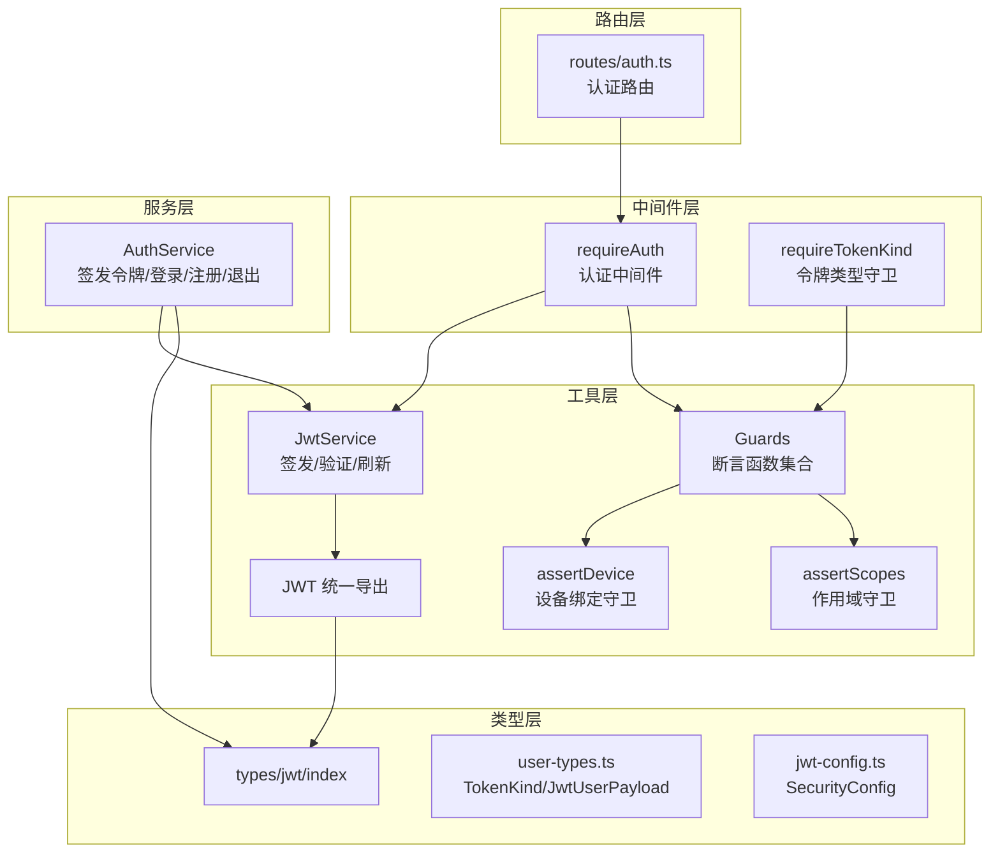
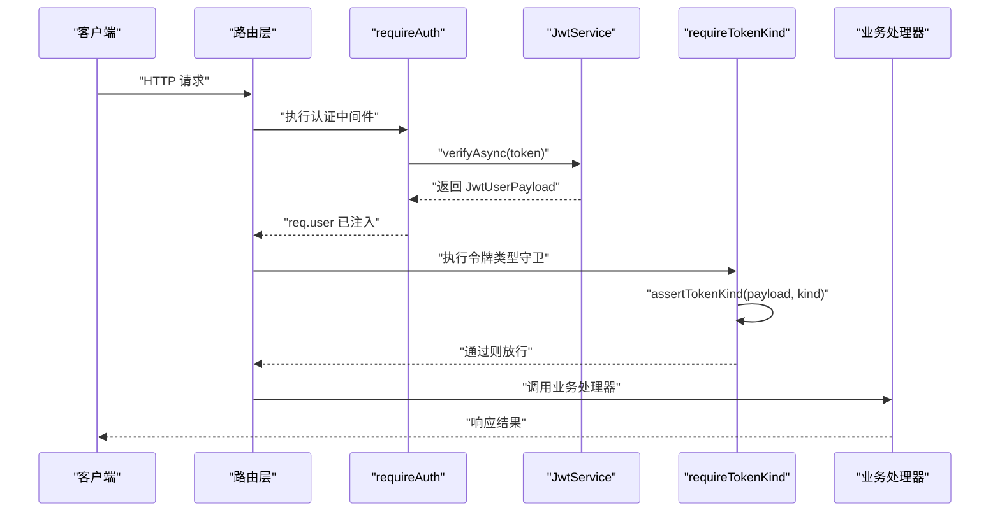
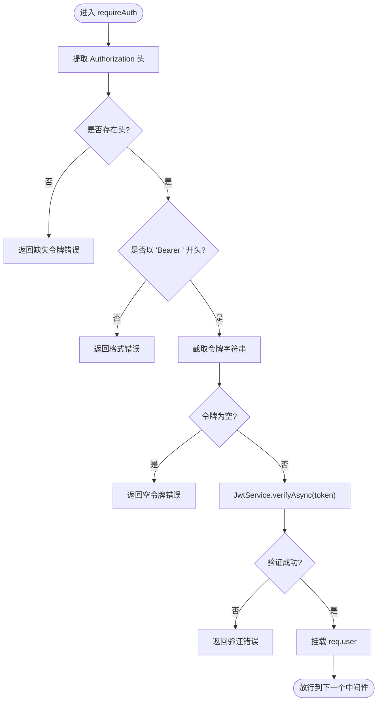
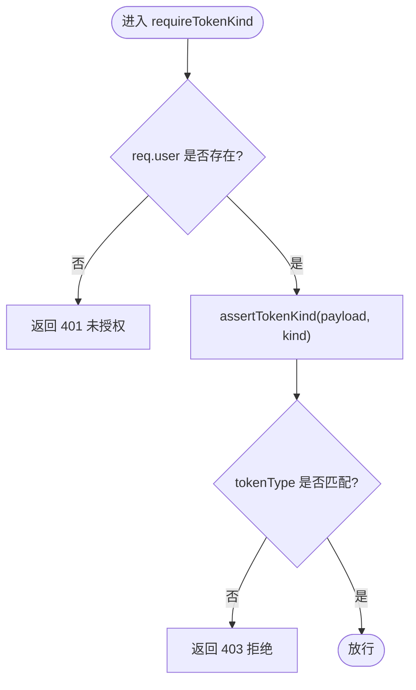
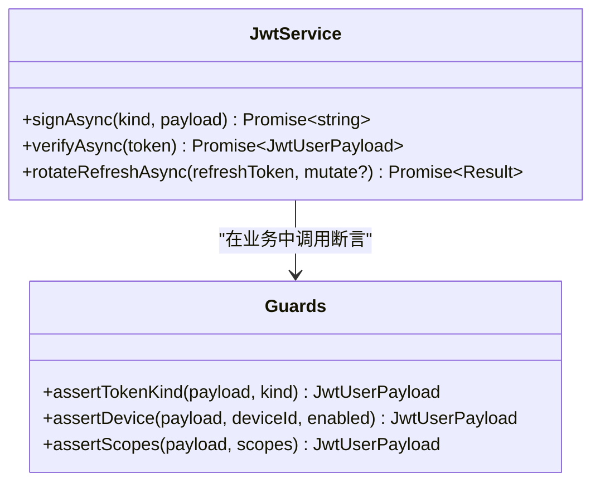
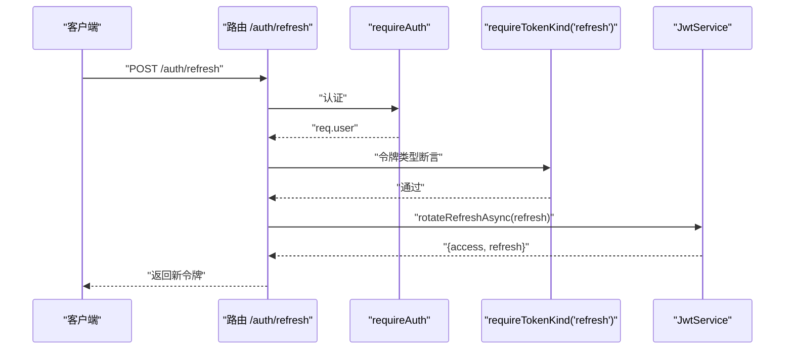
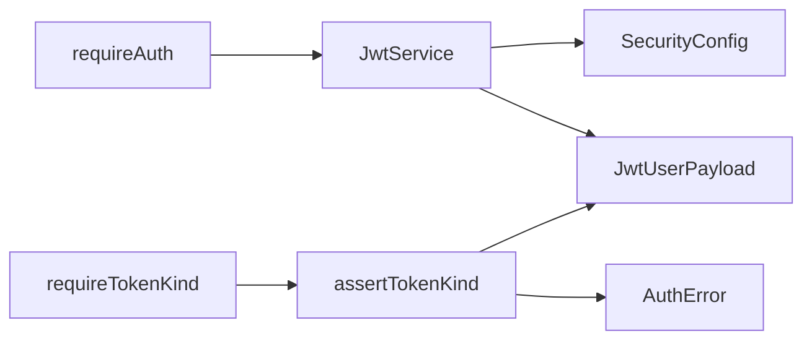

# 令牌类型控制

<cite>
**本文引用的文件**
- [src/middleware/auth/types.ts](file://src/middleware/auth/types.ts)
- [src/middleware/auth/require.ts](file://src/middleware/auth/require.ts)
- [src/middleware/auth/guards.ts](file://src/middleware/auth/guards.ts)
- [src/tools/jwt/index.ts](file://src/tools/jwt/index.ts)
- [src/tools/jwt/service.ts](file://src/tools/jwt/service.ts)
- [src/tools/jwt/guards/index.ts](file://src/tools/jwt/guards/index.ts)
- [src/tools/jwt/guards/device.ts](file://src/tools/jwt/guards/device.ts)
- [src/tools/jwt/guards/scopes.ts](file://src/tools/jwt/guards/scopes.ts)
- [src/types/jwt/index.ts](file://src/types/jwt/index.ts)
- [src/types/jwt/user-types.ts](file://src/types/jwt/user-types.ts)
- [src/types/jwt/jwt-config.ts](file://src/types/jwt/jwt-config.ts)
- [src/services/auth.ts](file://src/services/auth.ts)
- [src/routes/auth.ts](file://src/routes/auth.ts)
</cite>

## 目录
1. [引言](#引言)
2. [项目结构](#项目结构)
3. [核心组件](#核心组件)
4. [架构总览](#架构总览)
5. [详细组件分析](#详细组件分析)
6. [依赖关系分析](#依赖关系分析)
7. [性能考量](#性能考量)
8. [故障排查指南](#故障排查指南)
9. [结论](#结论)
10. [附录](#附录)

## 引言
本文件围绕“令牌类型控制”模块，系统性阐述 JWT 令牌的安全模型与使用场景，重点解释 access token 与 refresh token 的区别、令牌生命周期管理策略以及令牌用途限制。文档还深入解析 requireTokenKind 中间件的实现原理，包括令牌类型验证、令牌用途检查与安全边界控制，并说明其在 OAuth 2.0 流程中的作用与安全考虑。最后提供令牌刷新、降级处理与撤销流程的实际应用示例，并讨论令牌类型控制与设备绑定、一次性令牌等安全机制的协同使用。

## 项目结构
本项目采用分层与按功能划分的组织方式：
- 中间件层：认证与权限守卫，负责请求拦截与安全校验
- 工具层：JWT 服务、守卫函数、密钥与环境配置
- 类型层：JWT 载荷、令牌类型、安全配置等类型定义
- 服务层：认证业务逻辑（签发令牌、登录/注册、退出）
- 路由层：对外暴露的认证接口

图表来源
- [src/middleware/auth/require.ts](file://src/middleware/auth/require.ts#L68-L97)
- [src/middleware/auth/guards.ts](file://src/middleware/auth/guards.ts#L168-L194)
- [src/tools/jwt/index.ts](file://src/tools/jwt/index.ts#L75-L106)
- [src/tools/jwt/service.ts](file://src/tools/jwt/service.ts#L27-L97)
- [src/tools/jwt/guards/index.ts](file://src/tools/jwt/guards/index.ts#L13-L18)
- [src/types/jwt/index.ts](file://src/types/jwt/index.ts#L9-L11)
- [src/types/jwt/user-types.ts](file://src/types/jwt/user-types.ts#L10-L58)
- [src/types/jwt/jwt-config.ts](file://src/types/jwt/jwt-config.ts#L8-L12)
- [src/services/auth.ts](file://src/services/auth.ts#L45-L80)
- [src/routes/auth.ts](file://src/routes/auth.ts#L12-L46)

章节来源
- [src/middleware/auth/require.ts](file://src/middleware/auth/require.ts#L1-L98)
- [src/middleware/auth/guards.ts](file://src/middleware/auth/guards.ts#L1-L195)
- [src/tools/jwt/index.ts](file://src/tools/jwt/index.ts#L1-L107)
- [src/tools/jwt/service.ts](file://src/tools/jwt/service.ts#L1-L98)
- [src/types/jwt/index.ts](file://src/types/jwt/index.ts#L1-L24)
- [src/types/jwt/user-types.ts](file://src/types/jwt/user-types.ts#L1-L64)
- [src/types/jwt/jwt-config.ts](file://src/types/jwt/jwt-config.ts#L1-L13)
- [src/services/auth.ts](file://src/services/auth.ts#L1-L170)
- [src/routes/auth.ts](file://src/routes/auth.ts#L1-L47)

## 核心组件
- 令牌类型与载荷
  - TokenKind：区分 access 与 refresh 两种令牌类型
  - JwtUserPayload：标准化的业务载荷，包含 sub、roleId、vip、teamId、scope、tokenType、deviceId、jti、iat 等字段
- 认证中间件 requireAuth
  - 从 Authorization 头提取 Bearer 令牌，调用 JwtService 验证并把解码后的载荷挂载到 req.user
- 令牌类型守卫 requireTokenKind
  - 基于 req.user 的 tokenType 字段进行断言，确保仅允许特定类型的令牌访问对应资源
- JWT 服务 JwtService
  - 提供签发 signAsync、验证 verifyAsync、刷新轮转 rotateRefreshAsync 等能力
- 守卫函数集合 Guards
  - 包含 assertTokenKind、assertDevice、assertScopes 等断言函数，用于多维度的安全校验

章节来源
- [src/types/jwt/user-types.ts](file://src/types/jwt/user-types.ts#L10-L58)
- [src/middleware/auth/require.ts](file://src/middleware/auth/require.ts#L68-L97)
- [src/middleware/auth/guards.ts](file://src/middleware/auth/guards.ts#L168-L194)
- [src/tools/jwt/service.ts](file://src/tools/jwt/service.ts#L41-L96)
- [src/tools/jwt/guards/index.ts](file://src/tools/jwt/guards/index.ts#L13-L18)

## 架构总览
下图展示了从请求进入系统到完成令牌类型控制的整体流程，涵盖认证、令牌类型校验与安全断言：

图表来源
- [src/middleware/auth/require.ts](file://src/middleware/auth/require.ts#L68-L97)
- [src/middleware/auth/guards.ts](file://src/middleware/auth/guards.ts#L168-L194)
- [src/tools/jwt/service.ts](file://src/tools/jwt/service.ts#L66-L75)
- [src/tools/jwt/guards/index.ts](file://src/tools/jwt/guards/index.ts#L13-L18)

## 详细组件分析

### 令牌类型与生命周期管理
- 令牌类型
  - access：用于访问受保护资源，通常短期有效，但本实现中未设置 exp，采用业务侧控制与其它安全机制配合
  - refresh：用于轮换新的 access 令牌，具备更长有效期，且建议携带唯一标识以支持撤销与审计
- 生命周期策略
  - 本实现采用“长期有效”的 access token 与 refresh token 策略，不依赖 exp 过期；通过业务流程（如刷新、撤销）与安全边界（设备绑定、作用域）共同保障安全
- 用途限制
  - 通过 requireTokenKind 在路由层强制限定令牌用途，避免 access 令牌被用于刷新、refresh 令牌被用于资源访问

章节来源
- [src/types/jwt/user-types.ts](file://src/types/jwt/user-types.ts#L10-L58)
- [src/tools/jwt/service.ts](file://src/tools/jwt/service.ts#L41-L56)
- [src/middleware/auth/guards.ts](file://src/middleware/auth/guards.ts#L168-L194)

### requireAuth 认证中间件
- 功能要点
  - 从 Authorization 头提取 Bearer 令牌
  - 调用 JwtService.verifyAsync 验证令牌有效性
  - 将解码后的 JwtUserPayload 写入 req.user，供后续守卫使用
- 错误处理
  - 对缺失令牌、格式错误、验证失败等情况返回标准化错误
- 单例化
  - 延迟初始化 JwtService，避免重复创建

图表来源
- [src/middleware/auth/require.ts](file://src/middleware/auth/require.ts#L40-L97)
- [src/tools/jwt/service.ts](file://src/tools/jwt/service.ts#L66-L75)

章节来源
- [src/middleware/auth/require.ts](file://src/middleware/auth/require.ts#L1-L98)

### requireTokenKind 令牌类型守卫
- 功能要点
  - 读取 req.user 的 tokenType 字段
  - 与期望类型进行断言，不匹配则返回拒绝错误
- 使用场景
  - 将刷新接口限定为仅 refresh 令牌可用
  - 将资源访问接口限定为仅 access 令牌可用
- 与其它守卫组合
  - 可与 assertDevice、assertScopes 等组合，形成多维安全边界

图表来源
- [src/middleware/auth/guards.ts](file://src/middleware/auth/guards.ts#L168-L194)
- [src/tools/jwt/guards/index.ts](file://src/tools/jwt/guards/index.ts#L13-L18)

章节来源
- [src/middleware/auth/guards.ts](file://src/middleware/auth/guards.ts#L160-L194)
- [src/tools/jwt/guards/index.ts](file://src/tools/jwt/guards/index.ts#L13-L18)

### JwtService 令牌签发与刷新
- 签发 signAsync
  - 自动填充 iat、jti、tokenType 等字段
  - 不设置 exp，采用业务侧控制
- 验证 verifyAsync
  - 使用公钥/私钥进行验证，捕获过期与无效错误
- 刷新 rotateRefreshAsync
  - 仅对 tokenType 为 refresh 的令牌进行轮转
  - 生成新的 access 与 refresh 令牌，必要时更新 jti

图表来源
- [src/tools/jwt/service.ts](file://src/tools/jwt/service.ts#L27-L97)
- [src/tools/jwt/guards/index.ts](file://src/tools/jwt/guards/index.ts#L13-L18)

章节来源
- [src/tools/jwt/service.ts](file://src/tools/jwt/service.ts#L41-L96)

### OAuth 2.0 流程中的令牌类型控制
- 授权与令牌发放
  - 登录/注册成功后签发 access 与 refresh 令牌
- 资源访问
  - 使用 access 令牌访问受保护资源
- 令牌刷新
  - 使用 refresh 令牌调用刷新接口，获得新的 access 与 refresh 令牌
- 安全考虑
  - 通过 requireTokenKind 严格限制刷新接口仅接受 refresh 令牌
  - 结合设备绑定与作用域断言，进一步降低令牌滥用风险

章节来源
- [src/services/auth.ts](file://src/services/auth.ts#L45-L80)
- [src/middleware/auth/guards.ts](file://src/middleware/auth/guards.ts#L168-L194)
- [src/tools/jwt/guards/device.ts](file://src/tools/jwt/guards/device.ts#L25-L35)
- [src/tools/jwt/guards/scopes.ts](file://src/tools/jwt/guards/scopes.ts#L23-L29)

### 实际应用示例

#### 令牌刷新机制
- 路由设计
  - POST /auth/refresh：仅允许 refresh 令牌访问
- 实现要点
  - requireAuth + requireTokenKind("refresh")
  - JwtService.rotateRefreshAsync 生成新令牌对
  - 返回新的 access 与 refresh 令牌

图表来源
- [src/middleware/auth/require.ts](file://src/middleware/auth/require.ts#L68-L97)
- [src/middleware/auth/guards.ts](file://src/middleware/auth/guards.ts#L168-L194)
- [src/tools/jwt/service.ts](file://src/tools/jwt/service.ts#L86-L96)

章节来源
- [src/middleware/auth/guards.ts](file://src/middleware/auth/guards.ts#L168-L194)
- [src/tools/jwt/service.ts](file://src/tools/jwt/service.ts#L86-L96)

#### 令牌降级处理
- 场景
  - 发现用户权限变更或风险事件，需要降低令牌权限或缩短有效期
- 实现思路
  - 在 rotateRefreshAsync 的 mutate 回调中调整 payload（如 scope、roleId），生成降级后的令牌
  - 通过 assertScopes 与 assertRole 等断言确保降级生效

章节来源
- [src/tools/jwt/service.ts](file://src/tools/jwt/service.ts#L86-L96)
- [src/tools/jwt/guards/scopes.ts](file://src/tools/jwt/guards/scopes.ts#L23-L29)

#### 令牌撤销流程
- 无状态 JWT
  - 本实现为无状态 JWT，不维护服务端状态，因此不直接支持服务端撤销
- 替代方案
  - 设备绑定：assertDevice 限制设备，使被吊销设备无法继续使用
  - 作用域收紧：assertScopes 限制访问范围
  - 引入黑名单（扩展点）：若启用 Redis 黑名单，可在服务端记录 jti 或 token 标识，验证阶段检查黑名单

章节来源
- [src/services/auth.ts](file://src/services/auth.ts#L162-L166)
- [src/tools/jwt/guards/device.ts](file://src/tools/jwt/guards/device.ts#L25-L35)
- [src/tools/jwt/guards/scopes.ts](file://src/tools/jwt/guards/scopes.ts#L23-L29)

### 与设备绑定、一次性令牌等安全机制的结合
- 设备绑定
  - 通过 assertDevice 在验证阶段强制设备一致性，防止令牌跨设备滥用
- 一次性令牌
  - 通过为 refresh 令牌设置唯一 jti 并在刷新时替换 jti，实现“一次一新”，便于审计与撤销
- 作用域控制
  - 通过 assertScopes 限制令牌可访问的资源范围，降低越权风险

章节来源
- [src/tools/jwt/guards/device.ts](file://src/tools/jwt/guards/device.ts#L25-L35)
- [src/tools/jwt/guards/scopes.ts](file://src/tools/jwt/guards/scopes.ts#L23-L29)
- [src/tools/jwt/service.ts](file://src/tools/jwt/service.ts#L93-L95)

## 依赖关系分析
- 中间件依赖
  - requireAuth 依赖 JwtService 与 AuthError
  - requireTokenKind 依赖 Guards.assertTokenKind
- 工具层依赖
  - JwtService 依赖密钥提供器与安全配置
  - Guards 依赖 AuthError 与 JwtUserPayload
- 类型层依赖
  - 所有模块共享 TokenKind、JwtUserPayload、SecurityConfig 等类型

图表来源
- [src/middleware/auth/require.ts](file://src/middleware/auth/require.ts#L13-L32)
- [src/middleware/auth/guards.ts](file://src/middleware/auth/guards.ts#L168-L194)
- [src/tools/jwt/service.ts](file://src/tools/jwt/service.ts#L27-L31)
- [src/tools/jwt/guards/index.ts](file://src/tools/jwt/guards/index.ts#L1-L18)
- [src/types/jwt/user-types.ts](file://src/types/jwt/user-types.ts#L44-L58)
- [src/types/jwt/jwt-config.ts](file://src/types/jwt/jwt-config.ts#L8-L12)

章节来源
- [src/middleware/auth/require.ts](file://src/middleware/auth/require.ts#L1-L98)
- [src/middleware/auth/guards.ts](file://src/middleware/auth/guards.ts#L1-L195)
- [src/tools/jwt/service.ts](file://src/tools/jwt/service.ts#L1-L98)
- [src/tools/jwt/guards/index.ts](file://src/tools/jwt/guards/index.ts#L1-L18)
- [src/types/jwt/user-types.ts](file://src/types/jwt/user-types.ts#L1-L64)
- [src/types/jwt/jwt-config.ts](file://src/types/jwt/jwt-config.ts#L1-L13)

## 性能考量
- 令牌验证为同步 I/O 操作，主要开销在于密钥加载与签名验证
- 建议
  - 使用连接池与密钥缓存，减少重复加载
  - 对高频接口采用合理的缓存策略（注意令牌安全边界）
  - 控制断言链长度，避免过度组合导致的性能损耗

## 故障排查指南
- 常见错误与定位
  - 401 未授权：缺少 Authorization 头或令牌无效
  - 403 拒绝：令牌类型不匹配或权限不足
  - 500 内部错误：未知异常，检查日志
- 排查步骤
  - 确认请求头格式为 Bearer <token>
  - 检查 JwtService 初始化与算法配置
  - 验证 requireTokenKind 的期望类型与实际 tokenType 是否一致
  - 结合 assertDevice 与 assertScopes 排查设备与作用域问题

章节来源
- [src/middleware/auth/require.ts](file://src/middleware/auth/require.ts#L73-L96)
- [src/middleware/auth/guards.ts](file://src/middleware/auth/guards.ts#L168-L194)
- [src/tools/jwt/guards/index.ts](file://src/tools/jwt/guards/index.ts#L13-L18)

## 结论
本模块通过明确的令牌类型划分与严格的中间件守卫，实现了细粒度的令牌用途控制。配合设备绑定、作用域限制与刷新轮转机制，能够在无状态 JWT 的前提下构建稳健的安全边界。未来可按需引入黑名单与动态撤销策略，进一步提升安全能力。

## 附录
- 关键类型与职责
  - TokenKind：令牌类型枚举
  - JwtUserPayload：业务载荷，包含 tokenType、deviceId、scope 等
  - SecurityConfig：安全配置（TTL、刷新窗口等）
- 关键流程
  - 登录/注册：签发 access 与 refresh 令牌
  - 资源访问：使用 access 令牌，经 requireAuth 与 requireTokenKind 校验
  - 令牌刷新：使用 refresh 令牌，经 requireTokenKind 与 rotateRefreshAsync 轮转

章节来源
- [src/types/jwt/user-types.ts](file://src/types/jwt/user-types.ts#L10-L58)
- [src/types/jwt/jwt-config.ts](file://src/types/jwt/jwt-config.ts#L8-L12)
- [src/services/auth.ts](file://src/services/auth.ts#L45-L80)
- [src/middleware/auth/guards.ts](file://src/middleware/auth/guards.ts#L168-L194)
- [src/tools/jwt/service.ts](file://src/tools/jwt/service.ts#L86-L96)