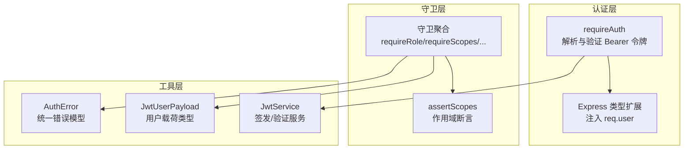
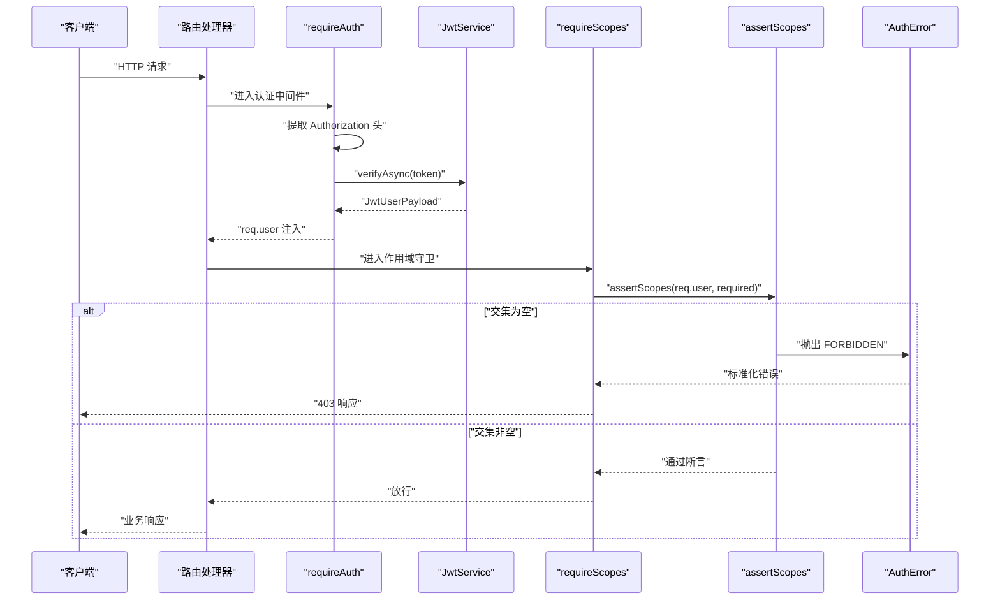
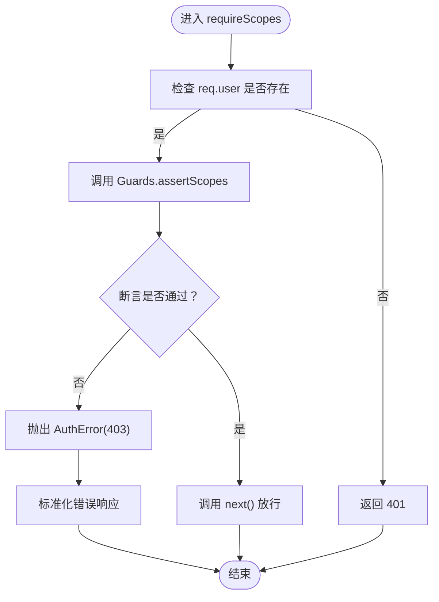
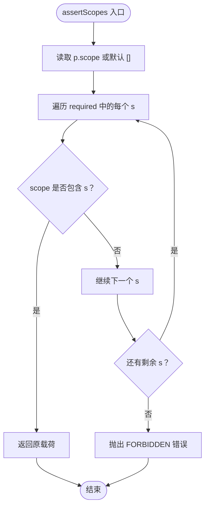
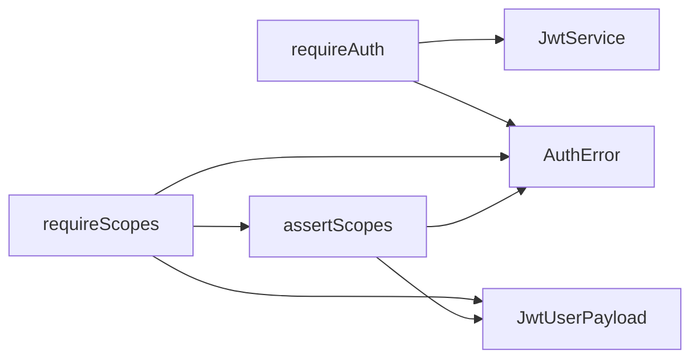

# 作用域权限控制

<cite>
**本文档引用的文件**
- [src/middleware/auth/guards.ts](file://src/middleware/auth/guards.ts)
- [src/middleware/auth/require.ts](file://src/middleware/auth/require.ts)
- [src/middleware/auth/types.ts](file://src/middleware/auth/types.ts)
- [src/middleware/auth/index.ts](file://src/middleware/auth/index.ts)
- [src/tools/jwt/guards/scopes.ts](file://src/tools/jwt/guards/scopes.ts)
- [src/tools/jwt/guards/index.ts](file://src/tools/jwt/guards/index.ts)
- [src/tools/jwt/errors/index.ts](file://src/tools/jwt/errors/index.ts)
- [src/tokens/jwt/user-types.ts](file://src/tokens/jwt/user-types.ts)
- [src/services/auth.ts](file://src/services/auth.ts)
- [src/routes/auth.ts](file://src/routes/auth.ts)
- [src/routes/admin/user.ts](file://src/routes/admin/user.ts)
</cite>

## 目录
1. [引言](#引言)
2. [项目结构](#项目结构)
3. [核心组件](#核心组件)
4. [架构概览](#架构概览)
5. [详细组件分析](#详细组件分析)
6. [依赖关系分析](#依赖关系分析)
7. [性能考虑](#性能考虑)
8. [故障排除指南](#故障排除指南)
9. [结论](#结论)
10. [附录](#附录)

## 引言
本文件针对基于作用域的细粒度权限控制模块进行系统化技术文档化，涵盖以下要点：
- 作用域定义与权限边界划分
- 最小权限原则的实现与应用
- requireScopes 中间件的实现逻辑与调用流程
- 作用域验证算法、作用域组合规则与权限交集计算
- 与 OAuth 2.0 标准的兼容性与扩展性
- 具体代码示例：API 端点访问控制、功能模块权限、操作级别权限验证
- 设计模式与最佳实践

## 项目结构
作用域权限控制由三层协作构成：
- 认证层：从请求头解析 Bearer 令牌，解码并注入用户载荷
- 守卫层：对用户载荷执行角色、VIP、团队、令牌类型与作用域等多维校验
- 工具层：统一的 JWT 服务、错误模型与类型定义

**图表来源**
- [src/middleware/auth/require.ts](file://src/middleware/auth/require.ts#L68-L97)
- [src/middleware/auth/types.ts](file://src/middleware/auth/types.ts#L17-L31)
- [src/middleware/auth/guards.ts](file://src/middleware/auth/guards.ts#L54-L87)
- [src/tools/jwt/guards/scopes.ts](file://src/tools/jwt/guards/scopes.ts#L23-L29)
- [src/tools/jwt/errors/index.ts](file://src/tools/jwt/errors/index.ts#L75-L141)
- [src/tokens/jwt/user-types.ts](file://src/tokens/jwt/user-types.ts#L44-L58)

**章节来源**
- [src/middleware/auth/index.ts](file://src/middleware/auth/index.ts#L12-L44)
- [src/middleware/auth/require.ts](file://src/middleware/auth/require.ts#L1-L98)
- [src/middleware/auth/guards.ts](file://src/middleware/auth/guards.ts#L1-L195)
- [src/tools/jwt/guards/index.ts](file://src/tools/jwt/guards/index.ts#L1-L19)
- [src/tools/jwt/guards/scopes.ts](file://src/tools/jwt/guards/scopes.ts#L1-L30)
- [src/tools/jwt/errors/index.ts](file://src/tools/jwt/errors/index.ts#L1-L288)
- [src/tokens/jwt/user-types.ts](file://src/tokens/jwt/user-types.ts#L1-L64)

## 核心组件
- requireAuth：从 Authorization 头提取 Bearer 令牌，调用 JwtService 验证后将用户载荷写入 req.user
- requireScopes：基于 requireAuth 之后的 req.user 执行作用域断言，至少包含所需作用域之一
- assertScopes：核心验证函数，若 required 与用户 scope 的交集为空则抛出 403
- JwtUserPayload：包含 scope 字段在内的用户载荷类型，scope 为可选字符串数组
- AuthError：统一的认证错误模型，支持序列化与日志化

关键职责与交互：
- requireAuth 依赖 JwtService 与 AuthError；通过 requireAuth 后，后续守卫可读取 req.user.scope
- requireScopes 将断言失败转化为标准化错误响应
- JwtUserPayload.scope 支持空数组与缺失场景，assertScopes 对空数组视为无作用域

**章节来源**
- [src/middleware/auth/require.ts](file://src/middleware/auth/require.ts#L68-L97)
- [src/middleware/auth/guards.ts](file://src/middleware/auth/guards.ts#L54-L87)
- [src/tools/jwt/guards/scopes.ts](file://src/tools/jwt/guards/scopes.ts#L23-L29)
- [src/tokens/jwt/user-types.ts](file://src/tokens/jwt/user-types.ts#L44-L58)
- [src/tools/jwt/errors/index.ts](file://src/tools/jwt/errors/index.ts#L75-L141)

## 架构概览
作用域权限控制的整体流程如下：

**图表来源**
- [src/middleware/auth/require.ts](file://src/middleware/auth/require.ts#L68-L97)
- [src/middleware/auth/guards.ts](file://src/middleware/auth/guards.ts#L61-L87)
- [src/tools/jwt/guards/scopes.ts](file://src/tools/jwt/guards/scopes.ts#L23-L29)
- [src/tools/jwt/errors/index.ts](file://src/tools/jwt/errors/index.ts#L75-L141)

## 详细组件分析

### requireScopes 中间件实现
- 输入：作用域数组 required
- 行为：
  - 若 req.user 不存在，返回 401
  - 调用 Guards.assertScopes(req.user, required)
  - 断言失败按 AuthError 标准化输出
  - 成功则放行
- 特性：采用“任一满足”策略，即 required 与用户 scope 存在交集即通过

**图表来源**
- [src/middleware/auth/guards.ts](file://src/middleware/auth/guards.ts#L61-L87)
- [src/tools/jwt/guards/scopes.ts](file://src/tools/jwt/guards/scopes.ts#L23-L29)
- [src/tools/jwt/errors/index.ts](file://src/tools/jwt/errors/index.ts#L75-L141)

**章节来源**
- [src/middleware/auth/guards.ts](file://src/middleware/auth/guards.ts#L54-L87)

### assertScopes 验证算法与复杂度
- 算法：对 required 中的每个作用域 s，检查是否存在于用户 scope 中
- 时间复杂度：O(n×m)，n 为 required 长度，m 为用户 scope 长度
- 空集合处理：当用户 scope 为空或缺失时，视为无任何作用域
- 结果：只要存在至少一个交集元素，即视为通过

**图表来源**
- [src/tools/jwt/guards/scopes.ts](file://src/tools/jwt/guards/scopes.ts#L23-L29)
- [src/tools/jwt/errors/index.ts](file://src/tools/jwt/errors/index.ts#L187-L196)

**章节来源**
- [src/tools/jwt/guards/scopes.ts](file://src/tools/jwt/guards/scopes.ts#L11-L29)

### 作用域组合规则与权限交集计算
- 组合规则：采用“任一满足”（OR）策略，即 required 与用户 scope 的交集非空即通过
- 交集计算：线性扫描 required，对每个元素检查是否在 scope 中
- 边界情况：
  - scope 缺失或为空数组：视为无作用域，断言失败
  - required 为空数组：断言失败（因交集为空）
- 最小权限原则体现：仅授予完成任务所需的最小作用域集合，避免过度授权

**章节来源**
- [src/tools/jwt/guards/scopes.ts](file://src/tools/jwt/guards/scopes.ts#L23-L29)
- [src/tokens/jwt/user-types.ts](file://src/tokens/jwt/user-types.ts#L44-L58)

### 与 OAuth 2.0 的兼容性与扩展性
- 兼容性：
  - 使用标准 Bearer 令牌格式（Authorization: Bearer <token>）
  - 使用标准的 scope 字段承载授权范围
  - 与 OAuth 2.0 授权服务器的 scope 语义一致
- 扩展性：
  - 可在 JwtUserPayload 中扩展更多字段（如 resource_servers、permissions）
  - 可引入更复杂的组合规则（如 AND/OR 混合、层级作用域）
  - 可结合资源服务器策略（Resource Indicators）实现多资源授权

**章节来源**
- [src/middleware/auth/require.ts](file://src/middleware/auth/require.ts#L35-L57)
- [src/tokens/jwt/user-types.ts](file://src/tokens/jwt/user-types.ts#L44-L58)

### 具体代码示例与使用场景

#### API 端点访问控制
- 示例：保护写入端点，要求至少拥有 admin 或 writer 作用域
- 关键路径：src/middleware/auth/guards.ts 中的 requireScopes 工厂函数
- 使用方式：在路由中串联 requireAuth 与 requireScopes

参考路径：
- [src/middleware/auth/guards.ts](file://src/middleware/auth/guards.ts#L54-L87)

#### 功能模块权限
- 场景：后台管理模块仅允许具有 admin 作用域的用户访问
- 关键路径：JwtUserPayload.scope 与 assertScopes 的组合
- 使用方式：在模块路由上挂载 requireScopes(["admin"])

参考路径：
- [src/tools/jwt/guards/scopes.ts](file://src/tools/jwt/guards/scopes.ts#L23-L29)
- [src/tokens/jwt/user-types.ts](file://src/tokens/jwt/user-types.ts#L44-L58)

#### 操作级别权限验证
- 场景：特定操作（如删除）需要额外的操作级作用域 delete_user
- 关键路径：在具体处理器内部再次调用 requireScopes(["delete_user"])
- 使用方式：在业务处理器中追加 requireScopes 中间件

参考路径：
- [src/middleware/auth/guards.ts](file://src/middleware/auth/guards.ts#L54-L87)

### 设计模式与最佳实践
- 中间件链模式：将认证与多种守卫以中间件形式串联，形成清晰的权限检查流水线
- 单一职责：每个守卫只负责一种维度的校验（角色、VIP、团队、令牌类型、作用域）
- 错误统一：通过 AuthError 提供一致的错误模型与序列化输出
- 最小权限：仅授予完成任务所需的最小作用域集合，避免过度授权
- 可测试性：assertScopes 为纯函数，便于单元测试与边界条件覆盖

**章节来源**
- [src/middleware/auth/guards.ts](file://src/middleware/auth/guards.ts#L1-L195)
- [src/tools/jwt/errors/index.ts](file://src/tools/jwt/errors/index.ts#L75-L141)

## 依赖关系分析

**图表来源**
- [src/middleware/auth/require.ts](file://src/middleware/auth/require.ts#L12-L32)
- [src/middleware/auth/guards.ts](file://src/middleware/auth/guards.ts#L12-L15)
- [src/tools/jwt/guards/index.ts](file://src/tools/jwt/guards/index.ts#L1-L19)
- [src/tools/jwt/guards/scopes.ts](file://src/tools/jwt/guards/scopes.ts#L8-L9)
- [src/tools/jwt/errors/index.ts](file://src/tools/jwt/errors/index.ts#L75-L141)
- [src/tokens/jwt/user-types.ts](file://src/tokens/jwt/user-types.ts#L44-L58)

**章节来源**
- [src/middleware/auth/index.ts](file://src/middleware/auth/index.ts#L12-L44)
- [src/middleware/auth/guards.ts](file://src/middleware/auth/guards.ts#L1-L195)
- [src/tools/jwt/guards/index.ts](file://src/tools/jwt/guards/index.ts#L1-L19)

## 性能考虑
- 时间复杂度：assertScopes 为 O(n×m)，建议控制 required 与 scope 数量规模
- 缓存策略：可在业务层缓存用户作用域，减少重复计算
- 中间件顺序：将 requireAuth 放在首位，确保后续守卫只处理已认证用户
- 错误早返回：在 requireScopes 中对缺失用户直接返回 401，避免无意义的断言

## 故障排除指南
常见问题与定位：
- 401 未认证：检查 Authorization 头格式与令牌有效性
- 403 禁止访问：确认用户 scope 是否包含 required 中的任意元素
- 500 内部错误：检查 JwtService 初始化与异常捕获逻辑

排查步骤：
- 核实 requireAuth 是否正确解析 Bearer 令牌
- 核查 JwtUserPayload.scope 是否按预期注入
- 使用 assertScopes 的返回值与错误信息定位问题

**章节来源**
- [src/middleware/auth/require.ts](file://src/middleware/auth/require.ts#L35-L57)
- [src/middleware/auth/guards.ts](file://src/middleware/auth/guards.ts#L61-L87)
- [src/tools/jwt/errors/index.ts](file://src/tools/jwt/errors/index.ts#L187-L196)

## 结论
本模块通过 requireAuth 与 requireScopes 的协同，实现了基于作用域的细粒度权限控制。其设计遵循最小权限原则，采用“任一满足”的组合规则，并与 OAuth 2.0 的 scope 语义保持一致。通过统一的错误模型与清晰的中间件链，系统具备良好的可维护性与扩展性。

## 附录

### API 端点访问控制示例路径
- 路由示例：在路由中串联 requireAuth 与 requireScopes
  - [src/routes/admin/user.ts](file://src/routes/admin/user.ts#L33-L37)
  - [src/middleware/auth/guards.ts](file://src/middleware/auth/guards.ts#L54-L87)

### 功能模块权限示例路径
- 在模块路由上挂载 requireScopes(["admin"])
  - [src/middleware/auth/guards.ts](file://src/middleware/auth/guards.ts#L54-L87)
  - [src/tokens/jwt/user-types.ts](file://src/tokens/jwt/user-types.ts#L44-L58)

### 操作级别权限验证示例路径
- 在处理器内部追加 requireScopes
  - [src/middleware/auth/guards.ts](file://src/middleware/auth/guards.ts#L54-L87)