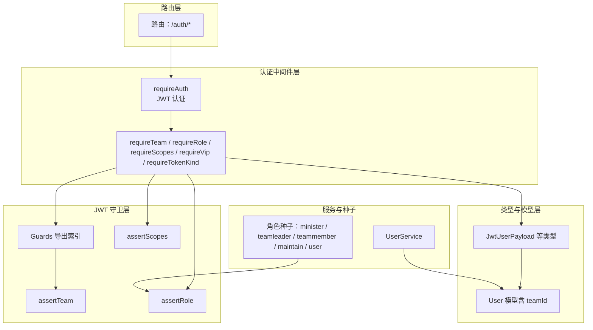
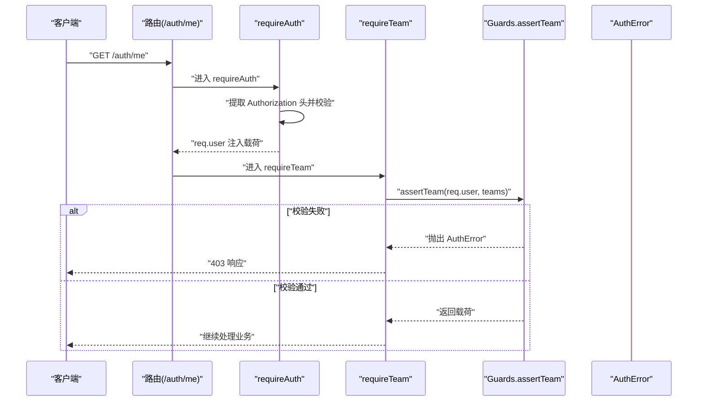
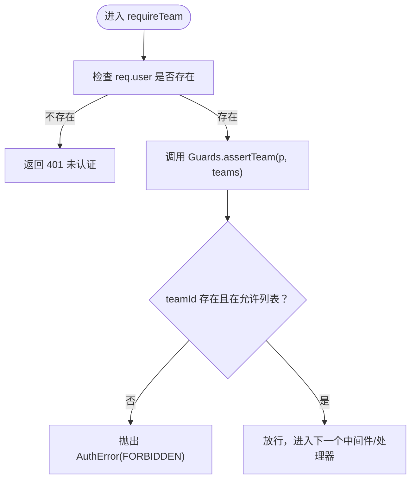
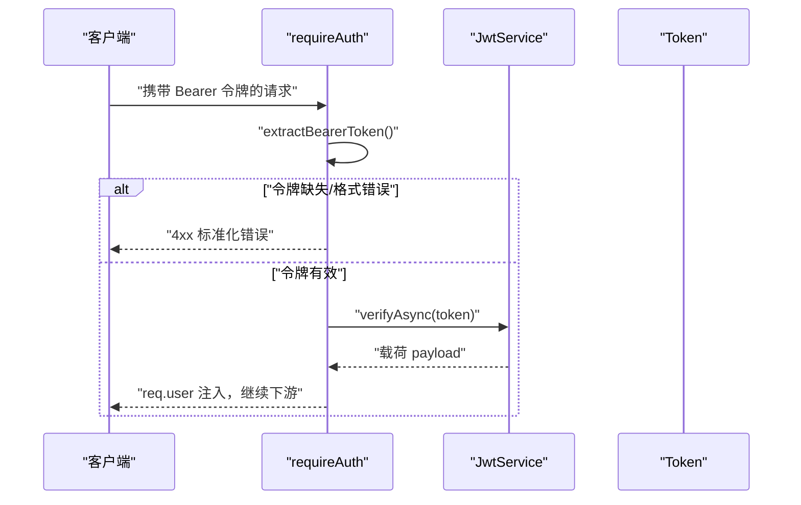
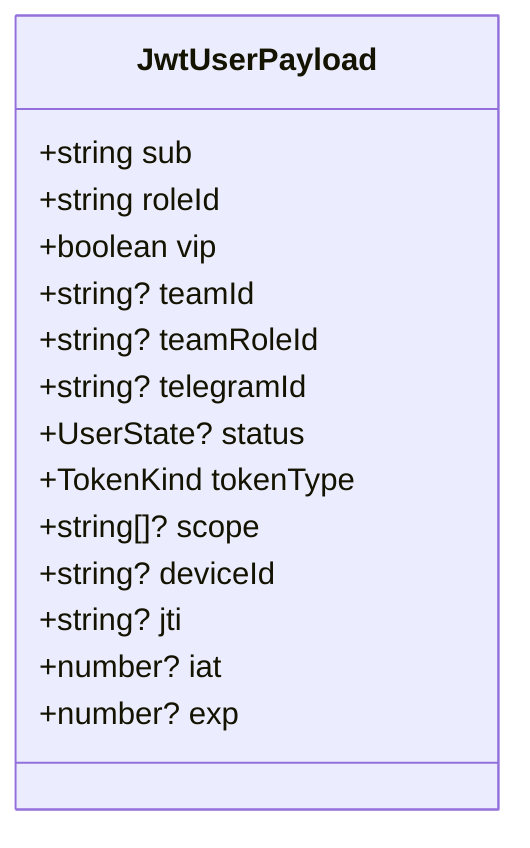
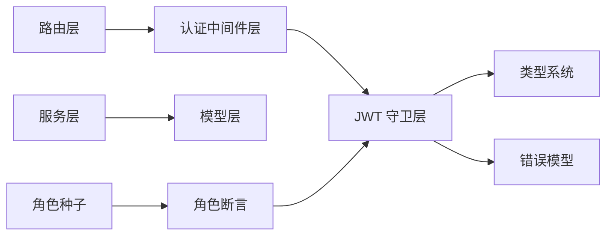

# 团队权限控制

<cite>
**本文引用的文件**
- [src/middleware/auth/index.ts](file://src/middleware/auth/index.ts)
- [src/middleware/auth/require.ts](file://src/middleware/auth/require.ts)
- [src/middleware/auth/guards.ts](file://src/middleware/auth/guards.ts)
- [src/middleware/auth/types.ts](file://src/middleware/auth/types.ts)
- [src/tools/jwt/index.ts](file://src/tools/jwt/index.ts)
- [src/tools/jwt/guards/team.ts](file://src/tools/jwt/guards/team.ts)
- [src/tools/jwt/guards/index.ts](file://src/tools/jwt/guards/index.ts)
- [src/tools/jwt/guards/role.ts](file://src/tools/jwt/guards/role.ts)
- [src/tools/jwt/guards/scopes.ts](file://src/tools/jwt/guards/scopes.ts)
- [src/tools/jwt/errors/index.ts](file://src/tools/jwt/errors/index.ts)
- [src/types/jwt/user-types.ts](file://src/types/jwt/user-types.ts)
- [src/models/user/user.ts](file://src/models/user/user.ts)
- [src/models/user/types/user.ts](file://src/models/user/types/user.ts)
- [src/services/user.ts](file://src/services/user.ts)
- [src/routes/auth.ts](file://src/routes/auth.ts)
- [src/config/seed/role.json](file://src/config/seed/role.json)
</cite>

## 目录
1. [引言](#引言)
2. [项目结构](#项目结构)
3. [核心组件](#核心组件)
4. [架构总览](#架构总览)
5. [组件详解](#组件详解)
6. [依赖关系分析](#依赖关系分析)
7. [性能考量](#性能考量)
8. [故障排查指南](#故障排查指南)
9. [结论](#结论)
10. [附录](#附录)

## 引言
本技术文档围绕“团队权限控制”主题，系统阐述团队隔离权限模型的设计理念与实现机制，覆盖团队成员关系、团队资源访问控制与跨团队权限限制。文档重点解析 requireTeam 中间件的工作原理，包括团队验证逻辑、团队成员身份确认与团队权限继承；同时给出团队权限的配置方式、团队层级结构与动态团队变更处理策略，并提供实际应用示例与最佳实践，帮助读者在项目管理与组织架构背景下正确设计与落地团队权限体系。

## 项目结构
该权限控制体系由“认证中间件层 + JWT 守卫层 + 类型与模型层 + 服务与路由层”构成，形成清晰的分层职责与稳定的依赖方向。



图表来源
- [src/routes/auth.ts](file://src/routes/auth.ts#L1-L47)
- [src/middleware/auth/require.ts](file://src/middleware/auth/require.ts#L68-L97)
- [src/middleware/auth/guards.ts](file://src/middleware/auth/guards.ts#L132-L158)
- [src/middleware/auth/index.ts](file://src/middleware/auth/index.ts#L16-L32)
- [src/tools/jwt/guards/index.ts](file://src/tools/jwt/guards/index.ts#L1-L18)
- [src/tools/jwt/guards/team.ts](file://src/tools/jwt/guards/team.ts#L24-L29)
- [src/types/jwt/user-types.ts](file://src/types/jwt/user-types.ts#L44-L58)
- [src/models/user/user.ts](file://src/models/user/user.ts#L170-L174)
- [src/services/user.ts](file://src/services/user.ts#L40-L60)
- [src/config/seed/role.json](file://src/config/seed/role.json#L1-L27)

章节来源
- [src/routes/auth.ts](file://src/routes/auth.ts#L1-L47)
- [src/middleware/auth/index.ts](file://src/middleware/auth/index.ts#L1-L45)
- [src/middleware/auth/require.ts](file://src/middleware/auth/require.ts#L1-L98)
- [src/middleware/auth/guards.ts](file://src/middleware/auth/guards.ts#L1-L195)
- [src/middleware/auth/types.ts](file://src/middleware/auth/types.ts#L1-L34)
- [src/tools/jwt/index.ts](file://src/tools/jwt/index.ts#L1-L107)
- [src/tools/jwt/guards/index.ts](file://src/tools/jwt/guards/index.ts#L1-L18)
- [src/tools/jwt/guards/team.ts](file://src/tools/jwt/guards/team.ts#L1-L30)
- [src/tools/jwt/guards/role.ts](file://src/tools/jwt/guards/role.ts#L1-L31)
- [src/tools/jwt/guards/scopes.ts](file://src/tools/jwt/guards/scopes.ts#L1-L30)
- [src/tools/jwt/errors/index.ts](file://src/tools/jwt/errors/index.ts#L1-L288)
- [src/types/jwt/user-types.ts](file://src/types/jwt/user-types.ts#L1-L64)
- [src/models/user/user.ts](file://src/models/user/user.ts#L1-L275)
- [src/models/user/types/user.ts](file://src/models/user/types/user.ts#L1-L177)
- [src/services/user.ts](file://src/services/user.ts#L1-L60)
- [src/config/seed/role.json](file://src/config/seed/role.json#L1-L27)

## 核心组件
- 认证中间件 requireAuth：从请求头提取 Bearer 令牌，调用 JWT 服务进行签名校验，成功后将用户载荷挂载到 req.user，供后续守卫使用。
- 权限守卫中间件 requireTeam / requireRole / requireScopes / requireVip / requireTokenKind：基于 req.user 的载荷执行断言，不符合条件则返回标准化错误。
- JWT 守卫函数 assertTeam / assertRole / assertScopes：在运行时对载荷中的团队、角色、作用域等字段进行严格校验。
- 类型系统 JwtUserPayload：统一定义 JWT 载荷字段，其中 teamId、teamRoleId、roleId、scope、tokenType 等为权限控制的关键字段。
- 用户模型 User：数据库层包含 teamId 字段，用于持久化用户的团队归属。

章节来源
- [src/middleware/auth/require.ts](file://src/middleware/auth/require.ts#L68-L97)
- [src/middleware/auth/guards.ts](file://src/middleware/auth/guards.ts#L132-L158)
- [src/tools/jwt/guards/team.ts](file://src/tools/jwt/guards/team.ts#L24-L29)
- [src/tools/jwt/guards/role.ts](file://src/tools/jwt/guards/role.ts#L25-L29)
- [src/tools/jwt/guards/scopes.ts](file://src/tools/jwt/guards/scopes.ts#L23-L28)
- [src/types/jwt/user-types.ts](file://src/types/jwt/user-types.ts#L44-L58)
- [src/models/user/user.ts](file://src/models/user/user.ts#L170-L174)

## 架构总览
下图展示了从路由到守卫再到 JWT 守卫函数的整体调用链路与数据流。



图表来源
- [src/routes/auth.ts](file://src/routes/auth.ts#L44-L44)
- [src/middleware/auth/require.ts](file://src/middleware/auth/require.ts#L68-L97)
- [src/middleware/auth/guards.ts](file://src/middleware/auth/guards.ts#L132-L158)
- [src/tools/jwt/guards/team.ts](file://src/tools/jwt/guards/team.ts#L24-L29)
- [src/tools/jwt/errors/index.ts](file://src/tools/jwt/errors/index.ts#L75-L121)

## 组件详解

### requireTeam 中间件工作原理
- 团队验证逻辑：从 req.user 中读取 teamId，与传入的允许团队列表进行严格匹配。若 teamId 为空或不在允许列表，则抛出禁止访问错误。
- 团队成员身份确认：依赖 JWT 载荷中的 teamId 字段，确保用户在认证阶段即携带正确的团队信息。
- 团队权限继承：当前实现为直接匹配，未体现“团队层级结构”的继承关系。如需继承，可在业务层扩展为“团队树遍历”或“团队角色映射”。



图表来源
- [src/middleware/auth/guards.ts](file://src/middleware/auth/guards.ts#L132-L158)
- [src/tools/jwt/guards/team.ts](file://src/tools/jwt/guards/team.ts#L24-L29)
- [src/tools/jwt/errors/index.ts](file://src/tools/jwt/errors/index.ts#L46-L63)

章节来源
- [src/middleware/auth/guards.ts](file://src/middleware/auth/guards.ts#L124-L158)
- [src/tools/jwt/guards/team.ts](file://src/tools/jwt/guards/team.ts#L1-L30)
- [src/tools/jwt/errors/index.ts](file://src/tools/jwt/errors/index.ts#L1-L288)

### requireAuth 认证流程
- 从 Authorization 头提取 Bearer 令牌，进行格式校验。
- 使用 JWT 服务对令牌进行异步验证，成功后将载荷写入 req.user。
- 若出现缺失令牌、格式错误、无效或过期等情形，返回标准化错误。



图表来源
- [src/middleware/auth/require.ts](file://src/middleware/auth/require.ts#L68-L97)
- [src/tools/jwt/index.ts](file://src/tools/jwt/index.ts#L80-L106)
- [src/tools/jwt/errors/index.ts](file://src/tools/jwt/errors/index.ts#L144-L196)

章节来源
- [src/middleware/auth/require.ts](file://src/middleware/auth/require.ts#L1-L98)
- [src/tools/jwt/index.ts](file://src/tools/jwt/index.ts#L75-L106)
- [src/tools/jwt/errors/index.ts](file://src/tools/jwt/errors/index.ts#L1-L288)

### JWT 载荷与类型约束
- JwtUserPayload 关键字段：sub、roleId、vip、teamId、teamRoleId、scope、tokenType 等，这些字段共同决定权限断言的结果。
- 类型扩展：通过 Express.Request.user 注入 JwtUserPayload，保证中间件与业务层的类型一致性。



图表来源
- [src/types/jwt/user-types.ts](file://src/types/jwt/user-types.ts#L44-L58)
- [src/middleware/auth/types.ts](file://src/middleware/auth/types.ts#L24-L28)

章节来源
- [src/types/jwt/user-types.ts](file://src/types/jwt/user-types.ts#L1-L64)
- [src/middleware/auth/types.ts](file://src/middleware/auth/types.ts#L1-L34)

### 团队成员关系与资源访问控制
- 成员关系：用户模型包含 teamId 字段，用于标识所属团队。
- 资源访问控制：通过 requireTeam 在路由层强制校验用户是否属于允许的团队集合；结合 requireRole/requireScopes 可实现更细粒度的权限组合。
- 跨团队权限限制：当前实现为“直接匹配”，未体现跨团队继承或授权。如需跨团队访问，可在业务层引入“团队角色映射”或“授权委托”机制。

```mermaid
erDiagram
USER {
string id PK
string phone
string account
string roleId
string? teamId
boolean vip
}
TEAM {
string id PK
string name
}
USER }o--|| TEAM : "属于"
```

图表来源
- [src/models/user/user.ts](file://src/models/user/user.ts#L170-L174)
- [src/models/user/types/user.ts](file://src/models/user/types/user.ts#L64-L87)

章节来源
- [src/models/user/user.ts](file://src/models/user/user.ts#L1-L275)
- [src/models/user/types/user.ts](file://src/models/user/types/user.ts#L1-L177)

### 团队层级结构与动态变更处理
- 层级结构：当前未实现团队树或父子关系，建议在业务层扩展“团队树”模型，以支持继承与跨级授权。
- 动态变更：当用户团队发生变动时，应在签发新令牌时同步更新载荷中的 teamId/role 信息；或在运行时通过缓存/会话刷新机制更新 req.user。

章节来源
- [src/tools/jwt/guards/team.ts](file://src/tools/jwt/guards/team.ts#L24-L29)
- [src/types/jwt/user-types.ts](file://src/types/jwt/user-types.ts#L44-L58)

### 团队权限配置与角色种子
- 角色配置：通过角色种子文件定义角色 ID 与名称，配合 requireRole 中间件实现角色级权限控制。
- 团队角色：JwtUserPayload 支持 teamRoleId 字段，可用于区分“团队内角色”（如负责人、成员），但当前守卫未直接使用该字段，可在业务层扩展。

章节来源
- [src/config/seed/role.json](file://src/config/seed/role.json#L1-L27)
- [src/tools/jwt/guards/role.ts](file://src/tools/jwt/guards/role.ts#L25-L29)
- [src/types/jwt/user-types.ts](file://src/types/jwt/user-types.ts#L48-L49)

### 实际应用示例
- 团队资源访问：在路由上叠加 requireAuth 与 requireTeam，仅允许特定团队成员访问。
- 团队协作权限：结合 requireRole 与 requireScopes，实现“团队负责人 + 写权限”的复合校验。
- 团队隔离机制：通过 requireTeam 严格限制资源边界，防止跨团队越权访问。

章节来源
- [src/middleware/auth/guards.ts](file://src/middleware/auth/guards.ts#L124-L158)
- [src/routes/auth.ts](file://src/routes/auth.ts#L37-L44)

## 依赖关系分析
- 中间件层依赖 JWT 守卫层与类型系统；JWT 守卫层依赖错误模型与类型定义。
- 路由层依赖认证中间件；服务层依赖模型层；角色种子影响角色断言。



图表来源
- [src/routes/auth.ts](file://src/routes/auth.ts#L1-L47)
- [src/middleware/auth/index.ts](file://src/middleware/auth/index.ts#L16-L32)
- [src/tools/jwt/guards/index.ts](file://src/tools/jwt/guards/index.ts#L1-L18)
- [src/tools/jwt/errors/index.ts](file://src/tools/jwt/errors/index.ts#L1-L288)
- [src/types/jwt/user-types.ts](file://src/types/jwt/user-types.ts#L1-L64)
- [src/services/user.ts](file://src/services/user.ts#L1-L60)
- [src/models/user/user.ts](file://src/models/user/user.ts#L1-L275)
- [src/config/seed/role.json](file://src/config/seed/role.json#L1-L27)

章节来源
- [src/middleware/auth/index.ts](file://src/middleware/auth/index.ts#L1-L45)
- [src/tools/jwt/index.ts](file://src/tools/jwt/index.ts#L68-L68)
- [src/tools/jwt/guards/index.ts](file://src/tools/jwt/guards/index.ts#L1-L18)
- [src/tools/jwt/errors/index.ts](file://src/tools/jwt/errors/index.ts#L1-L288)
- [src/types/jwt/user-types.ts](file://src/types/jwt/user-types.ts#L1-L64)
- [src/services/user.ts](file://src/services/user.ts#L1-L60)
- [src/models/user/user.ts](file://src/models/user/user.ts#L1-L275)
- [src/config/seed/role.json](file://src/config/seed/role.json#L1-L27)

## 性能考量
- requireTeam 为 O(1) 匹配，性能开销极低；assertTeam 与 requireTeam 均为轻量断言，适合高频路由保护。
- JWT 验证为异步操作，建议在网关或上游层做必要的速率限制与缓存策略，避免频繁重复验证。

[本节为通用指导，无需列出具体文件来源]

## 故障排查指南
- 401 未认证：通常由 requireAuth 抛出，检查 Authorization 头格式与令牌有效性。
- 403 禁止访问：可能来自 requireTeam/requireRole/requireScopes 的断言失败，核对 req.user 中的 teamId/roleId/scope。
- 标准化错误：所有认证错误均实现统一的错误对象与序列化，便于日志记录与前端展示。

章节来源
- [src/middleware/auth/require.ts](file://src/middleware/auth/require.ts#L75-L96)
- [src/middleware/auth/guards.ts](file://src/middleware/auth/guards.ts#L27-L50)
- [src/tools/jwt/errors/index.ts](file://src/tools/jwt/errors/index.ts#L75-L121)

## 结论
该团队权限控制方案以 JWT 载荷为核心，通过 requireAuth 与 requireTeam 等中间件实现“按团队隔离”的访问控制。当前实现简洁高效，满足基础团队边界控制需求；若需支持团队层级与跨团队授权，可在业务层扩展团队树与团队角色映射机制，并在令牌签发时同步更新相关字段。

[本节为总结性内容，无需列出具体文件来源]

## 附录
- 项目管理与组织架构关系：团队权限模型应与组织架构保持一致，团队负责人与成员角色在角色种子与业务断言中明确体现，确保“谁可以做什么”清晰可追溯。
- 最佳实践：在路由层统一使用 requireAuth + requireTeam，必要时叠加 requireRole/requireScopes；对高风险接口采用更严格的断言组合；对团队变更场景，确保令牌签发与会话刷新流程及时生效。

[本节为概念性内容，无需列出具体文件来源]