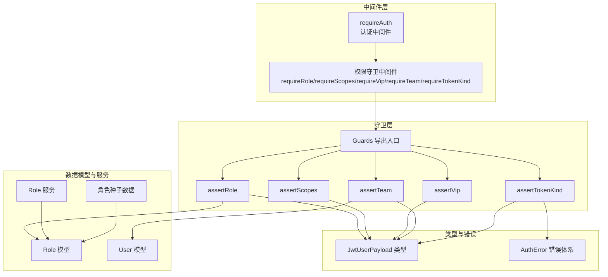
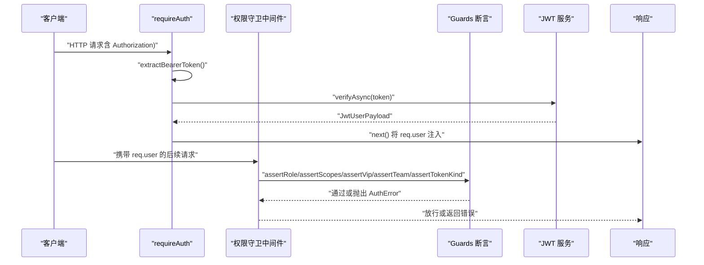
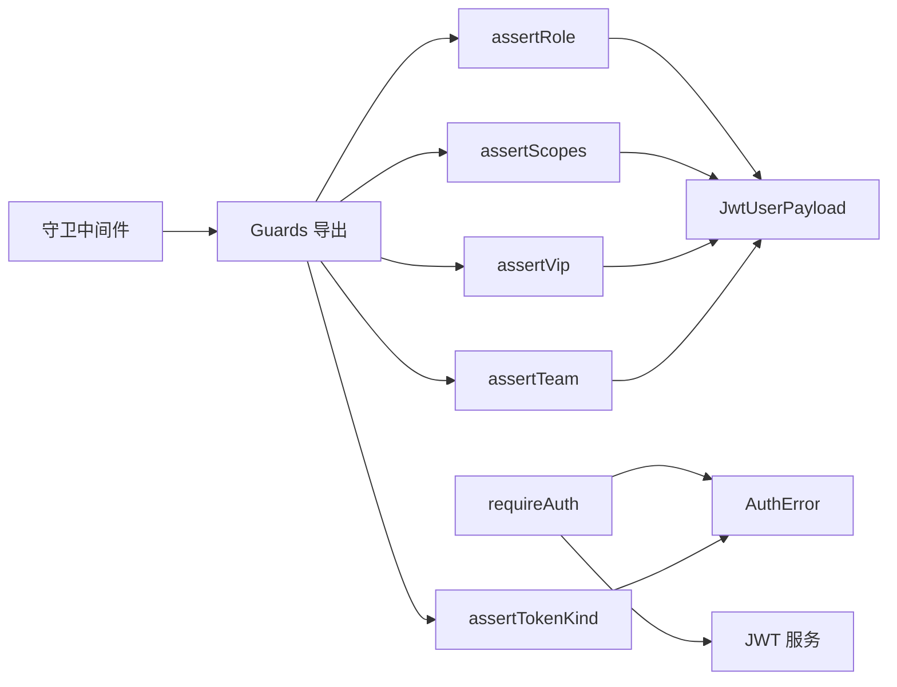

# 权限控制系统

<cite>
**本文档引用的文件**
- [src/middleware/auth/guards.ts](file://src/middleware/auth/guards.ts)
- [src/middleware/auth/require.ts](file://src/middleware/auth/require.ts)
- [src/middleware/auth/types.ts](file://src/middleware/auth/types.ts)
- [src/tools/jwt/guards/index.ts](file://src/tools/jwt/guards/index.ts)
- [src/tools/jwt/guards/role.ts](file://src/tools/jwt/guards/role.ts)
- [src/tools/jwt/guards/team.ts](file://src/tools/jwt/guards/team.ts)
- [src/tools/jwt/guards/vip.ts](file://src/tools/jwt/guards/vip.ts)
- [src/tools/jwt/guards/scopes.ts](file://src/tools/jwt/guards/scopes.ts)
- [src/tools/jwt/errors/index.ts](file://src/tools/jwt/errors/index.ts)
- [src/tokens/jwt/user-types.ts](file://src/tokens/jwt/user-types.ts)
- [src/models/role/index.ts](file://src/models/role/index.ts)
- [src/models/user/user.ts](file://src/models/user/user.ts)
- [src/services/role.ts](file://src/services/role.ts)
- [src/config/seed/role.json](file://src/config/seed/role.json)
- [src/routes/admin/user.ts](file://src/routes/admin/user.ts)
</cite>

## 目录
1. [引言](#引言)
2. [项目结构](#项目结构)
3. [核心组件](#核心组件)
4. [架构总览](#架构总览)
5. [详细组件分析](#详细组件分析)
6. [依赖关系分析](#依赖关系分析)
7. [性能考虑](#性能考虑)
8. [故障排除指南](#故障排除指南)
9. [结论](#结论)
10. [附录](#附录)

## 引言
本文件面向权限控制系统的技术文档，聚焦多维度权限控制机制，涵盖角色权限（ADMIN、USER 等）、VIP 用户权限、团队权限隔离等不同层级的权限模型。文档化了权限守卫的实现原理与中间件工作机制，包括角色验证、VIP 权限检查、团队权限隔离等能力；解释了权限验证的优先级与组合规则、权限继承与覆盖机制；并提供权限配置的最佳实践与安全建议，包含权限绕过攻击的防护措施。同时，给出具体权限控制代码示例与使用场景，帮助开发者快速正确地集成与扩展权限体系。

## 项目结构
权限控制子系统由三层协作构成：
- 中间件层：负责请求拦截与认证，将 JWT 载荷注入到请求对象中，供后续守卫使用。
- 守卫层：提供细粒度的权限断言，如角色、作用域、VIP、团队、Token 类型等。
- 数据模型与服务层：提供角色与用户数据结构、默认角色种子数据及服务封装。

图表来源
- [src/middleware/auth/require.ts](file://src/middleware/auth/require.ts#L68-L97)
- [src/middleware/auth/guards.ts](file://src/middleware/auth/guards.ts#L25-L194)
- [src/tools/jwt/guards/index.ts](file://src/tools/jwt/guards/index.ts#L1-L19)
- [src/tokens/jwt/user-types.ts](file://src/tokens/jwt/user-types.ts#L44-L58)
- [src/models/role/index.ts](file://src/models/role/index.ts#L27-L76)
- [src/models/user/user.ts](file://src/models/user/user.ts#L33-L101)
- [src/services/role.ts](file://src/services/role.ts#L32-L34)
- [src/config/seed/role.json](file://src/config/seed/role.json#L1-L28)

章节来源
- [src/middleware/auth/require.ts](file://src/middleware/auth/require.ts#L1-L98)
- [src/middleware/auth/guards.ts](file://src/middleware/auth/guards.ts#L1-L195)
- [src/middleware/auth/types.ts](file://src/middleware/auth/types.ts#L1-L34)
- [src/tools/jwt/guards/index.ts](file://src/tools/jwt/guards/index.ts#L1-L19)
- [src/tokens/jwt/user-types.ts](file://src/tokens/jwt/user-types.ts#L1-L64)
- [src/models/role/index.ts](file://src/models/role/index.ts#L1-L77)
- [src/models/user/user.ts](file://src/models/user/user.ts#L1-L275)
- [src/services/role.ts](file://src/services/role.ts#L1-L35)
- [src/config/seed/role.json](file://src/config/seed/role.json#L1-L28)

## 核心组件
- 认证中间件 requireAuth：从 Authorization 头解析 Bearer 令牌，调用 JWT 服务进行验证，成功后将用户载荷写入 req.user，失败则返回标准化错误。
- 权限守卫中间件 requireRole/requireScopes/requireVip/requireTeam/requireTokenKind：基于 req.user 调用对应守卫断言，实现角色、作用域、VIP、团队与 Token 类型的校验。
- 守卫断言函数：Guards.assertRole/assertScopes/assertVip/assertTeam/assertTokenKind，提供细粒度的权限校验逻辑与错误抛出。
- 类型与错误：JwtUserPayload 定义 JWT 载荷字段；AuthError 提供统一错误码与响应结构。
- 数据模型：Role 与 User 模型承载角色与用户信息；Role 服务与种子数据支撑角色初始化与管理。

章节来源
- [src/middleware/auth/require.ts](file://src/middleware/auth/require.ts#L68-L97)
- [src/middleware/auth/guards.ts](file://src/middleware/auth/guards.ts#L25-L194)
- [src/tools/jwt/guards/index.ts](file://src/tools/jwt/guards/index.ts#L1-L19)
- [src/tokens/jwt/user-types.ts](file://src/tokens/jwt/user-types.ts#L44-L58)
- [src/tools/jwt/errors/index.ts](file://src/tools/jwt/errors/index.ts#L46-L63)

## 架构总览
下图展示了从请求进入系统到权限验证完成的整体流程，强调中间件与守卫的协作关系：

图表来源
- [src/middleware/auth/require.ts](file://src/middleware/auth/require.ts#L68-L97)
- [src/middleware/auth/guards.ts](file://src/middleware/auth/guards.ts#L25-L194)
- [src/tools/jwt/guards/index.ts](file://src/tools/jwt/guards/index.ts#L1-L19)
- [src/tools/jwt/errors/index.ts](file://src/tools/jwt/errors/index.ts#L75-L121)

## 详细组件分析

### 认证中间件 requireAuth
- 功能要点
  - 从 Authorization 头提取 Bearer 令牌，进行格式校验。
  - 通过 JWT 服务异步验证令牌，成功后将 JwtUserPayload 写入 req.user。
  - 对异常进行分类处理，统一返回标准化错误响应。
- 关键行为
  - 未提供令牌或格式错误：返回缺失令牌或格式错误。
  - 令牌无效或过期：返回无效或过期错误。
  - 其他未知错误：返回内部错误。
- 使用场景
  - 作为路由保护的第一道防线，确保后续守卫拿到可信的用户上下文。

章节来源
- [src/middleware/auth/require.ts](file://src/middleware/auth/require.ts#L34-L97)

### 权限守卫中间件
- requireRole(roles)
  - 校验用户角色是否在允许列表中。
  - 未通过时返回 403 Forbidden。
- requireScopes(scopes)
  - 校验用户是否拥有至少一个所需作用域。
  - 未通过时返回 403 Forbidden。
- requireVip()
  - 校验用户是否为 VIP。
  - 未通过时返回 403 Forbidden。
- requireTeam(teams)
  - 校验用户所属团队是否在允许列表中。
  - 未通过时返回 403 Forbidden。
- requireTokenKind(kind)
  - 校验令牌类型是否匹配（access/refresh）。
  - 未通过时返回 403 Forbidden。

章节来源
- [src/middleware/auth/guards.ts](file://src/middleware/auth/guards.ts#L18-L194)

### 守卫断言函数
- assertRole(payload, roles)
  - 基于 payload.roleId 与允许列表进行匹配。
- assertScopes(payload, required)
  - 基于 payload.scope 与所需作用域集合进行“任一满足”匹配。
- assertVip(payload)
  - 基于 payload.vip 是否为真进行校验。
- assertTeam(payload, teams)
  - 基于 payload.teamId 是否存在且在允许列表中进行校验。
- assertTokenKind(payload, kind)
  - 基于 payload.tokenType 与期望类型进行匹配。

章节来源
- [src/tools/jwt/guards/role.ts](file://src/tools/jwt/guards/role.ts#L25-L30)
- [src/tools/jwt/guards/scopes.ts](file://src/tools/jwt/guards/scopes.ts#L23-L28)
- [src/tools/jwt/guards/vip.ts](file://src/tools/jwt/guards/vip.ts#L24-L28)
- [src/tools/jwt/guards/team.ts](file://src/tools/jwt/guards/team.ts#L24-L28)
- [src/tools/jwt/guards/index.ts](file://src/tools/jwt/guards/index.ts#L13-L18)

### 类型与错误体系
- JwtUserPayload
  - 定义用户主体、角色、VIP、团队、设备、令牌类型、作用域等字段。
- AuthError
  - 统一错误码与响应结构，提供工厂方法与序列化能力。
  - 支持类型守卫 isAuthError，便于中间件捕获与处理。

章节来源
- [src/tokens/jwt/user-types.ts](file://src/tokens/jwt/user-types.ts#L44-L58)
- [src/tools/jwt/errors/index.ts](file://src/tools/jwt/errors/index.ts#L46-L63)
- [src/tools/jwt/errors/index.ts](file://src/tools/jwt/errors/index.ts#L75-L121)
- [src/tools/jwt/errors/index.ts](file://src/tools/jwt/errors/index.ts#L259-L267)

### 数据模型与服务
- Role 模型
  - 定义角色主键、名称与分组（system/project/user/admin），并提供初始化函数。
- User 模型
  - 定义用户字段，包括 roleId、teamId、vip 等，并提供认证与序列化能力。
- Role 服务
  - 基于通用 CRUD 服务封装角色的增删改查能力。
- 角色种子数据
  - 提供默认角色（如部长、团队负责人、普通用户等）的初始化数据。

章节来源
- [src/models/role/index.ts](file://src/models/role/index.ts#L27-L76)
- [src/models/user/user.ts](file://src/models/user/user.ts#L33-L101)
- [src/services/role.ts](file://src/services/role.ts#L32-L34)
- [src/config/seed/role.json](file://src/config/seed/role.json#L1-L28)

### 权限模型与验证优先级
- 多维度权限模型
  - 角色权限：基于 payload.roleId 与允许列表匹配。
  - VIP 权限：基于 payload.vip 为真。
  - 团队权限：基于 payload.teamId 与允许列表匹配。
  - 作用域权限：基于 payload.scope 与所需作用域集合的“任一满足”。
  - Token 类型：基于 payload.tokenType 与期望类型匹配。
- 验证优先级与组合规则
  - 认证优先：必须先通过 requireAuth，才能使用任何守卫。
  - 组合规则：各守卫之间为“与”的关系，即同一请求可叠加多个守卫，全部通过才放行。
  - 顺序建议：通常按“认证 -> 角色 -> VIP -> 团队 -> 作用域 -> Token 类型”的顺序组合，以保证最小权限原则与可审计性。
- 权限继承与覆盖
  - 角色与作用域可视为“继承”维度，通过角色与作用域共同决定可用能力。
  - VIP 与团队为“覆盖”维度，VIP 可提升访问等级，团队可限定资源边界。

章节来源
- [src/middleware/auth/guards.ts](file://src/middleware/auth/guards.ts#L25-L194)
- [src/tools/jwt/guards/index.ts](file://src/tools/jwt/guards/index.ts#L1-L19)
- [src/tokens/jwt/user-types.ts](file://src/tokens/jwt/user-types.ts#L44-L58)

### 权限配置最佳实践与安全建议
- 最佳实践
  - 明确角色与作用域：为每个功能点定义清晰的角色与作用域，避免“超级角色”泛滥。
  - 最小权限原则：尽量使用 requireRole 与 requireScopes 的组合，限制用户访问范围。
  - VIP 与团队隔离：VIP 仅作为能力提升，不改变团队隔离策略；团队权限应与业务域强绑定。
  - Token 类型分离：区分 access 与 refresh 令牌的使用场景，防止令牌滥用。
- 安全建议
  - 防止权限绕过：确保所有受保护接口均经过 requireAuth 与必要守卫；不要在守卫前直接放行。
  - 令牌安全：严格校验 tokenType，避免在错误场景使用 refresh 令牌执行写操作。
  - 错误处理：统一使用 AuthError，避免泄露内部细节；对未知错误进行兜底处理。
  - 审计与日志：对权限拒绝事件进行记录，便于追踪与审计。

章节来源
- [src/middleware/auth/require.ts](file://src/middleware/auth/require.ts#L68-L97)
- [src/middleware/auth/guards.ts](file://src/middleware/auth/guards.ts#L25-L194)
- [src/tools/jwt/errors/index.ts](file://src/tools/jwt/errors/index.ts#L75-L121)

### 使用场景与代码示例路径
- 示例：管理员删除用户
  - 路由：/admin/users
  - 中间件链：requireAuth -> requireRole(["ADMIN"]) -> 控制器
  - 示例路径：[src/middleware/auth/guards.ts](file://src/middleware/auth/guards.ts#L25-L51)
- 示例：写入接口
  - 中间件链：requireAuth -> requireScopes(["admin","writer"]) -> 控制器
  - 示例路径：[src/middleware/auth/guards.ts](file://src/middleware/auth/guards.ts#L61-L87)
- 示例：VIP 专属资源
  - 中间件链：requireAuth -> requireVip() -> 控制器
  - 示例路径：[src/middleware/auth/guards.ts](file://src/middleware/auth/guards.ts#L96-L122)
- 示例：团队资源访问
  - 中间件链：requireAuth -> requireTeam(["team-a","team-b"]) -> 控制器
  - 示例路径：[src/middleware/auth/guards.ts](file://src/middleware/auth/guards.ts#L132-L158)
- 示例：刷新令牌
  - 中间件链：requireAuth -> requireTokenKind("refresh") -> 控制器
  - 示例路径：[src/middleware/auth/guards.ts](file://src/middleware/auth/guards.ts#L168-L194)

章节来源
- [src/middleware/auth/guards.ts](file://src/middleware/auth/guards.ts#L25-L194)

## 依赖关系分析
- 组件耦合
  - 中间件层依赖守卫层与 JWT 服务；守卫层依赖类型与错误体系；数据层为角色与用户提供基础数据。
- 直接依赖
  - requireAuth 依赖 JWT 服务与 AuthError。
  - 各守卫中间件依赖 Guards 断言函数与 AuthError。
  - 断言函数依赖 JwtUserPayload 与 AuthError。
- 外部依赖
  - Express 中间件生态；Sequelize ORM（角色与用户模型）。

图表来源
- [src/middleware/auth/require.ts](file://src/middleware/auth/require.ts#L68-L97)
- [src/middleware/auth/guards.ts](file://src/middleware/auth/guards.ts#L25-L194)
- [src/tools/jwt/guards/index.ts](file://src/tools/jwt/guards/index.ts#L1-L19)
- [src/tokens/jwt/user-types.ts](file://src/tokens/jwt/user-types.ts#L44-L58)
- [src/tools/jwt/errors/index.ts](file://src/tools/jwt/errors/index.ts#L75-L121)

章节来源
- [src/middleware/auth/require.ts](file://src/middleware/auth/require.ts#L1-L98)
- [src/middleware/auth/guards.ts](file://src/middleware/auth/guards.ts#L1-L195)
- [src/tools/jwt/guards/index.ts](file://src/tools/jwt/guards/index.ts#L1-L19)
- [src/tokens/jwt/user-types.ts](file://src/tokens/jwt/user-types.ts#L1-L64)
- [src/tools/jwt/errors/index.ts](file://src/tools/jwt/errors/index.ts#L1-L288)

## 性能考虑
- JWT 验证成本
  - 验证过程为 O(1)，主要开销在签名算法与密钥查找；建议使用硬件加速或缓存公钥。
- 守卫断言复杂度
  - 角色与团队断言为 O(1)，作用域断言为 O(n×m)，其中 n 为 required 长度，m 为 scope 长度；建议控制作用域数量。
- 中间件链长度
  - 中间件链越长，请求延迟越高；建议按需组合守卫，避免冗余校验。
- 数据库查询
  - 角色与用户模型具备索引，常规查询成本低；避免在守卫中进行额外数据库查询。

## 故障排除指南
- 常见错误与定位
  - 缺少令牌：检查 Authorization 头是否包含 Bearer 令牌。
  - 格式错误：确认头部以 "Bearer " 开头且后续无空字符。
  - 令牌无效/过期：检查签名、有效期与服务器时间同步。
  - 权限不足：核对角色、作用域、VIP、团队与 Token 类型是否满足要求。
- 错误处理
  - 使用 isAuthError 进行类型判断，统一返回 JSON 响应。
  - 对未知错误进行兜底处理，避免泄露内部细节。

章节来源
- [src/middleware/auth/require.ts](file://src/middleware/auth/require.ts#L34-L97)
- [src/tools/jwt/errors/index.ts](file://src/tools/jwt/errors/index.ts#L259-L267)

## 结论
该权限控制系统通过“认证中间件 + 多维守卫 + 统一错误体系”的设计，实现了角色、VIP、团队、作用域与 Token 类型的多维度权限控制。中间件链遵循最小权限与可审计原则，结合角色与作用域的继承、VIP 与团队的覆盖机制，能够灵活适配多种业务场景。建议在实际应用中明确角色与作用域定义、严格校验令牌类型、统一错误处理，并持续优化中间件链长度与断言复杂度，以获得更好的安全性与性能表现。

## 附录
- 角色与用户模型关系
  - User 模型通过 roleId 关联 Role 模型；通过 teamId 关联团队边界。
- 角色种子数据
  - 提供默认角色初始化数据，便于系统快速上线。

章节来源
- [src/models/role/index.ts](file://src/models/role/index.ts#L27-L76)
- [src/models/user/user.ts](file://src/models/user/user.ts#L33-L101)
- [src/config/seed/role.json](file://src/config/seed/role.json#L1-L28)