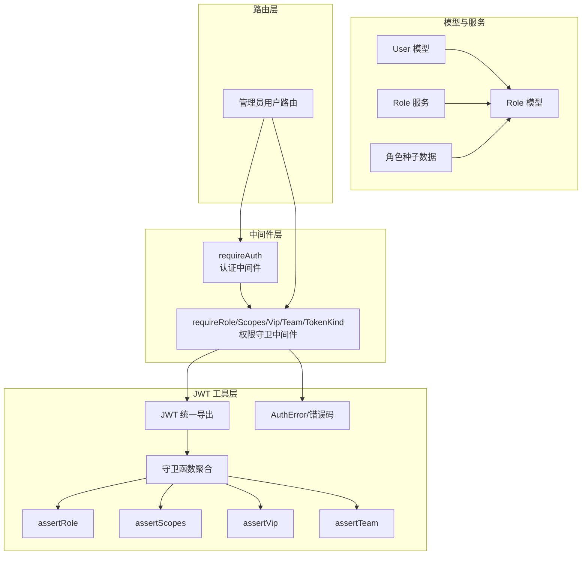
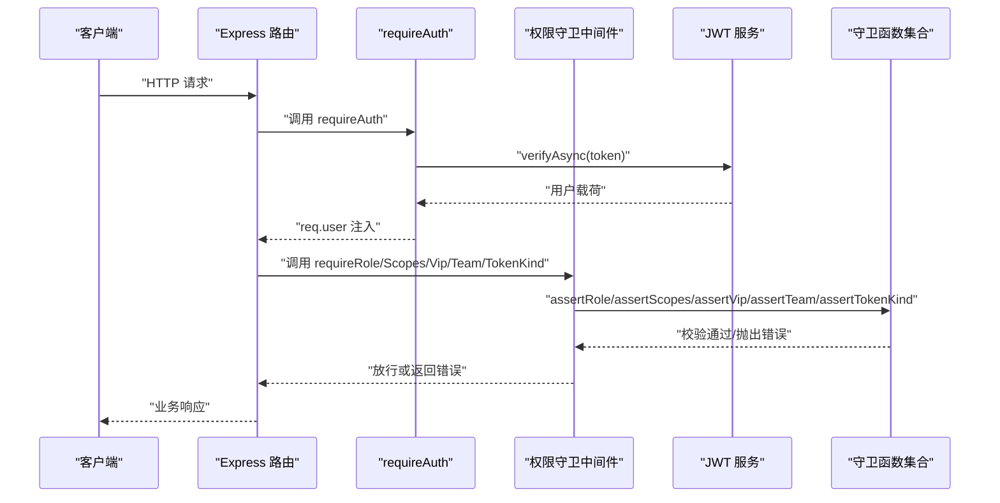
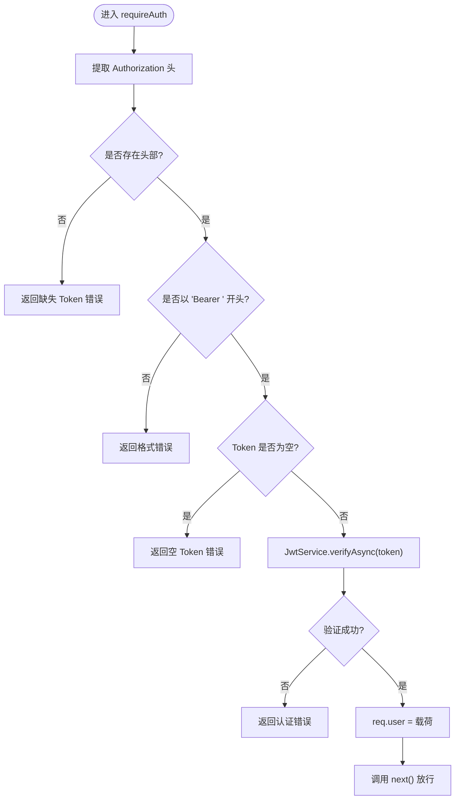
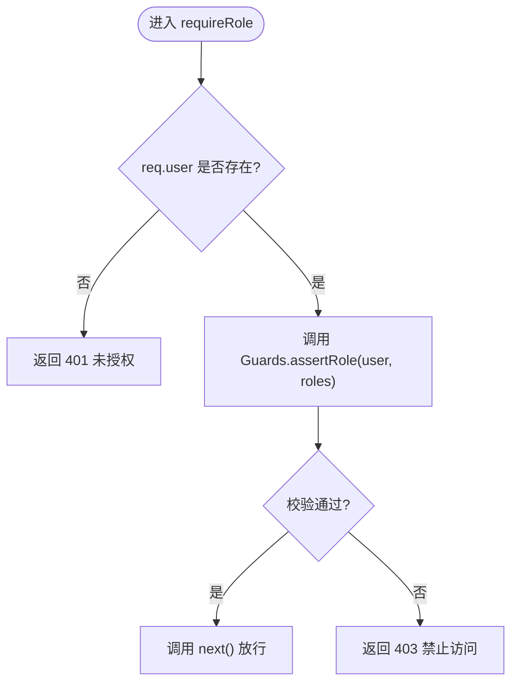
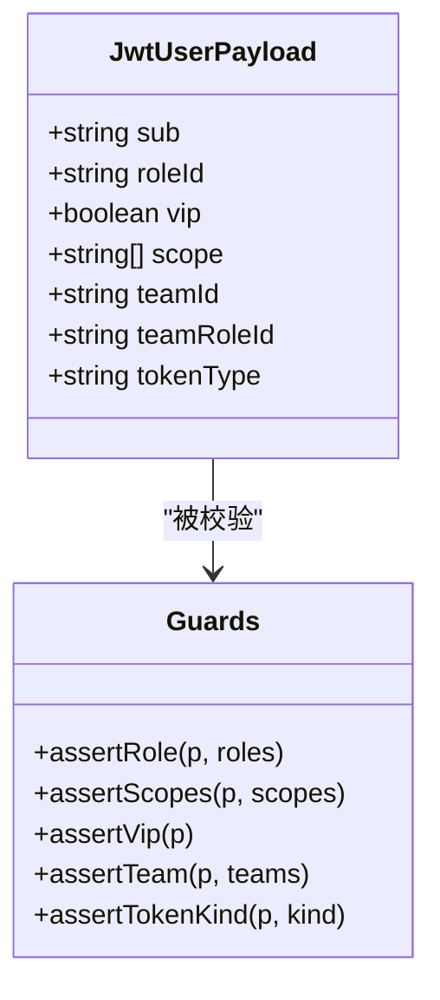
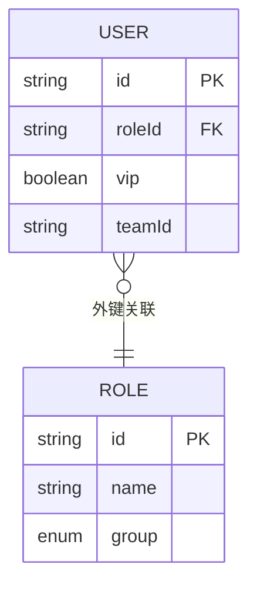
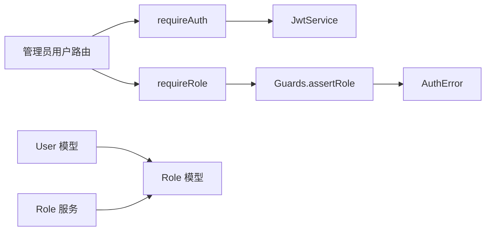

# 角色权限控制

<cite>
**本文引用的文件**
- [src/middleware/auth/guards.ts](file://src/middleware/auth/guards.ts)
- [src/middleware/auth/require.ts](file://src/middleware/auth/require.ts)
- [src/middleware/auth/types.ts](file://src/middleware/auth/types.ts)
- [src/middleware/auth/index.ts](file://src/middleware/auth/index.ts)
- [src/tools/jwt/index.ts](file://src/tools/jwt/index.ts)
- [src/tools/jwt/guards/index.ts](file://src/tools/jwt/guards/index.ts)
- [src/tools/jwt/guards/role.ts](file://src/tools/jwt/guards/role.ts)
- [src/tools/jwt/guards/scopes.ts](file://src/tools/jwt/guards/scopes.ts)
- [src/tools/jwt/guards/team.ts](file://src/tools/jwt/guards/team.ts)
- [src/tools/jwt/guards/vip.ts](file://src/tools/jwt/guards/vip.ts)
- [src/tools/jwt/guards/app.ts](file://src/tools/jwt/guards/app.ts)
- [src/tools/jwt/guards/code.ts](file://src/tools/jwt/guards/code.ts)
- [src/tools/jwt/guards/device.ts](file://src/tools/jwt/guards/device.ts)
- [src/tools/jwt/guards/id.ts](file://src/tools/jwt/guards/id.ts)
- [src/tools/jwt/errors/index.ts](file://src/tools/jwt/errors/index.ts)
- [src/types/jwt/index.ts](file://src/types/jwt/index.ts)
- [src/types/jwt/user-types.ts](file://src/types/jwt/user-types.ts)
- [src/models/role/index.ts](file://src/models/role/index.ts)
- [src/models/role/types/index.ts](file://src/models/role/types/index.ts)
- [src/models/user/user.ts](file://src/models/user/user.ts)
- [src/services/role.ts](file://src/services/role.ts)
- [src/config/seed/role.json](file://src/config/seed/role.json)
- [src/routes/admin/user.ts](file://src/routes/admin/user.ts)
</cite>

## 目录
1. [简介](#简介)
2. [项目结构](#项目结构)
3. [核心组件](#核心组件)
4. [架构总览](#架构总览)
5. [详细组件分析](#详细组件分析)
6. [依赖关系分析](#依赖关系分析)
7. [性能考虑](#性能考虑)
8. [故障排查指南](#故障排查指南)
9. [结论](#结论)
10. [附录](#附录)

## 简介
本技术文档围绕基于角色的访问控制（RBAC）机制进行系统化梳理，重点覆盖以下方面：
- 角色与权限模型：角色定义、角色分组、用户角色外键关联、角色种子数据与默认值。
- 中间件链路：认证中间件（requireAuth）与权限守卫中间件（requireRole、requireScopes、requireVip、requireTeam、requireTokenKind）的职责与调用顺序。
- 角色验证逻辑：基于 JWT 载荷中的 roleId 字段进行角色匹配，以及与作用域（scope）、VIP、团队（teamId）等维度的组合校验。
- 配置与动态更新：角色配置来源（种子数据）、角色模型与服务层、用户模型中的 roleId 默认值与外键约束。
- 实战示例：管理员权限验证、用户权限检查等常见场景的使用方法。
- 协作与优先级：RBAC 与其他权限模型（如作用域、VIP、团队）的协作关系与执行顺序建议。

## 项目结构
本项目采用按领域与层次划分的组织方式：
- 中间件层：认证与权限守卫中间件，负责请求拦截与权限判定。
- JWT 工具层：统一的 JWT 服务、守卫函数、错误类型与类型定义。
- 模型层：用户与角色的数据库模型，包含角色分组与用户角色外键。
- 服务层：角色 CRUD 服务，提供角色管理的通用能力。
- 配置与种子：角色种子数据，用于初始化系统角色。
- 路由层：示例路由，展示如何在路由上叠加认证与权限守卫。

图表来源
- [src/middleware/auth/require.ts](file://src/middleware/auth/require.ts#L68-L97)
- [src/middleware/auth/guards.ts](file://src/middleware/auth/guards.ts#L25-L51)
- [src/tools/jwt/index.ts](file://src/tools/jwt/index.ts#L68-L106)
- [src/tools/jwt/guards/index.ts](file://src/tools/jwt/guards/index.ts#L1-L19)
- [src/tools/jwt/guards/role.ts](file://src/tools/jwt/guards/role.ts#L25-L30)
- [src/models/user/user.ts](file://src/models/user/user.ts#L157-L162)
- [src/models/role/index.ts](file://src/models/role/index.ts#L42-L76)
- [src/services/role.ts](file://src/services/role.ts#L32-L34)
- [src/config/seed/role.json](file://src/config/seed/role.json#L1-L27)
- [src/routes/admin/user.ts](file://src/routes/admin/user.ts#L33-L37)

章节来源
- [src/middleware/auth/index.ts](file://src/middleware/auth/index.ts#L12-L44)
- [src/middleware/auth/require.ts](file://src/middleware/auth/require.ts#L68-L97)
- [src/middleware/auth/guards.ts](file://src/middleware/auth/guards.ts#L25-L51)
- [src/tools/jwt/index.ts](file://src/tools/jwt/index.ts#L68-L106)
- [src/models/user/user.ts](file://src/models/user/user.ts#L157-L162)
- [src/models/role/index.ts](file://src/models/role/index.ts#L42-L76)
- [src/services/role.ts](file://src/services/role.ts#L32-L34)
- [src/config/seed/role.json](file://src/config/seed/role.json#L1-L27)
- [src/routes/admin/user.ts](file://src/routes/admin/user.ts#L33-L37)

## 核心组件
- 认证中间件 requireAuth：从 Authorization 头解析 Bearer Token，调用 JWT 服务进行验证，将用户载荷写入 req.user。
- 权限守卫中间件 requireRole/requireScopes/requireVip/requireTeam/requireTokenKind：基于 req.user 执行角色、作用域、VIP、团队、Token 类型等校验。
- JWT 工具层：统一导出 JwtService、守卫函数、错误类型与类型定义，提供 createJwtServiceFromEnv 等工厂方法。
- 用户与角色模型：User 模型包含 roleId 外键，默认值为 "user"；Role 模型定义角色分组（system/project/user/admin）。
- 角色服务：基于通用 CRUD 服务封装 Role 的增删改查能力。
- 角色种子数据：提供初始角色（如 admin 与 user 分组）以快速初始化系统。

章节来源
- [src/middleware/auth/require.ts](file://src/middleware/auth/require.ts#L68-L97)
- [src/middleware/auth/guards.ts](file://src/middleware/auth/guards.ts#L25-L51)
- [src/tools/jwt/index.ts](file://src/tools/jwt/index.ts#L68-L106)
- [src/models/user/user.ts](file://src/models/user/user.ts#L157-L162)
- [src/models/role/index.ts](file://src/models/role/index.ts#L42-L76)
- [src/services/role.ts](file://src/services/role.ts#L32-L34)
- [src/config/seed/role.json](file://src/config/seed/role.json#L1-L27)

## 架构总览
下图展示了从请求进入应用到完成权限校验的整体流程，强调了认证与权限守卫的协作关系：

图表来源
- [src/middleware/auth/require.ts](file://src/middleware/auth/require.ts#L68-L97)
- [src/middleware/auth/guards.ts](file://src/middleware/auth/guards.ts#L25-L51)
- [src/tools/jwt/index.ts](file://src/tools/jwt/index.ts#L68-L106)
- [src/tools/jwt/guards/index.ts](file://src/tools/jwt/guards/index.ts#L1-L19)

## 详细组件分析

### 认证中间件 requireAuth
- 职责：从 Authorization 头提取 Bearer Token，调用 JwtService 验证后将用户载荷写入 req.user。
- 错误处理：对缺失/格式错误/验证失败等场景返回标准化错误。
- 单例 JWT 服务：延迟初始化，根据环境变量选择 HS256 或 RS256。

图表来源
- [src/middleware/auth/require.ts](file://src/middleware/auth/require.ts#L40-L97)

章节来源
- [src/middleware/auth/require.ts](file://src/middleware/auth/require.ts#L68-L97)

### 权限守卫中间件 requireRole
- 职责：基于 req.user 中的 roleId 与传入的角色列表进行匹配，若不匹配则返回 403。
- 依赖：调用 JWT 工具层的 Guards.assertRole。
- 错误处理：捕获认证错误并返回对应状态码，其他异常返回 500。

图表来源
- [src/middleware/auth/guards.ts](file://src/middleware/auth/guards.ts#L25-L51)
- [src/tools/jwt/guards/role.ts](file://src/tools/jwt/guards/role.ts#L25-L30)

章节来源
- [src/middleware/auth/guards.ts](file://src/middleware/auth/guards.ts#L25-L51)
- [src/tools/jwt/guards/role.ts](file://src/tools/jwt/guards/role.ts#L25-L30)

### 角色验证逻辑与组合规则
- 角色匹配：基于用户载荷中的 roleId 与允许列表进行包含判断。
- 作用域匹配：通过 requireScopes 对 scope 数组进行“至少包含其一”的校验。
- VIP 校验：通过 requireVip 对 vip 标志进行校验。
- 团队校验：通过 requireTeam 对 teamId 进行“至少属于其一”的校验。
- Token 类型校验：通过 requireTokenKind 对 tokenType 进行匹配。

图表来源
- [src/types/jwt/user-types.ts](file://src/types/jwt/user-types.ts#L44-L58)
- [src/tools/jwt/guards/index.ts](file://src/tools/jwt/guards/index.ts#L1-L19)

章节来源
- [src/tools/jwt/guards/index.ts](file://src/tools/jwt/guards/index.ts#L1-L19)
- [src/types/jwt/user-types.ts](file://src/types/jwt/user-types.ts#L44-L58)

### 角色模型与用户模型
- Role 模型：定义 id、name、group（枚举：system/project/user/admin），默认 group 为 user。
- User 模型：包含 roleId 外键，默认值为 "user"，并建立与 Role 的外键关联。
- 角色服务：基于通用 CRUD 服务封装 Role 的字段与排序配置。

图表来源
- [src/models/role/index.ts](file://src/models/role/index.ts#L42-L76)
- [src/models/user/user.ts](file://src/models/user/user.ts#L157-L162)

章节来源
- [src/models/role/index.ts](file://src/models/role/index.ts#L42-L76)
- [src/models/user/user.ts](file://src/models/user/user.ts#L157-L162)
- [src/services/role.ts](file://src/services/role.ts#L32-L34)

### 角色配置与种子数据
- 种子数据：提供 admin 与 user 分组的角色条目，便于系统初始化。
- 默认值：User 模型的 roleId 默认为 "user"，Role 模型的 group 默认为 "user"。

章节来源
- [src/config/seed/role.json](file://src/config/seed/role.json#L1-L27)
- [src/models/user/user.ts](file://src/models/user/user.ts#L160-L161)
- [src/models/role/index.ts](file://src/models/role/index.ts#L59-L60)

### 实际使用示例
- 管理员权限验证：在路由上叠加 requireAuth 与 requireRole(["ADMIN"])，确保仅 ADMIN 可访问。
- 用户权限检查：通过 requireScopes(["read", "write"]) 确保用户具备所需作用域之一。
- VIP 资源访问：通过 requireVip() 限制仅 VIP 用户可访问。
- 团队资源访问：通过 requireTeam(["team-a", "team-b"]) 限制团队范围。
- Token 类型限制：通过 requireTokenKind("refresh") 限制刷新令牌使用。

章节来源
- [src/middleware/auth/guards.ts](file://src/middleware/auth/guards.ts#L22-L23)
- [src/middleware/auth/guards.ts](file://src/middleware/auth/guards.ts#L58-L59)
- [src/middleware/auth/guards.ts](file://src/middleware/auth/guards.ts#L93-L94)
- [src/middleware/auth/guards.ts](file://src/middleware/auth/guards.ts#L130-L131)
- [src/middleware/auth/guards.ts](file://src/middleware/auth/guards.ts#L165-L166)
- [src/routes/admin/user.ts](file://src/routes/admin/user.ts#L33-L37)

## 依赖关系分析
- 中间件依赖 JWT 工具层：requireAuth 依赖 JwtService，requireRole 等依赖 Guards。
- 守卫函数依赖错误类型：assertRole 等在不满足条件时抛出 AuthError。
- 模型依赖：User 依赖 Role 进行外键关联；Role 服务依赖 Role 模型。
- 路由依赖：示例路由使用 requireAuth 与 requireRole 等中间件。

图表来源
- [src/middleware/auth/require.ts](file://src/middleware/auth/require.ts#L80-L84)
- [src/middleware/auth/guards.ts](file://src/middleware/auth/guards.ts#L37-L38)
- [src/tools/jwt/guards/role.ts](file://src/tools/jwt/guards/role.ts#L25-L30)
- [src/tools/jwt/errors/index.ts](file://src/tools/jwt/errors/index.ts#L1-L200)
- [src/models/user/user.ts](file://src/models/user/user.ts#L157-L162)
- [src/models/role/index.ts](file://src/models/role/index.ts#L42-L76)
- [src/services/role.ts](file://src/services/role.ts#L32-L34)
- [src/routes/admin/user.ts](file://src/routes/admin/user.ts#L33-L37)

章节来源
- [src/middleware/auth/require.ts](file://src/middleware/auth/require.ts#L80-L84)
- [src/middleware/auth/guards.ts](file://src/middleware/auth/guards.ts#L37-L38)
- [src/tools/jwt/guards/role.ts](file://src/tools/jwt/guards/role.ts#L25-L30)
- [src/models/user/user.ts](file://src/models/user/user.ts#L157-L162)
- [src/models/role/index.ts](file://src/models/role/index.ts#L42-L76)
- [src/services/role.ts](file://src/services/role.ts#L32-L34)
- [src/routes/admin/user.ts](file://src/routes/admin/user.ts#L33-L37)

## 性能考虑
- JWT 验证成本：verifyAsync 为异步验证，建议在高并发场景下合理设置超时与缓存策略（如公钥缓存）。
- 守卫函数复杂度：角色匹配为 O(1)，作用域与团队匹配为 O(n)（n 为允许列表长度），建议控制允许列表规模。
- 中间件链路：尽量将 requireAuth 放在最前，减少后续守卫的重复校验成本。
- 数据库访问：角色 CRUD 服务基于通用 CRUD，注意索引与查询字段配置，避免 N+1 查询。

## 故障排查指南
- 401 未授权：通常由 requireAuth 抛出，检查 Authorization 头是否正确、Token 是否过期或签名无效。
- 403 禁止访问：由 requireRole/Scopes/Vip/Team/TokenKind 抛出，检查用户载荷中的 roleId/scope/vip/teamId/tokenType 是否符合预期。
- 500 内部错误：中间件内部异常或 JWT 服务异常，检查日志与环境配置。
- 类型扩展：确保引入中间件的类型扩展文件，使 req.user 类型可用。

章节来源
- [src/middleware/auth/require.ts](file://src/middleware/auth/require.ts#L75-L96)
- [src/middleware/auth/guards.ts](file://src/middleware/auth/guards.ts#L36-L50)
- [src/middleware/auth/types.ts](file://src/middleware/auth/types.ts#L17-L31)

## 结论
本 RBAC 模块通过认证中间件与多维权限守卫中间件协同工作，实现了以角色为主、辅以作用域、VIP、团队与 Token 类型的灵活权限控制。结合角色模型、服务层与种子数据，系统可在初始化阶段快速建立角色体系，并在运行时通过 JWT 载荷进行高效校验。建议在生产环境中配合缓存、限流与日志审计，进一步提升安全性与可观测性。

## 附录
- 关键类型与导出：JWT 类型、守卫函数、错误类型均通过统一入口导出，便于集中管理与替换。
- 示例路由：管理员用户路由展示了如何在实际业务中叠加认证与权限守卫。

章节来源
- [src/types/jwt/index.ts](file://src/types/jwt/index.ts#L9-L23)
- [src/tools/jwt/index.ts](file://src/tools/jwt/index.ts#L68-L106)
- [src/routes/admin/user.ts](file://src/routes/admin/user.ts#L33-L37)