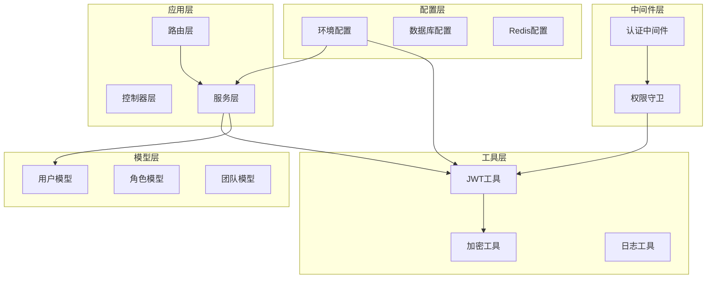
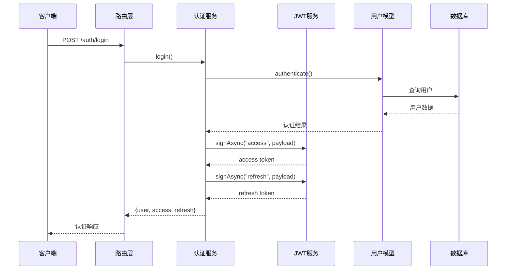
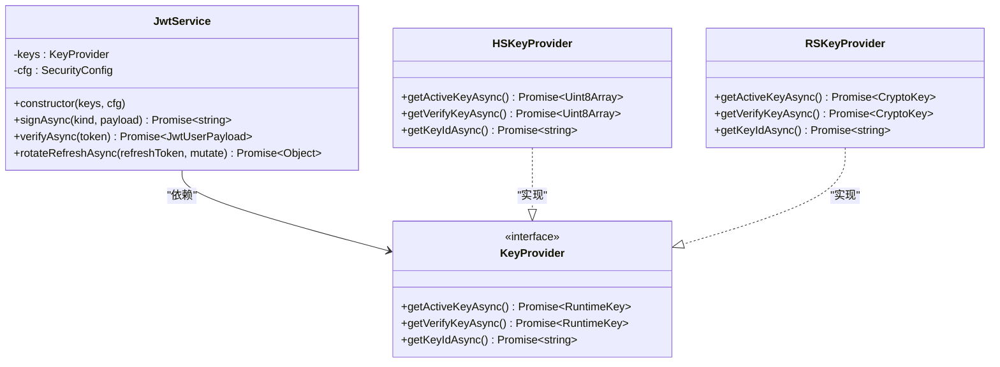
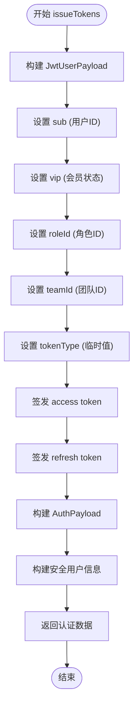
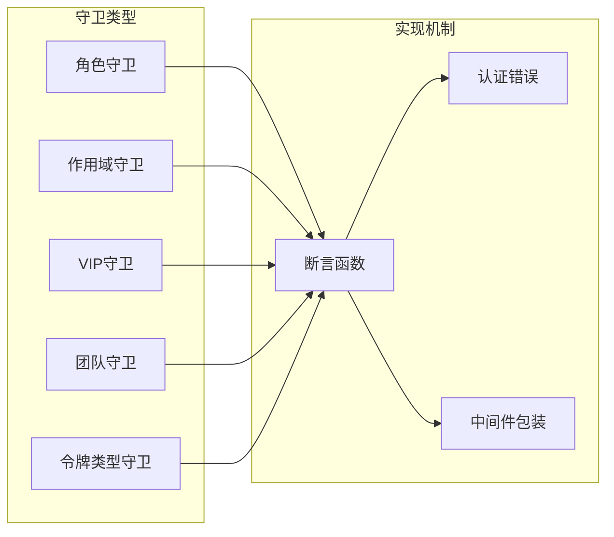
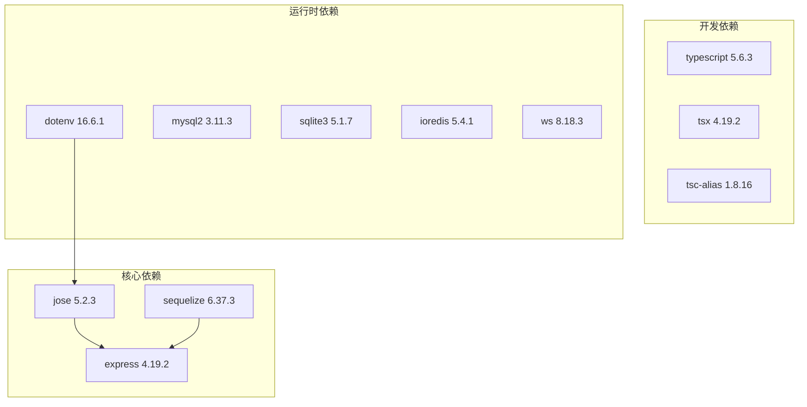
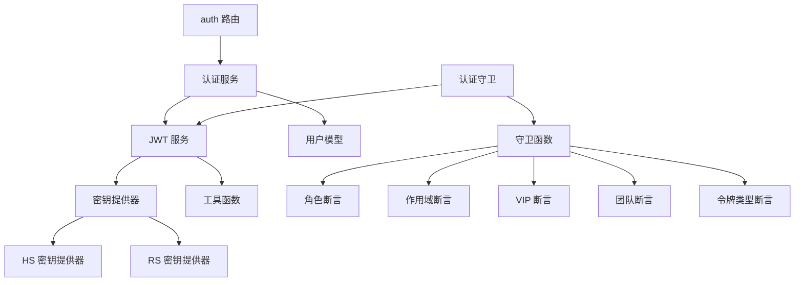

# 令牌管理系统

<cite>
**本文档引用的文件**
- [src/tools/jwt/service.ts](file://src/tools/jwt/service.ts)
- [src/tools/jwt/index.ts](file://src/tools/jwt/index.ts)
- [src/tools/jwt/utils.ts](file://src/tools/jwt/utils.ts)
- [src/types/jwt/index.ts](file://src/types/jwt/index.ts)
- [src/types/jwt/user-types.ts](file://src/types/jwt/user-types.ts)
- [src/types/jwt/jwt-config.ts](file://src/types/jwt/jwt-config.ts)
- [src/tools/jwt/keys/index.ts](file://src/tools/jwt/keys/index.ts)
- [src/services/auth.ts](file://src/services/auth.ts)
- [src/routes/auth.ts](file://src/routes/auth.ts)
- [src/middleware/auth/guards.ts](file://src/middleware/auth/guards.ts)
- [src/tools/jwt/guards/index.ts](file://src/tools/jwt/guards/index.ts)
- [src/models/user/user.ts](file://src/models/user/user.ts)
- [package.json](file://package.json)
- [src/config/env/index.ts](file://src/config/env/index.ts)
</cite>

## 目录
1. [简介](#简介)
2. [项目结构](#项目结构)
3. [核心组件](#核心组件)
4. [架构概览](#架构概览)
5. [详细组件分析](#详细组件分析)
6. [依赖关系分析](#依赖关系分析)
7. [性能考量](#性能考量)
8. [故障排除指南](#故障排除指南)
9. [结论](#结论)
10. [附录](#附录)

## 简介
本项目是一个基于 JWT（JSON Web Token）的令牌管理系统，提供了完整的令牌签发、验证、刷新和权限控制能力。系统采用现代 TypeScript 开发，支持 HS256 和 RS256 两种签名算法，实现了无状态的认证机制。

系统的核心特性包括：
- 支持 access token 和 refresh token 的双重令牌机制
- 基于 jose 库的安全 JWT 实现
- 多种密钥提供器（HS256/RSA）
- 完整的权限守卫系统
- 类型安全的载荷定义
- 环境变量驱动的配置管理

## 项目结构
项目采用模块化的组织方式，主要分为以下层次：

**图表来源**
- [src/routes/auth.ts](file://src/routes/auth.ts#L1-L47)
- [src/services/auth.ts](file://src/services/auth.ts#L1-L170)
- [src/tools/jwt/index.ts](file://src/tools/jwt/index.ts#L1-L107)

**章节来源**
- [src/routes/auth.ts](file://src/routes/auth.ts#L1-L47)
- [src/services/auth.ts](file://src/services/auth.ts#L1-L170)
- [src/tools/jwt/index.ts](file://src/tools/jwt/index.ts#L1-L107)

## 核心组件
系统的核心组件围绕 JWT 令牌管理展开，主要包括以下关键模块：

### JWT 服务层
- **JwtService**: 核心的 JWT 操作类，提供签发、验证、刷新等功能
- **密钥提供器**: 支持 HS256 和 RS256 算法的密钥管理
- **工具函数**: TTL 转换、时间戳处理、ID 生成等辅助功能

### 认证服务层
- **AuthService**: 处理用户注册、登录、令牌签发等业务逻辑
- **issueTokens 函数**: 核心的令牌签发流程实现

### 权限控制层
- **守卫中间件**: 基于角色、作用域、VIP 状态等的权限验证
- **类型系统**: 完整的 TypeScript 类型定义确保运行时安全

**章节来源**
- [src/tools/jwt/service.ts](file://src/tools/jwt/service.ts#L27-L98)
- [src/services/auth.ts](file://src/services/auth.ts#L45-L80)
- [src/middleware/auth/guards.ts](file://src/middleware/auth/guards.ts#L1-L195)

## 架构概览
系统采用分层架构设计，各层职责清晰分离：

**图表来源**
- [src/routes/auth.ts](file://src/routes/auth.ts#L26-L30)
- [src/services/auth.ts](file://src/services/auth.ts#L126-L134)
- [src/tools/jwt/service.ts](file://src/tools/jwt/service.ts#L41-L56)

系统架构的关键特点：
- **无状态设计**: JWT 令牌包含所有必要的认证信息
- **模块化**: 各组件职责明确，便于测试和维护
- **类型安全**: 完整的 TypeScript 类型系统确保编译时安全
- **可扩展性**: 支持多种算法和配置选项

## 详细组件分析

### JWT 服务组件分析

#### JwtService 类设计
JwtService 是系统的核心类，封装了完整的 JWT 生命周期管理：

**图表来源**
- [src/tools/jwt/service.ts](file://src/tools/jwt/service.ts#L27-L30)
- [src/tools/jwt/keys/index.ts](file://src/tools/jwt/keys/index.ts#L161-L174)
- [src/tools/jwt/keys/index.ts](file://src/tools/jwt/keys/index.ts#L232-L254)

#### issueTokens 函数实现流程
issueTokens 函数是令牌签发的核心流程，实现了完整的令牌生成逻辑：

**图表来源**
- [src/services/auth.ts](file://src/services/auth.ts#L45-L80)

令牌签发的关键步骤：
1. **载荷构建**: 从用户模型提取必要信息构建 JWT 载荷
2. **令牌签发**: 分别签发 access token 和 refresh token
3. **数据整理**: 构建返回给客户端的数据结构
4. **安全处理**: 移除敏感信息，确保数据安全

**章节来源**
- [src/services/auth.ts](file://src/services/auth.ts#L45-L80)

### 令牌数据结构分析

#### JwtUserPayload 字段详解
JWT 载荷定义了令牌中包含的所有用户信息：

| 字段名 | 类型 | 必填 | 描述 | 示例值 |
|--------|------|------|------|--------|
| sub | string | 是 | 用户主体ID（用户主键） | "U123456" |
| roleId | string | 是 | 角色ID | "user" |
| vip | boolean | 是 | 是否为会员用户 | true/false |
| teamId | string \| null | 否 | 团队ID | "T789" |
| teamRoleId | string \| null | 否 | 团队角色ID | "member" |
| telegramId | string \| null | 否 | 电报ID | "123456789" |
| status | UserState \| null | 否 | 用户状态 | "active" |
| tokenType | TokenKind | 是 | 令牌类型 | "access" |
| scope | string[] \| null | 否 | 作用域集合 | ["read", "write"] |
| deviceId | string \| null | 否 | 设备ID | "device-001" |
| jti | string \| null | 否 | JWT 唯一ID | "jti-123" |
| iat | number \| null | 否 | 签发时间（秒） | 1700000000 |
| exp | number \| null | 否 | 过期时间（秒） | 1700003600 |

**章节来源**
- [src/types/jwt/user-types.ts](file://src/types/jwt/user-types.ts#L28-L58)

### 权限守卫系统分析

#### 守卫中间件架构
系统提供了多层次的权限控制机制：

**图表来源**
- [src/middleware/auth/guards.ts](file://src/middleware/auth/guards.ts#L18-L195)
- [src/tools/jwt/guards/index.ts](file://src/tools/jwt/guards/index.ts#L1-L19)

**章节来源**
- [src/middleware/auth/guards.ts](file://src/middleware/auth/guards.ts#L1-L195)
- [src/tools/jwt/guards/index.ts](file://src/tools/jwt/guards/index.ts#L1-L19)

## 依赖关系分析

### 外部依赖关系
系统依赖的关键外部库：

**图表来源**
- [package.json](file://package.json#L12-L34)

### 内部模块依赖
系统内部模块间的依赖关系：

**图表来源**
- [src/routes/auth.ts](file://src/routes/auth.ts#L12-L16)
- [src/services/auth.ts](file://src/services/auth.ts#L13-L22)
- [src/tools/jwt/service.ts](file://src/tools/jwt/service.ts#L15-L20)

**章节来源**
- [package.json](file://package.json#L12-L34)
- [src/tools/jwt/keys/index.ts](file://src/tools/jwt/keys/index.ts#L267-L285)

## 性能考量

### 令牌签发性能优化
系统在令牌签发过程中采用了多项性能优化措施：

1. **密钥缓存**: 密钥提供器实现了密钥缓存机制，避免重复的密钥加载
2. **异步操作**: 所有 I/O 操作都采用异步处理，避免阻塞主线程
3. **内存管理**: 使用高效的随机数生成和字符串处理
4. **算法选择**: 支持 HS256 和 RS256 两种算法，可根据场景选择最优方案

### 缓存策略
- **密钥缓存**: HS 密钥提供器缓存解密后的密钥字节数组
- **RSA 密钥缓存**: RS 密钥提供器缓存导入后的 CryptoKey 对象
- **环境变量缓存**: 环境配置在应用启动时一次性加载

### 并发处理
系统通过以下机制保证高并发场景下的稳定性：
- 使用异步函数处理所有 JWT 操作
- 密钥提供器的线程安全设计
- 无状态的 JWT 令牌设计减少服务器端状态存储

## 故障排除指南

### 常见错误类型及解决方案

#### 认证错误处理
系统定义了完整的错误处理机制：

| 错误类型 | 错误码 | 描述 | 解决方案 |
|----------|--------|------|----------|
| Expired | EXPIRED | 令牌过期 | 请求新的 access token |
| Invalid | INVALID | 令牌无效 | 检查令牌格式和签名 |
| Forbidden | FORBIDDEN | 权限不足 | 验证用户角色和作用域 |
| Unauthorized | UNAUTHORIZED | 未认证 | 检查认证头和令牌有效性 |

#### 令牌验证失败排查
当令牌验证失败时，建议按以下顺序排查：

1. **检查令牌格式**: 确保 JWT 包含三个点分隔的有效部分
2. **验证签名算法**: 确认客户端和服务端使用相同的算法
3. **检查密钥配置**: 验证 HS256 密钥或 RSA 密钥对配置正确
4. **确认时间同步**: 确保服务器时间和客户端时间同步
5. **检查令牌类型**: 验证访问令牌和刷新令牌的正确使用

#### 性能问题诊断
如果遇到性能问题，可以检查：

1. **密钥加载**: 确认密钥提供器正常工作，没有频繁的密钥重新加载
2. **数据库连接**: 检查用户认证相关的数据库查询性能
3. **内存使用**: 监控应用的内存使用情况，避免内存泄漏
4. **并发处理**: 检查是否有过多的并发请求导致资源竞争

**章节来源**
- [src/tools/jwt/service.ts](file://src/tools/jwt/service.ts#L66-L75)
- [src/middleware/auth/guards.ts](file://src/middleware/auth/guards.ts#L26-L50)

## 结论
本令牌管理系统提供了完整、安全、高性能的 JWT 认证解决方案。系统的主要优势包括：

1. **安全性**: 基于 jose 库的标准化实现，支持多种加密算法
2. **灵活性**: 模块化设计支持不同的部署场景和安全要求
3. **可维护性**: 完整的 TypeScript 类型系统和单元测试覆盖
4. **性能**: 优化的密钥管理和异步处理机制
5. **易用性**: 简洁的 API 设计和详细的文档说明

系统适用于各种规模的应用场景，从小型 Web 应用到大型企业级系统都能提供可靠的认证服务。

## 附录

### 环境配置说明
系统支持通过环境变量进行配置，主要配置项包括：

- **JWT_SECRET**: HS256 算法的密钥
- **JWT_PRIVATE_KEY_PATH**: RS256 私钥文件路径
- **JWT_PUBLIC_KEY_PATH**: RS256 公钥文件路径
- **JWT_ALGORITHM**: JWT 算法选择（HS256/RS256）

### 最佳实践建议
1. **密钥管理**: 生产环境中使用强随机密钥，定期轮换
2. **令牌存储**: 客户端应安全存储令牌，避免明文存储
3. **传输安全**: 始终使用 HTTPS 传输令牌
4. **过期策略**: 合理设置令牌过期时间，平衡用户体验和安全性
5. **监控告警**: 建立令牌使用监控和异常告警机制

### 安全考虑
- 实施严格的输入验证和输出编码
- 使用 HTTPS 和安全的 Cookie 属性
- 定期审计和更新安全配置
- 实施适当的速率限制和防护措施
- 建立完整的日志记录和审计机制