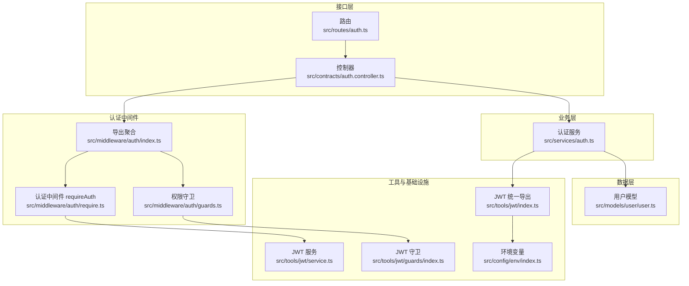
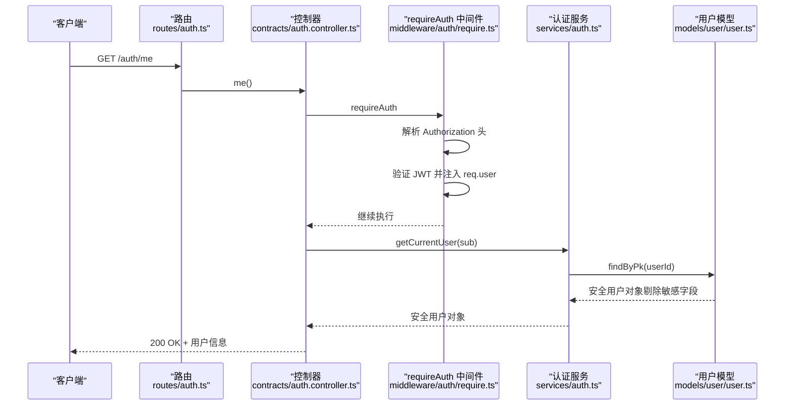
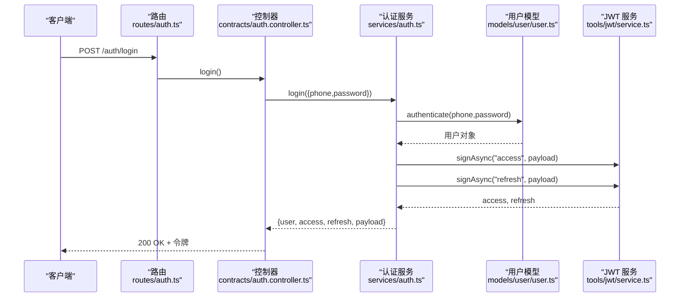
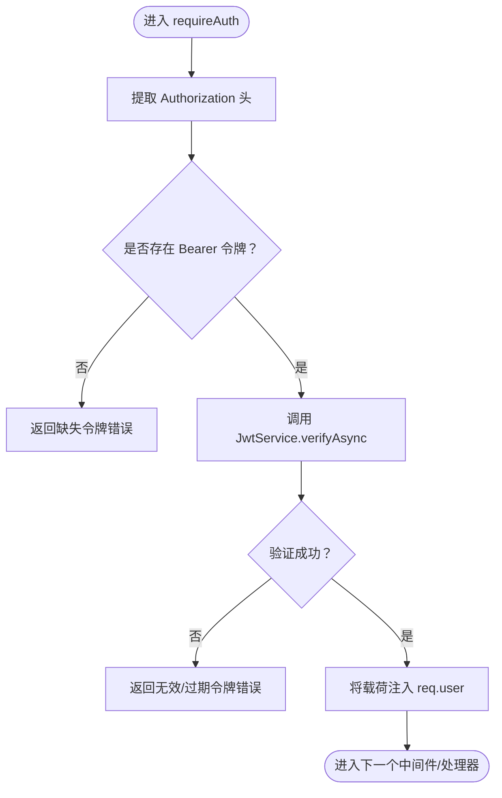
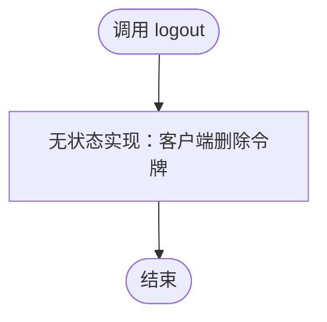
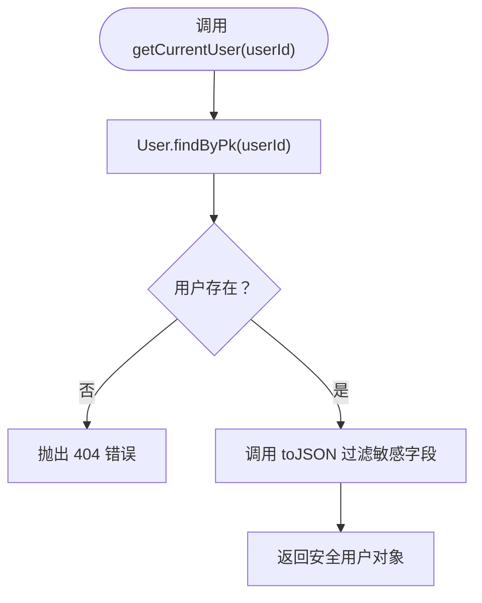
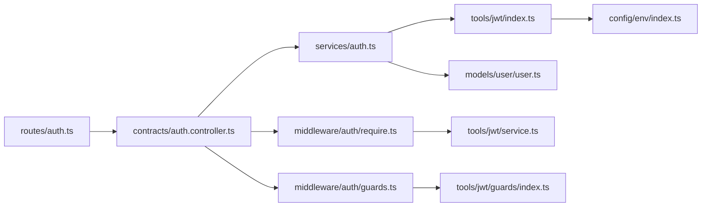

# 用户会话管理

<cite>
**本文引用的文件**
- [src/services/auth.ts](file://src/services/auth.ts)
- [src/contracts/auth.controller.ts](file://src/contracts/auth.controller.ts)
- [src/routes/auth.ts](file://src/routes/auth.ts)
- [src/middleware/auth/index.ts](file://src/middleware/auth/index.ts)
- [src/middleware/auth/require.ts](file://src/middleware/auth/require.ts)
- [src/middleware/auth/guards.ts](file://src/middleware/auth/guards.ts)
- [src/tools/jwt/index.ts](file://src/tools/jwt/index.ts)
- [src/tools/jwt/service.ts](file://src/tools/jwt/service.ts)
- [src/tools/jwt/guards/index.ts](file://src/tools/jwt/guards/index.ts)
- [src/models/user/user.ts](file://src/models/user/user.ts)
- [src/config/env/index.ts](file://src/config/env/index.ts)
</cite>

## 目录
1. [简介](#简介)
2. [项目结构](#项目结构)
3. [核心组件](#核心组件)
4. [架构总览](#架构总览)
5. [组件详解](#组件详解)
6. [依赖关系分析](#依赖关系分析)
7. [性能考量](#性能考量)
8. [故障排除指南](#故障排除指南)
9. [结论](#结论)
10. [附录](#附录)

## 简介
本文件围绕用户会话管理提供一套完整的操作文档，涵盖会话建立、维护与销毁流程，当前用户信息获取、会话状态跟踪与超时处理机制。重点解释以下内容：
- getCurrentUser 方法的实现逻辑：用户ID验证、数据库查询与安全信息过滤
- logout 方法的无状态实现原理：为何 JWT 无需服务端会话存储
- 会话管理最佳实践：令牌刷新策略、会话安全与并发控制
- 分布式环境下会话状态处理方式与挑战
- 会话管理的代码示例与故障排除指南

## 项目结构
本项目的会话管理由“路由 → 控制器 → 中间件 → 服务 → 工具/模型”分层协作完成，采用无状态 JWT 令牌作为会话凭证，避免服务端会话存储。

图表来源
- [src/routes/auth.ts](file://src/routes/auth.ts#L1-L47)
- [src/contracts/auth.controller.ts](file://src/contracts/auth.controller.ts#L1-L111)
- [src/middleware/auth/index.ts](file://src/middleware/auth/index.ts#L1-L45)
- [src/middleware/auth/require.ts](file://src/middleware/auth/require.ts#L1-L98)
- [src/middleware/auth/guards.ts](file://src/middleware/auth/guards.ts#L1-L195)
- [src/services/auth.ts](file://src/services/auth.ts#L1-L170)
- [src/tools/jwt/index.ts](file://src/tools/jwt/index.ts#L1-L107)
- [src/tools/jwt/service.ts](file://src/tools/jwt/service.ts#L1-L98)
- [src/tools/jwt/guards/index.ts](file://src/tools/jwt/guards/index.ts#L1-L19)
- [src/models/user/user.ts](file://src/models/user/user.ts#L1-L275)
- [src/config/env/index.ts](file://src/config/env/index.ts#L1-L223)

章节来源
- [src/routes/auth.ts](file://src/routes/auth.ts#L1-L47)
- [src/contracts/auth.controller.ts](file://src/contracts/auth.controller.ts#L1-L111)
- [src/middleware/auth/index.ts](file://src/middleware/auth/index.ts#L1-L45)
- [src/middleware/auth/require.ts](file://src/middleware/auth/require.ts#L1-L98)
- [src/middleware/auth/guards.ts](file://src/middleware/auth/guards.ts#L1-L195)
- [src/services/auth.ts](file://src/services/auth.ts#L1-L170)
- [src/tools/jwt/index.ts](file://src/tools/jwt/index.ts#L1-L107)
- [src/tools/jwt/service.ts](file://src/tools/jwt/service.ts#L1-L98)
- [src/tools/jwt/guards/index.ts](file://src/tools/jwt/guards/index.ts#L1-L19)
- [src/models/user/user.ts](file://src/models/user/user.ts#L1-L275)
- [src/config/env/index.ts](file://src/config/env/index.ts#L1-L223)

## 核心组件
- 路由与控制器：负责对外暴露注册、登录、退出、获取当前用户等接口，并调用认证服务与中间件。
- 认证中间件：requireAuth 负责从请求头解析 Bearer 令牌并验证；权限守卫基于 req.user 进行角色、作用域、VIP、团队与令牌类型校验。
- 认证服务：封装注册、登录、获取当前用户、退出等业务逻辑；登录时签发访问与刷新令牌；退出为无状态实现。
- JWT 工具：提供 JwtService 的签发、验证、刷新轮转能力；根据环境变量选择算法与密钥；提供守卫断言。
- 用户模型：提供认证与序列化能力，确保敏感字段不外泄。

章节来源
- [src/routes/auth.ts](file://src/routes/auth.ts#L1-L47)
- [src/contracts/auth.controller.ts](file://src/contracts/auth.controller.ts#L1-L111)
- [src/middleware/auth/require.ts](file://src/middleware/auth/require.ts#L1-L98)
- [src/middleware/auth/guards.ts](file://src/middleware/auth/guards.ts#L1-L195)
- [src/services/auth.ts](file://src/services/auth.ts#L1-L170)
- [src/tools/jwt/service.ts](file://src/tools/jwt/service.ts#L1-L98)
- [src/models/user/user.ts](file://src/models/user/user.ts#L1-L275)

## 架构总览
下图展示一次“获取当前用户”的完整调用链路，体现无状态 JWT 的会话管理方式。

图表来源
- [src/routes/auth.ts](file://src/routes/auth.ts#L39-L44)
- [src/contracts/auth.controller.ts](file://src/contracts/auth.controller.ts#L95-L110)
- [src/middleware/auth/require.ts](file://src/middleware/auth/require.ts#L68-L97)
- [src/services/auth.ts](file://src/services/auth.ts#L136-L153)
- [src/models/user/user.ts](file://src/models/user/user.ts#L69-L89)

## 组件详解

### 会话建立：登录与令牌签发
- 登录流程：控制器接收手机号与密码，调用认证服务；服务层通过用户模型进行认证，成功后构建 JWT 载荷并调用 JWT 服务签发访问与刷新令牌；返回安全用户信息与令牌。
- 令牌类型：访问令牌用于受保护资源访问；刷新令牌用于轮换新的访问令牌；当前实现为长期有效，不设置过期时间，刷新功能关闭，登录重新签发，退出注销。

图表来源
- [src/routes/auth.ts](file://src/routes/auth.ts#L25-L30)
- [src/contracts/auth.controller.ts](file://src/contracts/auth.controller.ts#L59-L74)
- [src/services/auth.ts](file://src/services/auth.ts#L120-L134)
- [src/models/user/user.ts](file://src/models/user/user.ts#L69-L89)
- [src/tools/jwt/service.ts](file://src/tools/jwt/service.ts#L41-L56)

章节来源
- [src/contracts/auth.controller.ts](file://src/contracts/auth.controller.ts#L59-L74)
- [src/services/auth.ts](file://src/services/auth.ts#L120-L134)
- [src/models/user/user.ts](file://src/models/user/user.ts#L69-L89)
- [src/tools/jwt/service.ts](file://src/tools/jwt/service.ts#L41-L56)

### 会话维护：中间件认证与权限守卫
- requireAuth：从 Authorization 头提取 Bearer 令牌，调用 JWT 服务验证，成功则将用户载荷注入 req.user，供后续处理器使用。
- 权限守卫：基于 req.user 断言角色、作用域、VIP、团队与令牌类型，不符合条件时返回相应错误。

图表来源
- [src/middleware/auth/require.ts](file://src/middleware/auth/require.ts#L35-L97)
- [src/tools/jwt/service.ts](file://src/tools/jwt/service.ts#L66-L75)

章节来源
- [src/middleware/auth/require.ts](file://src/middleware/auth/require.ts#L1-L98)
- [src/middleware/auth/guards.ts](file://src/middleware/auth/guards.ts#L1-L195)
- [src/tools/jwt/guards/index.ts](file://src/tools/jwt/guards/index.ts#L1-L19)

### 会话销毁：无状态退出
- 当前实现为无状态 JWT，客户端删除令牌即可视为注销；服务端无需维护会话状态。
- 若未来启用 Redis 黑名单，可在服务层 logout 中扩展相关逻辑。

图表来源
- [src/services/auth.ts](file://src/services/auth.ts#L155-L166)
- [src/contracts/auth.controller.ts](file://src/contracts/auth.controller.ts#L81-L88)

章节来源
- [src/services/auth.ts](file://src/services/auth.ts#L155-L166)
- [src/contracts/auth.controller.ts](file://src/contracts/auth.controller.ts#L81-L88)

### 当前用户信息获取：getCurrentUser
- 输入：用户 ID（来自 JWT 载荷 sub）
- 流程：通过用户模型按主键查询，若不存在抛出 404；成功则返回安全用户对象（内部已剔除敏感字段）
- 安全性：模型 toJSON 自动过滤敏感字段；服务层返回 SafeUser 类型

图表来源
- [src/services/auth.ts](file://src/services/auth.ts#L136-L153)
- [src/models/user/user.ts](file://src/models/user/user.ts#L91-L100)

章节来源
- [src/services/auth.ts](file://src/services/auth.ts#L136-L153)
- [src/models/user/user.ts](file://src/models/user/user.ts#L91-L100)

### 会话超时与刷新策略
- 当前实现：访问令牌长期有效（不设置 exp），刷新功能关闭，登录重新签发，退出注销。
- 刷新策略建议（可选）：启用刷新令牌轮转，服务端校验 refresh token 类型并签发新 access 与 refresh；结合设备绑定与黑名单降低风险。

章节来源
- [src/tools/jwt/service.ts](file://src/tools/jwt/service.ts#L33-L96)
- [src/tools/jwt/index.ts](file://src/tools/jwt/index.ts#L75-L106)

### 分布式环境下的会话处理
- 一致性挑战：无状态 JWT 在多节点部署时天然一致；但若启用 Redis 黑名单，需保证多节点共享状态。
- 建议：使用集中式缓存（如 Redis）统一管理黑名单；确保各节点使用相同密钥与算法；跨节点同步令牌轮转状态。

章节来源
- [src/tools/jwt/index.ts](file://src/tools/jwt/index.ts#L75-L106)
- [src/config/env/index.ts](file://src/config/env/index.ts#L215-L219)

## 依赖关系分析
- 路由依赖控制器；控制器依赖认证服务与中间件；认证服务依赖 JWT 工具与用户模型；JWT 工具依赖环境变量与密钥提供器；中间件依赖 JWT 服务与守卫。
- 关键耦合点：requireAuth 与 JwtService；权限守卫与 JwtService/Guards；认证服务与用户模型。

图表来源
- [src/routes/auth.ts](file://src/routes/auth.ts#L1-L47)
- [src/contracts/auth.controller.ts](file://src/contracts/auth.controller.ts#L1-L111)
- [src/services/auth.ts](file://src/services/auth.ts#L1-L170)
- [src/middleware/auth/require.ts](file://src/middleware/auth/require.ts#L1-L98)
- [src/middleware/auth/guards.ts](file://src/middleware/auth/guards.ts#L1-L195)
- [src/tools/jwt/index.ts](file://src/tools/jwt/index.ts#L1-L107)
- [src/tools/jwt/service.ts](file://src/tools/jwt/service.ts#L1-L98)
- [src/tools/jwt/guards/index.ts](file://src/tools/jwt/guards/index.ts#L1-L19)
- [src/models/user/user.ts](file://src/models/user/user.ts#L1-L275)
- [src/config/env/index.ts](file://src/config/env/index.ts#L1-L223)

章节来源
- [src/routes/auth.ts](file://src/routes/auth.ts#L1-L47)
- [src/contracts/auth.controller.ts](file://src/contracts/auth.controller.ts#L1-L111)
- [src/services/auth.ts](file://src/services/auth.ts#L1-L170)
- [src/middleware/auth/require.ts](file://src/middleware/auth/require.ts#L1-L98)
- [src/middleware/auth/guards.ts](file://src/middleware/auth/guards.ts#L1-L195)
- [src/tools/jwt/index.ts](file://src/tools/jwt/index.ts#L1-L107)
- [src/tools/jwt/service.ts](file://src/tools/jwt/service.ts#L1-L98)
- [src/tools/jwt/guards/index.ts](file://src/tools/jwt/guards/index.ts#L1-L19)
- [src/models/user/user.ts](file://src/models/user/user.ts#L1-L275)
- [src/config/env/index.ts](file://src/config/env/index.ts#L1-L223)

## 性能考量
- 无状态优势：JWT 无需服务端会话存储，减少数据库/缓存压力，适合水平扩展。
- 验证成本：每次请求均需验证签名与载荷，建议使用高性能密钥与合适的算法；对频繁访问的接口可考虑缓存公钥或使用硬件加速。
- 刷新与轮转：启用刷新轮转会增加一次验证与签发开销；建议在高并发场景评估刷新频率与令牌生命周期。
- 模型序列化：模型 toJSON 已内置安全过滤，避免重复处理敏感字段，减少序列化成本。

## 故障排除指南
- 缺失或格式错误的 Authorization 头
  - 现象：返回缺失令牌或头部格式错误
  - 排查：确认请求头以 Bearer 开头且不含多余空格
  - 参考
    - [src/middleware/auth/require.ts](file://src/middleware/auth/require.ts#L35-L57)
- 令牌无效或已过期
  - 现象：返回无效/过期令牌错误
  - 排查：核对密钥、算法与签名；检查系统时间与时区；确认未被黑名单拦截
  - 参考
    - [src/middleware/auth/require.ts](file://src/middleware/auth/require.ts#L85-L96)
    - [src/tools/jwt/service.ts](file://src/tools/jwt/service.ts#L66-L75)
- 用户不存在
  - 现象：获取当前用户时报 404
  - 排查：确认用户 ID 正确；检查用户状态与软删除
  - 参考
    - [src/services/auth.ts](file://src/services/auth.ts#L146-L150)
    - [src/models/user/user.ts](file://src/models/user/user.ts#L69-L89)
- 注销无效
  - 现象：服务端无状态注销不生效
  - 排查：确认客户端已删除本地令牌；若启用黑名单，需在服务端扩展注销逻辑
  - 参考
    - [src/services/auth.ts](file://src/services/auth.ts#L155-L166)

章节来源
- [src/middleware/auth/require.ts](file://src/middleware/auth/require.ts#L35-L97)
- [src/tools/jwt/service.ts](file://src/tools/jwt/service.ts#L66-L75)
- [src/services/auth.ts](file://src/services/auth.ts#L146-L150)
- [src/models/user/user.ts](file://src/models/user/user.ts#L69-L89)
- [src/services/auth.ts](file://src/services/auth.ts#L155-L166)

## 结论
本项目采用无状态 JWT 作为会话凭证，通过 requireAuth 中间件完成认证与权限校验，服务层提供注册、登录、获取当前用户与退出等能力。当前实现为长期有效的访问令牌与关闭的刷新功能，客户端删除令牌即完成注销。若需增强安全性与可控性，可引入刷新轮转、设备绑定与 Redis 黑名单等机制，并在分布式环境中统一密钥与状态管理。

## 附录
- 代码示例（以路径代替具体代码）
  - 登录接口调用链
    - [src/routes/auth.ts](file://src/routes/auth.ts#L25-L30)
    - [src/contracts/auth.controller.ts](file://src/contracts/auth.controller.ts#L59-L74)
    - [src/services/auth.ts](file://src/services/auth.ts#L120-L134)
    - [src/tools/jwt/service.ts](file://src/tools/jwt/service.ts#L41-L56)
  - 获取当前用户
    - [src/routes/auth.ts](file://src/routes/auth.ts#L39-L44)
    - [src/contracts/auth.controller.ts](file://src/contracts/auth.controller.ts#L95-L110)
    - [src/middleware/auth/require.ts](file://src/middleware/auth/require.ts#L68-L97)
    - [src/services/auth.ts](file://src/services/auth.ts#L136-L153)
    - [src/models/user/user.ts](file://src/models/user/user.ts#L91-L100)
  - 退出接口
    - [src/routes/auth.ts](file://src/routes/auth.ts#L32-L37)
    - [src/contracts/auth.controller.ts](file://src/contracts/auth.controller.ts#L81-L88)
    - [src/services/auth.ts](file://src/services/auth.ts#L155-L166)