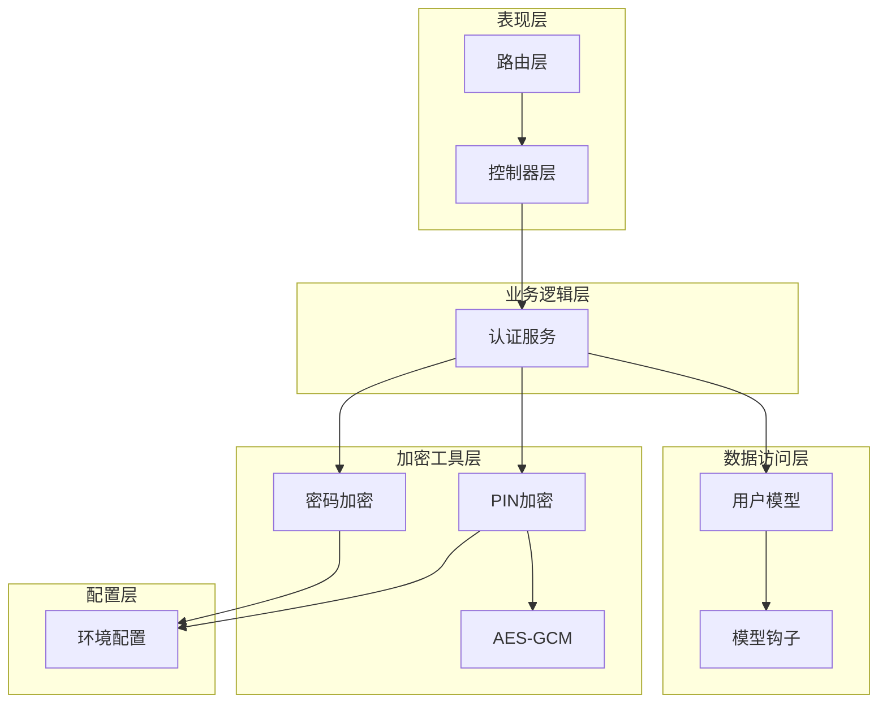
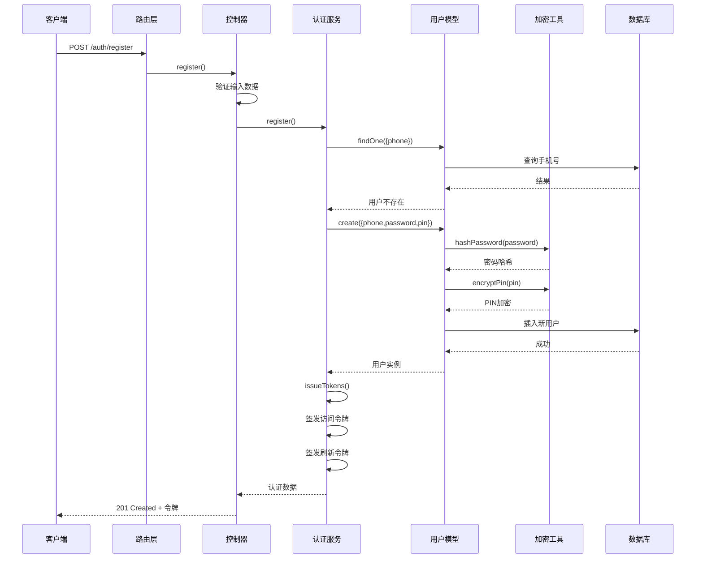
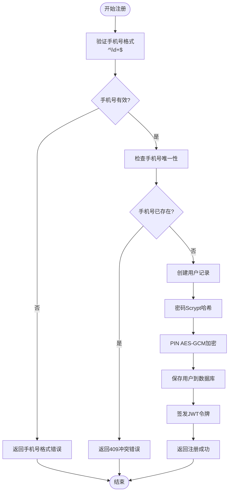
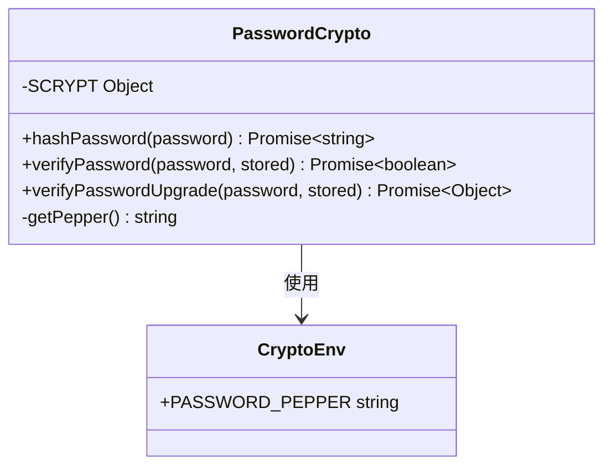
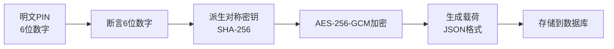
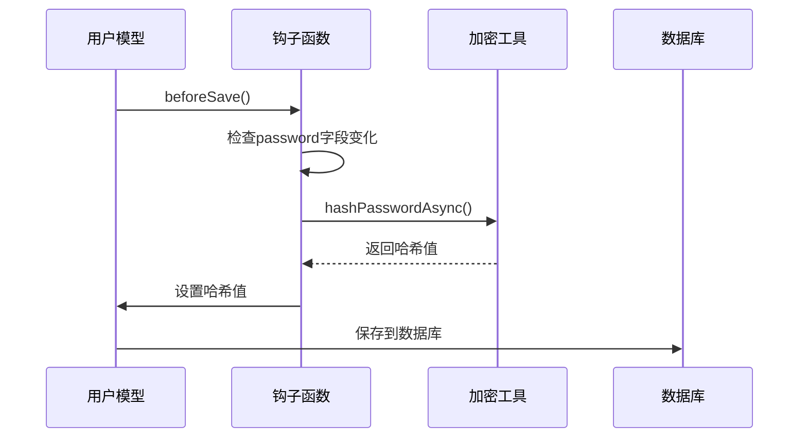
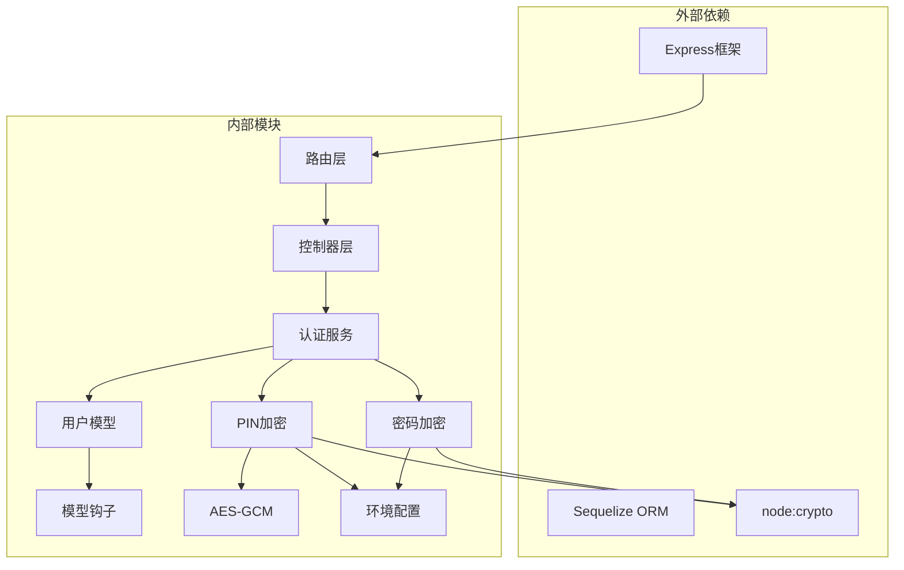
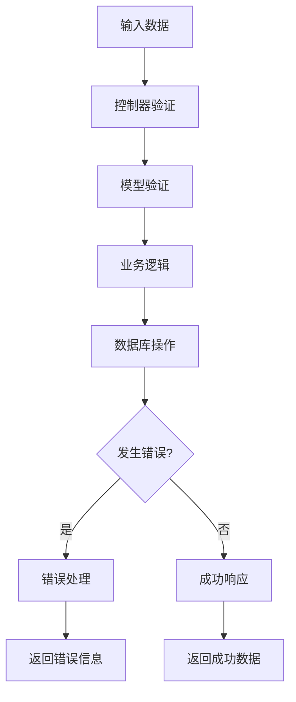

# 用户注册流程

<cite>
**本文档引用的文件**
- [src/services/auth.ts](file://src/services/auth.ts)
- [src/models/user/user.ts](file://src/models/user/user.ts)
- [src/models/user/hook.ts](file://src/models/user/hook.ts)
- [src/tools/crypto/password.ts](file://src/tools/crypto/password.ts)
- [src/tools/crypto/pin.ts](file://src/tools/crypto/pin.ts)
- [src/tools/crypto/aesgcm.ts](file://src/tools/crypto/aesgcm.ts)
- [src/models/auth/anth.ts](file://src/models/auth/anth.ts)
- [src/contracts/auth.controller.ts](file://src/contracts/auth.controller.ts)
- [src/routes/auth.ts](file://src/routes/auth.ts)
- [src/config/env/index.ts](file://src/config/env/index.ts)
- [src/models/user/types/user.ts](file://src/models/user/types/user.ts)
</cite>

## 目录
1. [简介](#简介)
2. [项目结构](#项目结构)
3. [核心组件](#核心组件)
4. [架构概览](#架构概览)
5. [详细组件分析](#详细组件分析)
6. [依赖关系分析](#依赖关系分析)
7. [性能考虑](#性能考虑)
8. [故障排除指南](#故障排除指南)
9. [结论](#结论)

## 简介

本文档详细阐述了用户注册流程的完整生命周期，包括手机号验证、PIN码验证、密码加密（Scrypt算法）、用户创建等关键步骤。文档涵盖了注册数据的验证规则和业务逻辑，包括手机号唯一性检查、密码强度要求、PIN码验证机制。同时，文档化了注册服务的核心方法register的实现细节，包括参数处理、错误处理、事务管理和返回值结构，并提供了具体的注册示例和常见错误场景的处理方案。

## 项目结构

该系统采用分层架构设计，主要包含以下层次：

**图表来源**
- [src/routes/auth.ts](file://src/routes/auth.ts#L1-L47)
- [src/contracts/auth.controller.ts](file://src/contracts/auth.controller.ts#L1-L111)
- [src/services/auth.ts](file://src/services/auth.ts#L1-L170)
- [src/models/user/user.ts](file://src/models/user/user.ts#L1-L275)

**章节来源**
- [src/routes/auth.ts](file://src/routes/auth.ts#L1-L47)
- [src/contracts/auth.controller.ts](file://src/contracts/auth.controller.ts#L1-L111)
- [src/services/auth.ts](file://src/services/auth.ts#L1-L170)

## 核心组件

### 认证服务 (AuthService)

认证服务是注册流程的核心组件，负责处理用户注册、登录、令牌签发等认证业务逻辑。其主要职责包括：

- **注册处理**: 验证输入数据、检查手机号唯一性、创建用户、签发令牌
- **登录处理**: 验证用户凭据、签发令牌
- **令牌管理**: 生成访问令牌和刷新令牌
- **用户信息获取**: 根据用户ID获取安全的用户信息

### 用户模型 (User Model)

用户模型定义了用户的数据结构和行为，包括：

- **数据验证**: 手机号格式验证、唯一性约束
- **密码处理**: Scrypt算法加密、密码验证
- **钩子函数**: 保存前的密码哈希处理
- **序列化**: 安全的对象序列化，剔除敏感字段

### 加密工具

系统实现了多层加密保护：

- **密码加密**: 使用Scrypt算法进行高强度密码哈希
- **PIN加密**: 使用AES-256-GCM对6位数字PIN进行对称加密
- **环境配置**: 密码加盐(pepper)和密钥管理

**章节来源**
- [src/services/auth.ts](file://src/services/auth.ts#L86-L167)
- [src/models/user/user.ts](file://src/models/user/user.ts#L33-L101)
- [src/tools/crypto/password.ts](file://src/tools/crypto/password.ts#L1-L111)

## 架构概览

用户注册流程遵循经典的MVC架构模式，通过清晰的分层实现了关注点分离：

**图表来源**
- [src/routes/auth.ts](file://src/routes/auth.ts#L18-L23)
- [src/contracts/auth.controller.ts](file://src/contracts/auth.controller.ts#L25-L52)
- [src/services/auth.ts](file://src/services/auth.ts#L94-L117)
- [src/models/user/user.ts](file://src/models/user/user.ts#L109-L135)

## 详细组件分析

### 注册流程核心实现

#### 认证服务中的register方法

注册方法实现了完整的业务逻辑处理：

**图表来源**
- [src/services/auth.ts](file://src/services/auth.ts#L94-L117)
- [src/models/user/user.ts](file://src/models/user/user.ts#L127-L135)

#### 数据验证规则

系统在多个层面实施数据验证：

**控制器层验证**：
- 必填字段检查：手机号、密码、PIN均不能为空
- 手机号格式验证：必须为纯数字
- PIN格式验证：必须为6位纯数字

**模型层验证**：
- 手机号唯一性约束
- 密码长度和格式要求
- PIN长度和格式要求

**章节来源**
- [src/contracts/auth.controller.ts](file://src/contracts/auth.controller.ts#L25-L52)
- [src/models/user/user.ts](file://src/models/user/user.ts#L127-L135)

### 密码加密机制

#### Scrypt算法实现

密码加密使用Scrypt算法，具有以下特点：

- **参数配置**：N=32768, r=8, p=1, keylen=32
- **加盐处理**：使用随机盐值增强安全性
- **Pepper机制**：支持环境变量加盐，提升安全性
- **版本化存储**：采用`scrypt$N$r$p$salt$dk`格式存储

**图表来源**
- [src/tools/crypto/password.ts](file://src/tools/crypto/password.ts#L14-L46)
- [src/tools/crypto/crypto-env.ts](file://src/tools/crypto/crypto-env.ts#L1-L6)

**章节来源**
- [src/tools/crypto/password.ts](file://src/tools/crypto/password.ts#L1-L111)
- [src/models/user/user.ts](file://src/models/user/user.ts#L256-L274)

### PIN码加密机制

#### AES-256-GCM对称加密

PIN码使用AES-256-GCM进行对称加密：

- **固定长度**：6位纯数字
- **密钥派生**：从环境变量中派生32字节密钥
- **载荷格式**：包含版本、算法、密钥ID、IV、标签、密文等
- **认证加密**：确保数据完整性和机密性

**图表来源**
- [src/tools/crypto/pin.ts](file://src/tools/crypto/pin.ts#L15-L55)
- [src/tools/crypto/aesgcm.ts](file://src/tools/crypto/aesgcm.ts#L59-L68)

**章节来源**
- [src/tools/crypto/pin.ts](file://src/tools/crypto/pin.ts#L1-L77)
- [src/tools/crypto/aesgcm.ts](file://src/tools/crypto/aesgcm.ts#L1-L100)

### 用户模型钩子函数

#### 密码哈希处理

用户模型实现了beforeSave钩子，在保存前自动处理密码哈希：

**图表来源**
- [src/models/user/user.ts](file://src/models/user/user.ts#L256-L263)
- [src/models/user/hook.ts](file://src/models/user/hook.ts#L9-L16)

**章节来源**
- [src/models/user/user.ts](file://src/models/user/user.ts#L256-L274)
- [src/models/user/hook.ts](file://src/models/user/hook.ts#L1-L20)

## 依赖关系分析

### 组件依赖图

**图表来源**
- [src/services/auth.ts](file://src/services/auth.ts#L13-L22)
- [src/models/user/user.ts](file://src/models/user/user.ts#L1-L6)
- [src/tools/crypto/password.ts](file://src/tools/crypto/password.ts#L10-L12)

### 错误处理机制

系统实现了多层次的错误处理：

**图表来源**
- [src/contracts/auth.controller.ts](file://src/contracts/auth.controller.ts#L29-L45)
- [src/services/auth.ts](file://src/services/auth.ts#L102-L106)

**章节来源**
- [src/contracts/auth.controller.ts](file://src/contracts/auth.controller.ts#L1-L111)
- [src/services/auth.ts](file://src/services/auth.ts#L1-L170)

## 性能考虑

### 加密性能优化

1. **Scrypt参数调优**：当前配置N=32768, r=8, p=1，平衡了安全性与性能
2. **异步处理**：所有加密操作均为异步执行，避免阻塞主线程
3. **缓存策略**：JWT令牌在内存中管理，减少数据库查询

### 数据库性能

1. **索引优化**：为phone字段建立索引，加速唯一性检查
2. **批量操作**：用户创建和密码哈希在单个事务中完成
3. **连接池**：使用连接池管理数据库连接

### 内存管理

1. **流式处理**：大文件处理采用流式方式
2. **及时释放**：加密密钥在使用后及时释放
3. **垃圾回收**：避免创建不必要的中间对象

## 故障排除指南

### 常见错误场景

#### 手机号已存在

**错误信息**：`该手机号已被注册`
**HTTP状态码**：409 Conflict
**解决方案**：
- 提示用户使用其他手机号注册
- 提供找回密码功能

#### 手机号格式错误

**错误信息**：`手机号格式不正确`
**HTTP状态码**：400 Bad Request
**解决方案**：
- 确保输入为纯数字
- 检查手机号长度是否符合要求

#### PIN码格式错误

**错误信息**：`二级密码必须为6位纯数字`
**HTTP状态码**：400 Bad Request
**解决方案**：
- 确保输入为6位数字
- 检查是否包含特殊字符

#### 密码加密失败

**错误信息**：`缺少或过短的 PASSWORD_PEPPER（至少16位）`
**HTTP状态码**：500 Internal Server Error
**解决方案**：
- 检查环境变量PASSWORD_PEPPER设置
- 确保长度至少16位

### 调试建议

1. **日志记录**：启用详细的错误日志
2. **环境验证**：检查所有必需的环境变量
3. **数据库连接**：验证数据库连接配置
4. **加密密钥**：确认加密相关的密钥设置

**章节来源**
- [src/contracts/auth.controller.ts](file://src/contracts/auth.controller.ts#L30-L45)
- [src/services/auth.ts](file://src/services/auth.ts#L102-L106)
- [src/tools/crypto/password.ts](file://src/tools/crypto/password.ts#L40-L43)

## 结论

用户注册流程通过精心设计的分层架构和多重安全机制，实现了高安全性、高可靠性的用户注册体验。系统的主要优势包括：

1. **多层次验证**：从控制器到模型的双重验证确保数据完整性
2. **强加密保护**：Scrypt算法和AES-GCM加密提供业界标准的安全保障
3. **清晰的错误处理**：完善的错误分类和处理机制
4. **良好的扩展性**：模块化设计便于功能扩展和维护

通过本文档的详细说明，开发者可以深入理解注册流程的每个环节，为系统的进一步开发和维护提供坚实的基础。