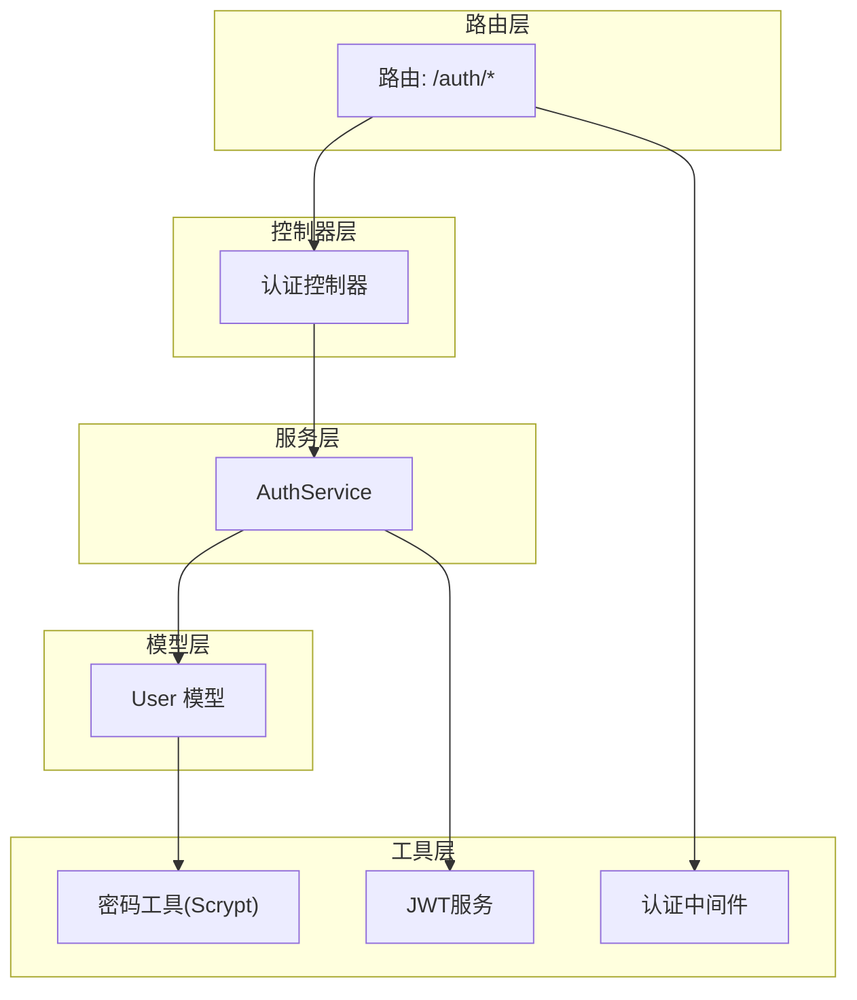
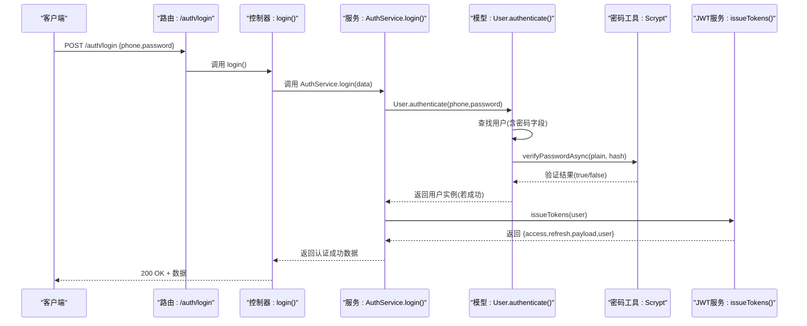
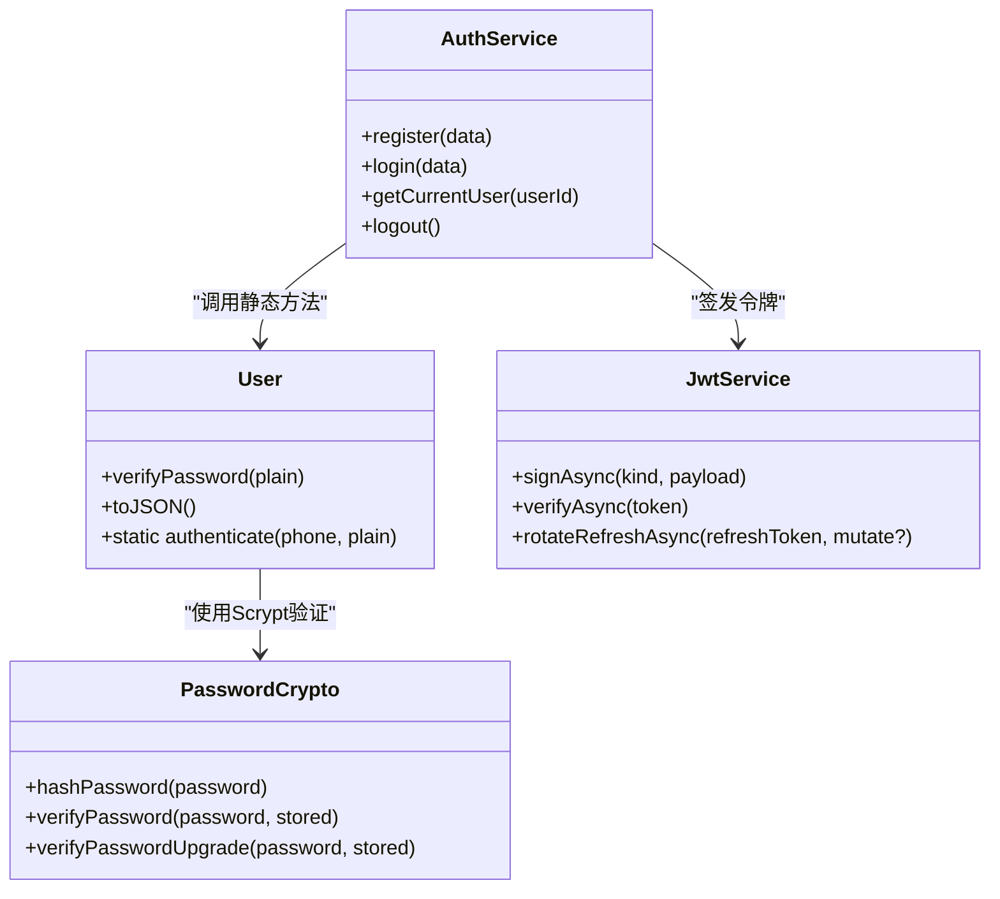

# 用户登录流程

<cite>
**本文引用的文件**
- [src/services/auth.ts](file://src/services/auth.ts)
- [src/models/user/user.ts](file://src/models/user/user.ts)
- [src/tools/crypto/password.ts](file://src/tools/crypto/password.ts)
- [src/routes/auth.ts](file://src/routes/auth.ts)
- [src/contracts/auth.controller.ts](file://src/contracts/auth.controller.ts)
- [src/models/auth/anth.ts](file://src/models/auth/anth.ts)
- [src/tools/jwt/service.ts](file://src/tools/jwt/service.ts)
- [src/tools/jwt/index.ts](file://src/tools/jwt/index.ts)
- [src/middleware/auth/require.ts](file://src/middleware/auth/require.ts)
- [src/middleware/auth/guards.ts](file://src/middleware/auth/guards.ts)
</cite>

## 目录
1. [简介](#简介)
2. [项目结构](#项目结构)
3. [核心组件](#核心组件)
4. [架构总览](#架构总览)
5. [详细组件分析](#详细组件分析)
6. [依赖关系分析](#依赖关系分析)
7. [性能考量](#性能考量)
8. [故障排查指南](#故障排查指南)
9. [结论](#结论)

## 简介
本操作文档围绕“用户登录流程”展开，系统性阐述从请求进入、手机号查找、密码验证（Scrypt解密比对）、用户状态检查、到签发JWT令牌的完整认证过程。重点解析登录服务login方法的实现逻辑、与用户模型authenticate静态方法的协作关系，并提供登录失败的典型场景与对应错误处理策略，附带时序图与代码示例路径，帮助开发者快速理解与优化登录链路。

## 项目结构
登录相关代码分布在以下层次：
- 路由层：定义对外接口，暴露POST /auth/login等端点
- 控制器层：封装请求校验与响应包装，调用服务层
- 服务层：实现注册、登录、令牌签发等业务逻辑
- 模型层：用户模型与密码校验、状态管理
- 工具层：密码Scrypt加解密、JWT签发与校验、认证中间件

图表来源
- [src/routes/auth.ts](file://src/routes/auth.ts#L1-L47)
- [src/contracts/auth.controller.ts](file://src/contracts/auth.controller.ts#L1-L111)
- [src/services/auth.ts](file://src/services/auth.ts#L1-L170)
- [src/models/user/user.ts](file://src/models/user/user.ts#L1-L275)
- [src/tools/crypto/password.ts](file://src/tools/crypto/password.ts#L1-L111)
- [src/tools/jwt/service.ts](file://src/tools/jwt/service.ts#L1-L98)
- [src/middleware/auth/require.ts](file://src/middleware/auth/require.ts#L1-L98)

章节来源
- [src/routes/auth.ts](file://src/routes/auth.ts#L1-L47)
- [src/contracts/auth.controller.ts](file://src/contracts/auth.controller.ts#L1-L111)
- [src/services/auth.ts](file://src/services/auth.ts#L1-L170)
- [src/models/user/user.ts](file://src/models/user/user.ts#L1-L275)
- [src/tools/crypto/password.ts](file://src/tools/crypto/password.ts#L1-L111)
- [src/tools/jwt/service.ts](file://src/tools/jwt/service.ts#L1-L98)
- [src/middleware/auth/require.ts](file://src/middleware/auth/require.ts#L1-L98)

## 核心组件
- 路由与控制器：负责接收登录请求、参数校验、调用服务层并返回标准响应
- 认证服务：封装登录、注册、令牌签发、当前用户查询等逻辑
- 用户模型：提供静态authenticate方法完成手机号查找与密码校验，内置Scrypt验证
- 密码工具：提供Scrypt哈希生成与验证，支持pepper与参数升级
- JWT服务：签发access/refresh令牌，提供验证与刷新轮转能力
- 认证中间件：保护受保护接口，解析并验证JWT

章节来源
- [src/contracts/auth.controller.ts](file://src/contracts/auth.controller.ts#L54-L74)
- [src/services/auth.ts](file://src/services/auth.ts#L119-L134)
- [src/models/user/user.ts](file://src/models/user/user.ts#L69-L89)
- [src/tools/crypto/password.ts](file://src/tools/crypto/password.ts#L39-L70)
- [src/tools/jwt/service.ts](file://src/tools/jwt/service.ts#L27-L97)
- [src/middleware/auth/require.ts](file://src/middleware/auth/require.ts#L68-L97)

## 架构总览
下图展示登录请求从进入系统到返回令牌的整体流程，包括路由、控制器、服务、模型与密码工具之间的交互。

图表来源
- [src/routes/auth.ts](file://src/routes/auth.ts#L25-L30)
- [src/contracts/auth.controller.ts](file://src/contracts/auth.controller.ts#L59-L73)
- [src/services/auth.ts](file://src/services/auth.ts#L126-L134)
- [src/models/user/user.ts](file://src/models/user/user.ts#L69-L89)
- [src/tools/crypto/password.ts](file://src/tools/crypto/password.ts#L55-L70)
- [src/tools/jwt/service.ts](file://src/tools/jwt/service.ts#L45-L80)

## 详细组件分析

### 登录服务 AuthService.login 方法
- 输入：LoginRequest（手机号、密码）
- 关键步骤：
  1) 调用User.authenticate(phone, password)执行手机号查找与密码校验
  2) 成功后调用issueTokens(user)签发access/refresh令牌
  3) 返回包含用户安全信息、令牌与载荷的数据结构
- 错误处理：若authenticate抛错（如用户不存在/密码错误），直接向上抛出，由控制器层捕获并返回标准错误响应

章节来源
- [src/services/auth.ts](file://src/services/auth.ts#L119-L134)
- [src/models/auth/anth.ts](file://src/models/auth/anth.ts#L38-L42)

### 用户模型 User.authenticate 静态方法
- 查询策略：使用withSecret作用域获取包含password字段的用户记录
- 校验流程：
  1) 若未找到用户，抛出“用户不存在或密码错误”
  2) 使用verifyPasswordAsync(plain, user.password)进行Scrypt验证
  3) 若验证失败，抛出相同错误
  4) 可选升级：如需升级哈希，可在此处更新并保存（当前版本预留逻辑）
  5) 再次按主键加载安全用户并返回
- 性能注意：使用withSecret作用域仅在认证时临时包含密码字段，避免常规查询泄露敏感信息

章节来源
- [src/models/user/user.ts](file://src/models/user/user.ts#L69-L89)
- [src/tools/crypto/password.ts](file://src/tools/crypto/password.ts#L55-L70)

### 密码验证与Scrypt实现
- 哈希生成：hashPassword(password)生成scrypt$N$r$p$salt$dk格式字符串，包含pepper与参数
- 验证逻辑：verifyPassword(password, stored)支持两种校验路径（带pepper与不带），使用timingSafeEqual确保常量时间比较
- 参数与安全：固定N、r、p与keylen，结合pepper提升抗彩虹表能力；支持未来升级策略（needsRehash/newHash）

章节来源
- [src/tools/crypto/password.ts](file://src/tools/crypto/password.ts#L39-L70)
- [src/tools/crypto/password.ts](file://src/tools/crypto/password.ts#L77-L110)

### 令牌签发与JWT服务
- issueTokens(user)：构建JwtUserPayload，分别签发access与refresh令牌，返回包含user、access、refresh、payload的对象
- JwtService：支持signAsync/verifyAsync/rotateRefreshAsync，根据环境变量选择HS256或RS256算法，当前实现为长期有效（不设置exp）

章节来源
- [src/services/auth.ts](file://src/services/auth.ts#L45-L80)
- [src/tools/jwt/service.ts](file://src/tools/jwt/service.ts#L41-L96)
- [src/tools/jwt/index.ts](file://src/tools/jwt/index.ts#L80-L106)

### 路由与控制器
- 路由：/auth/login映射到控制器login处理函数
- 控制器：对请求体进行基础校验（手机号、密码非空），调用AuthService.login并返回标准响应

章节来源
- [src/routes/auth.ts](file://src/routes/auth.ts#L25-L30)
- [src/contracts/auth.controller.ts](file://src/contracts/auth.controller.ts#L59-L73)

### 认证中间件与受保护接口
- requireAuth：从Authorization头提取Bearer token，调用JwtService.verifyAsync验证，成功后将用户载荷注入req.user
- 受保护接口：如GET /auth/me需先通过requireAuth

章节来源
- [src/middleware/auth/require.ts](file://src/middleware/auth/require.ts#L68-L97)
- [src/routes/auth.ts](file://src/routes/auth.ts#L44-L44)

## 依赖关系分析

图表来源
- [src/services/auth.ts](file://src/services/auth.ts#L86-L167)
- [src/models/user/user.ts](file://src/models/user/user.ts#L33-L101)
- [src/tools/crypto/password.ts](file://src/tools/crypto/password.ts#L39-L110)
- [src/tools/jwt/service.ts](file://src/tools/jwt/service.ts#L27-L97)

章节来源
- [src/services/auth.ts](file://src/services/auth.ts#L1-L170)
- [src/models/user/user.ts](file://src/models/user/user.ts#L1-L275)
- [src/tools/crypto/password.ts](file://src/tools/crypto/password.ts#L1-L111)
- [src/tools/jwt/service.ts](file://src/tools/jwt/service.ts#L1-L98)

## 性能考量
- 密码校验成本：Scrypt参数固定，N、r、p与keylen已优化，避免过度昂贵的计算
- 查询优化：User.authenticate使用withSecret作用域仅在认证时包含password字段，减少常规查询开销
- 令牌签发：issueTokens为同步I/O操作，签发两个令牌；建议在高并发场景下关注JWT服务实例的初始化与密钥提供器性能
- 缓存策略：当前未见针对登录场景的缓存实现，可在用户频繁登录且密码未变更时考虑短期缓存用户安全信息以降低重复查询

[本节为通用性能建议，不直接分析具体文件]

## 故障排查指南
- 用户不存在或密码错误
  - 现象：登录失败，返回“用户不存在或密码错误”
  - 排查：确认手机号是否存在、密码是否正确、是否使用了正确的手机号
  - 代码参考：[src/models/user/user.ts](file://src/models/user/user.ts#L74-L79)
- 密码格式或长度不合法
  - 现象：注册时提示手机号、密码或二级密码格式错误
  - 排查：检查手机号是否为纯数字、二级密码是否为6位纯数字
  - 代码参考：[src/contracts/auth.controller.ts](file://src/contracts/auth.controller.ts#L30-L45)
- 令牌无效或过期
  - 现象：受保护接口返回401，提示Token invalid或Token expired
  - 排查：确认Authorization头格式为Bearer token、令牌未过期、算法与密钥配置正确
  - 代码参考：[src/middleware/auth/require.ts](file://src/middleware/auth/require.ts#L80-L96)，[src/tools/jwt/service.ts](file://src/tools/jwt/service.ts#L66-L75)
- 未认证访问受保护接口
  - 现象：返回401，提示Authentication required
  - 排查：确认携带有效的Bearer token
  - 代码参考：[src/middleware/auth/require.ts](file://src/middleware/auth/require.ts#L26-L50)

章节来源
- [src/models/user/user.ts](file://src/models/user/user.ts#L74-L79)
- [src/contracts/auth.controller.ts](file://src/contracts/auth.controller.ts#L30-L45)
- [src/middleware/auth/require.ts](file://src/middleware/auth/require.ts#L80-L96)
- [src/tools/jwt/service.ts](file://src/tools/jwt/service.ts#L66-L75)

## 结论
登录流程以“路由-控制器-服务-模型-工具-中间件”的分层设计清晰分离职责，登录服务login方法通过委托用户模型的authenticate静态方法完成手机号查找与Scrypt密码验证，并在成功后统一签发JWT令牌。整体实现具备良好的安全性（Scrypt+pepper、常量时间比较、无状态JWT）与可维护性（模块化、类型明确）。建议在高并发场景下关注令牌签发与密钥提供器性能，并在必要时引入短期缓存与速率限制等优化措施。