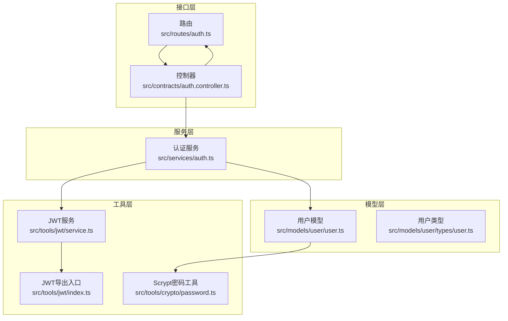
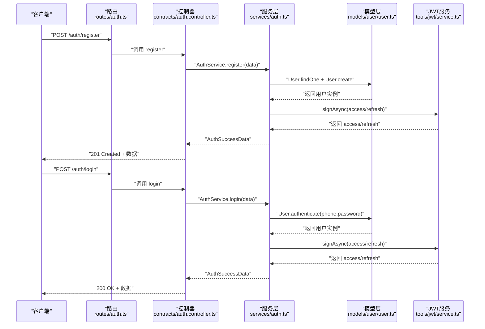
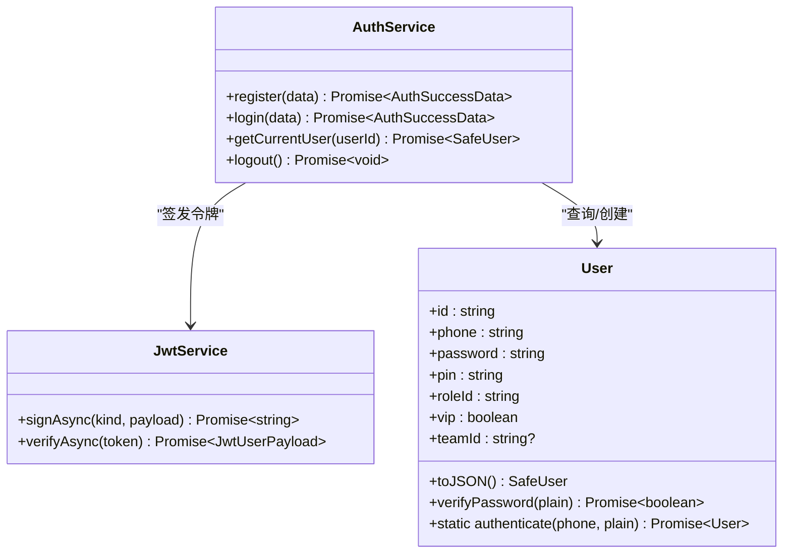
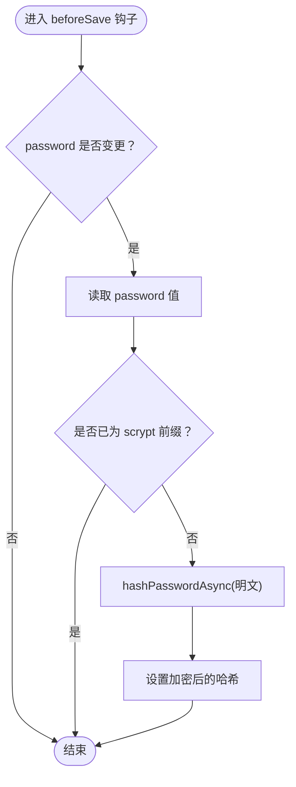
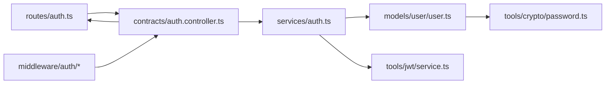

# 用户认证流程

<cite>
**本文引用的文件**
- [src/services/auth.ts](file://src/services/auth.ts)
- [src/models/user/user.ts](file://src/models/user/user.ts)
- [src/models/user/types/user.ts](file://src/models/user/types/user.ts)
- [src/models/auth/anth.ts](file://src/models/auth/anth.ts)
- [src/models/auth/index.ts](file://src/models/auth/index.ts)
- [src/routes/auth.ts](file://src/routes/auth.ts)
- [src/contracts/auth.controller.ts](file://src/contracts/auth.controller.ts)
- [src/middleware/auth/index.ts](file://src/middleware/auth/index.ts)
- [src/middleware/auth/require.ts](file://src/middleware/auth/require.ts)
- [src/middleware/auth/guards.ts](file://src/middleware/auth/guards.ts)
- [src/tools/jwt/index.ts](file://src/tools/jwt/index.ts)
- [src/tools/jwt/service.ts](file://src/tools/jwt/service.ts)
- [src/tools/crypto/password.ts](file://src/tools/crypto/password.ts)
- [src/types/jwt/index.ts](file://src/types/jwt/index.ts)
</cite>

## 目录
1. [简介](#简介)
2. [项目结构](#项目结构)
3. [核心组件](#核心组件)
4. [架构总览](#架构总览)
5. [详细组件分析](#详细组件分析)
6. [依赖关系分析](#依赖关系分析)
7. [性能考量](#性能考量)
8. [故障排查指南](#故障排查指南)
9. [结论](#结论)
10. [附录](#附录)

## 简介
本文件面向“用户认证流程”的操作与维护人员，系统性说明从注册到登录的完整生命周期，涵盖数据验证、密码加密（Scrypt）、用户创建、登录认证、令牌签发与使用、以及与用户模型的数据流转。同时文档化认证服务的API接口与错误处理策略，并提供常见场景的最佳实践。

## 项目结构
认证相关代码采用分层设计：
- 路由层：定义对外暴露的认证接口（注册、登录、退出、获取当前用户）
- 控制器层：负责输入校验、调用服务层、封装响应与错误
- 服务层：编排业务逻辑（注册、登录、获取当前用户、退出）
- 模型层：用户模型与数据库交互、密码加密钩子、安全序列化
- 工具层：JWT服务、Scrypt密码工具、权限守卫中间件

图表来源
- [src/routes/auth.ts](file://src/routes/auth.ts#L1-L47)
- [src/contracts/auth.controller.ts](file://src/contracts/auth.controller.ts#L1-L111)
- [src/services/auth.ts](file://src/services/auth.ts#L1-L170)
- [src/models/user/user.ts](file://src/models/user/user.ts#L1-L275)
- [src/tools/jwt/index.ts](file://src/tools/jwt/index.ts#L1-L107)
- [src/tools/jwt/service.ts](file://src/tools/jwt/service.ts#L1-L98)
- [src/tools/crypto/password.ts](file://src/tools/crypto/password.ts#L1-L111)

章节来源
- [src/routes/auth.ts](file://src/routes/auth.ts#L1-L47)
- [src/contracts/auth.controller.ts](file://src/contracts/auth.controller.ts#L1-L111)
- [src/services/auth.ts](file://src/services/auth.ts#L1-L170)
- [src/models/user/user.ts](file://src/models/user/user.ts#L1-L275)
- [src/tools/jwt/index.ts](file://src/tools/jwt/index.ts#L1-L107)
- [src/tools/jwt/service.ts](file://src/tools/jwt/service.ts#L1-L98)
- [src/tools/crypto/password.ts](file://src/tools/crypto/password.ts#L1-L111)

## 核心组件
- 认证服务（AuthService）：提供 register、login、getCurrentUser、logout 方法，负责调用模型与JWT服务完成业务流程
- 用户模型（User）：定义用户表结构、唯一索引、默认/带密文范围、密码加密钩子、认证静态方法与安全序列化
- 认证控制器（auth.controller）：对请求进行基础校验（手机号、PIN、登录密码），调用服务层并统一封装响应
- JWT服务：签发/校验令牌，支持HS256/RS256，提供令牌轮转与错误类型
- Scrypt密码工具：提供密码哈希与校验，支持pepper与参数升级检测
- 权限守卫中间件：requireAuth、requireRole、requireScopes、requireVip、requireTeam、requireTokenKind

章节来源
- [src/services/auth.ts](file://src/services/auth.ts#L82-L167)
- [src/models/user/user.ts](file://src/models/user/user.ts#L33-L101)
- [src/contracts/auth.controller.ts](file://src/contracts/auth.controller.ts#L25-L110)
- [src/tools/jwt/service.ts](file://src/tools/jwt/service.ts#L27-L97)
- [src/tools/crypto/password.ts](file://src/tools/crypto/password.ts#L39-L70)
- [src/middleware/auth/require.ts](file://src/middleware/auth/require.ts#L68-L97)
- [src/middleware/auth/guards.ts](file://src/middleware/auth/guards.ts#L25-L194)

## 架构总览
认证系统采用“路由-控制器-服务-模型-工具”分层，数据流自上而下，职责清晰：
- 路由接收HTTP请求，交由控制器处理
- 控制器进行输入校验与错误封装，调用服务层
- 服务层协调模型与JWT服务，返回标准化结果
- 模型层负责数据库交互与密码加密钩子
- 工具层提供JWT与密码加密能力

图表来源
- [src/routes/auth.ts](file://src/routes/auth.ts#L18-L30)
- [src/contracts/auth.controller.ts](file://src/contracts/auth.controller.ts#L25-L74)
- [src/services/auth.ts](file://src/services/auth.ts#L94-L134)
- [src/models/user/user.ts](file://src/models/user/user.ts#L69-L89)
- [src/tools/jwt/service.ts](file://src/tools/jwt/service.ts#L41-L56)

## 详细组件分析

### 组件A：认证服务（AuthService）
- 职责
  - register：校验手机号唯一性、创建用户（密码由模型钩子加密）、签发access/refresh令牌
  - login：根据手机号与密码认证、签发令牌
  - getCurrentUser：按用户ID查询并安全序列化返回
  - logout：当前为无状态实现（客户端删除令牌）
- 关键点
  - 使用JWT服务单例，避免重复初始化
  - 令牌签发时构建JwtUserPayload并移除tokenType生成AuthPayload
  - 安全用户信息通过模型toJSON剔除敏感字段

图表来源
- [src/services/auth.ts](file://src/services/auth.ts#L86-L167)
- [src/tools/jwt/service.ts](file://src/tools/jwt/service.ts#L27-L97)
- [src/models/user/user.ts](file://src/models/user/user.ts#L33-L101)

章节来源
- [src/services/auth.ts](file://src/services/auth.ts#L86-L167)

### 组件B：用户模型（User）
- 职责
  - 定义字段、约束、索引、默认/带密文范围
  - beforeSave钩子：对新设或变更的password执行Scrypt加密
  - authenticate静态方法：按手机号查询含密文记录，校验密码，必要时保存更新
  - toJSON：安全序列化，剔除password/pin
- 关键点
  - phone唯一性与纯数字校验
  - password/pin均以scrypt$开头的哈希存储
  - scopes：defaultScope排除password，withSecret包含password用于认证

图表来源
- [src/models/user/user.ts](file://src/models/user/user.ts#L256-L263)
- [src/tools/crypto/password.ts](file://src/tools/crypto/password.ts#L39-L46)

章节来源
- [src/models/user/user.ts](file://src/models/user/user.ts#L109-L275)

### 组件C：认证控制器（auth.controller）
- 职责
  - register：校验手机号、PIN格式，调用服务层注册并返回201
  - login：校验手机号、密码非空，调用服务层登录并返回200
  - logout：调用服务层退出并返回200
  - me：经requireAuth后，调用服务层获取当前用户并返回200
- 关键点
  - 使用wrap封装统一响应与错误处理
  - 对必填字段缺失与格式错误返回400
  - requireAuth失败返回401

章节来源
- [src/contracts/auth.controller.ts](file://src/contracts/auth.controller.ts#L25-L110)

### 组件D：JWT服务（JwtService）
- 职责
  - signAsync：签发access/refresh令牌，自动设置iat/jti/sub，不设置exp（长期有效）
  - verifyAsync：校验令牌并返回业务载荷，错误映射为AuthError
  - rotateRefreshAsync：校验refresh并轮转返回新access/refresh
- 关键点
  - 支持HS256/RS256，密钥提供器由环境变量决定
  - 配置项包含算法、TTL、设备绑定与黑名单开关

章节来源
- [src/tools/jwt/service.ts](file://src/tools/jwt/service.ts#L27-L97)
- [src/tools/jwt/index.ts](file://src/tools/jwt/index.ts#L80-L106)

### 组件E：Scrypt密码工具
- 职责
  - hashPassword：生成scrypt哈希（包含N/r/p/salt/dk）
  - verifyPassword：校验明文与存储哈希，兼容pepper与无pepper两种路径
  - verifyPasswordUpgrade：判断是否需要升级（成本参数或pepper），必要时返回新哈希
- 关键点
  - 需要满足最低长度的PASSWORD_PEPPER
  - timingSafeEqual保证比较安全性

章节来源
- [src/tools/crypto/password.ts](file://src/tools/crypto/password.ts#L39-L110)

### 组件F：权限守卫中间件
- 职责
  - requireAuth：从Authorization头提取Bearer token，校验后将用户载荷注入req.user
  - requireRole/requireScopes/requireVip/requireTeam/requireTokenKind：基于req.user进行角色/作用域/VIP/团队/令牌类型断言
- 关键点
  - 未认证返回401，断言失败返回对应错误码
  - 通过Guards命名空间导出断言函数

章节来源
- [src/middleware/auth/require.ts](file://src/middleware/auth/require.ts#L68-L97)
- [src/middleware/auth/guards.ts](file://src/middleware/auth/guards.ts#L25-L194)
- [src/middleware/auth/index.ts](file://src/middleware/auth/index.ts#L16-L44)

## 依赖关系分析
- 路由依赖控制器
- 控制器依赖服务层
- 服务层依赖模型与JWT服务
- 模型依赖密码工具
- 中间件依赖JWT工具

图表来源
- [src/routes/auth.ts](file://src/routes/auth.ts#L12-L46)
- [src/contracts/auth.controller.ts](file://src/contracts/auth.controller.ts#L13-L18)
- [src/services/auth.ts](file://src/services/auth.ts#L13-L22)
- [src/models/user/user.ts](file://src/models/user/user.ts#L4-L4)
- [src/tools/jwt/service.ts](file://src/tools/jwt/service.ts#L15-L21)
- [src/tools/crypto/password.ts](file://src/tools/crypto/password.ts#L10-L12)
- [src/middleware/auth/index.ts](file://src/middleware/auth/index.ts#L16-L32)

章节来源
- [src/routes/auth.ts](file://src/routes/auth.ts#L12-L46)
- [src/contracts/auth.controller.ts](file://src/contracts/auth.controller.ts#L13-L18)
- [src/services/auth.ts](file://src/services/auth.ts#L13-L22)
- [src/models/user/user.ts](file://src/models/user/user.ts#L4-L4)
- [src/tools/jwt/service.ts](file://src/tools/jwt/service.ts#L15-L21)
- [src/tools/crypto/password.ts](file://src/tools/crypto/password.ts#L10-L12)
- [src/middleware/auth/index.ts](file://src/middleware/auth/index.ts#L16-L32)

## 性能考量
- 密码加密
  - Scrypt参数固定，哈希生成与校验均为CPU密集型，建议在高并发场景下合理配置进程/容器资源
  - 使用beforeSave钩子避免重复加密，减少数据库写放大
- JWT签发
  - 无状态签发，避免服务端状态存储；长期有效令牌减少轮转开销
  - 若启用黑名单，需评估Redis写入与查询的延迟
- 查询优化
  - 用户表对phone、roleId、state、lastOnlineAt等字段建立索引，有助于高频查询
  - 默认scope排除password，避免不必要的字段传输

[本节为通用指导，不直接分析具体文件]

## 故障排查指南
- 注册失败（409）
  - 现象：手机号已存在
  - 排查：确认手机号唯一性约束与业务校验
  - 参考
    - [src/services/auth.ts](file://src/services/auth.ts#L97-L106)
- 登录失败（401）
  - 现象：用户不存在或密码错误
  - 排查：核对手机号是否存在、密码是否正确、是否触发了pepper/参数升级
  - 参考
    - [src/models/user/user.ts](file://src/models/user/user.ts#L69-L89)
    - [src/contracts/auth.controller.ts](file://src/contracts/auth.controller.ts#L63-L73)
- 令牌无效（401）
  - 现象：Authorization头缺失、格式错误、令牌非法或过期
  - 排查：确认Bearer前缀、令牌内容、算法与密钥配置
  - 参考
    - [src/middleware/auth/require.ts](file://src/middleware/auth/require.ts#L40-L57)
    - [src/tools/jwt/service.ts](file://src/tools/jwt/service.ts#L66-L75)
- 获取当前用户失败（404）
  - 现象：用户不存在
  - 排查：确认用户ID有效性
  - 参考
    - [src/services/auth.ts](file://src/services/auth.ts#L143-L150)
- 退出失败
  - 现象：当前为无状态实现，无需服务端注销
  - 排查：若需黑名单，请在服务层扩展
  - 参考
    - [src/services/auth.ts](file://src/services/auth.ts#L162-L166)

章节来源
- [src/services/auth.ts](file://src/services/auth.ts#L97-L106)
- [src/models/user/user.ts](file://src/models/user/user.ts#L69-L89)
- [src/contracts/auth.controller.ts](file://src/contracts/auth.controller.ts#L63-L73)
- [src/middleware/auth/require.ts](file://src/middleware/auth/require.ts#L40-L57)
- [src/tools/jwt/service.ts](file://src/tools/jwt/service.ts#L66-L75)
- [src/services/auth.ts](file://src/services/auth.ts#L143-L150)
- [src/services/auth.ts](file://src/services/auth.ts#L162-L166)

## 结论
本认证体系以Scrypt保障密码安全、以JWT实现无状态令牌管理、以分层架构确保职责清晰与可维护性。通过模型钩子与控制器校验形成完整的数据安全闭环，配合中间件守卫实现灵活的权限控制。建议在生产环境中关注密码pepper与参数升级策略、令牌算法与密钥管理、以及必要的黑名单与风控措施。

[本节为总结性内容，不直接分析具体文件]

## 附录

### API接口定义与使用示例

- 注册 register
  - 方法：POST /auth/register
  - 请求体
    - phone: string（纯数字）
    - password: string
    - pin: string（6位纯数字）
  - 成功响应：201 Created，返回 AuthSuccessData
  - 常见错误：400（字段缺失/格式错误）、409（手机号已存在）
  - 示例
    - curl -X POST https://your.domain/auth/register -H "Content-Type: application/json" -d '{"phone":"13800001111","password":"...","pin":"123456"}'
  - 参考
    - [src/routes/auth.ts](file://src/routes/auth.ts#L18-L23)
    - [src/contracts/auth.controller.ts](file://src/contracts/auth.controller.ts#L25-L52)
    - [src/models/auth/anth.ts](file://src/models/auth/anth.ts#L18-L29)

- 登录 login
  - 方法：POST /auth/login
  - 请求体
    - phone: string
    - password: string
  - 成功响应：200 OK，返回 AuthSuccessData
  - 常见错误：400（字段缺失）、401（用户不存在或密码错误）
  - 示例
    - curl -X POST https://your.domain/auth/login -H "Content-Type: application/json" -d '{"phone":"13800001111","password":"..."}'
  - 参考
    - [src/routes/auth.ts](file://src/routes/auth.ts#L25-L30)
    - [src/contracts/auth.controller.ts](file://src/contracts/auth.controller.ts#L59-L74)
    - [src/models/auth/anth.ts](file://src/models/auth/anth.ts#L31-L42)

- 获取当前用户 getCurrentUser
  - 方法：GET /auth/me
  - 鉴权：Bearer Token
  - 成功响应：200 OK，返回 SafeUser
  - 常见错误：401（未认证）、404（用户不存在）
  - 示例
    - curl -X GET https://your.domain/auth/me -H "Authorization: Bearer <access_token>"
  - 参考
    - [src/routes/auth.ts](file://src/routes/auth.ts#L39-L44)
    - [src/contracts/auth.controller.ts](file://src/contracts/auth.controller.ts#L95-L110)
    - [src/models/auth/anth.ts](file://src/models/auth/anth.ts#L12-L16)

- 退出 logout
  - 方法：POST /auth/logout
  - 鉴权：Bearer Token
  - 成功响应：200 OK
  - 说明：当前为无状态实现，无需服务端注销
  - 示例
    - curl -X POST https://your.domain/auth/logout -H "Authorization: Bearer <access_token>"
  - 参考
    - [src/routes/auth.ts](file://src/routes/auth.ts#L32-L37)
    - [src/contracts/auth.controller.ts](file://src/contracts/auth.controller.ts#L81-L88)
    - [src/services/auth.ts](file://src/services/auth.ts#L155-L166)

### 数据模型与类型
- 用户模型字段与约束
  - 关键字段：id、phone（唯一、纯数字）、account（唯一）、password（scrypt哈希）、pin（scrypt哈希）、roleId、vip、teamId、state、name、avatar、gender、location、ip、ua、longSession、lastOnlineAt、createdAt、updatedAt
  - 索引：createdAt_id_desc_idx、roleId、state、lastOnlineAt、phone
  - 范围：defaultScope排除password；withSecret包含password
  - 参考
    - [src/models/user/user.ts](file://src/models/user/user.ts#L109-L254)
    - [src/models/user/types/user.ts](file://src/models/user/types/user.ts#L40-L87)

- 认证相关类型
  - SafeUser：去除了password/pin的安全用户信息
  - RegisterRequest/LoginRequest/ForgotPasswordRequest/MeUpdateRequest：请求体DTO
  - AuthTokens/AuthPayload/AuthIssue/AuthSuccessData：令牌与返回数据结构
  - 参考
    - [src/models/auth/anth.ts](file://src/models/auth/anth.ts#L12-L107)
    - [src/models/auth/index.ts](file://src/models/auth/index.ts#L1-L15)

### 最佳实践
- 输入校验
  - 前端与后端双重校验手机号与PIN格式
  - 控制器层统一使用wrap处理响应与错误
- 密码安全
  - 使用Scrypt，确保PASSWORD_PEPPER长度≥16位
  - 定期评估参数升级策略，必要时迁移旧哈希
- 令牌管理
  - 客户端妥善保管access/refresh令牌，避免泄露
  - 令牌长期有效时，建议在客户端实现失效检测与刷新策略
- 权限控制
  - 对受保护接口使用requireAuth
  - 按需使用requireRole/requireScopes/requireVip/requireTeam/requireTokenKind进行细粒度授权
- 日志与监控
  - 记录认证事件（注册、登录、退出、失败原因）
  - 监控令牌签发/校验耗时与错误率

[本节为通用指导，不直接分析具体文件]