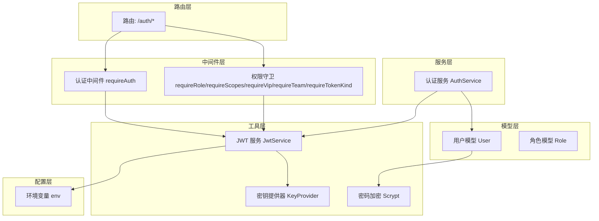
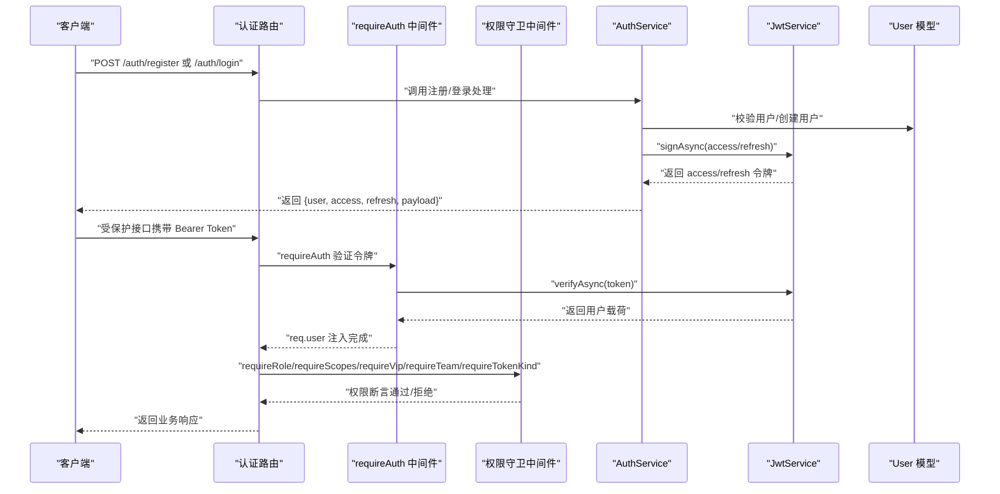
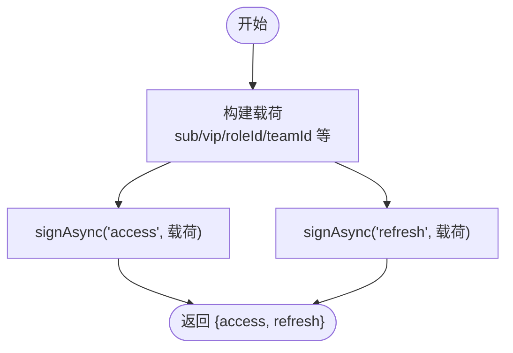
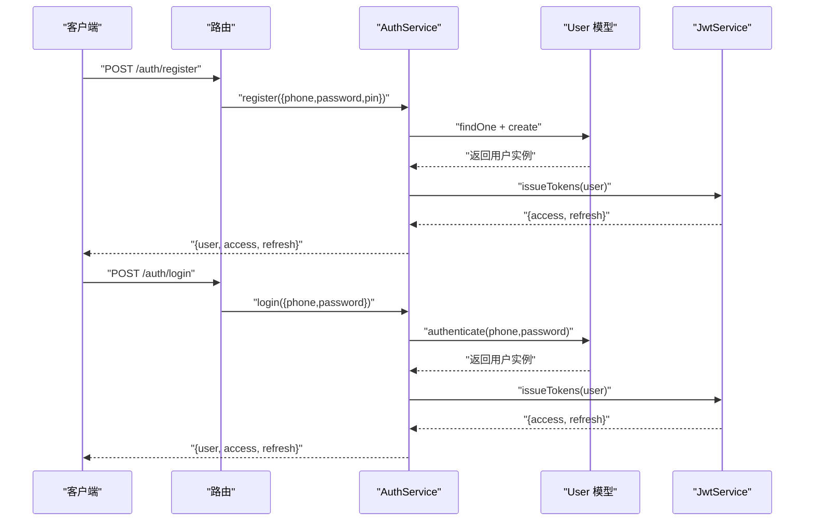
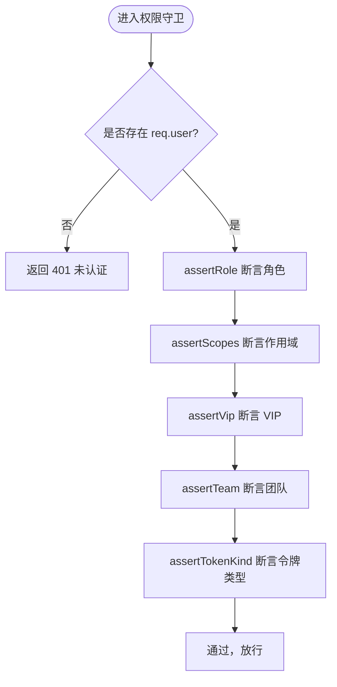
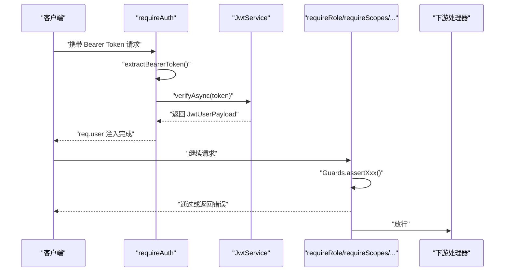
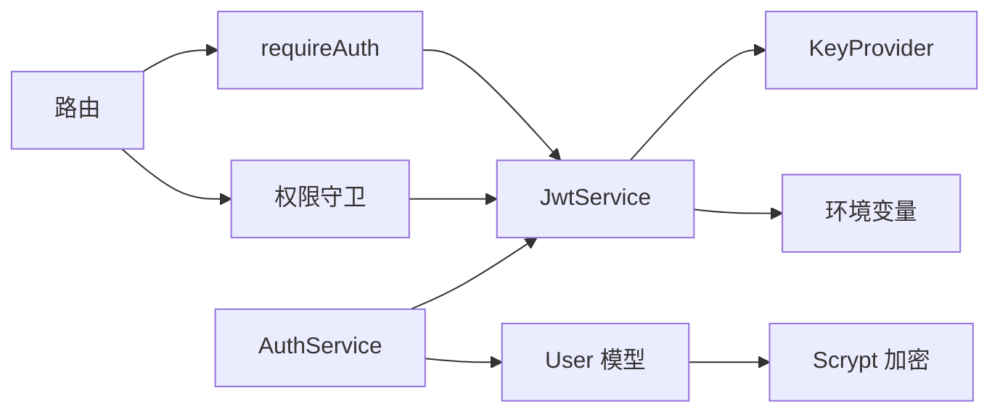

# 认证授权系统

<cite>
**本文引用的文件**
- [src/services/auth.ts](file://src/services/auth.ts)
- [src/middleware/auth/index.ts](file://src/middleware/auth/index.ts)
- [src/middleware/auth/require.ts](file://src/middleware/auth/require.ts)
- [src/middleware/auth/guards.ts](file://src/middleware/auth/guards.ts)
- [src/tools/jwt/service.ts](file://src/tools/jwt/service.ts)
- [src/tools/jwt/index.ts](file://src/tools/jwt/index.ts)
- [src/tools/jwt/guards/index.ts](file://src/tools/jwt/guards/index.ts)
- [src/models/auth/anth.ts](file://src/models/auth/anth.ts)
- [src/models/user/user.ts](file://src/models/user/user.ts)
- [src/models/user/types/user.ts](file://src/models/user/types/user.ts)
- [src/models/role/index.ts](file://src/models/role/index.ts)
- [src/routes/auth.ts](file://src/routes/auth.ts)
- [src/config/env/index.ts](file://src/config/env/index.ts)
- [src/tools/crypto/password.ts](file://src/tools/crypto/password.ts)
</cite>

## 目录
1. [简介](#简介)
2. [项目结构](#项目结构)
3. [核心组件](#核心组件)
4. [架构总览](#架构总览)
5. [组件详解](#组件详解)
6. [依赖关系分析](#依赖关系分析)
7. [性能考量](#性能考量)
8. [故障排查指南](#故障排查指南)
9. [结论](#结论)
10. [附录](#附录)

## 简介
本文件面向 IM-API 的认证授权系统，围绕无状态 JWT 认证机制，系统性阐述以下主题：
- 令牌生成、验证与刷新流程
- 用户认证生命周期（注册到登录）
- 多维度权限控制（角色权限、VIP 用户、团队隔离）
- 权限守卫与中间件工作原理
- 安全最佳实践与常见攻击防护
- 密码加密（Scrypt）、令牌签名与验证的具体实现要点
- 配置项与代码示例路径

## 项目结构
认证授权相关代码主要分布在如下模块：
- 路由层：认证路由定义与对外接口
- 中间件层：认证与权限守卫中间件
- 服务层：认证业务逻辑（注册、登录、签发令牌）
- 工具层：JWT 服务、密钥提供器、错误处理、密码加密
- 模型层：用户模型、角色模型、认证 DTO 类型
- 配置层：环境变量解析与安全配置



图表来源
- [src/routes/auth.ts](file://src/routes/auth.ts#L1-L47)
- [src/middleware/auth/require.ts](file://src/middleware/auth/require.ts#L1-L98)
- [src/middleware/auth/guards.ts](file://src/middleware/auth/guards.ts#L1-L195)
- [src/services/auth.ts](file://src/services/auth.ts#L1-L170)
- [src/tools/jwt/service.ts](file://src/tools/jwt/service.ts#L1-L98)
- [src/tools/jwt/index.ts](file://src/tools/jwt/index.ts#L1-L107)
- [src/models/user/user.ts](file://src/models/user/user.ts#L1-L275)
- [src/models/role/index.ts](file://src/models/role/index.ts#L1-L77)
- [src/config/env/index.ts](file://src/config/env/index.ts#L1-L223)

章节来源
- [src/routes/auth.ts](file://src/routes/auth.ts#L1-L47)
- [src/middleware/auth/index.ts](file://src/middleware/auth/index.ts#L1-L45)
- [src/services/auth.ts](file://src/services/auth.ts#L1-L170)
- [src/tools/jwt/index.ts](file://src/tools/jwt/index.ts#L1-L107)

## 核心组件
- 认证服务 AuthService：封装注册、登录、获取当前用户、退出等业务逻辑，并负责签发访问/刷新令牌。
- JWT 服务 JwtService：提供签发、验证、刷新轮转等能力，支持 HS256/RS256 算法。
- 认证中间件 requireAuth：从 Authorization 头提取 Bearer 令牌并验证，将用户载荷注入 req.user。
- 权限守卫中间件：基于 req.user 的角色、作用域、VIP、团队、令牌类型等进行断言。
- 用户模型 User：集成密码加密钩子，提供认证与安全序列化。
- 密码加密工具：基于 Scrypt 的单向哈希与校验，支持升级策略。

章节来源
- [src/services/auth.ts](file://src/services/auth.ts#L82-L170)
- [src/tools/jwt/service.ts](file://src/tools/jwt/service.ts#L27-L98)
- [src/middleware/auth/require.ts](file://src/middleware/auth/require.ts#L68-L98)
- [src/middleware/auth/guards.ts](file://src/middleware/auth/guards.ts#L17-L195)
- [src/models/user/user.ts](file://src/models/user/user.ts#L33-L101)
- [src/tools/crypto/password.ts](file://src/tools/crypto/password.ts#L39-L111)

## 架构总览
下图展示认证授权的整体调用链路与职责划分：



图表来源
- [src/routes/auth.ts](file://src/routes/auth.ts#L12-L47)
- [src/middleware/auth/require.ts](file://src/middleware/auth/require.ts#L68-L98)
- [src/middleware/auth/guards.ts](file://src/middleware/auth/guards.ts#L17-L195)
- [src/services/auth.ts](file://src/services/auth.ts#L94-L134)
- [src/tools/jwt/service.ts](file://src/tools/jwt/service.ts#L41-L75)

## 组件详解

### JWT 无状态认证机制
- 令牌类型
  - access：用于访问受保护资源
  - refresh：用于轮换新的 access/refresh 令牌
- 令牌生成
  - 在签发时自动设置 issued-at、jti、subject 等标准字段
  - 不设置过期时间（exp），采用“长期有效”策略
- 令牌验证
  - 使用对应算法的密钥进行验证，异常按错误码映射为 401/403
- 令牌刷新
  - 仅当 tokenType 为 refresh 时才允许轮换
  - 生成新的 access 与 refresh，并更新 jti



图表来源
- [src/tools/jwt/service.ts](file://src/tools/jwt/service.ts#L41-L56)
- [src/services/auth.ts](file://src/services/auth.ts#L45-L80)

章节来源
- [src/tools/jwt/service.ts](file://src/tools/jwt/service.ts#L27-L98)
- [src/tools/jwt/index.ts](file://src/tools/jwt/index.ts#L80-L106)

### 用户认证生命周期（注册到登录）
- 注册
  - 校验手机号唯一性
  - 创建用户（密码通过钩子自动加密）
  - 签发 access/refresh 令牌
- 登录
  - 使用 User.authenticate 校验凭据
  - 签发 access/refresh 令牌
- 获取当前用户
  - 通过用户 ID 查询并安全序列化返回
- 退出
  - 无状态实现，客户端删除令牌即可；如启用黑名单可在服务端追加逻辑



图表来源
- [src/services/auth.ts](file://src/services/auth.ts#L94-L134)
- [src/models/user/user.ts](file://src/models/user/user.ts#L69-L89)
- [src/tools/jwt/service.ts](file://src/tools/jwt/service.ts#L41-L56)

章节来源
- [src/services/auth.ts](file://src/services/auth.ts#L94-L153)
- [src/models/user/user.ts](file://src/models/user/user.ts#L69-L101)

### 多维度权限控制系统
- 角色权限
  - 基于用户 roleId 与允许的角色列表进行断言
- VIP 用户权限
  - 断言用户必须为 VIP
- 团队权限隔离
  - 断言用户必须属于指定团队之一
- 作用域与令牌类型
  - 断言用户具备所需作用域之一
  - 断言令牌类型为 access 或 refresh



图表来源
- [src/middleware/auth/guards.ts](file://src/middleware/auth/guards.ts#L25-L195)
- [src/tools/jwt/guards/index.ts](file://src/tools/jwt/guards/index.ts#L1-L19)

章节来源
- [src/middleware/auth/guards.ts](file://src/middleware/auth/guards.ts#L17-L195)
- [src/tools/jwt/guards/index.ts](file://src/tools/jwt/guards/index.ts#L1-L19)

### 权限守卫与中间件工作原理
- requireAuth
  - 从 Authorization 头提取 Bearer 令牌
  - 调用 JwtService.verifyAsync 验证并注入 req.user
- 各类守卫
  - requireRole/requireScopes/requireVip/requireTeam/requireTokenKind
  - 内部委托至 Guards.assertXxx 进行断言
  - 对认证错误进行统一格式化返回



图表来源
- [src/middleware/auth/require.ts](file://src/middleware/auth/require.ts#L68-L98)
- [src/middleware/auth/guards.ts](file://src/middleware/auth/guards.ts#L25-L195)
- [src/tools/jwt/index.ts](file://src/tools/jwt/index.ts#L68-L68)

章节来源
- [src/middleware/auth/require.ts](file://src/middleware/auth/require.ts#L34-L98)
- [src/middleware/auth/guards.ts](file://src/middleware/auth/guards.ts#L17-L195)

### 密码加密（Scrypt）、令牌签名与验证
- 密码加密
  - 使用 Scrypt，参数固定，结合环境变量中的 PASSWORD_PEPPER
  - beforeSave 钩子自动对明文密码进行哈希存储
- 令牌签名与验证
  - 支持 HS256/RS256 算法，密钥由 KeyProvider 提供
  - 验证失败按错误码映射为 401/403

```mermaid
classDiagram
class User {
+string id
+string phone
+string password
+string pin
+string roleId
+string teamId
+boolean vip
+verifyPassword(plain) Promise~boolean~
+toJSON() SafeUser
}
class PasswordCrypto {
+hashPassword(password) Promise~string~
+verifyPassword(password, stored) Promise~boolean~
+verifyPasswordUpgrade(password, stored) Promise~{ok, needsRehash, newHash?}~
}
class JwtService {
+signAsync(kind, payload) Promise~string~
+verifyAsync(token) Promise~JwtUserPayload~
+rotateRefreshAsync(refreshToken, mutate?) Promise~{access, refresh, payload}~
}
User --> PasswordCrypto : "使用 Scrypt"
AuthService --> JwtService : "签发令牌"
requireAuth --> JwtService : "验证令牌"
```

图表来源
- [src/models/user/user.ts](file://src/models/user/user.ts#L33-L101)
- [src/tools/crypto/password.ts](file://src/tools/crypto/password.ts#L39-L111)
- [src/tools/jwt/service.ts](file://src/tools/jwt/service.ts#L41-L96)

章节来源
- [src/models/user/user.ts](file://src/models/user/user.ts#L256-L275)
- [src/tools/crypto/password.ts](file://src/tools/crypto/password.ts#L39-L111)
- [src/tools/jwt/service.ts](file://src/tools/jwt/service.ts#L27-L98)

### 配置选项与环境变量
- JWT 算法与密钥
  - HS256：JWT_SECRET
  - RS256：JWT_PRIVATE_KEY_PATH、JWT_PUBLIC_KEY_PATH
- TTL 与功能开关
  - JWT_ACCESS_TTL、JWT_REFRESH_TTL
  - enableDeviceBinding、enableRedisBlacklist（当前未启用）
- 其他安全相关
  - PASSWORD_PEPPER（密码加盐）
  - ADMIN_REQUIRE_LOGIN（管理员后台登录要求）

章节来源
- [src/config/env/index.ts](file://src/config/env/index.ts#L106-L223)
- [src/tools/jwt/index.ts](file://src/tools/jwt/index.ts#L80-L106)

## 依赖关系分析
- 路由依赖中间件：认证路由依赖 requireAuth 与各类权限守卫
- 中间件依赖工具：requireAuth 与守卫依赖 JwtService 与 Guards
- 服务依赖模型与工具：AuthService 依赖 User 模型与 JwtService
- 模型依赖工具：User 模型依赖 Scrypt 加密钩子
- 工具依赖配置：JwtService 依赖 KeyProvider 与环境变量



图表来源
- [src/routes/auth.ts](file://src/routes/auth.ts#L12-L47)
- [src/middleware/auth/require.ts](file://src/middleware/auth/require.ts#L12-L32)
- [src/middleware/auth/guards.ts](file://src/middleware/auth/guards.ts#L12-L15)
- [src/services/auth.ts](file://src/services/auth.ts#L13-L22)
- [src/models/user/user.ts](file://src/models/user/user.ts#L256-L275)
- [src/tools/jwt/index.ts](file://src/tools/jwt/index.ts#L80-L106)

章节来源
- [src/middleware/auth/index.ts](file://src/middleware/auth/index.ts#L12-L45)
- [src/services/auth.ts](file://src/services/auth.ts#L13-L22)

## 性能考量
- 令牌长期有效：避免频繁刷新带来的开销，但需关注令牌泄露风险
- 密码加密成本：Scrypt 参数固定，确保一致性；升级策略可按需启用
- 中间件验证：仅做必要校验，避免重复解析与多次 I/O
- 数据库索引：用户表对 phone、roleId、state 等字段建立索引，提升查询效率

## 故障排查指南
- 认证失败
  - 401 未认证：Authorization 头缺失或格式错误
  - 401 令牌无效/过期：令牌被篡改或验证失败
  - 403 令牌类型不符：尝试以 access 作为 refresh 使用
- 权限拒绝
  - 角色/作用域/团队/VIP 不满足要求
- 服务错误
  - 500 内部错误：未知异常，检查日志与依赖状态

章节来源
- [src/middleware/auth/require.ts](file://src/middleware/auth/require.ts#L75-L96)
- [src/middleware/auth/guards.ts](file://src/middleware/auth/guards.ts#L36-L86)
- [src/tools/jwt/service.ts](file://src/tools/jwt/service.ts#L66-L75)

## 结论
本认证授权系统采用无状态 JWT 架构，结合 Scrypt 密码加密与多维度权限守卫，实现了从注册到登录的完整生命周期管理。通过中间件与服务层的清晰分离，系统具备良好的可维护性与扩展性。建议在生产环境中配合 HTTPS、速率限制、设备绑定与黑名单等安全措施进一步加固。

## 附录
- 关键实现路径参考
  - 令牌签发与刷新：[src/tools/jwt/service.ts](file://src/tools/jwt/service.ts#L41-L96)
  - 认证中间件与守卫：[src/middleware/auth/require.ts](file://src/middleware/auth/require.ts#L68-L98)、[src/middleware/auth/guards.ts](file://src/middleware/auth/guards.ts#L25-L195)
  - 认证服务与路由：[src/services/auth.ts](file://src/services/auth.ts#L94-L134)、[src/routes/auth.ts](file://src/routes/auth.ts#L18-L44)
  - 用户模型与密码钩子：[src/models/user/user.ts](file://src/models/user/user.ts#L256-L275)
  - Scrypt 密码工具：[src/tools/crypto/password.ts](file://src/tools/crypto/password.ts#L39-L111)
  - 环境变量与安全配置：[src/config/env/index.ts](file://src/config/env/index.ts#L166-L223)