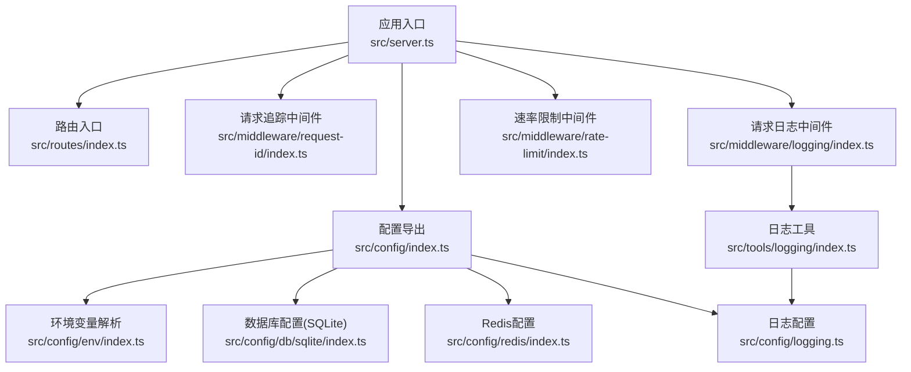
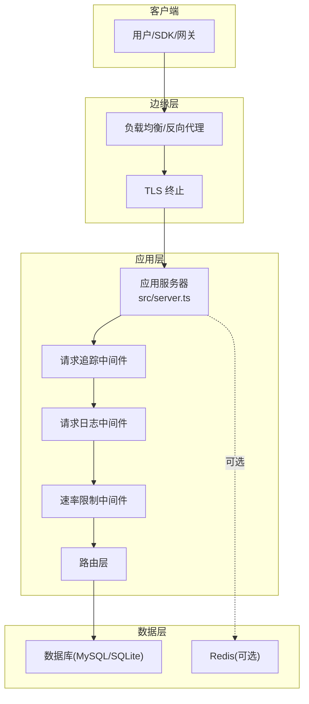
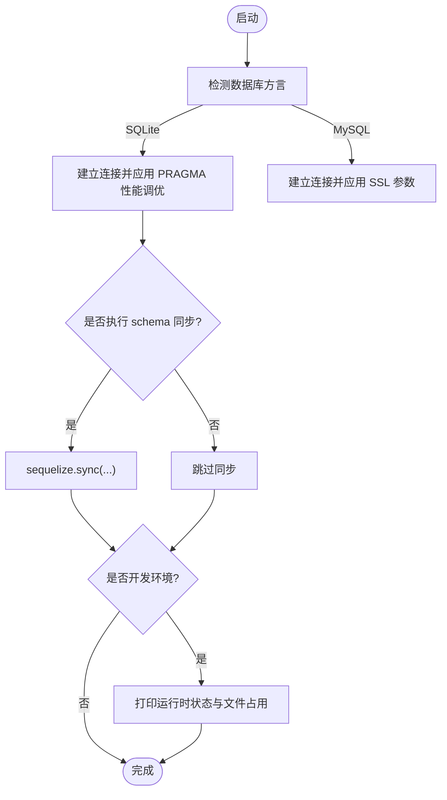
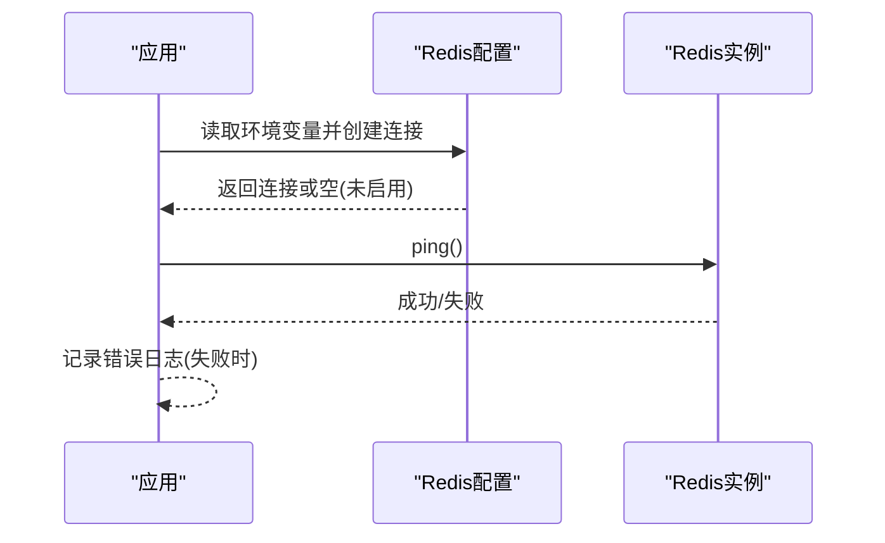
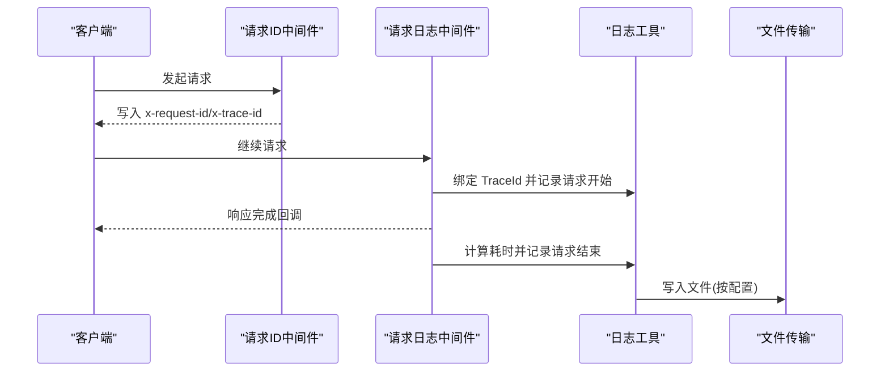
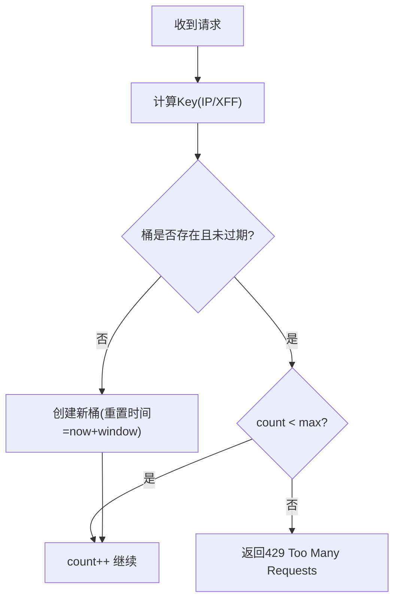
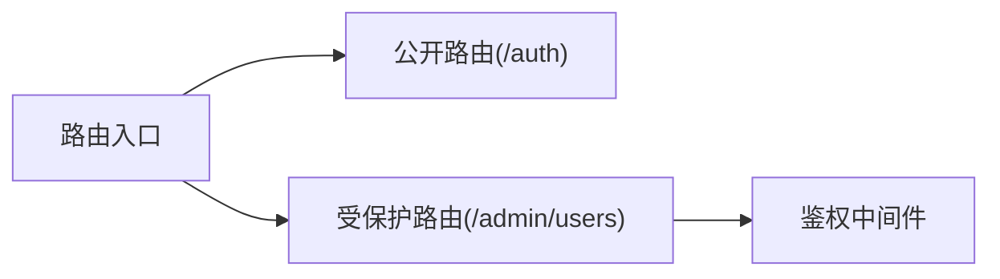
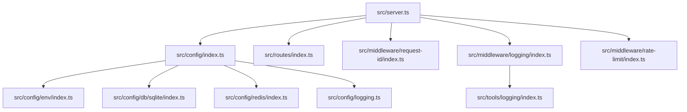

# 部署指南

<cite>
**本文引用的文件**
- [package.json](file://package.json)
- [.env](file://.env)
- [src/server.ts](file://src/server.ts)
- [src/config/index.ts](file://src/config/index.ts)
- [src/config/env/index.ts](file://src/config/env/index.ts)
- [src/config/db/sqlite/index.ts](file://src/config/db/sqlite/index.ts)
- [src/config/redis/index.ts](file://src/config/redis/index.ts)
- [src/config/logging.ts](file://src/config/logging.ts)
- [src/middleware/rate-limit/index.ts](file://src/middleware/rate-limit/index.ts)
- [src/middleware/logging/index.ts](file://src/middleware/logging/index.ts)
- [src/middleware/request-id/index.ts](file://src/middleware/request-id/index.ts)
- [src/tools/logging/index.ts](file://src/tools/logging/index.ts)
- [src/routes/index.ts](file://src/routes/index.ts)
</cite>

## 目录
1. [简介](#简介)
2. [项目结构](#项目结构)
3. [核心组件](#核心组件)
4. [架构总览](#架构总览)
5. [详细组件分析](#详细组件分析)
6. [依赖关系分析](#依赖关系分析)
7. [性能考量](#性能考量)
8. [故障排除指南](#故障排除指南)
9. [结论](#结论)
10. [附录](#附录)

## 简介
本指南面向生产环境，提供 IM-API 的部署与运维最佳实践，涵盖环境配置、容器化部署、性能优化、监控与日志、高可用与负载均衡、安全加固、数据库备份与恢复、部署后验证与测试、以及常见故障排查与运维技巧。内容严格基于仓库中的配置与实现，避免臆测。

## 项目结构
- 应用入口与启动流程集中在服务端入口文件，负责初始化数据库、注册中间件与路由，并暴露健康检查端点。
- 配置模块集中于 config 目录，包含环境变量解析、数据库（SQLite/MySQL）、Redis、日志与限流等配置。
- 中间件层提供请求追踪、请求日志、速率限制等功能。
- 工具层提供企业级日志系统，支持采样、脱敏、文件落盘与结构化输出。
- 路由层组织公开与受保护接口。

**图表来源**
- [src/server.ts](file://src/server.ts#L1-L74)
- [src/config/index.ts](file://src/config/index.ts#L1-L30)
- [src/config/env/index.ts](file://src/config/env/index.ts#L1-L223)
- [src/config/db/sqlite/index.ts](file://src/config/db/sqlite/index.ts#L1-L410)
- [src/config/redis/index.ts](file://src/config/redis/index.ts#L1-L40)
- [src/config/logging.ts](file://src/config/logging.ts#L1-L157)
- [src/middleware/logging/index.ts](file://src/middleware/logging/index.ts#L1-L64)
- [src/middleware/request-id/index.ts](file://src/middleware/request-id/index.ts#L1-L64)
- [src/middleware/rate-limit/index.ts](file://src/middleware/rate-limit/index.ts#L1-L70)
- [src/tools/logging/index.ts](file://src/tools/logging/index.ts#L1-L532)
- [src/routes/index.ts](file://src/routes/index.ts#L1-L22)

**章节来源**
- [src/server.ts](file://src/server.ts#L1-L74)
- [src/config/index.ts](file://src/config/index.ts#L1-L30)

## 核心组件
- 环境变量与类型安全解析：集中于环境配置模块，提供默认值与类型转换，覆盖数据库、安全密钥、连接池、SSL、速率限制、WebSocket、Redis 等。
- 数据库初始化与 SQLite 性能优化：封装了 SQLite 连接、PRAGMA 性能调优、运行时状态查询、文件占用统计与 WAL 使用估算。
- Redis 连接与连通性检查：按配置启用，提供 ping 检测与错误日志。
- 企业级日志系统：支持多级别、采样、脱敏、文件轮转、结构化输出与 TraceId 追踪。
- 请求追踪与日志中间件：确保每个请求具备唯一 ID，并在响应完成后记录请求耗时与状态。
- 速率限制中间件：基于内存的固定窗口计数，按 IP 限流。
- 路由组织：公开与受保护接口分离，受保护接口需鉴权。

**章节来源**
- [src/config/env/index.ts](file://src/config/env/index.ts#L1-L223)
- [src/config/db/sqlite/index.ts](file://src/config/db/sqlite/index.ts#L1-L410)
- [src/config/redis/index.ts](file://src/config/redis/index.ts#L1-L40)
- [src/config/logging.ts](file://src/config/logging.ts#L1-L157)
- [src/middleware/logging/index.ts](file://src/middleware/logging/index.ts#L1-L64)
- [src/middleware/request-id/index.ts](file://src/middleware/request-id/index.ts#L1-L64)
- [src/middleware/rate-limit/index.ts](file://src/middleware/rate-limit/index.ts#L1-L70)
- [src/tools/logging/index.ts](file://src/tools/logging/index.ts#L1-L532)
- [src/routes/index.ts](file://src/routes/index.ts#L1-L22)

## 架构总览
IM-API 在生产环境中建议采用“单体服务 + 外部数据库 + 缓存”的架构。数据库可选 SQLite 或 MySQL；Redis 可选配；日志落盘与采样结合；通过反向代理实现负载均衡与 TLS 终止；健康检查端点用于探活。

**图表来源**
- [src/server.ts](file://src/server.ts#L1-L74)
- [src/middleware/logging/index.ts](file://src/middleware/logging/index.ts#L1-L64)
- [src/middleware/request-id/index.ts](file://src/middleware/request-id/index.ts#L1-L64)
- [src/middleware/rate-limit/index.ts](file://src/middleware/rate-limit/index.ts#L1-L70)
- [src/routes/index.ts](file://src/routes/index.ts#L1-L22)
- [src/config/db/sqlite/index.ts](file://src/config/db/sqlite/index.ts#L1-L410)
- [src/config/redis/index.ts](file://src/config/redis/index.ts#L1-L40)

## 详细组件分析

### 数据库配置与初始化（SQLite/MySQL）
- 支持 SQLite 单文件与 MySQL 两种模式，通过方言与连接参数切换。
- SQLite 初始化包含认证、PRAGMA 性能调优、可选 schema 同步、运行时状态与文件占用日志。
- 提供 WAL 模式、内存映射、缓存大小、自动检查点、锁等待超时等关键参数。
- MySQL 连接参数可通过环境变量配置，支持 SSL 证书链与拒绝未授权证书。

**图表来源**
- [src/config/db/sqlite/index.ts](file://src/config/db/sqlite/index.ts#L130-L410)
- [src/config/env/index.ts](file://src/config/env/index.ts#L100-L206)

**章节来源**
- [src/config/db/sqlite/index.ts](file://src/config/db/sqlite/index.ts#L1-L410)
- [src/config/env/index.ts](file://src/config/env/index.ts#L100-L206)

### Redis 配置与连通性
- 可按开关启用，连接参数来自环境变量；提供 ping 检测与错误日志。
- 建议生产环境开启并配置密码与独立 DB，避免与业务数据混用。

**图表来源**
- [src/config/redis/index.ts](file://src/config/redis/index.ts#L1-L40)
- [src/config/env/index.ts](file://src/config/env/index.ts#L215-L219)

**章节来源**
- [src/config/redis/index.ts](file://src/config/redis/index.ts#L1-L40)
- [src/config/env/index.ts](file://src/config/env/index.ts#L215-L219)

### 日志系统与请求追踪
- 企业级日志系统支持多级别、采样、脱敏、文件轮转与结构化输出。
- 请求日志中间件在响应完成后记录方法、URL、状态码、耗时与长度，并绑定 TraceId。
- 请求 ID 中间件确保每个请求具备 x-request-id/x-trace-id 并回写响应头。

**图表来源**
- [src/middleware/request-id/index.ts](file://src/middleware/request-id/index.ts#L1-L64)
- [src/middleware/logging/index.ts](file://src/middleware/logging/index.ts#L1-L64)
- [src/tools/logging/index.ts](file://src/tools/logging/index.ts#L1-L532)
- [src/config/logging.ts](file://src/config/logging.ts#L1-L157)

**章节来源**
- [src/middleware/logging/index.ts](file://src/middleware/logging/index.ts#L1-L64)
- [src/middleware/request-id/index.ts](file://src/middleware/request-id/index.ts#L1-L64)
- [src/tools/logging/index.ts](file://src/tools/logging/index.ts#L1-L532)
- [src/config/logging.ts](file://src/config/logging.ts#L1-L157)

### 速率限制中间件
- 基于内存的固定窗口计数，按客户端 IP 限流。
- 窗口时长与最大请求数来自环境变量，支持通过请求头透传。

**图表来源**
- [src/middleware/rate-limit/index.ts](file://src/middleware/rate-limit/index.ts#L1-L70)
- [src/config/env/index.ts](file://src/config/env/index.ts#L208-L209)

**章节来源**
- [src/middleware/rate-limit/index.ts](file://src/middleware/rate-limit/index.ts#L1-L70)
- [src/config/env/index.ts](file://src/config/env/index.ts#L208-L209)

### 路由与鉴权
- 路由层区分公开与受保护接口，受保护接口需通过鉴权中间件。
- 鉴权中间件位于路由层，确保访问控制。

**图表来源**
- [src/routes/index.ts](file://src/routes/index.ts#L1-L22)

**章节来源**
- [src/routes/index.ts](file://src/routes/index.ts#L1-L22)

## 依赖关系分析
- 应用入口依赖配置导出与模型初始化，再挂载中间件与路由。
- 配置模块统一导出环境变量、数据库、Redis、日志与 CORS 等能力。
- 中间件层依赖日志工具以实现结构化输出与采样。
- 速率限制中间件依赖环境变量进行配置。

**图表来源**
- [src/server.ts](file://src/server.ts#L1-L74)
- [src/config/index.ts](file://src/config/index.ts#L1-L30)
- [src/config/env/index.ts](file://src/config/env/index.ts#L1-L223)
- [src/config/db/sqlite/index.ts](file://src/config/db/sqlite/index.ts#L1-L410)
- [src/config/redis/index.ts](file://src/config/redis/index.ts#L1-L40)
- [src/config/logging.ts](file://src/config/logging.ts#L1-L157)
- [src/middleware/logging/index.ts](file://src/middleware/logging/index.ts#L1-L64)
- [src/middleware/request-id/index.ts](file://src/middleware/request-id/index.ts#L1-L64)
- [src/middleware/rate-limit/index.ts](file://src/middleware/rate-limit/index.ts#L1-L70)
- [src/tools/logging/index.ts](file://src/tools/logging/index.ts#L1-L532)
- [src/routes/index.ts](file://src/routes/index.ts#L1-L22)

**章节来源**
- [src/server.ts](file://src/server.ts#L1-L74)
- [src/config/index.ts](file://src/config/index.ts#L1-L30)

## 性能考量
- 数据库
  - SQLite：启用 WAL、内存映射、缓存大小与自动检查点；合理设置连接池上限与获取超时；生产环境避免频繁强制同步，必要时使用迁移替代同步。
  - MySQL：启用 SSL 并校验证书；根据吞吐调整连接池参数；开启慢查询日志与性能分析。
- 缓存
  - Redis：启用并配置密码与独立 DB；合理设置过期策略与淘汰策略；监控命中率与内存使用。
- 应用
  - 速率限制：根据业务峰值设置窗口与阈值，避免对正常流量造成误伤。
  - 日志采样：生产环境开启采样，降低高频日志对 IO 的压力。
  - 请求追踪：统一 TraceId，便于跨服务定位问题。
- 资源配置建议
  - CPU：按 QPS 与并发连接数评估；预留 20%-30% 缓冲。
  - 内存：为 GC 与 OS 缓存留足空间；关注 WAL 与 mmap 占用。
  - 磁盘：为 SQLite WAL 与日志文件预留增长空间；定期清理旧日志。

[本节为通用指导，无需具体文件分析]

## 故障排除指南
- 启动失败
  - 检查数据库连接与凭据；确认方言与存储路径正确；查看数据库初始化日志。
  - 章节来源
    - [src/config/db/sqlite/index.ts](file://src/config/db/sqlite/index.ts#L368-L409)
- Redis 连接失败
  - 确认 Redis 开关、主机、端口、密码与 DB；使用 ping 检查连通性；查看错误日志。
  - 章节来源
    - [src/config/redis/index.ts](file://src/config/redis/index.ts#L31-L38)
- 请求被限流
  - 检查速率限制窗口与阈值；确认客户端 IP 是否被正确识别；适当提升阈值或分片限流。
  - 章节来源
    - [src/middleware/rate-limit/index.ts](file://src/middleware/rate-limit/index.ts#L43-L69)
- 日志异常
  - 检查日志级别、采样率与文件轮转配置；确认文件权限与磁盘空间；查看脱敏规则是否误伤诊断信息。
  - 章节来源
    - [src/config/logging.ts](file://src/config/logging.ts#L105-L151)
    - [src/tools/logging/index.ts](file://src/tools/logging/index.ts#L397-L437)

## 结论
本指南基于仓库现有实现，给出了生产环境的部署与运维要点。建议在上线前完成数据库迁移、Redis 连通性与性能压测、日志与监控接入、以及安全加固与备份演练。后续可根据业务增长逐步引入外部缓存、读写分离与水平扩展。

## 附录

### A. 生产环境配置清单
- 环境变量
  - 必填项：NODE_ENV、PORT、JWT_SECRET、PIN_SECRET、PASSWORD_PEPPER
  - 数据库：DB_DIALECT、DB_STORAGE（SQLite）或 MYSQL_*（MySQL）
  - 连接池与 SSL：DB_POOL_*、DB_SSL_*
  - 速率限制：RATE_LIMIT_WINDOW_MS、RATE_LIMIT_MAX_REQUESTS
  - WebSocket：WS_ENABLED、WS_PING_INTERVAL_MS、WS_IDLE_TIMEOUT_MS
  - Redis：REDIS_ENABLED、REDIS_HOST、REDIS_PORT、REDIS_PASSWORD、REDIS_DB
- 章节来源
  - [.env](file://.env#L1-L22)
  - [src/config/env/index.ts](file://src/config/env/index.ts#L166-L220)

### B. Docker 容器化部署流程（步骤）
- 构建镜像
  - 使用 Node.js 运行时镜像作为基础，复制依赖与构建产物，暴露端口。
  - 章节来源
    - [package.json](file://package.json#L6-L10)
- 配置文件挂载
  - 将 .env 与日志目录挂载至容器；确保日志目录可写。
  - 章节来源
    - [.env](file://.env#L1-L22)
    - [src/config/logging.ts](file://src/config/logging.ts#L114-L121)
- 数据库与缓存
  - 将数据库与 Redis 部署在独立容器或云服务上；通过网络与环境变量连接。
  - 章节来源
    - [src/config/db/sqlite/index.ts](file://src/config/db/sqlite/index.ts#L106-L128)
    - [src/config/redis/index.ts](file://src/config/redis/index.ts#L5-L15)
- 健康检查
  - 对外暴露 /health 端点，用于容器编排探活。
  - 章节来源
    - [src/server.ts](file://src/server.ts#L42-L45)

### C. 监控与日志收集
- 日志
  - 生产环境启用文件日志与采样；脱敏敏感字段；按日期轮转并压缩。
  - 章节来源
    - [src/config/logging.ts](file://src/config/logging.ts#L105-L151)
    - [src/tools/logging/index.ts](file://src/tools/logging/index.ts#L397-L437)
- 指标
  - 建议采集：QPS、P95/P99 延迟、错误率、数据库连接池使用率、Redis 命中率、日志写入速率。
- 追踪
  - 使用 x-request-id/x-trace-id 统一追踪；在日志中输出 TraceId 以便关联。

### D. 负载均衡与高可用
- 反向代理
  - Nginx/Traefik 等：监听 80/443，转发至多个应用实例；开启健康检查。
- 高可用
  - 多实例部署；共享数据库与缓存；使用会话粘性或无状态设计。
- WebSocket
  - 如启用 WebSocket，需确保代理支持升级与长连接保持。

### E. 安全加固
- 密钥管理
  - 更换默认密钥；使用安全的密钥长度与随机源；定期轮换。
  - 章节来源
    - [.env](file://.env#L19-L21)
- 传输安全
  - 启用数据库 SSL；在反向代理终止 TLS 并校验证书。
  - 章节来源
    - [src/config/env/index.ts](file://src/config/env/index.ts#L188-L192)
- 访问控制
  - 速率限制与 IP 白名单；鉴权中间件保护受保护路由。
  - 章节来源
    - [src/middleware/rate-limit/index.ts](file://src/middleware/rate-limit/index.ts#L43-L69)
    - [src/routes/index.ts](file://src/routes/index.ts#L17-L18)

### F. 数据库备份与恢复
- SQLite
  - 备份：直接复制 .db 与 -wal 文件；监控 WAL 大小，必要时执行检查点。
  - 恢复：停止服务，替换文件后重启。
  - 章节来源
    - [src/config/db/sqlite/index.ts](file://src/config/db/sqlite/index.ts#L287-L330)
- MySQL
  - 备份：使用逻辑/物理备份工具；验证一致性与恢复路径。
  - 恢复：在维护窗口执行，核对权限与字符集。

### G. 部署后验证与测试
- 功能验证
  - 调用 /health 确认服务可用；调用公开与受保护接口验证鉴权与限流。
- 性能验证
  - 压测工具模拟峰值流量；观察延迟、错误率与资源使用。
- 安全验证
  - 测试默认密钥是否已被替换；验证日志脱敏与采样效果。

### H. 运维监控实用技巧
- 日志分级：生产使用 info/warn/error，避免过多 debug。
- 采样策略：高频接口降低 trace/debug 采样率。
- 文件轮转：设置合理的单文件大小与保留份数，避免磁盘打满。
- 告警：针对 5xx、延迟突增、连接池耗尽、Redis 不可用等设置阈值告警。