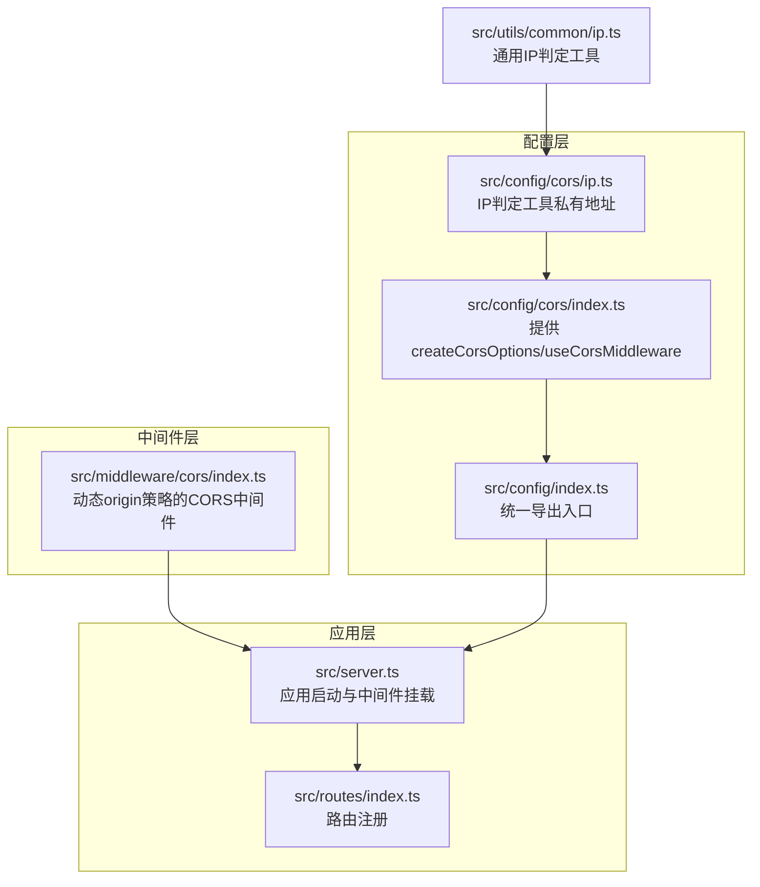
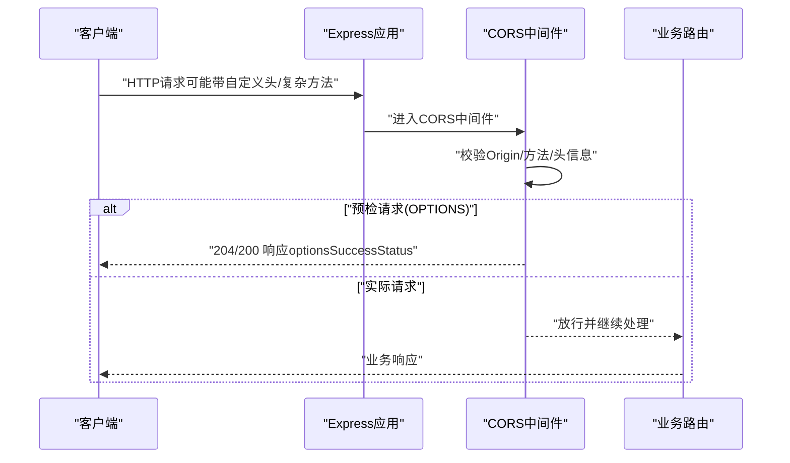
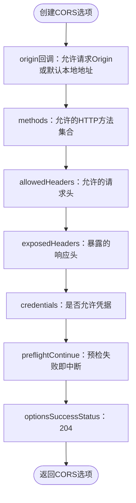
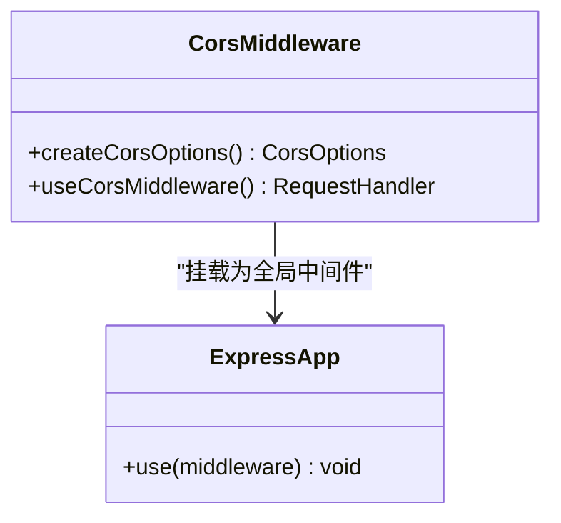
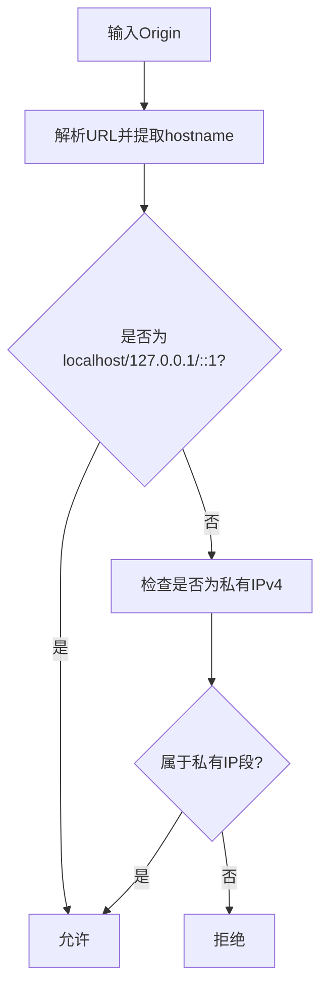
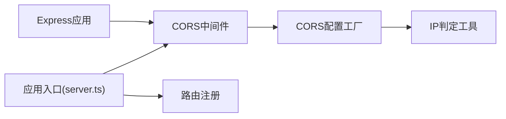

# CORS配置

<cite>
**本文引用的文件**
- [src/config/cors/index.ts](file://src/config/cors/index.ts)
- [src/config/cors/ip.ts](file://src/config/cors/ip.ts)
- [src/middleware/cors/index.ts](file://src/middleware/cors/index.ts)
- [src/config/index.ts](file://src/config/index.ts)
- [src/server.ts](file://src/server.ts)
- [src/config/env/index.ts](file://src/config/env/index.ts)
- [src/utils/common/ip.ts](file://src/utils/common/ip.ts)
- [src/middleware/request/app.ts](file://src/middleware/request/app.ts)
- [src/routes/index.ts](file://src/routes/index.ts)
</cite>

## 目录
1. [简介](#简介)
2. [项目结构](#项目结构)
3. [核心组件](#核心组件)
4. [架构总览](#架构总览)
5. [详细组件分析](#详细组件分析)
6. [依赖关系分析](#依赖关系分析)
7. [性能考量](#性能考量)
8. [故障排查指南](#故障排查指南)
9. [结论](#结论)
10. [附录](#附录)

## 简介
本文件面向IM-API的CORS跨域配置系统，系统性阐述CORS基本概念、安全考虑、配置项含义与行为、IP白名单与黑名单机制、不同部署环境下的策略建议、预检请求处理与缓存机制、安全最佳实践以及常见问题排查方案。文档同时结合代码实现，帮助开发者在理解原理的基础上正确配置与优化CORS。

## 项目结构
CORS相关能力由“配置层”和“中间件层”两部分组成：
- 配置层：提供CORS选项工厂函数与导出入口，便于在不同场景下选择合适的配置。
- 中间件层：封装Express中间件，将CORS选项注入到HTTP请求处理链中。

图表来源
- [src/config/cors/index.ts](file://src/config/cors/index.ts#L1-L43)
- [src/config/cors/ip.ts](file://src/config/cors/ip.ts#L1-L52)
- [src/config/index.ts](file://src/config/index.ts#L1-L30)
- [src/middleware/cors/index.ts](file://src/middleware/cors/index.ts#L1-L39)
- [src/server.ts](file://src/server.ts#L1-L74)
- [src/utils/common/ip.ts](file://src/utils/common/ip.ts#L1-L38)
- [src/routes/index.ts](file://src/routes/index.ts#L1-L22)

章节来源
- [src/config/cors/index.ts](file://src/config/cors/index.ts#L1-L43)
- [src/config/cors/ip.ts](file://src/config/cors/ip.ts#L1-L52)
- [src/middleware/cors/index.ts](file://src/middleware/cors/index.ts#L1-L39)
- [src/config/index.ts](file://src/config/index.ts#L1-L30)
- [src/server.ts](file://src/server.ts#L1-L74)
- [src/utils/common/ip.ts](file://src/utils/common/ip.ts#L1-L38)
- [src/routes/index.ts](file://src/routes/index.ts#L1-L22)

## 核心组件
- CORS配置工厂
  - 提供两种策略：
    - 严格模式：仅允许本机/局域网Origin，适用于开发与内网联调。
    - 动态镜像模式：origin设为true，镜像请求Origin，适用于需要多前端或外部联调的场景。
- CORS中间件
  - 将CORS选项注入Express应用，作为全局中间件生效。
- IP判定工具
  - 判断是否为本地或私有IP，辅助Origin合法性判断。
- 应用入口
  - 在服务器启动时挂载CORS中间件，确保所有路由均受CORS保护。

章节来源
- [src/config/cors/index.ts](file://src/config/cors/index.ts#L10-L42)
- [src/middleware/cors/index.ts](file://src/middleware/cors/index.ts#L15-L38)
- [src/config/cors/ip.ts](file://src/config/cors/ip.ts#L7-L51)
- [src/utils/common/ip.ts](file://src/utils/common/ip.ts#L7-L34)
- [src/server.ts](file://src/server.ts#L27-L48)

## 架构总览
CORS在应用中的位置与职责如下：
- 在Express应用启动阶段，通过中间件将CORS策略注入到请求处理链。
- 对于每个HTTP请求，CORS中间件根据策略决定是否允许跨域访问，并设置响应头。
- 对于复杂请求（含自定义头、非简单方法），浏览器会先发送预检请求（OPTIONS），CORS中间件负责处理并返回合适的状态码。

图表来源
- [src/server.ts](file://src/server.ts#L34-L40)
- [src/middleware/cors/index.ts](file://src/middleware/cors/index.ts#L20-L28)
- [src/config/cors/index.ts](file://src/config/cors/index.ts#L14-L34)

## 详细组件分析

### 组件A：CORS配置工厂（严格模式）
- 作用
  - 生成严格的CORS选项，限制允许的Origin为请求Origin或默认本地开发地址。
  - 显式声明允许的方法、允许的请求头、暴露的响应头、是否允许凭证、预检处理策略与成功状态码。
- 关键点
  - origin回调：允许请求Origin，若缺失则回退到本地开发地址。
  - 方法集合：覆盖常见的REST方法与OPTIONS。
  - 头信息：包含Content-Type、Authorization、设备标识与请求追踪等常用头。
  - 凭证：允许携带Cookie/凭据，需谨慎评估安全性。
  - 预检：preflightContinue为false，表示预检失败即中断，避免不必要的放行。
  - 成功状态：optionsSuccessStatus设为204，符合标准。

图表来源
- [src/config/cors/index.ts](file://src/config/cors/index.ts#L14-L34)

章节来源
- [src/config/cors/index.ts](file://src/config/cors/index.ts#L10-L42)

### 组件B：CORS中间件（动态镜像模式）
- 作用
  - 将origin设为true，镜像请求Origin，实现灵活的跨域策略。
  - 允许凭证，支持复杂请求场景。
- 适用场景
  - 多前端或外部联调，Origin来源多样但可控。
- 安全提示
  - 使用origin:true时，务必配合其他安全措施（如鉴权、限流、IP白名单等）。

图表来源
- [src/middleware/cors/index.ts](file://src/middleware/cors/index.ts#L15-L38)
- [src/server.ts](file://src/server.ts#L34-L37)

章节来源
- [src/middleware/cors/index.ts](file://src/middleware/cors/index.ts#L15-L38)
- [src/server.ts](file://src/server.ts#L34-L37)

### 组件C：IP白名单与黑名单机制
- 白名单判定
  - 通过URL解析与私有IP段匹配，判断Origin是否来自本地或局域网。
  - 支持localhost、127.0.0.1、IPv6环回地址以及私有IP段（10.0.0.0/8、172.16.0.0/12、192.168.0.0/16）。
- 黑名单机制
  - 当前仓库未提供显式的黑名单实现；可在业务层或上游网关处补充。
- 实践建议
  - 在生产环境优先采用白名单策略，明确允许的Origin列表。
  - 对于动态origin:true的场景，建议结合IP白名单与鉴权共同防护。

图表来源
- [src/config/cors/ip.ts](file://src/config/cors/ip.ts#L31-L51)
- [src/utils/common/ip.ts](file://src/utils/common/ip.ts#L24-L34)

章节来源
- [src/config/cors/ip.ts](file://src/config/cors/ip.ts#L7-L51)
- [src/utils/common/ip.ts](file://src/utils/common/ip.ts#L7-L34)

### 组件D：预检请求处理与缓存机制
- 预检请求
  - 浏览器对复杂请求（含自定义头、非简单方法）会先发送OPTIONS预检。
  - CORS中间件根据策略返回204或200，随后继续执行后续中间件与业务逻辑。
- 缓存机制
  - 浏览器基于Access-Control-Max-Age缓存预检结果，减少重复预检。
  - 若策略频繁变化，可能导致缓存失效，需谨慎调整max-age或策略。
- 代码要点
  - optionsSuccessStatus：控制预检成功返回码。
  - preflightContinue：控制预检失败时的行为（false表示直接中断）。

章节来源
- [src/middleware/cors/index.ts](file://src/middleware/cors/index.ts#L20-L28)
- [src/config/cors/index.ts](file://src/config/cors/index.ts#L14-L34)

### 组件E：与应用入口的集成
- 中间件挂载
  - 在应用启动时，将CORS中间件挂载到Express实例，确保所有路由均受CORS保护。
- 路由组织
  - 路由按公开与受保护两类组织，CORS在路由之前生效，保障所有端点的一致性。

章节来源
- [src/server.ts](file://src/server.ts#L27-L48)
- [src/routes/index.ts](file://src/routes/index.ts#L14-L18)

## 依赖关系分析
- 模块耦合
  - CORS中间件依赖Express与cors库，配置工厂与IP工具提供策略与判定能力。
  - 应用入口集中导入并挂载CORS中间件，形成统一的安全边界。
- 可能的循环依赖
  - 当前结构清晰，未见循环依赖迹象。
- 外部依赖
  - cors库用于处理CORS头部与策略匹配。
  - dotenv用于加载环境变量，间接影响部署策略（如端口、调试模式等）。

图表来源
- [src/server.ts](file://src/server.ts#L14-L48)
- [src/middleware/cors/index.ts](file://src/middleware/cors/index.ts#L12-L38)
- [src/config/cors/index.ts](file://src/config/cors/index.ts#L8-L42)
- [src/config/cors/ip.ts](file://src/config/cors/ip.ts#L7-L51)
- [src/routes/index.ts](file://src/routes/index.ts#L7-L21)

章节来源
- [src/server.ts](file://src/server.ts#L14-L48)
- [src/middleware/cors/index.ts](file://src/middleware/cors/index.ts#L12-L38)
- [src/config/cors/index.ts](file://src/config/cors/index.ts#L8-L42)
- [src/config/cors/ip.ts](file://src/config/cors/ip.ts#L7-L51)
- [src/routes/index.ts](file://src/routes/index.ts#L7-L21)

## 性能考量
- 预检缓存
  - 合理设置Access-Control-Max-Age可减少重复预检，提升性能。
  - 若策略频繁变更，建议降低max-age或禁用缓存以保证一致性。
- 头信息精简
  - 仅暴露必要的响应头，避免过度放行导致安全风险。
- 中间件顺序
  - CORS位于鉴权与日志之前，有助于快速拒绝非法跨域请求，减少后续处理开销。

[本节为通用指导，无需特定文件引用]

## 故障排查指南
- 症状：浏览器报跨域错误
  - 检查CORS中间件是否已挂载到应用入口。
  - 确认请求头是否包含允许的自定义头，且方法为允许集合之一。
- 症状：预检请求失败
  - 检查optionsSuccessStatus与preflightContinue配置。
  - 确认Origin是否被允许（严格模式下需为请求Origin或默认本地地址）。
- 症状：凭证丢失
  - 确认credentials为true且Origin非通配符。
  - 检查浏览器同源策略与Cookie域设置。
- 症状：生产环境被外部站点滥用
  - 将origin设为严格白名单，或在上游网关/反向代理中限制Origin。
  - 结合IP白名单与鉴权中间件，形成多层防护。

章节来源
- [src/server.ts](file://src/server.ts#L34-L37)
- [src/middleware/cors/index.ts](file://src/middleware/cors/index.ts#L20-L28)
- [src/config/cors/index.ts](file://src/config/cors/index.ts#L14-L34)

## 结论
本CORS配置体系提供了两种策略：严格模式与动态镜像模式，分别适用于内网开发与多前端联调场景。通过IP判定工具与中间件集成，系统在保证功能可用的同时兼顾了安全与性能。建议在生产环境中采用严格的白名单策略，并结合鉴权、限流与IP白名单形成纵深防御。

[本节为总结性内容，无需特定文件引用]

## 附录

### 不同部署环境下的CORS配置策略
- 开发环境
  - 使用严格模式或动态镜像模式均可，便于本地与前端联调。
  - 可临时开启credentials以便调试。
- 测试/预发布环境
  - 采用严格模式，限定允许的Origin与方法集合。
  - 预检缓存可适度放宽，平衡性能与策略变更频率。
- 生产环境
  - 强烈建议使用白名单策略，明确允许的Origin列表。
  - 禁用通配符Origin，避免凭证泄露风险。
  - 结合IP白名单、鉴权与速率限制，形成完整安全防线。

章节来源
- [src/config/cors/index.ts](file://src/config/cors/index.ts#L14-L34)
- [src/middleware/cors/index.ts](file://src/middleware/cors/index.ts#L20-L28)
- [src/config/cors/ip.ts](file://src/config/cors/ip.ts#L31-L51)

### CORS相关安全最佳实践
- 最小权限原则
  - 仅允许必要的Origin、方法与头信息。
- 凭证管理
  - 仅在必要时开启credentials，并确保Origin为可信范围。
- 预检缓存
  - 合理设置max-age，避免策略变更滞后导致的安全隐患。
- 多层防护
  - 结合IP白名单、鉴权中间件与速率限制，降低跨域滥用风险。

章节来源
- [src/middleware/cors/index.ts](file://src/middleware/cors/index.ts#L20-L28)
- [src/config/cors/index.ts](file://src/config/cors/index.ts#L14-L34)
- [src/config/cors/ip.ts](file://src/config/cors/ip.ts#L31-L51)

### 常见CORS问题与解决方案
- 问题：OPTIONS预检失败
  - 解决：确认allowedHeaders与methods包含请求所需字段；检查preflightContinue与optionsSuccessStatus。
- 问题：凭证无法使用
  - 解决：确保Origin非通配符；检查credentials配置与浏览器Cookie域。
- 问题：生产环境被滥用
  - 解决：采用白名单策略；在上游网关限制Origin；结合鉴权与IP白名单。

章节来源
- [src/middleware/cors/index.ts](file://src/middleware/cors/index.ts#L20-L28)
- [src/config/cors/index.ts](file://src/config/cors/index.ts#L14-L34)
- [src/config/cors/ip.ts](file://src/config/cors/ip.ts#L31-L51)