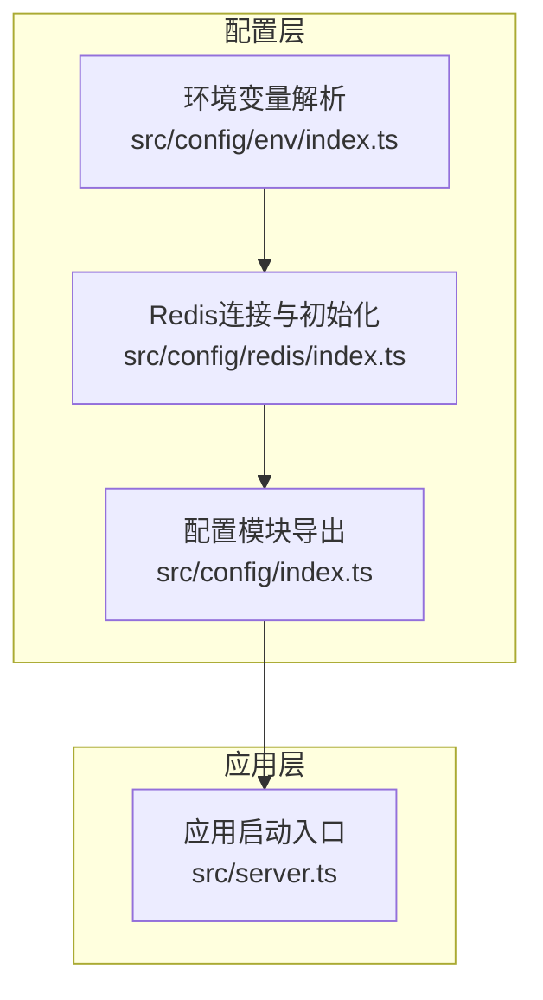
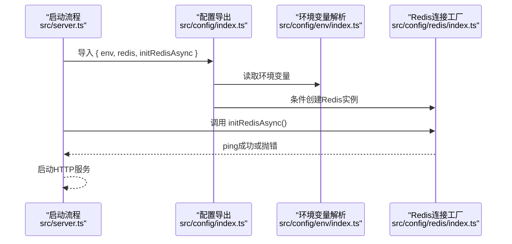
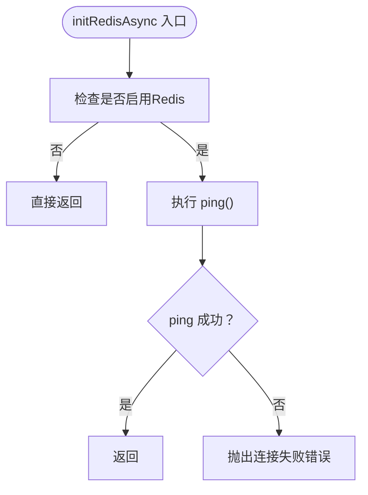
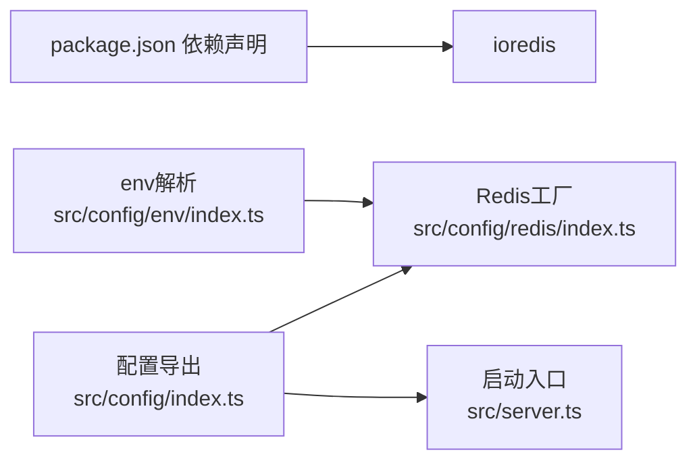

# Redis配置

<cite>
**本文引用的文件**
- [src/config/redis/index.ts](file://src/config/redis/index.ts)
- [src/config/env/index.ts](file://src/config/env/index.ts)
- [.env](file://.env)
- [src/config/index.ts](file://src/config/index.ts)
- [package.json](file://package.json)
- [src/server.ts](file://src/server.ts)
</cite>

## 目录
1. [简介](#简介)
2. [项目结构](#项目结构)
3. [核心组件](#核心组件)
4. [架构总览](#架构总览)
5. [详细组件分析](#详细组件分析)
6. [依赖关系分析](#依赖关系分析)
7. [性能考虑](#性能考虑)
8. [故障排查指南](#故障排查指南)
9. [结论](#结论)
10. [附录](#附录)

## 简介
本文件面向IM-API的Redis缓存配置系统，系统性阐述Redis连接配置、连接池管理、高级配置选项、多环境配置策略、性能调优与监控方法，并给出集群与哨兵模式的配置指引以及数据持久化与备份策略建议。当前代码实现基于ioredis客户端，提供基础连接、错误处理与连通性检测能力；同时通过环境变量实现灵活部署。

## 项目结构
Redis相关配置位于配置模块中，采用“按功能域分层”的组织方式：
- 环境变量解析与类型安全：src/config/env/index.ts
- Redis连接与初始化：src/config/redis/index.ts
- 配置模块统一出口：src/config/index.ts
- 启动入口：src/server.ts
- 依赖声明：package.json

图表来源
- [src/config/env/index.ts](file://src/config/env/index.ts#L166-L220)
- [src/config/redis/index.ts](file://src/config/redis/index.ts#L1-L40)
- [src/config/index.ts](file://src/config/index.ts#L1-L30)
- [src/server.ts](file://src/server.ts#L1-L74)

章节来源
- [src/config/env/index.ts](file://src/config/env/index.ts#L1-L223)
- [src/config/redis/index.ts](file://src/config/redis/index.ts#L1-L40)
- [src/config/index.ts](file://src/config/index.ts#L1-L30)
- [src/server.ts](file://src/server.ts#L1-L74)

## 核心组件
- 环境变量解析器：负责从进程环境变量加载并进行类型转换，定义了Redis相关的关键配置项。
- Redis连接工厂：根据环境变量创建ioredis实例，提供基础连接参数与事件监听。
- 初始化函数：提供异步连通性检测，用于启动阶段确保Redis可用。
- 配置模块导出：统一对外暴露env与redis实例及初始化函数。

章节来源
- [src/config/env/index.ts](file://src/config/env/index.ts#L155-L220)
- [src/config/redis/index.ts](file://src/config/redis/index.ts#L1-L40)
- [src/config/index.ts](file://src/config/index.ts#L29-L30)

## 架构总览
下图展示了Redis配置在系统中的位置与交互关系，以及启动阶段的初始化流程。

图表来源
- [src/server.ts](file://src/server.ts#L55-L67)
- [src/config/index.ts](file://src/config/index.ts#L29-L30)
- [src/config/env/index.ts](file://src/config/env/index.ts#L166-L220)
- [src/config/redis/index.ts](file://src/config/redis/index.ts#L31-L38)

## 详细组件分析

### 环境变量解析与Redis配置项
- 关键配置项
  - REDIS_ENABLED：布尔开关，控制是否启用Redis
  - REDIS_HOST：Redis主机地址
  - REDIS_PORT：Redis端口
  - REDIS_PASSWORD：Redis密码（可选）
  - REDIS_DB：数据库索引（默认0）

- 类型安全与默认值
  - 使用类型转换函数将字符串转为布尔、数字，未提供时使用默认值
  - 未显式提供时，默认值来自解析逻辑

- 与启动流程的关系
  - 配置模块导出env供其他模块使用
  - Redis连接工厂依据env决定是否创建实例

章节来源
- [src/config/env/index.ts](file://src/config/env/index.ts#L155-L220)
- [src/config/index.ts](file://src/config/index.ts#L7-L8)

### Redis连接工厂与初始化
- 连接参数
  - 主机、端口、密码、数据库索引
  - 连接超时、请求重试次数、离线队列行为等

- 事件监听
  - 连接事件：预留占位
  - 错误事件：输出错误日志

- 初始化函数
  - 通过ping命令进行连通性检测
  - 失败时抛出错误，便于启动阶段阻断

图表来源
- [src/config/redis/index.ts](file://src/config/redis/index.ts#L31-L38)

章节来源
- [src/config/redis/index.ts](file://src/config/redis/index.ts#L1-L40)

### 配置模块导出与应用集成
- 统一导出
  - env：类型安全的环境变量对象
  - redis：Redis实例或null
  - initRedisAsync：异步初始化函数

- 在启动流程中的使用
  - 通过导入统一出口，避免直接依赖具体文件路径
  - 启动阶段调用initRedisAsync确保Redis可用后再启动HTTP服务

章节来源
- [src/config/index.ts](file://src/config/index.ts#L29-L30)
- [src/server.ts](file://src/server.ts#L55-L67)

## 依赖关系分析
- 外部依赖
  - ioredis：Redis客户端库，提供连接、命令发送、事件处理等能力
- 内部依赖
  - env解析模块为Redis连接工厂提供配置输入
  - 配置模块导出层向上层提供统一接口

图表来源
- [package.json](file://package.json#L16-L16)
- [src/config/env/index.ts](file://src/config/env/index.ts#L166-L220)
- [src/config/redis/index.ts](file://src/config/redis/index.ts#L1-L40)
- [src/config/index.ts](file://src/config/index.ts#L29-L30)
- [src/server.ts](file://src/server.ts#L55-L67)

章节来源
- [package.json](file://package.json#L12-L23)
- [src/config/env/index.ts](file://src/config/env/index.ts#L166-L220)
- [src/config/redis/index.ts](file://src/config/redis/index.ts#L1-L40)
- [src/config/index.ts](file://src/config/index.ts#L29-L30)
- [src/server.ts](file://src/server.ts#L55-L67)

## 性能考虑
- 连接参数建议
  - 连接超时：当前固定为较短超时，适合快速失败场景；在高延迟网络可适当增大
  - 请求重试：当前每请求最多重试一次，平衡可靠性与延迟
  - 离线队列：当前禁用离线队列，适合在线业务；若需离线容错可开启并配合持久化
- 并发与连接池
  - ioredis内部维护连接池与命令队列；当前未显式配置池大小，建议结合业务QPS评估
- 命令优化
  - 批量操作（pipeline）可减少RTT
  - 合理设置过期时间，避免内存膨胀
- 监控与可观测性
  - 建议接入Redis自带INFO命令或第三方监控工具，关注连接数、内存、命中率、慢查询等指标

[本节为通用性能指导，不直接分析具体文件]

## 故障排查指南
- 启动阶段失败
  - 现象：启动时initRedisAsync抛出连接失败错误
  - 排查要点：确认REDIS_ENABLED、REDIS_HOST、REDIS_PORT、REDIS_PASSWORD、REDIS_DB是否正确
  - 参考实现：初始化函数通过ping检测连通性，失败即抛错
- 连接异常
  - 现象：Redis错误事件被触发
  - 排查要点：检查网络连通性、认证信息、防火墙、Redis服务状态
  - 参考实现：错误事件回调输出日志
- 环境变量缺失
  - 现象：类型转换函数抛出“必需变量未提供”错误
  - 排查要点：核对.env文件与环境变量命名，确保所有必需项存在

章节来源
- [src/config/redis/index.ts](file://src/config/redis/index.ts#L20-L23)
- [src/config/redis/index.ts](file://src/config/redis/index.ts#L31-L38)
- [src/config/env/index.ts](file://src/config/env/index.ts#L21-L27)

## 结论
当前Redis配置系统提供了简洁而实用的基础能力：通过环境变量实现灵活部署，使用ioredis完成连接与事件处理，并在启动阶段进行连通性检测。对于生产环境，建议进一步完善连接池参数、引入哨兵/集群支持、增强监控与告警，并制定数据持久化与备份策略。

[本节为总结性内容，不直接分析具体文件]

## 附录

### Redis基础配置项说明
- REDIS_ENABLED：布尔开关，控制是否启用Redis
- REDIS_HOST：Redis主机地址
- REDIS_PORT：Redis端口
- REDIS_PASSWORD：Redis密码（可选）
- REDIS_DB：数据库索引（默认0）

章节来源
- [src/config/env/index.ts](file://src/config/env/index.ts#L155-L220)

### 不同环境下的配置策略
- 开发环境
  - 本地单机Redis，可关闭密码或使用弱密码，便于调试
  - REDIS_ENABLED可设为true，REDIS_DB可设为0
- 测试环境
  - 使用独立Redis实例，启用密码与TLS（如可用），数据库隔离
- 生产环境
  - 建议使用哨兵或集群模式，启用密码与TLS，合理设置连接池与超时
  - 对关键数据开启持久化，制定备份计划

[本节为通用策略建议，不直接分析具体文件]

### Redis集群与哨兵模式配置指南
- 哨兵模式
  - 客户端通过哨兵发现主从节点，自动切换
  - 建议在ioredis中配置哨兵节点列表与主节点名称
- 集群模式
  - 客户端通过集群节点自动路由到对应槽位
  - 建议在ioredis中配置集群节点列表
- 注意事项
  - 选择合适的超时与重试策略
  - 监控节点健康状态与槽位分布
  - 避免跨槽批量操作导致的性能问题

[本节为通用配置建议，不直接分析具体文件]

### Redis数据持久化与备份策略
- 持久化
  - RDB快照：定期生成快照文件，适合灾难恢复
  - AOF追加：记录写命令，提供更高数据安全性
- 备份
  - 定期导出RDB或同步AOF文件
  - 跨机房复制或云存储归档
- 建议
  - 制定备份窗口与恢复演练计划
  - 监控磁盘空间与IO负载

[本节为通用策略建议，不直接分析具体文件]