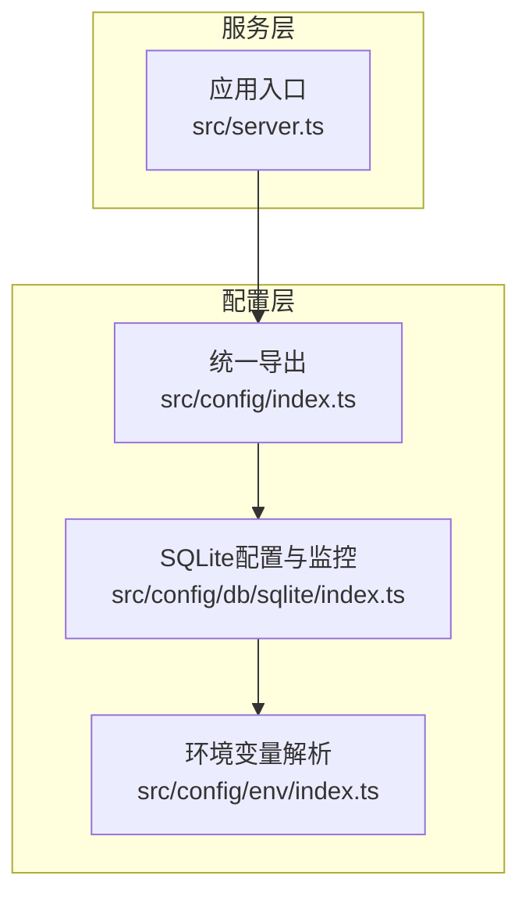
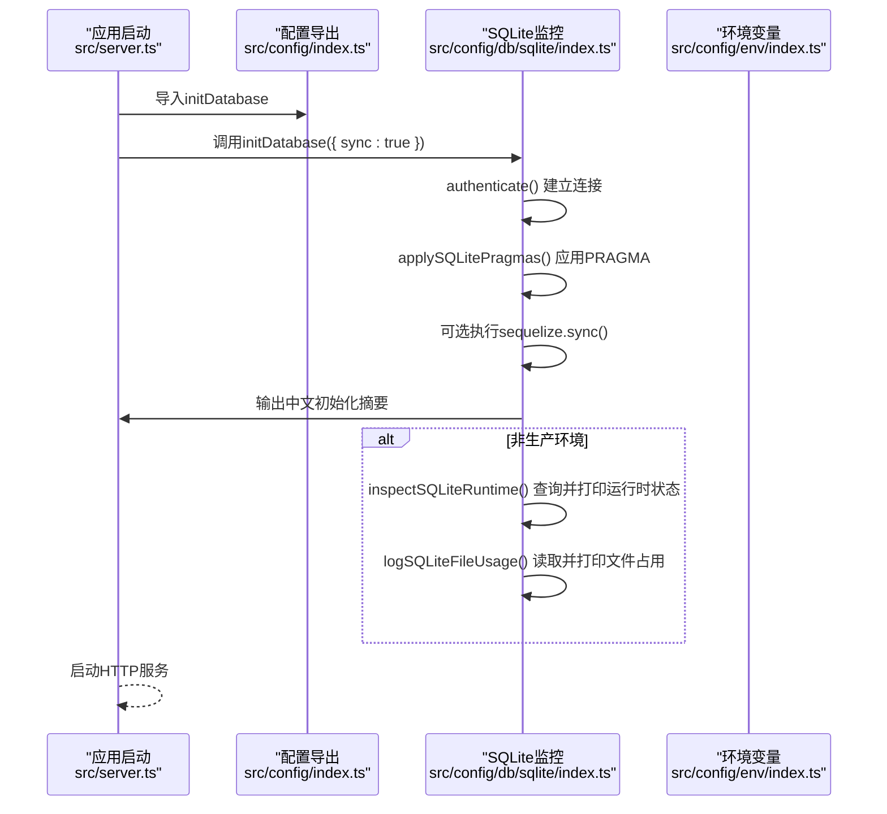
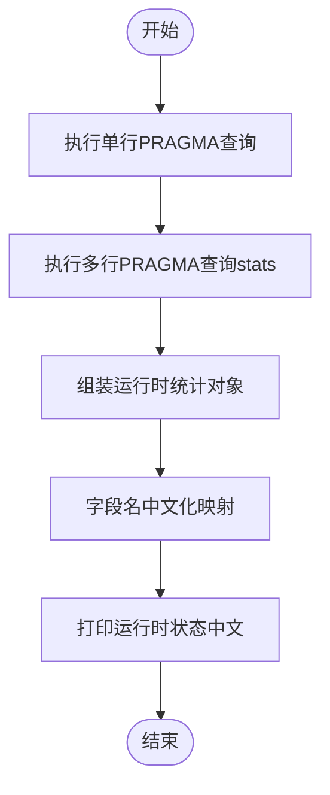
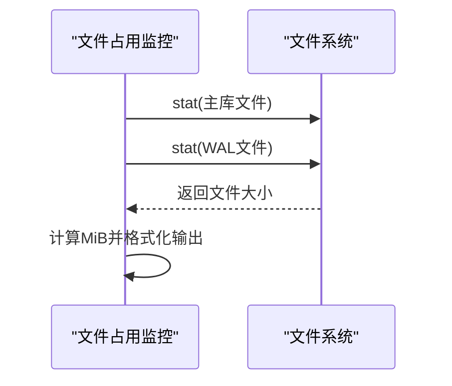
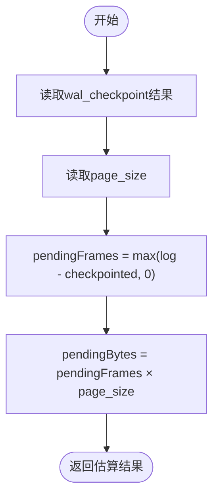
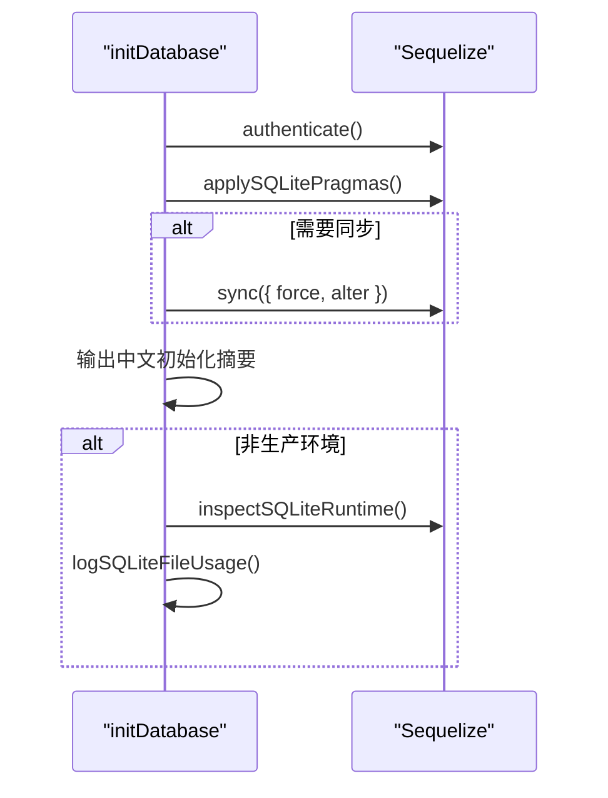
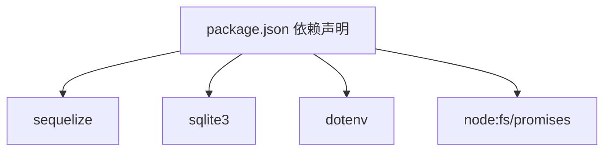

# SQLite性能监控

<cite>
**本文引用的文件**
- [src/config/db/sqlite/index.ts](file://src/config/db/sqlite/index.ts)
- [src/config/index.ts](file://src/config/index.ts)
- [src/server.ts](file://src/server.ts)
- [src/config/env/index.ts](file://src/config/env/index.ts)
- [package.json](file://package.json)
</cite>

## 目录
1. [简介](#简介)
2. [项目结构](#项目结构)
3. [核心组件](#核心组件)
4. [架构概览](#架构概览)
5. [详细组件分析](#详细组件分析)
6. [依赖关系分析](#依赖关系分析)
7. [性能考量](#性能考量)
8. [故障排查指南](#故障排查指南)
9. [结论](#结论)
10. [附录](#附录)

## 简介
本技术文档面向IM-API的SQLite性能监控系统，聚焦于运行时统计信息的查询与分析、WAL（写前日志）状态监控、文件占用监控以及PRAGMA统计信息的中文化显示与翻译机制。文档旨在帮助开发者理解并优化SQLite数据库在应用中的性能表现，涵盖缓存配置、页面大小、数据库页数、空闲页数量等关键指标，同时提供监控指标解读与优化建议。

## 项目结构
IM-API采用分层模块化组织，SQLite性能监控能力位于配置层，通过统一出口导出供服务启动阶段调用。核心文件如下：
- 配置层：SQLite性能监控与初始化逻辑
- 统一出口：集中导出数据库相关工具与类型
- 服务入口：应用启动时初始化数据库并输出运行时状态与文件占用

图表来源
- [src/server.ts](file://src/server.ts#L55-L67)
- [src/config/index.ts](file://src/config/index.ts#L12-L29)
- [src/config/db/sqlite/index.ts](file://src/config/db/sqlite/index.ts#L106-L128)
- [src/config/env/index.ts](file://src/config/env/index.ts#L166-L220)

章节来源
- [src/server.ts](file://src/server.ts#L1-L74)
- [src/config/index.ts](file://src/config/index.ts#L1-L30)
- [src/config/db/sqlite/index.ts](file://src/config/db/sqlite/index.ts#L1-L410)
- [src/config/env/index.ts](file://src/config/env/index.ts#L1-L223)

## 核心组件
- SQLite连接与池化配置：定义存储路径、连接池参数与重试策略。
- PRAGMA性能调优：设置WAL模式、同步级别、临时表存储位置、外键约束、缓存大小、内存映射、自动检查点、锁等待超时与WAL大小限制。
- 运行时统计查询：封装对cache_size、page_size、page_count、freelist_count、mmap_size、wal_checkpoint、busy_timeout、memory_used及stats的查询。
- 中文化日志：将PRAGMA字段名映射为中文，提升可读性。
- 文件占用监控：读取主数据库文件与WAL文件的物理大小并以MiB格式输出。
- WAL使用量估算：结合wal_checkpoint与page_size估算未checkpoint的数据量（页数与字节）。
- 初始化流程：建立连接、应用PRAGMA、可选schema同步、输出中文初始化摘要，并在非生产环境打印运行时状态与文件占用。

章节来源
- [src/config/db/sqlite/index.ts](file://src/config/db/sqlite/index.ts#L106-L128)
- [src/config/db/sqlite/index.ts](file://src/config/db/sqlite/index.ts#L136-L154)
- [src/config/db/sqlite/index.ts](file://src/config/db/sqlite/index.ts#L162-L207)
- [src/config/db/sqlite/index.ts](file://src/config/db/sqlite/index.ts#L215-L257)
- [src/config/db/sqlite/index.ts](file://src/config/db/sqlite/index.ts#L292-L330)
- [src/config/db/sqlite/index.ts](file://src/config/db/sqlite/index.ts#L338-L360)
- [src/config/db/sqlite/index.ts](file://src/config/db/sqlite/index.ts#L368-L409)

## 架构概览
SQLite性能监控系统在应用启动阶段完成初始化，随后在开发/测试环境中输出运行时状态与文件占用，帮助开发者快速定位性能问题。

图表来源
- [src/server.ts](file://src/server.ts#L55-L67)
- [src/config/index.ts](file://src/config/index.ts#L12-L29)
- [src/config/db/sqlite/index.ts](file://src/config/db/sqlite/index.ts#L368-L409)

## 详细组件分析

### SQLite连接与池化配置
- 存储路径：单文件数据库，默认路径在配置快照中定义，便于日志输出与文件占用统计。
- 连接池：最大连接数、最小连接数、空闲回收时间、获取连接最大等待时间等参数，确保并发场景下的稳定性。
- 重试策略：最大重试次数，降低瞬时异常对业务的影响。

章节来源
- [src/config/db/sqlite/index.ts](file://src/config/db/sqlite/index.ts#L106-L128)

### PRAGMA性能调优
- journal_mode=WAL：支持高并发读取与更好的崩溃恢复。
- synchronous=NORMAL：在安全与性能间取得平衡，减少fsync次数。
- temp_store=MEMORY：临时表走内存，降低磁盘I/O。
- foreign_keys=ON：启用外键约束，保障数据一致性。
- cache_size=-64000：约64MB页缓存（负数表示KB单位），提升读取性能。
- mmap_size=134217728：128MB内存映射，提高文件读取效率。
- wal_autocheckpoint=1000：每1000页自动checkpoint，控制WAL文件大小。
- busy_timeout=4000：锁冲突时最多等待4秒，避免长时间阻塞。
- journal_size_limit=67108864：WAL文件上限约64MB，防止无限膨胀。

章节来源
- [src/config/db/sqlite/index.ts](file://src/config/db/sqlite/index.ts#L136-L154)

### 运行时统计查询与中文化
- 统计项覆盖：缓存页配置、页面大小、数据库页数、空闲页数量、内存映射上限、WAL检查点状态、锁等待超时、内部内存占用、详细运行统计（PRAGMA stats）。
- 中文化映射：将英文字段名映射为中文，便于日志阅读与问题定位。
- 异常处理：当PRAGMA stats不可用时，返回空数组，保证流程稳定。

图表来源
- [src/config/db/sqlite/index.ts](file://src/config/db/sqlite/index.ts#L162-L207)
- [src/config/db/sqlite/index.ts](file://src/config/db/sqlite/index.ts#L215-L257)

章节来源
- [src/config/db/sqlite/index.ts](file://src/config/db/sqlite/index.ts#L162-L207)
- [src/config/db/sqlite/index.ts](file://src/config/db/sqlite/index.ts#L215-L257)

### 文件占用监控
- 主库文件：读取数据库文件实际大小（字节）。
- WAL文件：若存在则读取其实际大小（字节），否则为0。
- 输出格式：同时以字节与MiB形式输出，便于直观判断增长趋势。

图表来源
- [src/config/db/sqlite/index.ts](file://src/config/db/sqlite/index.ts#L292-L330)

章节来源
- [src/config/db/sqlite/index.ts](file://src/config/db/sqlite/index.ts#L292-L330)

### WAL使用量估算
- 估算依据：从wal_checkpoint结果中提取log与checkpointed（或其别名），计算未checkpoint页数与字节数。
- 字节估算：未checkpoint页数 × 页面大小。
- 容错处理：当字段缺失时以0替代，保证计算稳定。

图表来源
- [src/config/db/sqlite/index.ts](file://src/config/db/sqlite/index.ts#L338-L360)

章节来源
- [src/config/db/sqlite/index.ts](file://src/config/db/sqlite/index.ts#L338-L360)

### 初始化流程
- 建立连接：验证数据库可达性。
- 应用PRAGMA：按顺序执行性能调优语句，确保参数生效。
- 可选schema同步：开发/测试环境可选择同步模型，生产环境建议使用迁移。
- 输出摘要：打印中文初始化摘要，包含关键参数。
- 开发环境输出：打印运行时状态与文件占用，辅助诊断。

图表来源
- [src/config/db/sqlite/index.ts](file://src/config/db/sqlite/index.ts#L368-L409)

章节来源
- [src/config/db/sqlite/index.ts](file://src/config/db/sqlite/index.ts#L368-L409)

## 依赖关系分析
- 依赖库：Sequelize用于ORM与数据库交互；node:fs/promises用于文件系统操作；dotenv用于环境变量加载。
- 关键依赖：sqlite3（SQLite驱动）、sequelize（ORM框架）。
- 环境变量：通过dotenv加载，统一类型转换与校验，确保配置安全可靠。

图表来源
- [package.json](file://package.json#L12-L22)

章节来源
- [package.json](file://package.json#L1-L36)
- [src/config/env/index.ts](file://src/config/env/index.ts#L10-L13)

## 性能考量
- 缓存配置：cache_size设置为约64MB，适合中小规模数据与并发读取场景；可根据内存与工作集调整。
- 页面大小：page_size影响I/O块大小与碎片率，需结合业务数据特征评估。
- 数据库页数与空闲页：page_count反映数据库体量，freelist_count过高可能意味着碎片较多，建议定期维护。
- 内存映射：mmap_size设为128MB，提升大文件读取性能；注意系统内存压力。
- WAL检查点：wal_autocheckpoint=1000，journal_size_limit=64MB，平衡WAL增长与checkpoint开销。
- 锁等待：busy_timeout=4000，避免长事务导致的全局阻塞；建议优化事务粒度与索引设计。
- PRAGMA stats：在支持的环境中提供更细粒度的统计，辅助性能分析与瓶颈定位。

## 故障排查指南
- 连接失败：检查数据库文件路径与权限，确认Sequelize连接参数正确。
- PRAGMA stats不可用：在某些SQLite版本或构建中可能不支持stats，代码已容错处理为空数组。
- WAL过大：关注journal_size_limit与wal_autocheckpoint设置，必要时手动checkpoint或调整阈值。
- 锁冲突频繁：检查busy_timeout是否过短，优化事务时长与索引，减少长事务与热点更新。
- 文件占用异常：对比主库与WAL文件大小变化趋势，结合业务高峰时段分析。

章节来源
- [src/config/db/sqlite/index.ts](file://src/config/db/sqlite/index.ts#L190-L194)
- [src/config/db/sqlite/index.ts](file://src/config/db/sqlite/index.ts#L319-L330)

## 结论
该SQLite性能监控系统通过PRAGMA调优与运行时统计查询，结合文件占用监控与WAL使用量估算，提供了全面的SQLite性能观测能力。中文化日志提升了可观测性，初始化流程在开发环境自动输出关键指标，有助于快速定位与优化性能问题。建议在生产环境中谨慎使用自动同步，并根据业务负载调整缓存、WAL与锁等待参数。

## 附录
- 监控指标解读要点
  - 缓存页配置：过小会导致频繁I/O，过大可能挤占系统内存。
  - 页面大小：与索引与行大小匹配，避免过度碎片。
  - 数据库页数与空闲页：空闲页过多提示碎片，建议定期VACUUM或重建索引。
  - 内存映射：提升读取性能但占用系统内存，需权衡。
  - WAL检查点：频繁checkpoint影响写入吞吐，过大WAL增加恢复时间。
  - 锁等待：过长的等待时间通常由长事务或索引不足引起。
  - PRAGMA stats：在支持的环境中作为深度诊断工具使用。