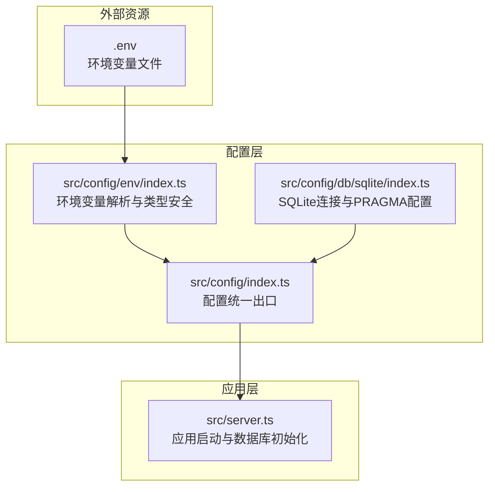
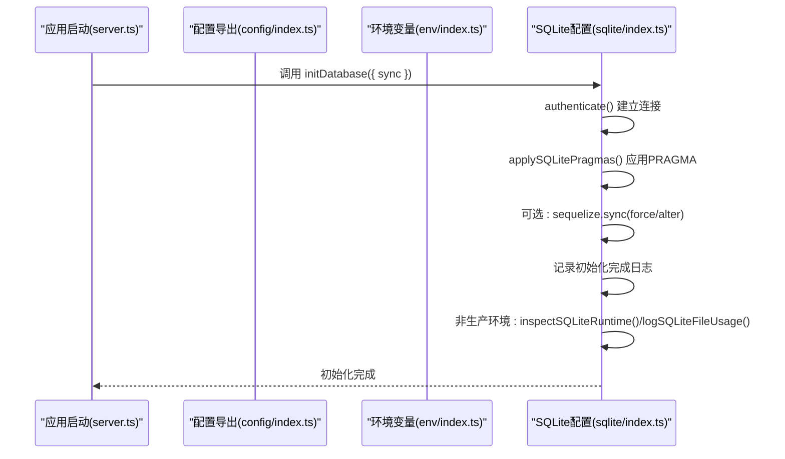
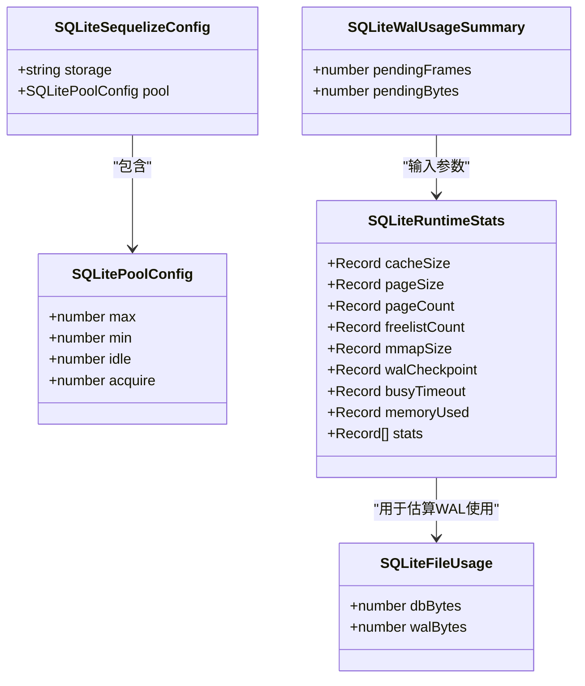
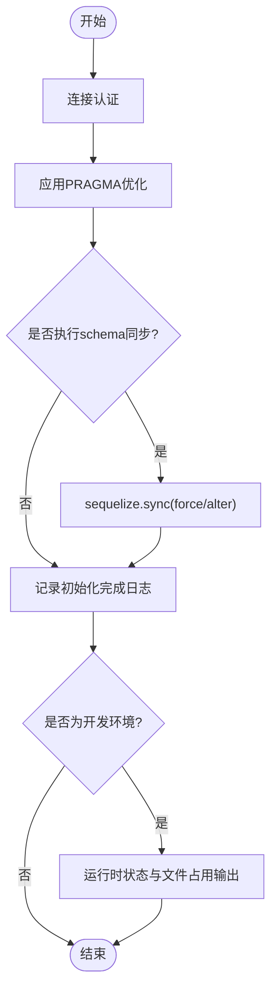
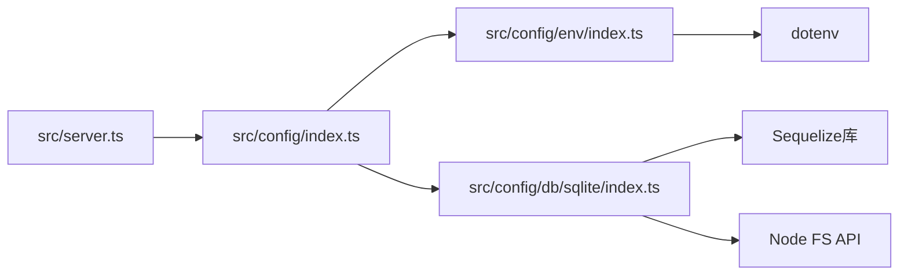

# SQLite配置

<cite>
**本文引用的文件**
- [src/config/db/sqlite/index.ts](file://src/config/db/sqlite/index.ts)
- [src/config/env/index.ts](file://src/config/env/index.ts)
- [src/config/index.ts](file://src/config/index.ts)
- [src/server.ts](file://src/server.ts)
- [.env](file://.env)
</cite>

## 目录
1. [简介](#简介)
2. [项目结构](#项目结构)
3. [核心组件](#核心组件)
4. [架构概览](#架构概览)
5. [详细组件分析](#详细组件分析)
6. [依赖关系分析](#依赖关系分析)
7. [性能考量](#性能考量)
8. [故障排查指南](#故障排查指南)
9. [结论](#结论)
10. [附录](#附录)

## 简介
本文件面向IM-API项目的SQLite数据库配置，系统性阐述：
- SQLite连接配置：storage文件路径设置与连接池参数
- 性能优化PRAGMA设置：WAL模式、缓存大小、内存映射、自动检查点等
- 连接池配置选项：最大连接数、最小连接数、空闲超时、获取超时
- 数据库初始化流程：连接认证、PRAGMA应用、schema同步
- 运行时监控：缓存统计、WAL状态、文件占用查询与分析
- 开发与生产环境不同配置策略

## 项目结构
IM-API采用分层与模块化的配置组织方式，SQLite相关配置集中在配置模块内，通过统一出口导出供服务器入口使用。

图表来源
- [src/config/env/index.ts](file://src/config/env/index.ts#L166-L220)
- [src/config/db/sqlite/index.ts](file://src/config/db/sqlite/index.ts#L106-L128)
- [src/config/index.ts](file://src/config/index.ts#L7-L29)
- [src/server.ts](file://src/server.ts#L55-L67)
- [.env](file://.env#L1-L22)

章节来源
- [src/config/env/index.ts](file://src/config/env/index.ts#L166-L220)
- [src/config/db/sqlite/index.ts](file://src/config/db/sqlite/index.ts#L106-L128)
- [src/config/index.ts](file://src/config/index.ts#L7-L29)
- [src/server.ts](file://src/server.ts#L55-L67)
- [.env](file://.env#L1-L22)

## 核心组件
- SQLite连接与PRAGMA配置：集中于SQLite配置模块，提供连接池配置快照、全局Sequelize实例、PRAGMA性能优化、运行时状态查询与文件占用统计。
- 环境变量解析：提供类型安全的环境变量读取与默认值处理，支持数据库连接池、SSL、会话参数等。
- 配置统一出口：将环境变量与SQLite配置聚合导出，供应用启动使用。
- 应用启动：在启动阶段调用数据库初始化函数，建立连接、应用PRAGMA、可选同步schema，并在非生产环境输出运行时状态与文件占用。

章节来源
- [src/config/db/sqlite/index.ts](file://src/config/db/sqlite/index.ts#L106-L128)
- [src/config/env/index.ts](file://src/config/env/index.ts#L166-L220)
- [src/config/index.ts](file://src/config/index.ts#L7-L29)
- [src/server.ts](file://src/server.ts#L55-L67)

## 架构概览
下图展示从应用启动到数据库初始化的关键交互流程，以及SQLite配置模块内部的职责划分。

图表来源
- [src/server.ts](file://src/server.ts#L55-L67)
- [src/config/index.ts](file://src/config/index.ts#L12-L19)
- [src/config/db/sqlite/index.ts](file://src/config/db/sqlite/index.ts#L368-L409)

## 详细组件分析

### SQLite连接与PRAGMA配置
- 连接配置快照：保存storage路径与pool配置，便于日志与运行时输出使用，避免直接访问Sequelize内部配置。
- 全局Sequelize实例：指定dialect为sqlite，storage指向配置快照中的路径，关闭SQL日志，配置连接池与重试策略。
- PRAGMA性能优化：顺序执行一组PRAGMA语句，覆盖WAL模式、同步级别、临时存储、外键、缓存大小、内存映射、自动检查点、锁等待超时与WAL大小限制。
- 运行时状态查询：封装PRAGMA查询，返回缓存、页面、空闲页、内存映射、WAL检查点、锁等待、内存使用及可选的详细统计。
- 中文化日志：将PRAGMA字段名映射为中文，提升日志可读性。
- 文件占用统计：读取主库与WAL文件的物理大小，提供字节与MiB格式化输出。
- WAL使用估算：基于wal_checkpoint与page_size估算未checkpoint的页数与字节数。

图表来源
- [src/config/db/sqlite/index.ts](file://src/config/db/sqlite/index.ts#L45-L100)

章节来源
- [src/config/db/sqlite/index.ts](file://src/config/db/sqlite/index.ts#L106-L128)
- [src/config/db/sqlite/index.ts](file://src/config/db/sqlite/index.ts#L136-L154)
- [src/config/db/sqlite/index.ts](file://src/config/db/sqlite/index.ts#L162-L207)
- [src/config/db/sqlite/index.ts](file://src/config/db/sqlite/index.ts#L215-L257)
- [src/config/db/sqlite/index.ts](file://src/config/db/sqlite/index.ts#L292-L330)
- [src/config/db/sqlite/index.ts](file://src/config/db/sqlite/index.ts#L338-L360)

### 连接池配置选项
- 最大连接数(max)：默认5，适用于单文件SQLite的并发读写场景。
- 最小连接数(min)：默认1，保持基础连接以降低频繁创建成本。
- 空闲超时(idle)：默认10000ms，超过该时间的空闲连接将被回收。
- 获取超时(acquire)：默认30000ms，获取连接的最大等待时间。
- 重试策略(retry)：最大重试次数为3，配合acquire超时共同保障稳定性。

章节来源
- [src/config/db/sqlite/index.ts](file://src/config/db/sqlite/index.ts#L106-L128)

### 数据库初始化流程
- 连接认证：通过authenticate()确保数据库可达。
- 应用PRAGMA：applySQLitePragmas()顺序执行性能优化PRAGMA。
- 可选schema同步：根据传入的sync/force/alter参数决定是否执行sequelize.sync。
- 初始化日志：输出中文描述的初始化摘要，包含WAL、同步、缓存、内存映射、自动检查点、锁等待、WAL上限与连接池最大连接数。
- 开发环境输出：非production环境下输出运行时状态与文件占用。

图表来源
- [src/config/db/sqlite/index.ts](file://src/config/db/sqlite/index.ts#L368-L409)

章节来源
- [src/config/db/sqlite/index.ts](file://src/config/db/sqlite/index.ts#L368-L409)

### 运行时监控与分析
- 缓存统计：查询cache_size、page_size、page_count、freelist_count，结合mmap_size评估缓存与内存映射效果。
- WAL状态：查询wal_checkpoint(PASSIVE)，计算pending帧数与字节数，评估WAL膨胀风险。
- 锁等待：查询busy_timeout，判断锁冲突与等待策略是否合理。
- 内存使用：查询memory_used，辅助诊断内存压力。
- 详细统计：PRAGMA stats（若可用），提供更细粒度的运行统计。
- 文件占用：统计主库与WAL文件大小，单位换算为MiB，便于容量规划。

章节来源
- [src/config/db/sqlite/index.ts](file://src/config/db/sqlite/index.ts#L162-L207)
- [src/config/db/sqlite/index.ts](file://src/config/db/sqlite/index.ts#L292-L330)
- [src/config/db/sqlite/index.ts](file://src/config/db/sqlite/index.ts#L338-L360)

## 依赖关系分析
- 服务器入口依赖配置统一出口，间接依赖环境变量解析与SQLite配置。
- SQLite配置模块依赖Sequelize进行连接与PRAGMA操作，依赖Node FS API进行文件占用统计。
- 环境变量解析模块负责DB_*相关配置的类型安全转换与默认值处理。

图表来源
- [src/server.ts](file://src/server.ts#L15-L20)
- [src/config/index.ts](file://src/config/index.ts#L7-L29)
- [src/config/env/index.ts](file://src/config/env/index.ts#L10-L13)
- [src/config/db/sqlite/index.ts](file://src/config/db/sqlite/index.ts#L13-L14)

章节来源
- [src/server.ts](file://src/server.ts#L15-L20)
- [src/config/index.ts](file://src/config/index.ts#L7-L29)
- [src/config/env/index.ts](file://src/config/env/index.ts#L10-L13)
- [src/config/db/sqlite/index.ts](file://src/config/db/sqlite/index.ts#L13-L14)

## 性能考量
- WAL模式：提升并发读性能与崩溃恢复能力，适合高并发读写场景。
- 缓存大小：设置为约64MB（KB单位），平衡内存占用与I/O性能。
- 内存映射：启用128MB内存映射，显著提升大文件读取性能。
- 自动检查点：每1000页触发一次检查点，控制WAL文件大小，避免无限增长。
- 锁等待：设置4000ms等待时间，兼顾吞吐与响应时间。
- WAL大小限制：限制WAL文件约为64MB，防止WAL无限膨胀。
- 连接池：适度的连接池大小与回收策略，避免过多连接导致资源竞争。

章节来源
- [src/config/db/sqlite/index.ts](file://src/config/db/sqlite/index.ts#L136-L154)
- [src/config/db/sqlite/index.ts](file://src/config/db/sqlite/index.ts#L106-L128)

## 故障排查指南
- 初始化失败：捕获错误并退出进程，检查数据库文件权限、路径正确性与PRAGMA兼容性。
- 连接池问题：调整max/min/idle/acquire参数，观察锁等待与超时日志；必要时降低并发或增加超时。
- WAL膨胀：通过WAL使用估算与文件占用统计监控WAL增长趋势，适当减小wal_autocheckpoint或journal_size_limit。
- 缓存命中率低：结合PRAGMA stats与缓存统计，评估cache_size与mmap_size设置是否合理。
- 开发环境调试：利用中文化运行时状态输出与文件占用日志，快速定位配置问题。

章节来源
- [src/config/db/sqlite/index.ts](file://src/config/db/sqlite/index.ts#L405-L408)
- [src/config/db/sqlite/index.ts](file://src/config/db/sqlite/index.ts#L338-L360)
- [src/config/db/sqlite/index.ts](file://src/config/db/sqlite/index.ts#L292-L330)

## 结论
IM-API的SQLite配置通过明确的连接配置快照、严格的PRAGMA性能优化、完善的运行时监控与文件占用统计，实现了在单文件SQLite上的高性能与可观测性。结合环境变量解析与统一配置出口，使得开发与生产环境的配置切换与调优更加便捷可控。

## 附录

### 开发环境与生产环境配置策略
- 开发环境
  - 初始化：开启schema同步，便于快速迭代。
  - 监控：输出运行时状态与文件占用，便于性能调优。
  - 连接池：适中大小，便于并发测试。
- 生产环境
  - 初始化：谨慎使用schema同步，优先采用迁移脚本管理结构变更。
  - 监控：关闭开发环境输出，关注日志与指标。
  - 连接池：根据实际负载调整max/min/idle/acquire，确保稳定与高效。

章节来源
- [src/config/db/sqlite/index.ts](file://src/config/db/sqlite/index.ts#L377-L383)
- [src/config/db/sqlite/index.ts](file://src/config/db/sqlite/index.ts#L401-L404)

### 环境变量与默认值
- DB_DIALECT：数据库方言，默认sqlite。
- DB_STORAGE：SQLite文件路径，默认./data/dev.sqlite。
- DB_POOL_MAX/MIN/IDLE/ACQUIRE：连接池参数，默认分别为5、0、10000、60000。
- DB_FORCE_SYNC：是否强制同步模型，默认false。

章节来源
- [src/config/env/index.ts](file://src/config/env/index.ts#L170-L186)
- [src/config/env/index.ts](file://src/config/env/index.ts#L200-L200)
- [.env](file://.env#L8-L9)