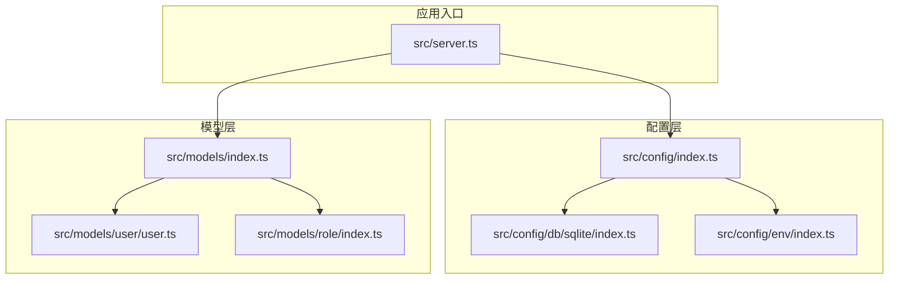
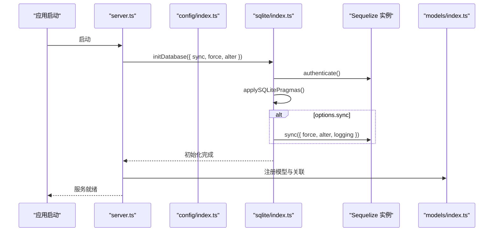
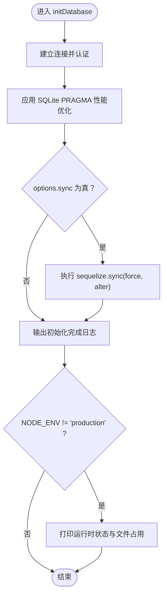
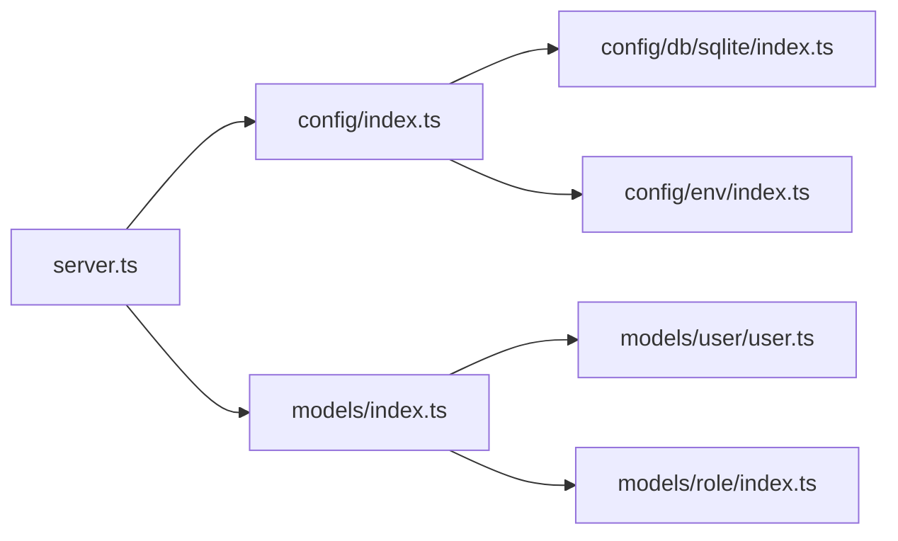

# 数据库初始化

<cite>
**本文引用的文件列表**
- [src/config/db/sqlite/index.ts](file://src/config/db/sqlite/index.ts)
- [src/config/index.ts](file://src/config/index.ts)
- [src/models/index.ts](file://src/models/index.ts)
- [src/server.ts](file://src/server.ts)
- [src/config/env/index.ts](file://src/config/env/index.ts)
- [src/models/user/user.ts](file://src/models/user/user.ts)
- [src/models/role/index.ts](file://src/models/role/index.ts)
- [package.json](file://package.json)
</cite>

## 目录
1. [简介](#简介)
2. [项目结构](#项目结构)
3. [核心组件](#核心组件)
4. [架构总览](#架构总览)
5. [详细组件分析](#详细组件分析)
6. [依赖关系分析](#依赖关系分析)
7. [性能考量](#性能考量)
8. [故障排除指南](#故障排除指南)
9. [结论](#结论)
10. [附录](#附录)

## 简介
本文件面向 IM-API 的数据库初始化系统，聚焦于 SQLite + Sequelize 的初始化流程与性能优化配置。内容涵盖：
- 连接建立与认证验证
- SQLite PRAGMA 性能优化配置应用
- initDatabase 函数工作原理（参数、错误处理、日志输出）
- schema 同步选项（sync、force、alter）的使用场景与风险
- 开发与生产环境的差异化初始化策略（运行时状态检查、文件占用监控）
- 最佳实践与故障排除建议

## 项目结构
IM-API 使用模块化的配置与模型组织方式，数据库初始化位于配置层，模型定义集中在 models 层，应用入口在 server 层。

图表来源
- [src/config/index.ts](file://src/config/index.ts#L1-L30)
- [src/config/db/sqlite/index.ts](file://src/config/db/sqlite/index.ts#L1-L410)
- [src/config/env/index.ts](file://src/config/env/index.ts#L1-L223)
- [src/models/index.ts](file://src/models/index.ts#L1-L143)
- [src/models/user/user.ts](file://src/models/user/user.ts#L1-L275)
- [src/models/role/index.ts](file://src/models/role/index.ts#L1-L77)
- [src/server.ts](file://src/server.ts#L1-L74)

章节来源
- [src/config/index.ts](file://src/config/index.ts#L1-L30)
- [src/config/db/sqlite/index.ts](file://src/config/db/sqlite/index.ts#L1-L410)
- [src/config/env/index.ts](file://src/config/env/index.ts#L1-L223)
- [src/models/index.ts](file://src/models/index.ts#L1-L143)
- [src/server.ts](file://src/server.ts#L1-L74)

## 核心组件
- 数据库配置与初始化
  - SQLite 连接与池配置
  - PRAGMA 性能优化
  - 运行时状态与文件占用检查
  - initDatabase 函数
- 模型注册与同步
  - 模型集中初始化与关联定义
  - 同步辅助方法
- 应用入口
  - 服务器启动时的数据库初始化调用

章节来源
- [src/config/db/sqlite/index.ts](file://src/config/db/sqlite/index.ts#L106-L128)
- [src/config/db/sqlite/index.ts](file://src/config/db/sqlite/index.ts#L136-L154)
- [src/config/db/sqlite/index.ts](file://src/config/db/sqlite/index.ts#L162-L207)
- [src/config/db/sqlite/index.ts](file://src/config/db/sqlite/index.ts#L265-L285)
- [src/config/db/sqlite/index.ts](file://src/config/db/sqlite/index.ts#L292-L330)
- [src/config/db/sqlite/index.ts](file://src/config/db/sqlite/index.ts#L368-L409)
- [src/models/index.ts](file://src/models/index.ts#L42-L57)
- [src/models/index.ts](file://src/models/index.ts#L140-L142)
- [src/server.ts](file://src/server.ts#L55-L67)

## 架构总览
数据库初始化的整体流程如下：
- 应用启动时调用 initDatabase，传入 sync/force/alter 等选项
- 建立数据库连接并进行认证
- 应用 SQLite PRAGMA 性能优化
- 可选执行模型同步（sync/force/alter）
- 输出初始化完成日志
- 开发环境打印运行时状态与文件占用

图表来源
- [src/server.ts](file://src/server.ts#L55-L67)
- [src/config/index.ts](file://src/config/index.ts#L12-L19)
- [src/config/db/sqlite/index.ts](file://src/config/db/sqlite/index.ts#L368-L409)
- [src/models/index.ts](file://src/models/index.ts#L42-L57)

## 详细组件分析

### initDatabase 函数详解
- 功能概述
  - 建立数据库连接并进行认证
  - 应用 SQLite PRAGMA 性能优化
  - 可选执行模型同步（sync/force/alter）
  - 输出初始化完成日志
  - 开发环境打印运行时状态与文件占用
- 参数配置
  - sync: 是否执行 schema 同步
  - force: 是否强制重建表（危险操作，仅开发/测试使用）
  - alter: 是否尝试非破坏性变更表结构
- 错误处理
  - 捕获异常并记录错误日志
  - 进程退出码 1，确保启动失败被感知
- 日志输出
  - 中文描述的初始化完成日志
  - 开发环境额外输出运行时状态与文件占用

图表来源
- [src/config/db/sqlite/index.ts](file://src/config/db/sqlite/index.ts#L368-L409)

章节来源
- [src/config/db/sqlite/index.ts](file://src/config/db/sqlite/index.ts#L17-L27)
- [src/config/db/sqlite/index.ts](file://src/config/db/sqlite/index.ts#L368-L409)

### SQLite PRAGMA 性能优化
- 关键 PRAGMA 作用
  - WAL 日志模式：支持高并发读与较好的崩溃恢复
  - synchronous NORMAL：在安全性与性能间平衡
  - temp_store MEMORY：临时表走内存，减少磁盘 I/O
  - foreign_keys ON：启用外键约束
  - cache_size：约 64MB 页面缓存
  - mmap_size：128MB 内存映射，提升文件读取性能
  - wal_autocheckpoint：每 1000 页自动 checkpoint，控制 WAL 大小
  - busy_timeout：锁冲突时最多等待 4 秒
  - journal_size_limit：WAL 文件限制约 64MB，避免无限膨胀
- 执行顺序
  - 顺序执行，保证模式与参数按设定顺序生效

章节来源
- [src/config/db/sqlite/index.ts](file://src/config/db/sqlite/index.ts#L136-L154)

### 运行时状态与文件占用检查
- 运行时状态
  - 通过 PRAGMA 查询缓存、页面、WAL、内存等指标
  - 字段名中文化，便于日志阅读
- 文件占用
  - 读取主库文件与 WAL 文件实际大小（字节）
  - 输出主库与 WAL 的大小（MiB）

章节来源
- [src/config/db/sqlite/index.ts](file://src/config/db/sqlite/index.ts#L162-L207)
- [src/config/db/sqlite/index.ts](file://src/config/db/sqlite/index.ts#L265-L285)
- [src/config/db/sqlite/index.ts](file://src/config/db/sqlite/index.ts#L292-L330)

### 模型注册与同步
- 模型集中初始化
  - 先初始化所有模型，再定义关联关系
  - 提供 modelRegistry 以支持通用 CRUD、动态路由、权限配置
- 同步辅助方法
  - syncModels：封装 sequelize.sync，支持 schema patch 生命周期

章节来源
- [src/models/index.ts](file://src/models/index.ts#L42-L57)
- [src/models/index.ts](file://src/models/index.ts#L140-L142)

### 应用入口与初始化调用
- server.ts 在启动时调用 initDatabase({ sync: true })
- 同时加载模型注册与关联，确保数据库结构与应用逻辑一致

章节来源
- [src/server.ts](file://src/server.ts#L55-L67)
- [src/models/index.ts](file://src/models/index.ts#L42-L57)

## 依赖关系分析
- 配置层
  - config/index.ts 统一导出 env、sequelizeConfig、sequelize、initDatabase 等
  - config/db/sqlite/index.ts 提供 SQLite 初始化与工具函数
  - config/env/index.ts 提供类型安全的环境变量解析
- 模型层
  - models/index.ts 负责模型初始化与关联定义
  - models/user/user.ts、models/role/index.ts 定义具体模型
- 应用入口
  - server.ts 在启动时调用 initDatabase 并加载模型

图表来源
- [src/server.ts](file://src/server.ts#L15-L20)
- [src/config/index.ts](file://src/config/index.ts#L12-L29)
- [src/config/db/sqlite/index.ts](file://src/config/db/sqlite/index.ts#L1-L410)
- [src/config/env/index.ts](file://src/config/env/index.ts#L166-L220)
- [src/models/index.ts](file://src/models/index.ts#L26-L57)
- [src/models/user/user.ts](file://src/models/user/user.ts#L109-L266)
- [src/models/role/index.ts](file://src/models/role/index.ts#L41-L76)

章节来源
- [src/server.ts](file://src/server.ts#L15-L20)
- [src/config/index.ts](file://src/config/index.ts#L12-L29)
- [src/models/index.ts](file://src/models/index.ts#L26-L57)

## 性能考量
- SQLite WAL 模式
  - 适合高并发读取与较好的崩溃恢复能力
  - 需配合合适的 busy_timeout 与 wal_autocheckpoint
- 内存映射与缓存
  - mmap_size 与 cache_size 提升读写性能
  - 注意内存占用与磁盘空间的平衡
- 连接池
  - 通过 sequelizeConfig.pool 控制最大连接数、最小连接数、空闲回收与获取等待时间
- 同步策略
  - 开发环境可使用 sync/force/alter 快速迭代
  - 生产环境建议使用迁移而非 sync，避免破坏性操作

章节来源
- [src/config/db/sqlite/index.ts](file://src/config/db/sqlite/index.ts#L106-L128)
- [src/config/db/sqlite/index.ts](file://src/config/db/sqlite/index.ts#L136-L154)
- [src/config/db/sqlite/index.ts](file://src/config/db/sqlite/index.ts#L377-L383)
- [src/config/env/index.ts](file://src/config/env/index.ts#L182-L186)

## 故障排除指南
- 连接失败
  - 检查数据库文件路径与权限
  - 确认 NODE_ENV 与 DB_STORAGE 环境变量设置
- 同步失败
  - 开发环境：确认 sync/force/alter 选项组合
  - 生产环境：优先使用迁移，避免 force/alter 带来的破坏性影响
- 性能问题
  - 检查 PRAGMA 设置是否生效
  - 监控 WAL 文件大小与 pending bytes，必要时调整 wal_autocheckpoint
- 运行时状态异常
  - 开发环境可查看中文化日志，定位缓存、页面、WAL、内存等指标
  - 关注 busy_timeout 是否过短导致频繁超时

章节来源
- [src/config/db/sqlite/index.ts](file://src/config/db/sqlite/index.ts#L368-L409)
- [src/config/db/sqlite/index.ts](file://src/config/db/sqlite/index.ts#L265-L285)
- [src/config/db/sqlite/index.ts](file://src/config/db/sqlite/index.ts#L338-L360)
- [src/config/env/index.ts](file://src/config/env/index.ts#L170-L171)

## 结论
IM-API 的数据库初始化系统围绕 SQLite + Sequelize 构建，通过 PRAGMA 性能优化、运行时状态检查与文件占用监控，提供了开发与生产双环境的差异化策略。initDatabase 函数将连接、认证、优化、同步与日志整合为统一入口，配合模型层的集中初始化与关联定义，确保应用启动时数据库结构与业务逻辑一致。生产环境建议采用迁移替代 sync/force/alter，以降低破坏性风险。

## 附录

### schema 同步选项说明与风险
- sync
  - 作用：根据模型定义同步数据库结构
  - 使用场景：开发环境快速迭代、自动化部署
  - 风险：可能导致表结构变更丢失历史数据
- force
  - 作用：强制重建表（删除旧表并重新创建）
  - 使用场景：开发/测试环境全新初始化
  - 风险：完全清空数据，生产环境严禁使用
- alter
  - 作用：尝试非破坏性变更表结构（新增列、索引等）
  - 使用场景：开发环境增量调整
  - 风险：复杂变更仍可能失败，生产环境建议迁移

章节来源
- [src/config/db/sqlite/index.ts](file://src/config/db/sqlite/index.ts#L17-L27)
- [src/config/db/sqlite/index.ts](file://src/config/db/sqlite/index.ts#L377-L383)

### 开发与生产环境策略
- 开发环境
  - 默认启用 initDatabase({ sync: true })
  - 输出运行时状态与文件占用日志，便于调试
- 生产环境
  - 默认关闭 sync，建议使用迁移管理结构变更
  - 关闭开发日志输出，避免敏感信息泄露

章节来源
- [src/server.ts](file://src/server.ts#L55-L67)
- [src/config/db/sqlite/index.ts](file://src/config/db/sqlite/index.ts#L400-L404)

### 环境变量与连接池配置
- 环境变量
  - DB_DIALECT、DB_STORAGE、DB_POOL_MAX/MIN/IDLE/ACQUIRE 等
- 连接池
  - 通过 sequelizeConfig.pool 控制连接数与等待时间

章节来源
- [src/config/env/index.ts](file://src/config/env/index.ts#L106-L160)
- [src/config/env/index.ts](file://src/config/env/index.ts#L170-L186)
- [src/config/db/sqlite/index.ts](file://src/config/db/sqlite/index.ts#L106-L114)