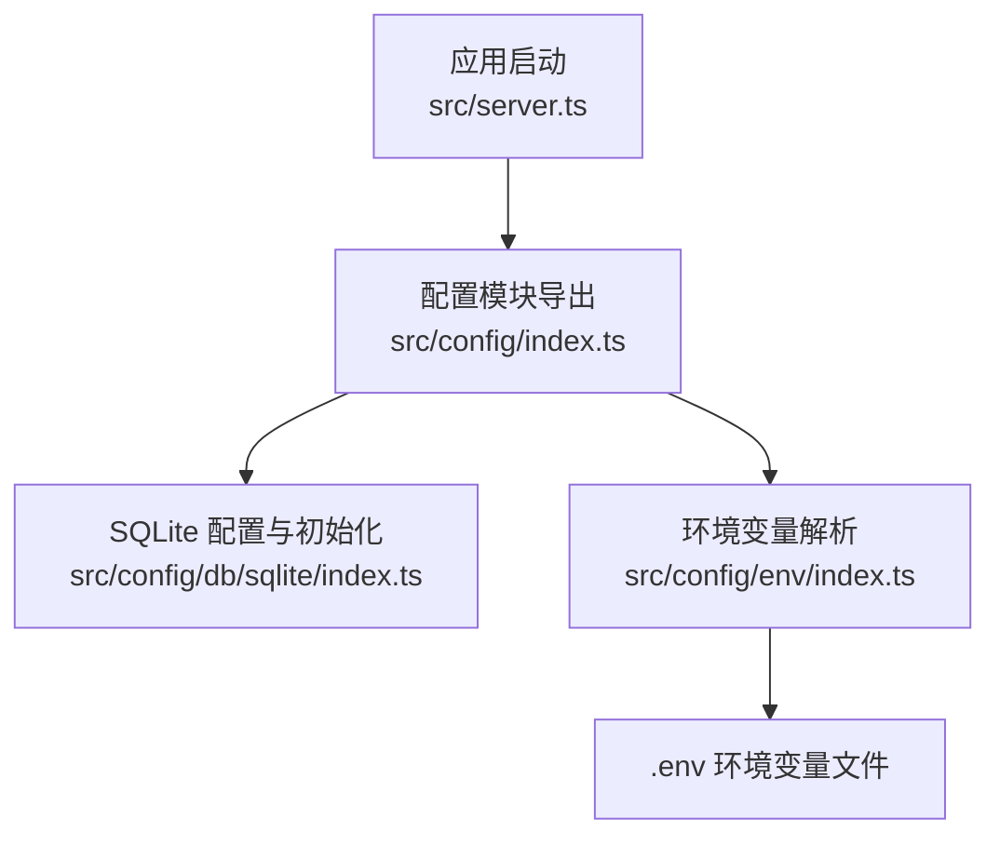
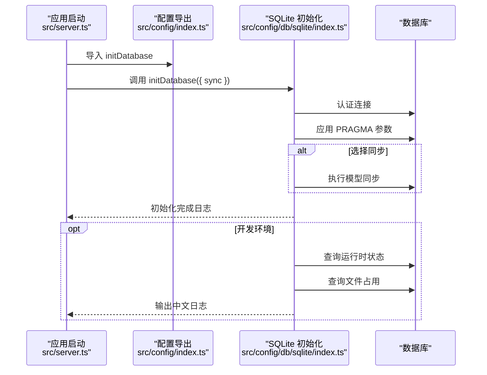
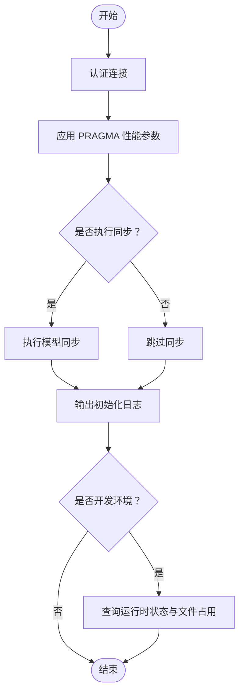
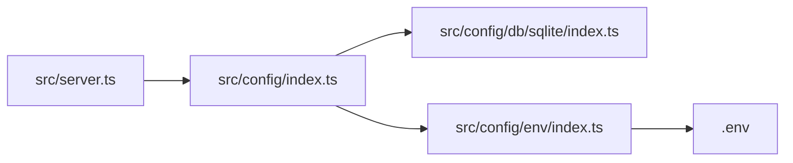

# 数据库配置

<cite>
**本文引用的文件**
- [src/config/db/sqlite/index.ts](file://src/config/db/sqlite/index.ts)
- [src/config/env/index.ts](file://src/config/env/index.ts)
- [src/config/index.ts](file://src/config/index.ts)
- [src/server.ts](file://src/server.ts)
- [.env](file://.env)
</cite>

## 目录
1. [简介](#简介)
2. [项目结构](#项目结构)
3. [核心组件](#核心组件)
4. [架构概览](#架构概览)
5. [详细组件分析](#详细组件分析)
6. [依赖关系分析](#依赖关系分析)
7. [性能考虑](#性能考虑)
8. [故障排查指南](#故障排查指南)
9. [结论](#结论)
10. [附录](#附录)

## 简介
本文件面向 IM-API 的数据库配置系统，聚焦于 SQLite 与 MySQL 的配置与连接设置，系统性说明以下主题：
- SQLite 与 MySQL 的配置项与连接参数
- 数据库连接池配置（最大连接数、最小连接数、空闲回收时间等）
- SSL 连接配置与证书管理
- 数据库会话配置（时区、事务隔离级别、字符集等）
- 数据库性能优化建议与监控指标
- 数据库迁移与同步配置
- 数据库备份与恢复策略

说明：当前仓库实现以 SQLite 为主，MySQL 配置项存在于环境变量与类型定义中，但未见实际的 MySQL 连接初始化逻辑。本文将分别阐述 SQLite 的完整实现与 MySQL 的可配置项与最佳实践。

## 项目结构
数据库配置相关的核心文件分布如下：
- SQLite 配置与初始化：src/config/db/sqlite/index.ts
- 环境变量解析与类型定义：src/config/env/index.ts
- 配置模块统一导出：src/config/index.ts
- 应用启动入口（初始化数据库）：src/server.ts
- 环境变量示例：.env

图表来源
- [src/server.ts](file://src/server.ts#L55-L67)
- [src/config/index.ts](file://src/config/index.ts#L1-L30)
- [src/config/db/sqlite/index.ts](file://src/config/db/sqlite/index.ts#L106-L128)
- [src/config/env/index.ts](file://src/config/env/index.ts#L166-L220)
- [.env](file://.env#L1-L22)

章节来源
- [src/server.ts](file://src/server.ts#L55-L67)
- [src/config/index.ts](file://src/config/index.ts#L1-L30)
- [src/config/db/sqlite/index.ts](file://src/config/db/sqlite/index.ts#L106-L128)
- [src/config/env/index.ts](file://src/config/env/index.ts#L166-L220)
- [.env](file://.env#L1-L22)

## 核心组件
- SQLite 配置与初始化模块：提供 SQLite 连接配置快照、全局 Sequelize 实例、PRAGMA 性能调优、运行时状态查询与文件占用统计、初始化流程封装。
- 环境变量解析模块：集中定义并解析数据库相关环境变量，包括方言、存储路径、连接池、SSL、会话参数以及 MySQL 主机信息等。
- 配置模块统一导出：向应用层暴露环境变量与 SQLite 初始化能力。
- 应用启动入口：在启动阶段调用数据库初始化流程。

章节来源
- [src/config/db/sqlite/index.ts](file://src/config/db/sqlite/index.ts#L106-L128)
- [src/config/env/index.ts](file://src/config/env/index.ts#L166-L220)
- [src/config/index.ts](file://src/config/index.ts#L7-L29)
- [src/server.ts](file://src/server.ts#L55-L67)

## 架构概览
数据库配置的运行时交互如下：
- 应用启动时，从配置模块导入初始化函数并执行。
- 初始化函数建立数据库连接，应用 SQLite PRAGMA 性能参数，可选执行模型同步。
- 在开发环境输出运行时状态与文件占用信息，辅助诊断。

图表来源
- [src/server.ts](file://src/server.ts#L55-L67)
- [src/config/index.ts](file://src/config/index.ts#L12-L19)
- [src/config/db/sqlite/index.ts](file://src/config/db/sqlite/index.ts#L368-L409)

## 详细组件分析

### SQLite 配置与初始化
- 连接配置快照：包含存储路径与连接池参数，便于日志与外部展示。
- 全局 Sequelize 实例：指定方言为 sqlite，禁用日志，应用连接池与重试策略。
- PRAGMA 性能调优：启用 WAL 日志模式、调整同步级别、临时表内存存储、外键约束、缓存大小、内存映射、自动检查点、锁等待超时与 WAL 大小限制。
- 运行时状态查询：封装 PRAGMA 查询，返回缓存、页面、WAL、内存等统计信息，并提供字段中文化输出。
- 文件占用统计：读取主库与 WAL 文件的物理大小，用于容量与性能监控。
- 初始化流程：认证连接 → 应用 PRAGMA → 可选模型同步 → 输出初始化日志 → 开发环境输出运行时状态与文件占用。

图表来源
- [src/config/db/sqlite/index.ts](file://src/config/db/sqlite/index.ts#L368-L409)

章节来源
- [src/config/db/sqlite/index.ts](file://src/config/db/sqlite/index.ts#L106-L128)
- [src/config/db/sqlite/index.ts](file://src/config/db/sqlite/index.ts#L136-L154)
- [src/config/db/sqlite/index.ts](file://src/config/db/sqlite/index.ts#L162-L207)
- [src/config/db/sqlite/index.ts](file://src/config/db/sqlite/index.ts#L265-L285)
- [src/config/db/sqlite/index.ts](file://src/config/db/sqlite/index.ts#L292-L330)
- [src/config/db/sqlite/index.ts](file://src/config/db/sqlite/index.ts#L368-L409)

### MySQL 配置项与连接设置
- 环境变量定义：包含 MySQL 主机、端口、数据库名、用户名与密码等。
- 类型安全：通过 EnvConfig 接口统一声明，确保配置项的完整性与可追踪性。
- 使用方式：当前代码未实现 MySQL 连接初始化逻辑，但可通过扩展在应用中引入 mysql2/Sequelize 进行连接与配置。

章节来源
- [src/config/env/index.ts](file://src/config/env/index.ts#L106-L160)
- [src/config/env/index.ts](file://src/config/env/index.ts#L166-L220)
- [.env](file://.env#L10-L14)

### 连接池配置
- SQLite 连接池参数：
  - 最大连接数：用于限制同时活跃的连接数量，避免资源耗尽。
  - 最小连接数：维持一定数量的空闲连接，降低首次请求延迟。
  - 空闲连接最大存活时间：控制空闲连接的回收时机，释放资源。
  - 获取连接最大等待时间：防止请求阻塞过久导致超时。
- MySQL 连接池参数（环境变量定义）：
  - 最大连接数、最小连接数、空闲回收时间、获取连接等待时间、回收间隔时间等，均通过环境变量进行配置与注入。

章节来源
- [src/config/db/sqlite/index.ts](file://src/config/db/sqlite/index.ts#L106-L114)
- [src/config/env/index.ts](file://src/config/env/index.ts#L182-L186)

### SSL 连接配置与证书管理
- 环境变量定义：包含 SSL 开关、证书校验开关、CA 证书路径、证书路径与私钥路径。
- 使用建议：在引入 MySQL 连接时，结合 mysql2 的 TLS 配置项传入证书路径与校验策略；对 SQLite 无需 SSL 配置。

章节来源
- [src/config/env/index.ts](file://src/config/env/index.ts#L188-L192)

### 数据库会话配置
- 会话时区：DB_SESSION_TIME_ZONE，默认 UTC。
- 事务隔离级别：DB_SESSION_TX_ISOLATION，默认 READ-COMMITTED。
- 字符集：DB_SESSION_CHARSET，默认 utf8mb4。
- 排序规则：DB_SESSION_COLLATION，默认 utf8mb4_general_ci。
- SQL 模式：DB_SESSION_SQL_MODE，默认空字符串（由数据库默认行为决定）。

章节来源
- [src/config/env/index.ts](file://src/config/env/index.ts#L194-L198)

### 数据库迁移与同步配置
- 模型同步（开发/测试）：initDatabase 支持可选的模型同步，包含 force 与 alter 选项，适合快速迭代场景。
- 生产环境建议：使用数据库迁移工具替代同步，确保结构变更的可控与可回滚。

章节来源
- [src/config/db/sqlite/index.ts](file://src/config/db/sqlite/index.ts#L377-L383)

### 数据库备份与恢复策略
- SQLite：
  - 备份：直接复制数据库文件与 WAL 文件；在写入密集场景建议在低峰期或使用 WAL 检查点后复制。
  - 恢复：停止服务后替换数据库文件，必要时清理 WAL 文件以避免不一致。
- MySQL：
  - 备份：使用逻辑备份（如 mysqldump）或物理备份（如 Percona XtraBackup）。
  - 恢复：在目标实例上执行备份文件，注意字符集、排序规则与时区一致性。

说明：以上为通用实践建议，具体策略需结合业务场景与合规要求制定。

## 依赖关系分析
- 应用启动依赖配置模块导出的初始化函数。
- 配置模块导出 SQLite 初始化能力与环境变量。
- 环境变量模块负责解析 .env 并提供类型安全的配置对象。

图表来源
- [src/server.ts](file://src/server.ts#L15-L16)
- [src/config/index.ts](file://src/config/index.ts#L7-L29)
- [src/config/env/index.ts](file://src/config/env/index.ts#L13-L13)
- [.env](file://.env#L1-L22)

章节来源
- [src/server.ts](file://src/server.ts#L15-L16)
- [src/config/index.ts](file://src/config/index.ts#L7-L29)
- [src/config/env/index.ts](file://src/config/env/index.ts#L13-L13)

## 性能考虑
- SQLite：
  - WAL 模式提升并发读性能与崩溃恢复能力。
  - 适度增大缓存与内存映射，平衡内存占用与 I/O 性能。
  - 控制 WAL 自动检查点频率与 WAL 文件上限，避免无限膨胀。
  - 合理设置锁等待超时，避免热点表争用导致的长尾延迟。
  - 定期检查运行时状态与文件占用，评估容量与性能瓶颈。
- MySQL：
  - 连接池参数需根据 QPS 与事务特性调优，避免连接不足或过度占用。
  - 启用慢查询日志与性能分析工具，定位热点 SQL。
  - 合理设置字符集与排序规则，避免隐式转换带来的性能损耗。

## 故障排查指南
- 初始化失败：
  - 检查数据库文件权限与路径是否存在。
  - 查看初始化日志中的 PRAGMA 参数是否生效。
- 运行时异常：
  - 开发环境可启用运行时状态与文件占用输出，定位缓存、WAL 或锁等待问题。
- 连接池问题：
  - 观察最大连接数与空闲回收时间设置是否合理，避免连接泄漏或频繁创建销毁。

章节来源
- [src/config/db/sqlite/index.ts](file://src/config/db/sqlite/index.ts#L405-L408)
- [src/config/db/sqlite/index.ts](file://src/config/db/sqlite/index.ts#L265-L285)
- [src/config/db/sqlite/index.ts](file://src/config/db/sqlite/index.ts#L292-L330)

## 结论
本项目对 SQLite 提供了完善的配置与性能优化方案，涵盖连接池、PRAGMA 调优、运行时监控与初始化流程。MySQL 配置项已通过环境变量与类型定义完成设计，建议在后续扩展中实现连接初始化与迁移管理，以满足多数据库场景需求。生产环境应优先采用迁移而非同步，并结合监控指标持续优化数据库性能与稳定性。

## 附录
- 环境变量清单（节选）：
  - DB_DIALECT：数据库方言（默认 sqlite）
  - DB_STORAGE：SQLite 存储路径（默认 ./data/dev.sqlite）
  - DB_POOL_MAX/DB_POOL_MIN/DB_POOL_IDLE/DB_POOL_ACQUIRE/DB_POOL_EVICT：连接池参数
  - DB_SSL_ENABLED/DB_SSL_REJECT_UNAUTHORIZED/DB_SSL_CA_FILE/DB_SSL_CERT_FILE/DB_SSL_KEY_FILE：SSL 配置
  - DB_SESSION_TIME_ZONE/DB_SESSION_TX_ISOLATION/DB_SESSION_CHARSET/DB_SESSION_COLLATION/DB_SESSION_SQL_MODE：会话配置
  - MYSQL_HOST/MYSQL_PORT/MYSQL_DB/MYSQL_USER/MYSQL_PASSWORD：MySQL 连接参数

章节来源
- [src/config/env/index.ts](file://src/config/env/index.ts#L170-L171)
- [src/config/env/index.ts](file://src/config/env/index.ts#L182-L186)
- [src/config/env/index.ts](file://src/config/env/index.ts#L188-L192)
- [src/config/env/index.ts](file://src/config/env/index.ts#L194-L198)
- [src/config/env/index.ts](file://src/config/env/index.ts#L202-L206)
- [.env](file://.env#L8-L14)