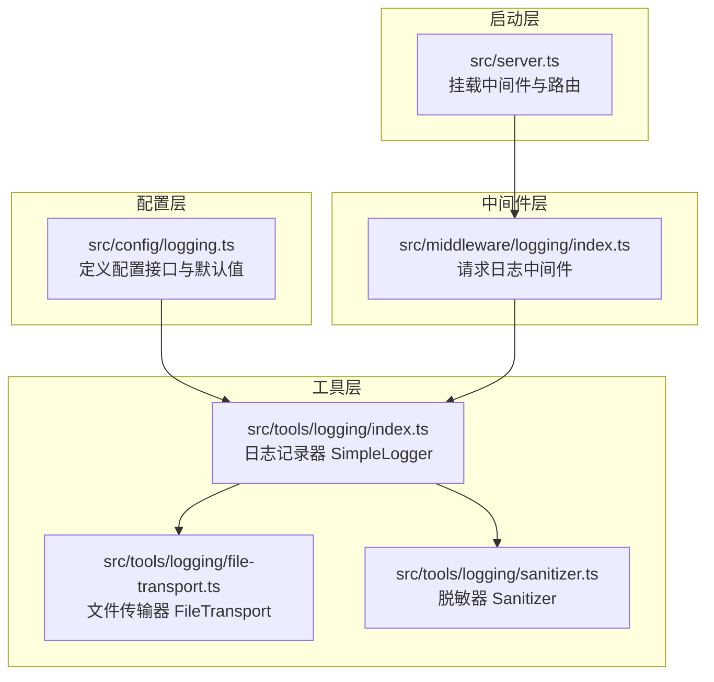
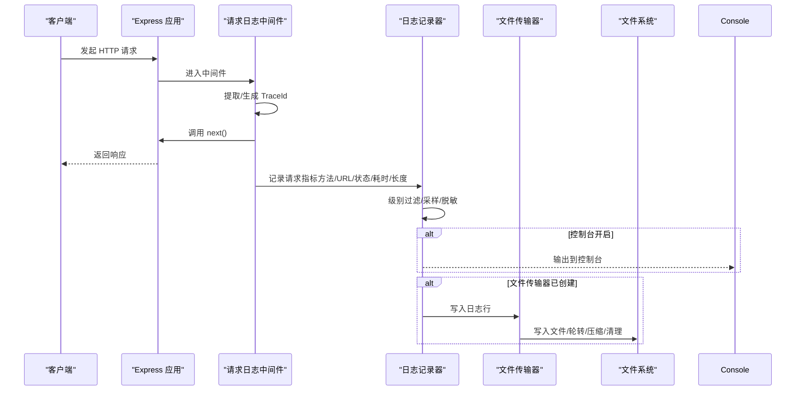
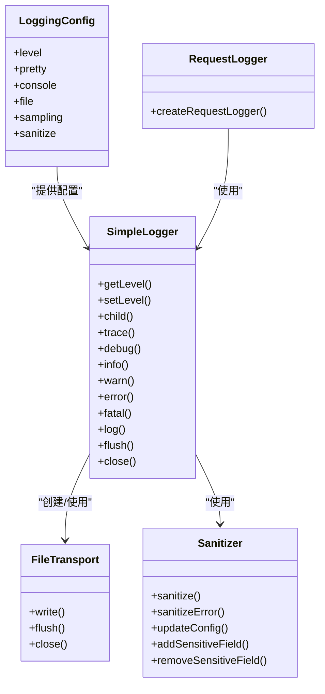

# 日志配置

<cite>
**本文引用的文件**
- [src/config/logging.ts](file://src/config/logging.ts)
- [src/tools/logging/index.ts](file://src/tools/logging/index.ts)
- [src/tools/logging/file-transport.ts](file://src/tools/logging/file-transport.ts)
- [src/tools/logging/sanitizer.ts](file://src/tools/logging/sanitizer.ts)
- [src/middleware/logging/index.ts](file://src/middleware/logging/index.ts)
- [src/server.ts](file://src/server.ts)
- [.env](file://.env)
</cite>

## 目录
1. [简介](#简介)
2. [项目结构](#项目结构)
3. [核心组件](#核心组件)
4. [架构总览](#架构总览)
5. [详细组件分析](#详细组件分析)
6. [依赖关系分析](#依赖关系分析)
7. [性能考量](#性能考量)
8. [故障排查指南](#故障排查指南)
9. [结论](#结论)
10. [附录](#附录)

## 简介
本文件面向 IM-API 的日志配置系统，系统采用“配置驱动 + 中间件 + 工具库”的分层设计，支持：
- 多级别日志（trace/debug/info/warn/error/fatal）
- 控制台与文件双输出
- 结构化上下文与错误序列化
- TraceId 上下文绑定与请求链路追踪
- 文件轮转、压缩与缓冲刷新
- 日志采样与敏感信息脱敏
- 基于环境变量的灵活配置

## 项目结构
日志相关代码分布在以下模块：
- 配置层：集中定义日志配置项与默认值
- 工具层：日志记录器、文件传输器、脱敏器
- 中间件层：HTTP 请求日志中间件，注入 TraceId 并记录请求耗时
- 启动层：在服务器启动时挂载中间件

图表来源
- [src/config/logging.ts](file://src/config/logging.ts#L1-L157)
- [src/tools/logging/index.ts](file://src/tools/logging/index.ts#L1-L532)
- [src/tools/logging/file-transport.ts](file://src/tools/logging/file-transport.ts#L1-L268)
- [src/tools/logging/sanitizer.ts](file://src/tools/logging/sanitizer.ts#L1-L210)
- [src/middleware/logging/index.ts](file://src/middleware/logging/index.ts#L1-L64)
- [src/server.ts](file://src/server.ts#L1-L74)

章节来源
- [src/config/logging.ts](file://src/config/logging.ts#L1-L157)
- [src/tools/logging/index.ts](file://src/tools/logging/index.ts#L1-L532)
- [src/tools/logging/file-transport.ts](file://src/tools/logging/file-transport.ts#L1-L268)
- [src/tools/logging/sanitizer.ts](file://src/tools/logging/sanitizer.ts#L1-L210)
- [src/middleware/logging/index.ts](file://src/middleware/logging/index.ts#L1-L64)
- [src/server.ts](file://src/server.ts#L1-L74)

## 核心组件
- 日志配置（LoggingConfig）：统一管理日志级别、输出格式、文件传输、采样、脱敏、控制台开关等
- 日志记录器（SimpleLogger）：实现多级别日志记录、结构化上下文、错误序列化、采样、脱敏、TraceId 注入、控制台与文件输出
- 文件传输器（FileTransport）：负责文件写入、缓冲、轮转、压缩、清理旧文件
- 脱敏器（Sanitizer）：对上下文与错误对象进行敏感字段识别与替换
- 请求日志中间件（createRequestLogger）：在请求生命周期内生成 TraceId，记录请求方法、URL、状态码、耗时、长度等

章节来源
- [src/config/logging.ts](file://src/config/logging.ts#L66-L79)
- [src/tools/logging/index.ts](file://src/tools/logging/index.ts#L295-L438)
- [src/tools/logging/file-transport.ts](file://src/tools/logging/file-transport.ts#L32-L259)
- [src/tools/logging/sanitizer.ts](file://src/tools/logging/sanitizer.ts#L135-L201)
- [src/middleware/logging/index.ts](file://src/middleware/logging/index.ts#L34-L57)

## 架构总览
日志系统通过配置驱动，记录器在构造时读取全局配置，按需创建文件传输器与脱敏器。请求中间件在每次请求开始时绑定 TraceId，结束时记录请求指标。记录器在输出时根据级别过滤、采样、脱敏，并决定控制台与文件输出。

图表来源
- [src/middleware/logging/index.ts](file://src/middleware/logging/index.ts#L34-L57)
- [src/tools/logging/index.ts](file://src/tools/logging/index.ts#L397-L437)
- [src/tools/logging/file-transport.ts](file://src/tools/logging/file-transport.ts#L197-L236)

## 详细组件分析

### 日志配置（LoggingConfig）
- 日志级别：支持 trace/debug/info/warn/error/fatal
- 输出格式：pretty（人类可读）与 JSON（生产）
- 文件传输：启用开关、路径模板（支持 %DATE%）、单文件大小、保留数量、压缩、日期分割
- 采样：针对 trace/debug/info 的采样率（生产环境默认较低）
- 脱敏：启用开关、敏感字段列表、占位符、部分保留策略（前后缀）
- 控制台：是否输出到控制台

默认值策略：
- 开发环境默认级别为 debug，生产环境为 info
- pretty 在非生产环境默认开启
- 文件传输在生产环境默认开启
- 采样在生产环境对 trace/debug 降低采样率
- 脱敏默认开启，包含常见敏感字段

章节来源
- [src/config/logging.ts](file://src/config/logging.ts#L66-L79)
- [src/config/logging.ts](file://src/config/logging.ts#L105-L151)

### 日志记录器（SimpleLogger）
职责与流程：
- 级别过滤：按 LEVEL_NUM 映射比较
- 采样过滤：按采样率随机丢弃
- 脱敏：对上下文与错误对象执行脱敏
- TraceId：从 AsyncLocalStorage 获取当前请求上下文
- 输出：控制台输出（按级别选择输出流），文件输出（通过 FileTransport）

关键点：
- 仅根记录器创建文件传输器，避免重复实例
- 支持子记录器（child），合并基础上下文
- 提供 flush/close 以确保缓冲与资源释放

章节来源
- [src/tools/logging/index.ts](file://src/tools/logging/index.ts#L295-L438)
- [src/tools/logging/index.ts](file://src/tools/logging/index.ts#L520-L531)

### 文件传输器（FileTransport）
功能与策略：
- 目录确保：首次写入前创建日志目录
- 路径解析：支持 %DATE% 替换为日期（YYYY-MM-DD）
- 轮转判断：文件大小超限或日期变化触发轮转
- 压缩：可选压缩旧文件（.gz）
- 清理：按 maxFiles 保留最新文件
- 缓冲与刷新：缓冲区满或定时刷新，写入后更新当前文件大小
- 关闭：清理定时器、刷新缓冲、关闭流

章节来源
- [src/tools/logging/file-transport.ts](file://src/tools/logging/file-transport.ts#L32-L259)

### 脱敏器（Sanitizer）
能力与规则：
- 字段匹配：大小写不敏感，支持包含式匹配
- 值脱敏：可选择部分保留（前后缀），否则使用占位符
- 对象递归：支持嵌套对象与数组的深度遍历
- 错误脱敏：对错误对象的键值同样进行脱敏

章节来源
- [src/tools/logging/sanitizer.ts](file://src/tools/logging/sanitizer.ts#L135-L201)

### 请求日志中间件（createRequestLogger）
行为与指标：
- 提取/生成 TraceId：优先 x-trace-id，其次 x-request-id，否则随机 UUID
- 写入响应头：设置 TRACE_ID_HEADER
- 生命周期：在 finish 事件中记录方法、URL、状态码、耗时（ms）、响应体长度
- 上下文绑定：使用 runWithTraceId 将 TraceId 绑定到异步存储

章节来源
- [src/middleware/logging/index.ts](file://src/middleware/logging/index.ts#L34-L57)

## 依赖关系分析
- 配置依赖：工具层记录器依赖全局配置（loggingConfig）
- 传输依赖：记录器依赖文件传输器（仅根记录器）
- 脱敏依赖：记录器依赖脱敏器
- 中间件依赖：请求日志中间件依赖记录器与 TraceId 中间件
- 启动依赖：服务器在启动时挂载中间件与路由

图表来源
- [src/config/logging.ts](file://src/config/logging.ts#L66-L79)
- [src/tools/logging/index.ts](file://src/tools/logging/index.ts#L295-L438)
- [src/tools/logging/file-transport.ts](file://src/tools/logging/file-transport.ts#L32-L259)
- [src/tools/logging/sanitizer.ts](file://src/tools/logging/sanitizer.ts#L135-L201)
- [src/middleware/logging/index.ts](file://src/middleware/logging/index.ts#L34-L57)

章节来源
- [src/config/logging.ts](file://src/config/logging.ts#L1-L157)
- [src/tools/logging/index.ts](file://src/tools/logging/index.ts#L1-L532)
- [src/tools/logging/file-transport.ts](file://src/tools/logging/file-transport.ts#L1-L268)
- [src/tools/logging/sanitizer.ts](file://src/tools/logging/sanitizer.ts#L1-L210)
- [src/middleware/logging/index.ts](file://src/middleware/logging/index.ts#L1-L64)

## 性能考量
- 采样：生产环境对 trace/debug 降低采样率，显著减少高频日志写入
- 缓冲与定时刷新：FileTransport 使用缓冲区与定时刷新，平衡吞吐与延迟
- 文件轮转与压缩：限制单文件大小与保留数量，避免磁盘膨胀；压缩旧文件节省空间
- 控制台输出：仅在必要时开启，避免阻塞 I/O
- TraceId：仅在中间件与记录器中使用，避免额外开销

优化建议：
- 根据业务流量调整采样率与缓冲大小
- 合理设置文件大小与保留数量，结合磁盘配额
- 在高并发场景下，优先使用 JSON 输出以提升解析效率
- 定期检查磁盘空间与日志轮转策略

[本节为通用性能指导，无需特定文件引用]

## 故障排查指南
常见问题与定位思路：
- 日志未输出到文件
  - 检查文件传输配置（enabled/path/maxSize/maxFiles/compress/datePattern）
  - 确认日志目录权限与磁盘空间
- 日志未显示 TraceId
  - 确认请求中间件已挂载且响应头已设置 TRACE_ID_HEADER
  - 检查记录器是否正确绑定 TraceId
- 敏感信息未脱敏
  - 检查脱敏配置（enabled/fields/placeholder/partial）
  - 确认字段名大小写与包含式匹配规则
- 采样导致日志缺失
  - 检查采样配置（sampling.trace/sampling.debug/sampling.info）
  - 在调试阶段提高采样率或临时禁用采样
- 性能下降
  - 检查缓冲区大小与刷新间隔
  - 调整采样率与文件轮转策略
  - 关闭不必要的控制台输出

章节来源
- [src/config/logging.ts](file://src/config/logging.ts#L105-L151)
- [src/tools/logging/index.ts](file://src/tools/logging/index.ts#L397-L437)
- [src/tools/logging/file-transport.ts](file://src/tools/logging/file-transport.ts#L197-L236)
- [src/tools/logging/sanitizer.ts](file://src/tools/logging/sanitizer.ts#L135-L201)
- [src/middleware/logging/index.ts](file://src/middleware/logging/index.ts#L34-L57)

## 结论
IM-API 的日志配置系统通过清晰的分层设计与丰富的配置项，实现了可控、可观测、可维护的日志体系。结合请求中间件与 TraceId 追踪，能够有效支撑调试与运维需求。在生产环境中，建议启用文件输出、合理设置采样与轮转策略，并开启脱敏以满足合规要求。

[本节为总结性内容，无需特定文件引用]

## 附录

### 环境变量与默认策略
- NODE_ENV：决定默认日志级别与 pretty 输出策略
- LOG_LEVEL：覆盖默认级别
- LOG_PRETTY：控制是否使用人类可读输出
- LOG_CONSOLE：控制是否输出到控制台
- LOG_FILE_ENABLED：是否启用文件输出
- LOG_FILE_PATH：文件路径模板（支持 %DATE%）
- LOG_FILE_MAX_SIZE：单文件最大大小（支持 b/k/m/g）
- LOG_FILE_MAX_FILES：保留文件数量
- LOG_FILE_COMPRESS：是否压缩旧文件
- LOG_FILE_DATE_PATTERN：日期分割模式
- LOG_SANITIZE：是否启用脱敏
- LOG_SANITIZE_FIELDS：敏感字段列表（默认包含常见敏感字段）
- LOG_SANITIZE_PLACEHOLDER：脱敏占位符
- LOG_SANITIZE_PARTIAL：部分保留策略（prefix/suffix）

章节来源
- [src/config/logging.ts](file://src/config/logging.ts#L105-L151)
- [.env](file://.env#L1-L22)

### 不同环境下的配置策略
- 开发环境
  - 默认级别：debug
  - pretty：开启
  - 文件输出：可选
  - 采样：关闭或低采样
  - 脱敏：开启
- 测试环境
  - 默认级别：info 或 debug
  - pretty：可选
  - 文件输出：可选
  - 采样：低采样
  - 脱敏：开启
- 生产环境
  - 默认级别：info
  - pretty：关闭
  - 文件输出：开启
  - 采样：trace/debug 低采样
  - 脱敏：开启
  - 压缩：开启
  - 保留数量：适中

章节来源
- [src/config/logging.ts](file://src/config/logging.ts#L105-L151)

### 日志传输器配置与自定义选项
- FileTransportOptions
  - bufferSize：缓冲区大小
  - flushInterval：刷新间隔（毫秒）
- 自定义建议
  - 高吞吐场景：增大缓冲区、延长刷新间隔
  - 低延迟场景：减小缓冲区、缩短刷新间隔
  - 磁盘空间紧张：减小 maxFiles 或开启压缩

章节来源
- [src/tools/logging/file-transport.ts](file://src/tools/logging/file-transport.ts#L21-L48)

### 日志监控与告警配置
- 建议采集指标
  - 错误/致命级别日志计数
  - 请求耗时分布（来自请求中间件）
  - 磁盘使用量与日志文件数量
- 告警阈值
  - 错误/致命级别日志在窗口期内超过阈值
  - 磁盘使用率超过阈值
  - 文件轮转失败或压缩失败
- 工具集成
  - 结合日志收集器（如 filebeat、fluent-bit）与监控平台（如 Prometheus/Grafana）

[本节为通用监控与告警建议，无需特定文件引用]

### 日志数据隐私保护与合规性
- 脱敏范围
  - 密码、PIN、令牌、密钥、授权信息、Cookie、会话 ID 等
- 部分保留
  - 可配置前后缀保留以满足审计需求
- 数据最小化
  - 仅记录必要的上下文与错误信息
- 合规要求
  - 保留期限与删除策略
  - 访问控制与加密存储
  - 审计日志与不可抵赖性

章节来源
- [src/config/logging.ts](file://src/config/logging.ts#L129-L149)
- [src/tools/logging/sanitizer.ts](file://src/tools/logging/sanitizer.ts#L135-L201)