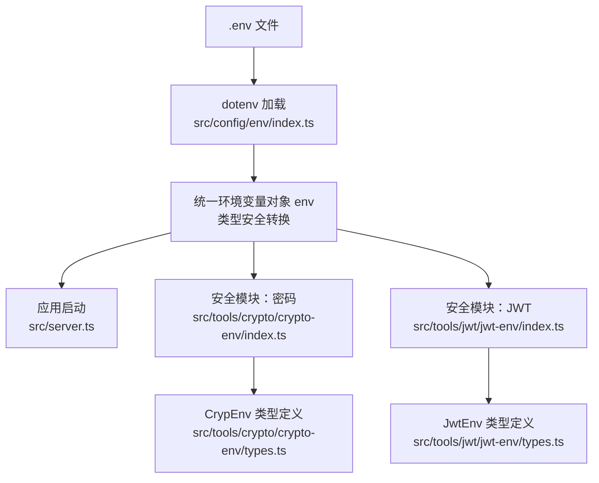
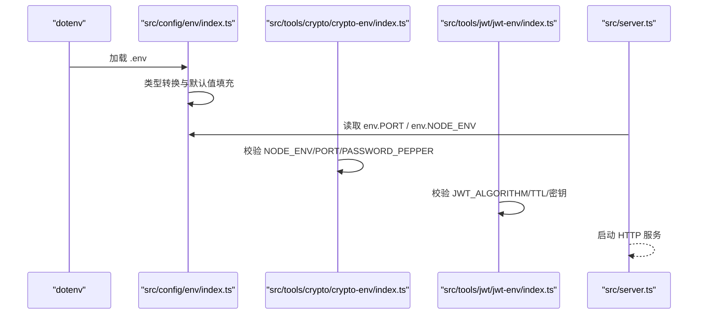
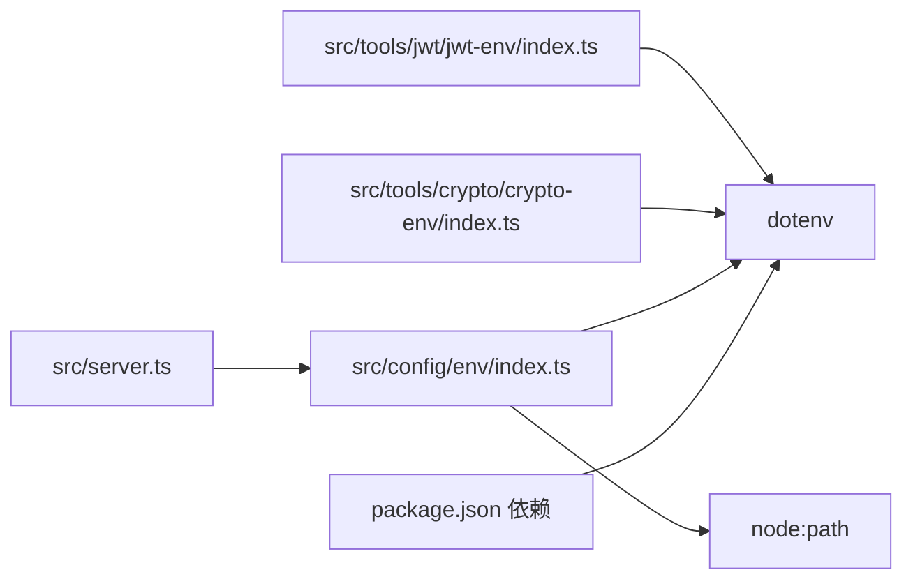

# 环境变量配置

<cite>
**本文引用的文件**
- [src/config/env/index.ts](file://src/config/env/index.ts)
- [src/tools/crypto/crypto-env/index.ts](file://src/tools/crypto/crypto-env/index.ts)
- [src/tools/crypto/crypto-env/types.ts](file://src/tools/crypto/crypto-env/types.ts)
- [src/tools/jwt/jwt-env/index.ts](file://src/tools/jwt/jwt-env/index.ts)
- [src/tools/jwt/jwt-env/types.ts](file://src/tools/jwt/jwt-env/types.ts)
- [.env](file://.env)
- [package.json](file://package.json)
- [src/server.ts](file://src/server.ts)
- [src/config/index.ts](file://src/config/index.ts)
</cite>

## 目录
1. [简介](#简介)
2. [项目结构](#项目结构)
3. [核心组件](#核心组件)
4. [架构总览](#架构总览)
5. [详细组件分析](#详细组件分析)
6. [依赖关系分析](#依赖关系分析)
7. [性能考量](#性能考量)
8. [故障排查指南](#故障排查指南)
9. [结论](#结论)
10. [附录](#附录)

## 简介
本文件系统性地文档化 IM-API 的环境变量配置体系，涵盖以下方面：
- 环境变量的加载机制与类型安全转换
- 所有可用配置项的含义、默认值与必需参数
- 开发与生产环境的配置示例
- 验证机制与错误处理策略
- 最佳实践与安全建议
- 配置文件模板与部署指南

## 项目结构
IM-API 的环境变量配置由多处独立但协同的模块组成：
- 统一的主配置模块负责加载 .env 并进行类型安全转换
- 安全相关子模块（密码与 JWT）各自加载并校验所需变量
- 服务器启动时读取统一配置以决定运行行为

图表来源
- [src/config/env/index.ts](file://src/config/env/index.ts#L10-L13)
- [src/server.ts](file://src/server.ts#L15-L66)
- [src/tools/crypto/crypto-env/index.ts](file://src/tools/crypto/crypto-env/index.ts#L10-L15)
- [src/tools/jwt/jwt-env/index.ts](file://src/tools/jwt/jwt-env/index.ts#L10-L12)

章节来源
- [src/config/env/index.ts](file://src/config/env/index.ts#L1-L223)
- [src/server.ts](file://src/server.ts#L1-L74)

## 核心组件
- 统一环境变量模块：负责加载 .env、执行类型转换与默认值填充，并导出强类型对象
- 安全模块（密码）：独立加载并校验 NODE_ENV、PORT、PASSWORD_PEPPER
- 安全模块（JWT）：独立加载并校验 JWT 算法、密钥与 TTL，支持 HS256/RS256
- 应用入口：在启动阶段读取统一配置并绑定到服务

章节来源
- [src/config/env/index.ts](file://src/config/env/index.ts#L166-L220)
- [src/tools/crypto/crypto-env/index.ts](file://src/tools/crypto/crypto-env/index.ts#L22-L43)
- [src/tools/jwt/jwt-env/index.ts](file://src/tools/jwt/jwt-env/index.ts#L19-L51)
- [src/server.ts](file://src/server.ts#L60-L66)

## 架构总览
下图展示环境变量在系统中的加载与使用流程：

图表来源
- [src/config/env/index.ts](file://src/config/env/index.ts#L10-L13)
- [src/server.ts](file://src/server.ts#L60-L66)
- [src/tools/crypto/crypto-env/index.ts](file://src/tools/crypto/crypto-env/index.ts#L22-L43)
- [src/tools/jwt/jwt-env/index.ts](file://src/tools/jwt/jwt-env/index.ts#L19-L51)

## 详细组件分析

### 统一环境变量模块（src/config/env/index.ts）
- 加载机制
  - 使用 dotenv 在进程启动时一次性加载 .env 文件
  - 通过类型转换函数实现字符串到数字、布尔值的安全转换
- 类型安全转换函数
  - 必填校验：当变量缺失或为空字符串时抛出错误
  - 数字转换：将字符串转为数字，非法输入抛错；缺省值可选
  - 布尔转换：接受 "true"/"1" 为真，其他为假；缺省值可选
- 配置项与默认值
  - 运行环境：NODE_ENV，默认 development
  - 服务端口：PORT，默认 3000
  - 数据库：DB_DIALECT 默认 sqlite；DB_STORAGE 默认 ./data/dev.sqlite
  - 安全密钥：JWT_SECRET 默认 dev-secret；PIN_SECRET 默认 dev-pin-secret；PASSWORD_PEPPER 默认 dev-pepper
  - 数据库连接池与超时：连接超时、重试次数与间隔、池大小、空闲回收、获取等待、回收间隔等均有默认值
  - MySQL 连接：主机、端口、数据库、用户、密码，均提供合理默认值
  - 速率限制：窗口毫秒数与最大请求数
  - WebSocket：开关、心跳间隔、空闲超时
  - Redis：开关、主机、端口、密码、数据库索引
- 错误处理
  - 缺失必填项时抛出明确错误
  - 数字转换失败时抛出错误
  - 布尔转换遵循约定值映射

章节来源
- [src/config/env/index.ts](file://src/config/env/index.ts#L10-L13)
- [src/config/env/index.ts](file://src/config/env/index.ts#L21-L61)
- [src/config/env/index.ts](file://src/config/env/index.ts#L166-L220)

### 安全模块（密码）（src/tools/crypto/crypto-env/index.ts）
- 加载机制
  - 单独调用 dotenv 初始化，提取 NODE_ENV、PORT、PASSWORD_PEPPER
- 校验逻辑
  - NODE_ENV 限定为 development、production、test 之一
  - PORT 必须为 1~65535 的整数
- 输出
  - 返回只读对象，避免运行时修改

章节来源
- [src/tools/crypto/crypto-env/index.ts](file://src/tools/crypto/crypto-env/index.ts#L14-L15)
- [src/tools/crypto/crypto-env/index.ts](file://src/tools/crypto/crypto-env/index.ts#L22-L43)
- [src/tools/crypto/crypto-env/types.ts](file://src/tools/crypto/crypto-env/types.ts#L10-L21)

### 安全模块（JWT）（src/tools/jwt/jwt-env/index.ts）
- 加载机制
  - 单独调用 dotenv 初始化，提取 JWT_ALGORITHM、JWT_ACCESS_TTL、JWT_REFRESH_TTL、JWT_SECRET、JWT_PRIVATE_KEY_PATH、JWT_PUBLIC_KEY_PATH
- 校验逻辑
  - 默认算法为 HS256；若选择 RS256，则必须同时提供私钥与公钥路径
  - TTL 默认访问 15 分钟、刷新 7 天
  - HS256 下可使用对称密钥作为默认值
- 输出
  - 返回已验证的 JwtEnv 对象

章节来源
- [src/tools/jwt/jwt-env/index.ts](file://src/tools/jwt/jwt-env/index.ts#L12-L12)
- [src/tools/jwt/jwt-env/index.ts](file://src/tools/jwt/jwt-env/index.ts#L19-L51)
- [src/tools/jwt/jwt-env/types.ts](file://src/tools/jwt/jwt-env/types.ts#L8-L25)

### 应用入口（src/server.ts）
- 启动流程
  - 初始化数据库
  - 创建 Express 应用并挂载中间件与路由
  - 读取统一配置中的端口与环境变量启动服务
- 错误处理
  - 启动失败时输出错误并退出进程

章节来源
- [src/server.ts](file://src/server.ts#L55-L73)
- [src/server.ts](file://src/server.ts#L60-L66)

## 依赖关系分析
- 统一配置模块依赖 dotenv 与 Node 路径解析
- 安全模块各自独立加载 dotenv，避免耦合
- 应用入口依赖统一配置模块提供的 env 对象

图表来源
- [package.json](file://package.json#L12-L22)
- [src/config/env/index.ts](file://src/config/env/index.ts#L10-L11)
- [src/server.ts](file://src/server.ts#L15-L15)

章节来源
- [package.json](file://package.json#L12-L22)
- [src/config/env/index.ts](file://src/config/env/index.ts#L10-L13)
- [src/tools/crypto/crypto-env/index.ts](file://src/tools/crypto/crypto-env/index.ts#L10-L12)
- [src/tools/jwt/jwt-env/index.ts](file://src/tools/jwt/jwt-env/index.ts#L10-L12)
- [src/server.ts](file://src/server.ts#L15-L15)

## 性能考量
- 环境变量加载仅在进程启动时执行一次，避免重复 IO
- 类型转换采用惰性检查：仅在读取到对应键时进行转换，减少不必要的计算
- 建议在生产环境使用更严格的默认值与更短的超时时间，以提升稳定性

## 故障排查指南
- 缺少必填变量
  - 现象：启动时报错提示某变量缺失
  - 排查：确认 .env 中是否遗漏该变量
  - 参考：统一配置模块的必填校验逻辑
- 数字变量格式错误
  - 现象：启动时报错提示变量必须为数字
  - 排查：检查变量值是否为合法数字字符串
  - 参考：统一配置模块的数字转换逻辑
- 端口无效
  - 现象：密码安全模块报错端口无效
  - 排查：确保 PORT 为 1~65535 的整数
  - 参考：密码安全模块的端口校验
- JWT 算法配置不完整
  - 现象：JWT 模块报错 RS256 需要私钥与公钥路径
  - 排查：若使用 RS256，请提供私钥与公钥路径；否则改为 HS256 或设置对称密钥
  - 参考：JWT 模块的算法与密钥校验

章节来源
- [src/config/env/index.ts](file://src/config/env/index.ts#L21-L61)
- [src/tools/crypto/crypto-env/index.ts](file://src/tools/crypto/crypto-env/index.ts#L25-L32)
- [src/tools/jwt/jwt-env/index.ts](file://src/tools/jwt/jwt-env/index.ts#L34-L35)

## 结论
IM-API 的环境变量配置体系通过“统一加载 + 类型安全转换 + 独立校验”的设计，实现了高可靠性与易维护性。建议在生产环境中严格管理密钥与路径，遵循最小权限原则，并定期轮换密钥与调整超时参数。

## 附录

### 可用配置项清单与默认值
- 运行环境与网络
  - NODE_ENV：运行环境，缺省 development
  - PORT：服务端口，缺省 3000
- 数据库
  - DB_DIALECT：数据库方言，缺省 sqlite
  - DB_STORAGE：SQLite 文件路径，缺省 ./data/dev.sqlite
  - MYSQL_HOST：MySQL 主机，缺省 localhost
  - MYSQL_PORT：MySQL 端口，缺省 3306
  - MYSQL_DB：MySQL 数据库名，缺省 空
  - MYSQL_USER：MySQL 用户名，缺省 空
  - MYSQL_PASSWORD：MySQL 密码，缺省 空
  - DB_CONNECT_TIMEOUT：连接超时(ms)，缺省 5000
  - DB_RETRY_MAX：最大重试次数，缺省 3
  - DB_RETRY_TIMEOUT：重试间隔(ms)，缺省 1000
  - DB_POOL_MAX：连接池最大连接数，缺省 5
  - DB_POOL_MIN：连接池最小连接数，缺省 0
  - DB_POOL_IDLE：空闲回收(ms)，缺省 10000
  - DB_POOL_ACQUIRE：获取等待(ms)，缺省 60000
  - DB_POOL_EVICT：回收间隔(ms)，缺省 10000
  - DB_SSL_ENABLED：启用 SSL，缺省 false
  - DB_SSL_REJECT_UNAUTHORIZED：校验证书，缺省 false
  - DB_SSL_CA_FILE：CA 证书路径，缺省 空
  - DB_SSL_CERT_FILE：证书路径，缺省 空
  - DB_SSL_KEY_FILE：SSL 私钥路径，缺省 空
  - DB_SESSION_TIME_ZONE：会话时区，缺省 UTC
  - DB_SESSION_TX_ISOLATION：事务隔离级别，缺省 READ-COMMITTED
  - DB_SESSION_CHARSET：字符集，缺省 utf8mb4
  - DB_SESSION_COLLATION：排序规则，缺省 utf8mb4_general_ci
  - DB_SESSION_SQL_MODE：SQL 模式，缺省 空
  - DB_FORCE_SYNC：强制同步模型，缺省 false
- 安全与认证
  - JWT_SECRET：JWT 对称密钥，缺省 dev-secret
  - PIN_SECRET：PIN 加密密钥，缺省 dev-pin-secret
  - PASSWORD_PEPPER：密码加盐 pepper，缺省 dev-pepper
  - ADMIN_REQUIRE_LOGIN：管理员登录要求，缺省 false
- 速率限制
  - RATE_LIMIT_WINDOW_MS：窗口毫秒数，缺省 60000
  - RATE_LIMIT_MAX_REQUESTS：窗口内最大请求数，缺省 120
- WebSocket
  - WS_ENABLED：启用 WebSocket，缺省 false
  - WS_PING_INTERVAL_MS：心跳间隔(ms)，缺省 15000
  - WS_IDLE_TIMEOUT_MS：空闲超时(ms)，缺省 45000
- Redis
  - REDIS_ENABLED：启用 Redis，缺省 false
  - REDIS_HOST：Redis 主机，缺省 localhost
  - REDIS_PORT：Redis 端口，缺省 6379
  - REDIS_PASSWORD：Redis 密码，缺省 空
  - REDIS_DB：Redis 数据库索引，缺省 0

章节来源
- [src/config/env/index.ts](file://src/config/env/index.ts#L106-L160)
- [src/config/env/index.ts](file://src/config/env/index.ts#L166-L220)

### 开发环境与生产环境配置示例
- 开发环境示例（基于仓库现有 .env）
  - 端口：3009
  - 数据库：sqlite 方言，存储于 database.sqlite
  - MySQL：示例主机、端口、库、用户、密码
  - 安全密钥：JWT_SECRET、PIN_SECRET、PASSWORD_PEPPER
- 生产环境建议
  - 设置 NODE_ENV=production
  - 使用强随机密钥替换默认密钥
  - 配置 MySQL/Redis 正确的主机、端口与凭据
  - 启用 SSL 并配置证书路径（如需要）
  - 调整连接池与超时参数以适配负载

章节来源
- [.env](file://.env#L1-L22)

### 验证机制与错误处理
- 统一配置模块
  - 必填校验：变量为空字符串或未设置则抛错
  - 数字转换：非法字符串抛错；缺省值可选
  - 布尔转换：接受 "true"/"1"，其余为假；缺省值可选
- 密码安全模块
  - NODE_ENV 限定枚举值
  - PORT 限定范围 1~65535
- JWT 模块
  - RS256 必须提供私钥与公钥路径
  - HS256 可使用对称密钥作为默认值

章节来源
- [src/config/env/index.ts](file://src/config/env/index.ts#L21-L61)
- [src/tools/crypto/crypto-env/index.ts](file://src/tools/crypto/crypto-env/index.ts#L25-L35)
- [src/tools/jwt/jwt-env/index.ts](file://src/tools/jwt/jwt-env/index.ts#L29-L44)

### 最佳实践与安全考虑
- 密钥管理
  - 使用强随机且足够长度的密钥，避免使用默认密钥
  - 将密钥存放在受控的环境变量中，不在代码库中提交
- 网络与数据库
  - 生产环境使用专用数据库与 Redis 实例
  - 启用 SSL 并校验证书
- 运行时安全
  - 限制 NODE_ENV 仅允许 development/production/test
  - 严格控制端口范围与访问来源
- 可观测性
  - 在启动日志中打印运行环境与端口，便于排障

章节来源
- [src/server.ts](file://src/server.ts#L63-L66)
- [src/tools/crypto/crypto-env/index.ts](file://src/tools/crypto/crypto-env/index.ts#L25-L35)
- [src/tools/jwt/jwt-env/index.ts](file://src/tools/jwt/jwt-env/index.ts#L34-L35)

### 配置文件模板
- .env 模板（示例）
  - 端口：PORT=3000
  - 数据库：DB_DIALECT=sqlite 或 mysql
  - MySQL（当使用 mysql 时）：MYSQL_HOST、MYSQL_PORT、MYSQL_DB、MYSQL_USER、MYSQL_PASSWORD
  - 安全密钥：JWT_SECRET、PIN_SECRET、PASSWORD_PEPPER
  - 其他：按需添加连接池、SSL、速率限制、WebSocket、Redis 等配置

章节来源
- [.env](file://.env#L1-L22)

### 部署指南
- 本地开发
  - 安装依赖：npm install
  - 启动：npm run dev
- 生产部署
  - 构建：npm run build
  - 运行：npm run start
  - 环境变量：确保 .env 或容器环境变量已正确注入
  - 健康检查：通过 /health 端点确认服务状态

章节来源
- [package.json](file://package.json#L6-L10)
- [src/server.ts](file://src/server.ts#L43-L45)