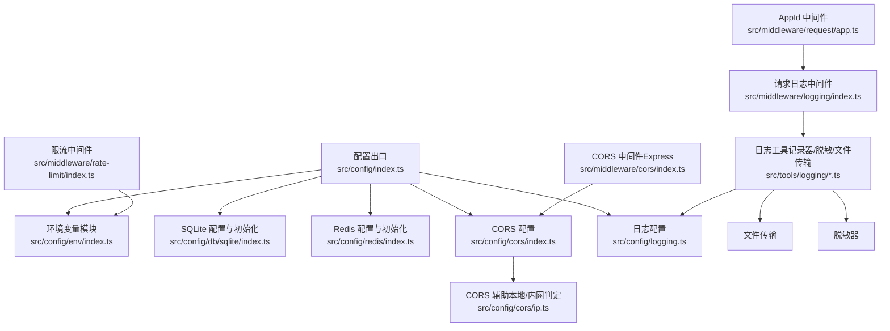
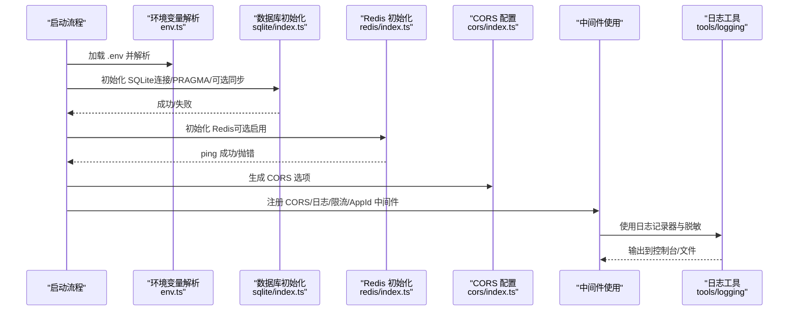
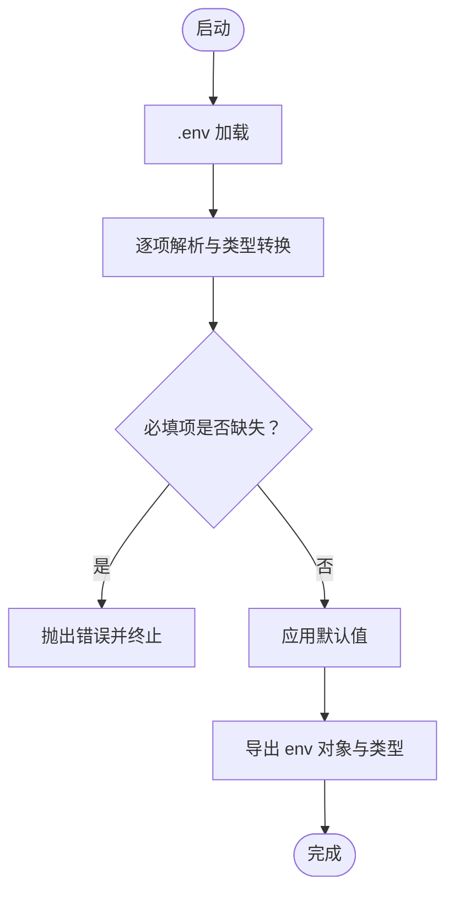
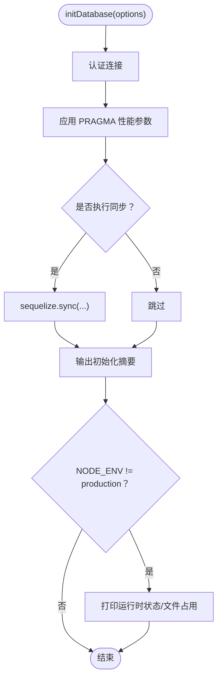
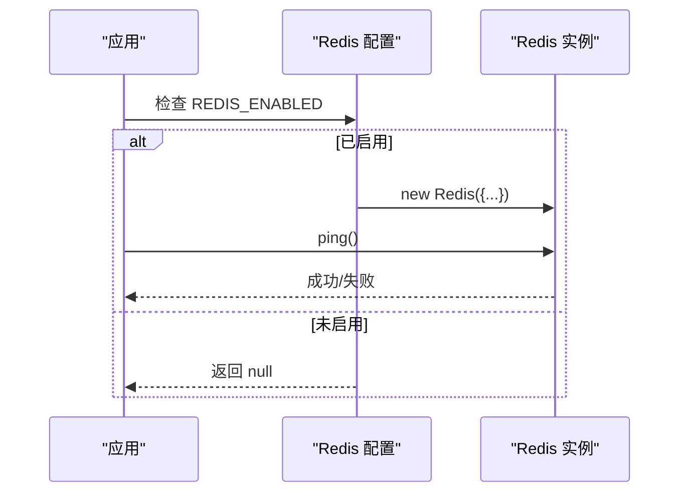
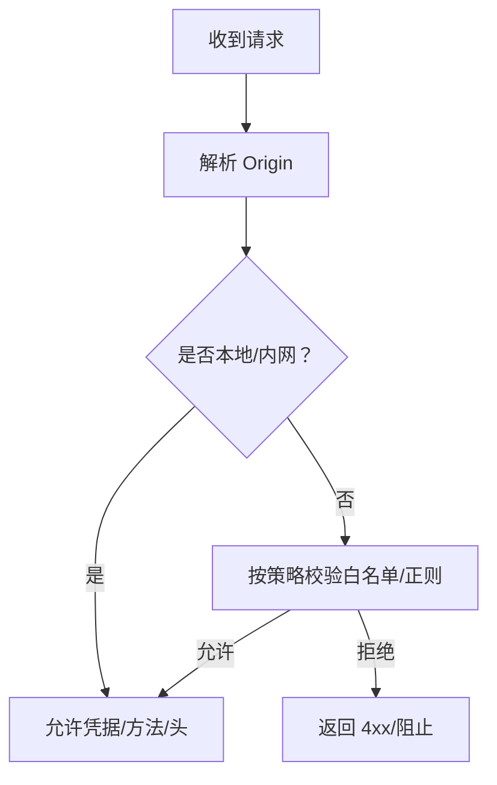
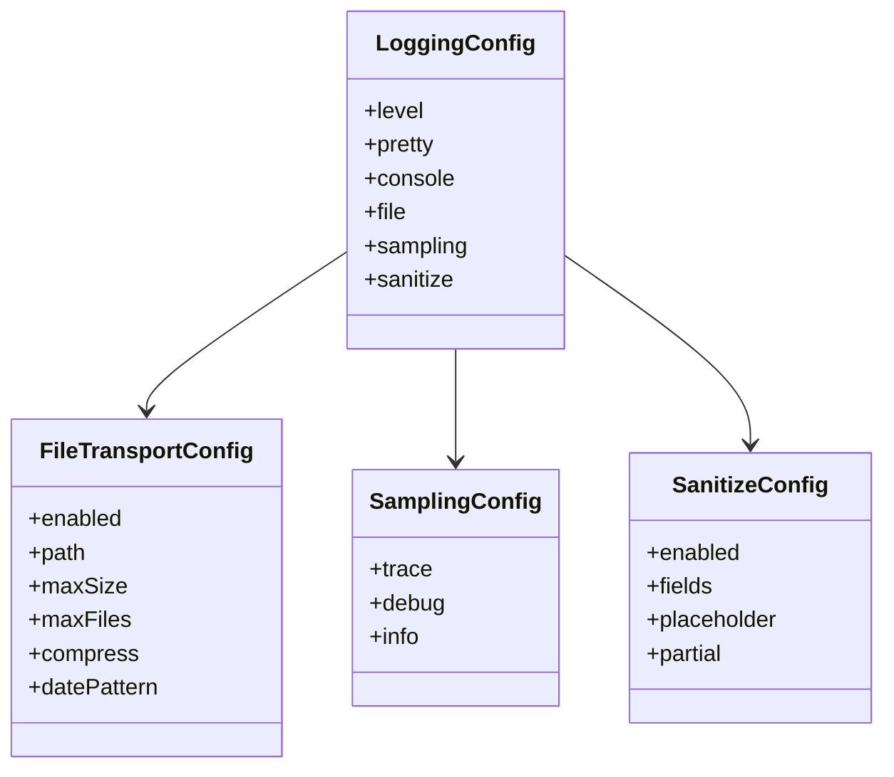
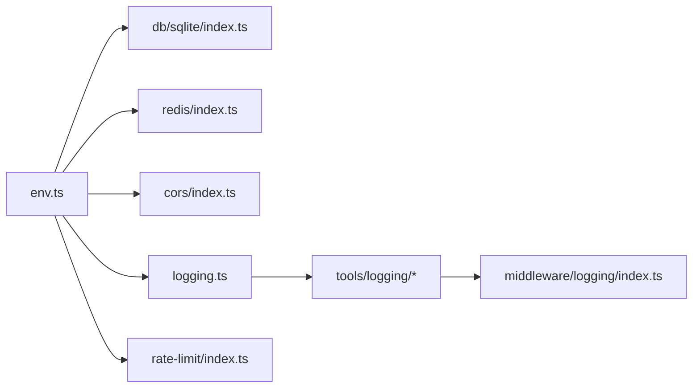

# 配置管理

<cite>
**本文引用的文件**
- [src/config/index.ts](file://src/config/index.ts)
- [src/config/env/index.ts](file://src/config/env/index.ts)
- [src/config/db/sqlite/index.ts](file://src/config/db/sqlite/index.ts)
- [src/config/redis/index.ts](file://src/config/redis/index.ts)
- [src/config/cors/index.ts](file://src/config/cors/index.ts)
- [src/config/cors/ip.ts](file://src/config/cors/ip.ts)
- [src/config/logging.ts](file://src/config/logging.ts)
- [.env](file://.env)
- [src/middleware/cors/index.ts](file://src/middleware/cors/index.ts)
- [src/middleware/logging/index.ts](file://src/middleware/logging/index.ts)
- [src/middleware/rate-limit/index.ts](file://src/middleware/rate-limit/index.ts)
- [src/middleware/request/app.ts](file://src/middleware/request/app.ts)
- [src/tools/logging/index.ts](file://src/tools/logging/index.ts)
- [src/tools/logging/file-transport.ts](file://src/tools/logging/file-transport.ts)
- [src/tools/logging/sanitizer.ts](file://src/tools/logging/sanitizer.ts)
</cite>

## 目录
1. [简介](#简介)
2. [项目结构](#项目结构)
3. [核心组件](#核心组件)
4. [架构总览](#架构总览)
5. [组件详解](#组件详解)
6. [依赖关系分析](#依赖关系分析)
7. [性能考量](#性能考量)
8. [故障排查指南](#故障排查指南)
9. [结论](#结论)
10. [附录](#附录)

## 简介
本文件面向 IM-API 的配置管理系统，系统性阐述环境变量配置、数据库（SQLite/MySQL）配置与优化、Redis 缓存配置与连接池管理、CORS 策略与安全考虑、日志配置与输出格式、配置模板与示例、生产与开发环境差异策略、配置验证与错误处理机制，以及配置更新与热重载的实现思路。文档以仓库现有代码为依据，结合中间件与工具层能力，给出可落地的实践建议。

## 项目结构
配置管理由“配置导出层 + 环境变量解析 + 数据库/缓存/CORS/日志子模块”构成，统一通过配置出口文件集中导出，便于上层模块按需引入。

**图示来源**
- [src/config/index.ts](file://src/config/index.ts#L1-L30)
- [src/config/env/index.ts](file://src/config/env/index.ts#L1-L223)
- [src/config/db/sqlite/index.ts](file://src/config/db/sqlite/index.ts#L1-L410)
- [src/config/redis/index.ts](file://src/config/redis/index.ts#L1-L40)
- [src/config/cors/index.ts](file://src/config/cors/index.ts#L1-L43)
- [src/config/cors/ip.ts](file://src/config/cors/ip.ts#L1-L52)
- [src/config/logging.ts](file://src/config/logging.ts#L1-L157)
- [src/middleware/cors/index.ts](file://src/middleware/cors/index.ts#L1-L39)
- [src/middleware/logging/index.ts](file://src/middleware/logging/index.ts#L1-L64)
- [src/middleware/rate-limit/index.ts](file://src/middleware/rate-limit/index.ts#L1-L70)
- [src/middleware/request/app.ts](file://src/middleware/request/app.ts#L1-L99)
- [src/tools/logging/index.ts](file://src/tools/logging/index.ts#L1-L532)
- [src/tools/logging/file-transport.ts](file://src/tools/logging/file-transport.ts#L1-L268)
- [src/tools/logging/sanitizer.ts](file://src/tools/logging/sanitizer.ts#L1-L210)

**章节来源**
- [src/config/index.ts](file://src/config/index.ts#L1-L30)

## 核心组件
- 环境变量配置与类型安全：集中解析 .env，提供 required/toNumber/toBoolean 等转换函数，统一导出 EnvConfig 类型与 env 对象。
- 数据库配置（SQLite/MySQL）：SQLite 采用 WAL+PRAGMA 优化与连接池约束；MySQL 通过 DB_DIALECT 与 MySQL_* 环境变量启用。
- Redis 缓存：按开关启用，支持主机、端口、密码、DB 选择与连接健康检查。
- CORS 策略：提供静态配置与动态中间件，支持凭据、预检短路、暴露头等。
- 日志系统：支持级别、美化输出、文件轮转、脱敏、采样与 TraceId 绑定。
- 中间件集成：CORS、请求日志、限流、AppId 等均基于配置模块提供的环境变量与工具。

**章节来源**
- [src/config/env/index.ts](file://src/config/env/index.ts#L1-L223)
- [src/config/db/sqlite/index.ts](file://src/config/db/sqlite/index.ts#L1-L410)
- [src/config/redis/index.ts](file://src/config/redis/index.ts#L1-L40)
- [src/config/cors/index.ts](file://src/config/cors/index.ts#L1-L43)
- [src/config/logging.ts](file://src/config/logging.ts#L1-L157)

## 架构总览
配置系统围绕“环境变量 → 类型安全解析 → 子系统配置 → 中间件/工具使用”的链路工作。关键流程如下：

**图示来源**
- [src/config/env/index.ts](file://src/config/env/index.ts#L10-L223)
- [src/config/db/sqlite/index.ts](file://src/config/db/sqlite/index.ts#L368-L409)
- [src/config/redis/index.ts](file://src/config/redis/index.ts#L31-L38)
- [src/config/cors/index.ts](file://src/config/cors/index.ts#L14-L42)
- [src/middleware/logging/index.ts](file://src/middleware/logging/index.ts#L34-L63)
- [src/tools/logging/index.ts](file://src/tools/logging/index.ts#L443-L532)

## 组件详解

### 环境变量配置与管理策略
- 加载与校验
  - 启动时加载 .env，提供 required、toNumber、toBoolean 三类转换函数，缺失或类型不符时抛错，确保配置健壮性。
  - 默认值策略：对可选项提供合理默认，对必填项在缺省时直接报错。
- 类型安全
  - 统一导出 EnvConfig 接口与 env 对象，上层模块通过类型推断获得明确字段与默认值。
- 环境区分
  - NODE_ENV 控制日志级别与文件输出策略；开发环境默认开启美化输出与控制台输出，生产环境默认 info 级别与文件输出。

**图示来源**
- [src/config/env/index.ts](file://src/config/env/index.ts#L13-L223)

**章节来源**
- [src/config/env/index.ts](file://src/config/env/index.ts#L1-L223)
- [.env](file://.env#L1-L22)

### 数据库配置（SQLite/MySQL）

#### SQLite 配置与优化
- 连接与池化
  - 通过 sequelizeConfig 快照存储 storage 与 pool 配置，避免直接访问底层 options。
  - 默认连接池：最大连接数、最小连接数、空闲回收、获取超时等参数可由环境变量覆盖。
- 性能优化（PRAGMA）
  - 启用 WAL 日志模式、NORMAL 同步、内存临时表、外键约束、缓存与内存映射、自动检查点与锁等待超时等。
  - 支持查询运行时统计（缓存、页面、WAL、内存等）与文件占用统计，并提供中文字段名映射便于日志阅读。
- 初始化流程
  - 认证连接 → 应用 PRAGMA → 可选执行模型同步（开发/测试慎用）→ 输出中文初始化摘要 → 非生产环境打印运行时状态与文件占用。
- 错误处理
  - 初始化失败时输出错误并终止进程，确保启动阶段即发现配置问题。

**图示来源**
- [src/config/db/sqlite/index.ts](file://src/config/db/sqlite/index.ts#L368-L409)

**章节来源**
- [src/config/db/sqlite/index.ts](file://src/config/db/sqlite/index.ts#L1-L410)

#### MySQL 配置
- 通过 DB_DIALECT=sqlite 或 mysql 切换方言；当选择 mysql 时，使用 MYSQL_HOST/PORT/DB/USER/PASSWORD 等环境变量进行连接。
- 该模块未提供 MySQL 的连接池/SSL/会话参数等专用配置导出，建议在上层使用 ORM/连接库时单独配置。

**章节来源**
- [src/config/env/index.ts](file://src/config/env/index.ts#L100-L146)
- [src/config/db/sqlite/index.ts](file://src/config/db/sqlite/index.ts#L120-L128)

### Redis 缓存配置与连接池管理
- 启用开关与连接参数
  - 通过 REDIS_ENABLED 控制是否启用；启用后按 REDIS_HOST/PORT/PASSWORD/DB 配置连接。
  - 连接超时、重试次数、离线队列等参数在连接配置中设定。
- 健康检查
  - 提供 initRedisAsync，通过 ping 校验连通性，失败抛错。
- 错误处理
  - 连接错误事件被捕获并记录，避免静默失败。

**图示来源**
- [src/config/redis/index.ts](file://src/config/redis/index.ts#L5-L38)

**章节来源**
- [src/config/redis/index.ts](file://src/config/redis/index.ts#L1-L40)

### CORS 配置策略与安全考虑
- 配置策略
  - 提供 createCorsOptions 与 useCorsMiddleware，支持允许的方法、头部、暴露头、凭据等。
  - 提供本地/内网判定工具（判断 localhost/127.0.0.1/私有地址），可用于更严格的 Origin 校验场景。
- 安全考虑
  - 凭据允许（credentials: true）需谨慎，确保仅在受控域名/子域范围内使用。
  - 预检短路（preflightContinue: false）与 204 状态有助于减少不必要的跨域预检请求。
  - 建议在生产环境配合反向代理或更严格的 Origin 白名单策略。

**图示来源**
- [src/config/cors/index.ts](file://src/config/cors/index.ts#L14-L42)
- [src/config/cors/ip.ts](file://src/config/cors/ip.ts#L31-L51)

**章节来源**
- [src/config/cors/index.ts](file://src/config/cors/index.ts#L1-L43)
- [src/config/cors/ip.ts](file://src/config/cors/ip.ts#L1-L52)

### 日志配置与输出格式
- 配置项
  - 全局级别、美化输出、控制台开关、文件传输（启用/路径/大小/文件数/压缩/日期模式）、采样率（trace/debug/info）、脱敏（字段/占位符/部分保留）。
- 默认策略
  - 开发环境默认 debug 级别、美化输出、控制台输出；生产环境默认 info 级别、文件输出、采样率降低。
- 输出格式
  - 支持 JSON 行与人类可读彩色行两种格式；支持结构化上下文与错误序列化。
- 文件传输
  - 支持按大小轮转、压缩旧文件、保留数量控制、日期分隔。
- 脱敏
  - 递归脱敏对象与数组，支持部分保留前后字符策略。

**图示来源**
- [src/config/logging.ts](file://src/config/logging.ts#L62-L151)

**章节来源**
- [src/config/logging.ts](file://src/config/logging.ts#L1-L157)
- [src/tools/logging/index.ts](file://src/tools/logging/index.ts#L1-L532)
- [src/tools/logging/file-transport.ts](file://src/tools/logging/file-transport.ts#L1-L268)
- [src/tools/logging/sanitizer.ts](file://src/tools/logging/sanitizer.ts#L1-L210)

### 中间件与配置联动
- CORS 中间件
  - 基于配置模块导出的 createCorsOptions/useCorsMiddleware 注入 Express。
- 请求日志中间件
  - 从请求头提取/生成 traceId，绑定到日志上下文，记录方法、URL、状态码、耗时、长度等。
- 限流中间件
  - 基于环境变量 RATE_LIMIT_WINDOW_MS 与 RATE_LIMIT_MAX_REQUESTS，按 IP 固定窗口计数。
- AppId 中间件
  - 提取并校验 x-app-id，支持限定允许的应用类型。

**章节来源**
- [src/middleware/cors/index.ts](file://src/middleware/cors/index.ts#L1-L39)
- [src/middleware/logging/index.ts](file://src/middleware/logging/index.ts#L1-L64)
- [src/middleware/rate-limit/index.ts](file://src/middleware/rate-limit/index.ts#L1-L70)
- [src/middleware/request/app.ts](file://src/middleware/request/app.ts#L1-L99)

## 依赖关系分析
- 配置导出层集中导出各子模块，上层路由/服务仅依赖配置出口文件，降低耦合。
- 环境变量模块被数据库、Redis、CORS、日志、限流等多个模块间接依赖。
- 日志工具与文件传输、脱敏器相互协作，形成完整的日志输出管线。

**图示来源**
- [src/config/env/index.ts](file://src/config/env/index.ts#L1-L223)
- [src/config/db/sqlite/index.ts](file://src/config/db/sqlite/index.ts#L1-L410)
- [src/config/redis/index.ts](file://src/config/redis/index.ts#L1-L40)
- [src/config/cors/index.ts](file://src/config/cors/index.ts#L1-L43)
- [src/config/logging.ts](file://src/config/logging.ts#L1-L157)
- [src/middleware/rate-limit/index.ts](file://src/middleware/rate-limit/index.ts#L1-L70)
- [src/middleware/logging/index.ts](file://src/middleware/logging/index.ts#L1-L64)
- [src/tools/logging/index.ts](file://src/tools/logging/index.ts#L1-L532)

**章节来源**
- [src/config/index.ts](file://src/config/index.ts#L1-L30)

## 性能考量
- SQLite
  - WAL 模式提升并发读写稳定性；PRAGMA 参数平衡性能与可靠性；连接池参数需根据并发与 I/O 能力调整。
  - 建议定期检查 WAL 未 checkpoint 页数与文件大小，避免无限膨胀。
- Redis
  - 合理设置连接超时与重试次数，避免阻塞；启用连接健康检查。
- 日志
  - 生产环境降低采样率，避免高频日志造成 I/O 压力；启用文件轮转与压缩，控制磁盘占用。

[本节为通用指导，无需列出具体文件来源]

## 故障排查指南
- 环境变量缺失或类型错误
  - 现象：启动时报错提示缺少某环境变量或类型不正确。
  - 处理：补齐 .env 对应项，确保类型符合要求（数字/布尔）。
- 数据库初始化失败
  - 现象：数据库初始化失败并终止进程。
  - 处理：检查 SQLite 文件权限、WAL 文件占用、PRAGMA 执行权限；确认连接参数与网络可达。
- Redis 连接失败
  - 现象：Redis 连接错误日志；ping 失败。
  - 处理：核对主机/端口/密码/DB；确认网络连通与服务端配置。
- CORS 不生效
  - 现象：浏览器跨域失败或预检未通过。
  - 处理：检查凭据、允许方法/头、暴露头；必要时结合本地/内网判定逻辑细化策略。
- 日志输出异常
  - 现象：日志未输出或文件轮转失败。
  - 处理：检查日志级别、美化输出、控制台开关、文件路径与权限、轮转参数。

**章节来源**
- [src/config/env/index.ts](file://src/config/env/index.ts#L21-L61)
- [src/config/db/sqlite/index.ts](file://src/config/db/sqlite/index.ts#L405-L409)
- [src/config/redis/index.ts](file://src/config/redis/index.ts#L20-L24)
- [src/config/cors/index.ts](file://src/config/cors/index.ts#L14-L42)
- [src/config/logging.ts](file://src/config/logging.ts#L105-L151)

## 结论
本配置系统以环境变量为核心，结合类型安全解析与子模块化设计，实现了数据库、缓存、CORS、日志等关键能力的统一管理。通过 PRAGMA 优化、连接池约束、文件轮转与脱敏等手段，兼顾了开发体验与生产稳定性。建议在生产环境中严格控制 CORS 与凭据范围，强化日志采样与轮转策略，并对数据库与缓存连接进行持续监控与容量评估。

[本节为总结性内容，无需列出具体文件来源]

## 附录

### 配置模板与示例
- .env 示例（摘取关键项）
  - 端口与数据库：PORT、DB_DIALECT、DB_STORAGE、MYSQL_HOST/PORT/DB/USER/PASSWORD
  - 安全密钥：JWT_SECRET、PIN_SECRET、PASSWORD_PEPPER
  - Redis：REDIS_ENABLED/HOST/PORT/PASSWORD/DB
  - 速率限制：RATE_LIMIT_WINDOW_MS、RATE_LIMIT_MAX_REQUESTS
  - WebSocket：WS_ENABLED、WS_PING_INTERVAL_MS、WS_IDLE_TIMEOUT_MS
  - 日志：LOG_LEVEL、LOG_PRETTY、LOG_CONSOLE、LOG_FILE_ENABLED/PATH/大小/文件数/压缩/日期模式、LOG_SANITIZE

**章节来源**
- [.env](file://.env#L1-L22)
- [src/config/env/index.ts](file://src/config/env/index.ts#L166-L220)
- [src/config/logging.ts](file://src/config/logging.ts#L105-L151)

### 开发环境与生产环境差异策略
- 环境变量
  - NODE_ENV=development：日志级别默认 debug，美化输出默认开启，控制台输出默认开启。
  - NODE_ENV=production：日志级别默认 info，美化输出默认关闭，控制台输出默认开启，文件输出默认开启，采样率降低。
- 数据库
  - 开发：可选执行模型同步（注意仅开发/测试）；非生产环境打印 SQLite 运行时状态与文件占用。
  - 生产：禁止强制同步，严格使用迁移方案。
- Redis
  - 建议生产环境启用并配置密码与网络隔离。
- CORS
  - 生产环境建议配合反向代理与更严格的 Origin 白名单策略。

**章节来源**
- [src/config/env/index.ts](file://src/config/env/index.ts#L105-L110)
- [src/config/db/sqlite/index.ts](file://src/config/db/sqlite/index.ts#L400-L404)
- [src/config/logging.ts](file://src/config/logging.ts#L105-L151)

### 配置验证与错误处理机制
- 环境变量
  - required：缺失即抛错；toNumber/toBoolean：类型不符或缺省且无默认即抛错。
- 数据库
  - 初始化失败直接终止进程，避免静默失败。
- Redis
  - 连接错误事件捕获并记录；ping 失败抛错。
- 日志
  - 错误对象序列化与脱敏，避免敏感信息泄露。

**章节来源**
- [src/config/env/index.ts](file://src/config/env/index.ts#L21-L61)
- [src/config/db/sqlite/index.ts](file://src/config/db/sqlite/index.ts#L405-L409)
- [src/config/redis/index.ts](file://src/config/redis/index.ts#L20-L38)
- [src/tools/logging/index.ts](file://src/tools/logging/index.ts#L232-L252)

### 配置更新与热重载
- 环境变量
  - 由于环境变量在启动时一次性解析并导出，建议通过进程管理器（如 PM2/Supervisor）在变更后重启进程，确保新配置生效。
- 数据库
  - SQLite 连接池与 PRAGMA 在连接建立时应用，重启后生效；如需动态调整，可在上层封装“重新初始化连接”逻辑并在安全窗口内执行。
- Redis
  - 连接实例为单例，建议通过进程重启或在上层提供“重建连接实例”的方法并确保无连接泄漏。
- 日志
  - 脱敏与采样配置可通过工具层的更新接口动态调整；文件传输配置建议重启以避免轮转状态不一致。

**章节来源**
- [src/config/env/index.ts](file://src/config/env/index.ts#L13-L223)
- [src/config/db/sqlite/index.ts](file://src/config/db/sqlite/index.ts#L120-L128)
- [src/config/redis/index.ts](file://src/config/redis/index.ts#L5-L15)
- [src/tools/logging/sanitizer.ts](file://src/tools/logging/sanitizer.ts#L174-L200)
- [src/tools/logging/file-transport.ts](file://src/tools/logging/file-transport.ts#L41-L48)