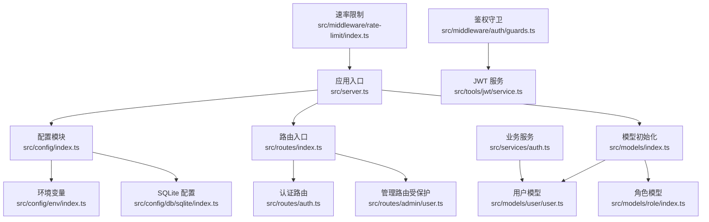
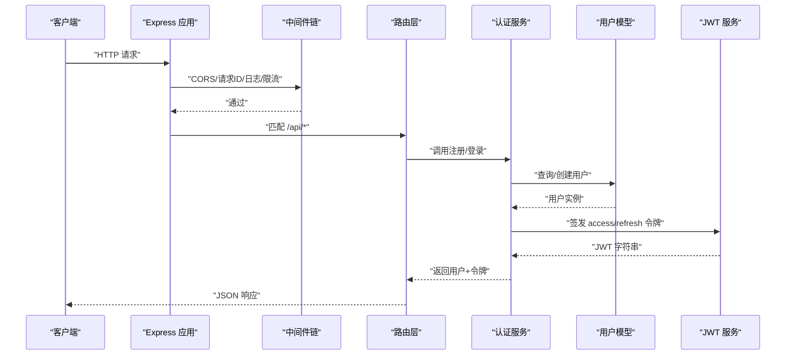
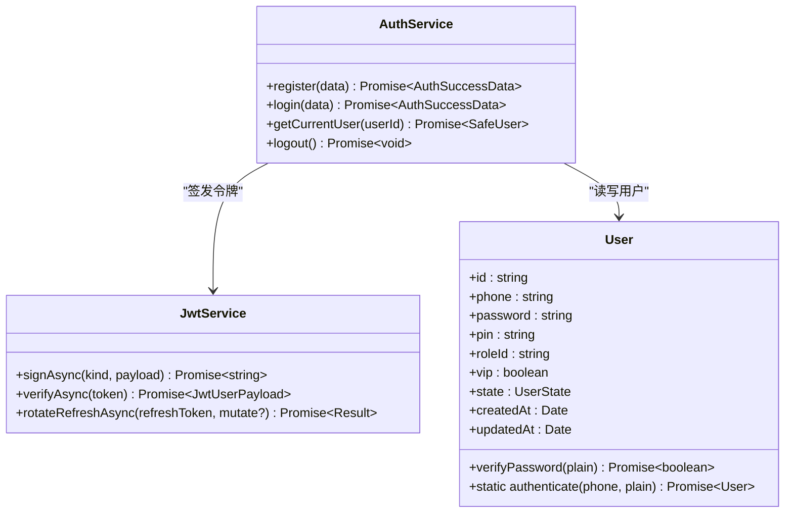
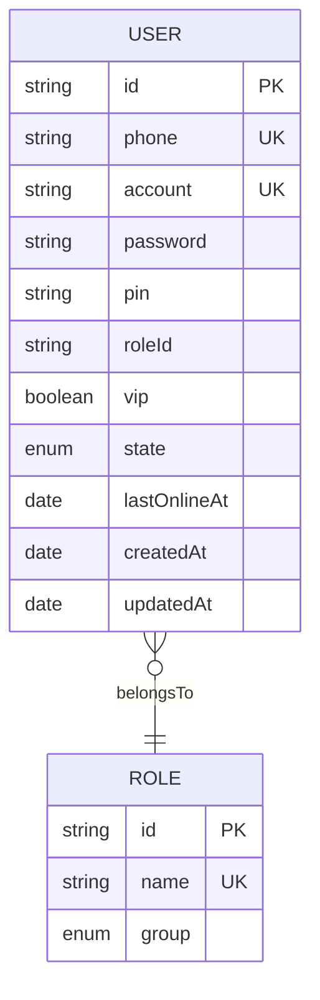
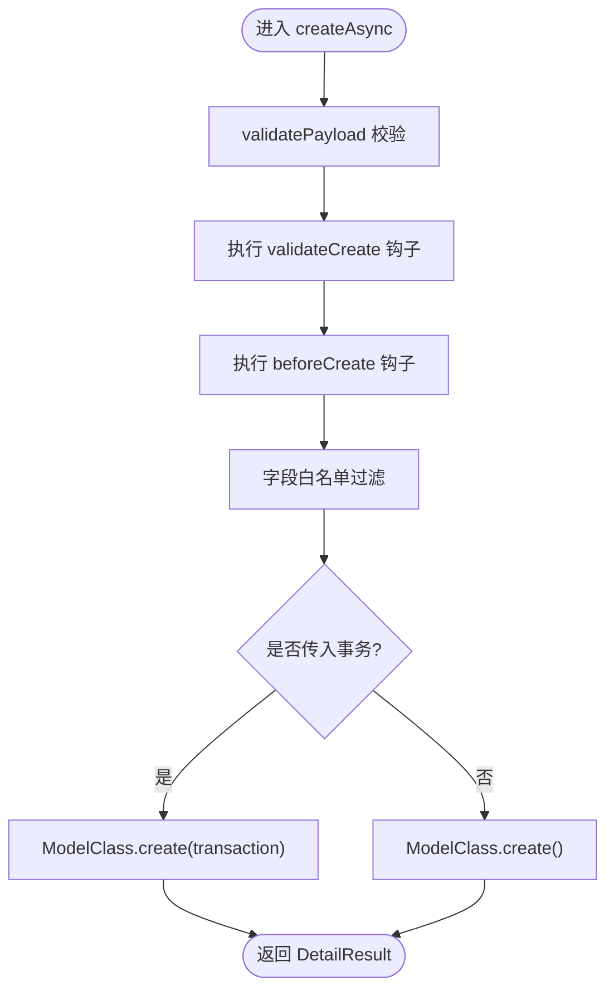
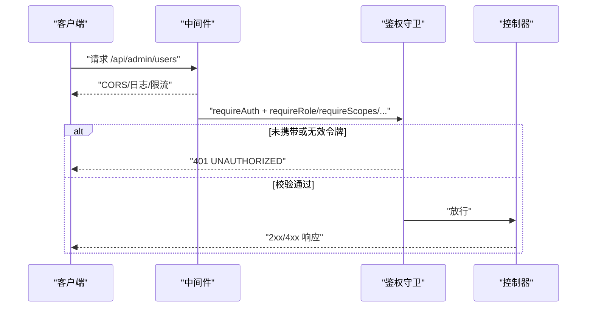
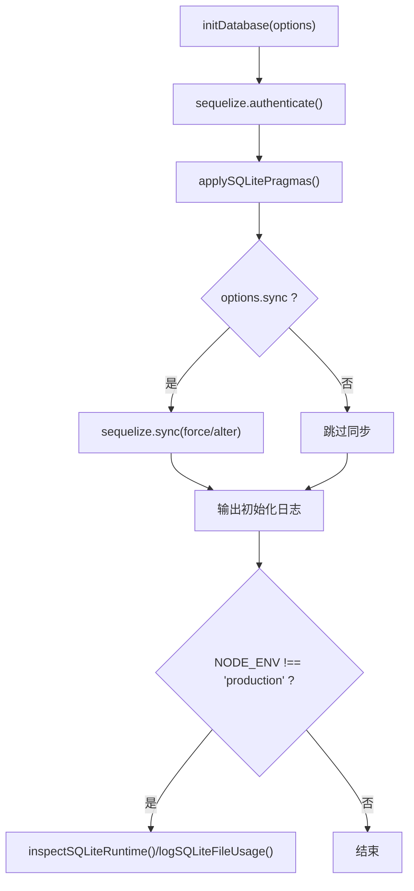
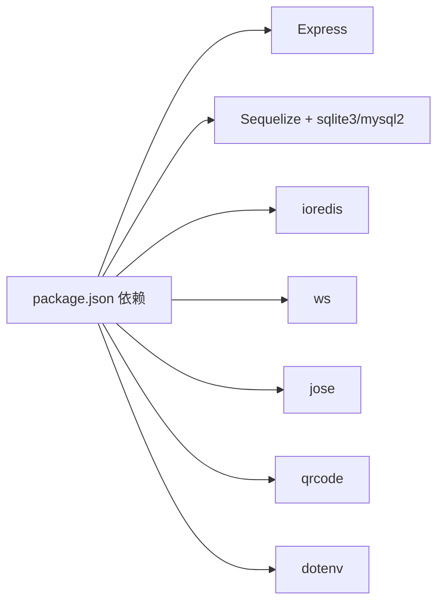

# 项目概述

<cite>
**本文引用的文件**
- [package.json](file://package.json)
- [server.ts](file://src/server.ts)
- [config/index.ts](file://src/config/index.ts)
- [config/env/index.ts](file://src/config/env/index.ts)
- [config/db/sqlite/index.ts](file://src/config/db/sqlite/index.ts)
- [models/index.ts](file://src/models/index.ts)
- [models/user/user.ts](file://src/models/user/user.ts)
- [models/role/index.ts](file://src/models/role/index.ts)
- [routes/index.ts](file://src/routes/index.ts)
- [routes/auth.ts](file://src/routes/auth.ts)
- [services/auth.ts](file://src/services/auth.ts)
- [middleware/auth/guards.ts](file://src/middleware/auth/guards.ts)
- [middleware/rate-limit/index.ts](file://src/middleware/rate-limit/index.ts)
- [repo/base/crud/create.ts](file://src/repo/base/crud/create.ts)
- [tools/jwt/service.ts](file://src/tools/jwt/service.ts)
</cite>

## 目录
1. [简介](#简介)
2. [项目结构](#项目结构)
3. [核心组件](#核心组件)
4. [架构总览](#架构总览)
5. [详细组件分析](#详细组件分析)
6. [依赖分析](#依赖分析)
7. [性能考虑](#性能考虑)
8. [故障排查指南](#故障排查指南)
9. [结论](#结论)
10. [附录](#附录)

## 简介
本项目是一个面向现代 Web 应用的企业级即时通讯后端原型系统，采用 TypeScript + Express + Sequelize + SQLite 技术栈构建，强调类型安全、可维护性与可扩展性。项目以“认证与授权”“用户与角色模型”“通用 CRUD 基座”“JWT 令牌体系”为核心能力，提供注册、登录、当前用户查询等基础能力，并通过中间件体系实现 CORS、请求追踪、速率限制与多维权限守卫。

项目定位为“轻量、可快速落地”的后端骨架，适合中小团队在开发阶段快速迭代，或作为企业内部 IM/聊天系统的基础底座进行二次开发。通过模块化的目录组织与清晰的职责边界，既能帮助初学者快速理解整体结构，也为资深开发者提供了深入扩展的空间。

## 项目结构
项目采用“按领域与层次混合”的组织方式，核心目录与职责如下：
- src/config：全局配置与基础设施（环境变量、数据库、Redis、CORS 等）
- src/models：ORM 模型与关联定义（用户、角色等）
- src/repo：通用仓储与 CRUD 基座（事务、字段白名单、钩子）
- src/services：业务服务（认证服务等）
- src/middleware：中间件（鉴权守卫、CORS、日志、速率限制、请求 ID 等）
- src/routes：路由入口与控制器绑定
- src/tools：工具模块（JWT、加解密、QR 码等）
- src/types：类型定义（JWT 载荷、用户类型等）
- src/utils：通用工具（ID 生成、掩码、查询辅助等）

图表来源
- [server.ts](file://src/server.ts#L1-L74)
- [config/index.ts](file://src/config/index.ts#L1-L30)
- [routes/index.ts](file://src/routes/index.ts#L1-L22)
- [models/index.ts](file://src/models/index.ts#L1-L143)

章节来源
- [server.ts](file://src/server.ts#L1-L74)
- [config/index.ts](file://src/config/index.ts#L1-L30)
- [routes/index.ts](file://src/routes/index.ts#L1-L22)
- [models/index.ts](file://src/models/index.ts#L1-L143)

## 核心组件
- 应用入口与启动
  - Express 应用创建、中间件装配、路由挂载、健康检查端点
  - 数据库初始化与模型同步
- 配置体系
  - 环境变量解析与类型安全转换
  - SQLite 连接、PRAGMA 性能优化、运行时状态与文件占用检查
- 模型与关联
  - 用户模型（含密码哈希、默认 Scope、索引、钩子）
  - 角色模型（系统/项目/用户/管理员分组）
  - 模型注册表与通用类型
- 业务服务
  - 认证服务：注册、登录、签发令牌、当前用户查询
- 中间件
  - CORS、请求追踪 ID、日志、速率限制、鉴权守卫（角色/作用域/VIP/团队/令牌类型）
- 通用 CRUD 基座
  - 校验、钩子、字段白名单、事务支持
- 工具模块
  - JWT 服务：签发、验证、刷新轮转
  - 加密与密码处理（scrypt）
  - QR 码生成

章节来源
- [server.ts](file://src/server.ts#L1-L74)
- [config/env/index.ts](file://src/config/env/index.ts#L1-L223)
- [config/db/sqlite/index.ts](file://src/config/db/sqlite/index.ts#L1-L410)
- [models/user/user.ts](file://src/models/user/user.ts#L1-L275)
- [models/role/index.ts](file://src/models/role/index.ts#L1-L77)
- [services/auth.ts](file://src/services/auth.ts#L1-L170)
- [middleware/auth/guards.ts](file://src/middleware/auth/guards.ts#L1-L195)
- [middleware/rate-limit/index.ts](file://src/middleware/rate-limit/index.ts#L1-L70)
- [repo/base/crud/create.ts](file://src/repo/base/crud/create.ts#L1-L81)
- [tools/jwt/service.ts](file://src/tools/jwt/service.ts#L1-L98)

## 架构总览
系统采用“请求驱动”的单体架构，核心流程：
- 客户端发起 HTTP 请求
- Express 中间件链处理（CORS、请求 ID、日志、速率限制）
- 路由层根据路径与方法分发至控制器
- 控制器调用服务层执行业务逻辑
- 服务层与模型交互，必要时通过通用 CRUD 基座与数据库交互
- JWT 服务负责令牌签发与校验，鉴权守卫在受保护路由上生效

图表来源
- [server.ts](file://src/server.ts#L27-L48)
- [routes/auth.ts](file://src/routes/auth.ts#L1-L47)
- [services/auth.ts](file://src/services/auth.ts#L86-L170)
- [tools/jwt/service.ts](file://src/tools/jwt/service.ts#L27-L98)

## 详细组件分析

### 认证与授权
- 认证服务
  - 提供注册、登录、当前用户查询、登出等方法
  - 使用 scrypt 对密码与 PIN 进行哈希存储
  - 通过 JWT 服务签发访问与刷新令牌
- 鉴权守卫
  - 支持角色、作用域、VIP、团队、令牌类型等多维校验
  - 基于 req.user 进行断言，统一错误响应格式
- JWT 服务
  - 基于 jose 实现，支持 HS256/RS256 算法
  - 提供签发、验证、刷新轮转能力
  - 令牌长期有效策略，退出即失效（无状态）

图表来源
- [services/auth.ts](file://src/services/auth.ts#L86-L170)
- [tools/jwt/service.ts](file://src/tools/jwt/service.ts#L27-L98)
- [models/user/user.ts](file://src/models/user/user.ts#L33-L101)

章节来源
- [services/auth.ts](file://src/services/auth.ts#L1-L170)
- [middleware/auth/guards.ts](file://src/middleware/auth/guards.ts#L1-L195)
- [tools/jwt/service.ts](file://src/tools/jwt/service.ts#L1-L98)
- [models/user/user.ts](file://src/models/user/user.ts#L1-L275)

### 数据模型与关联
- 用户模型
  - 主键为 7 位随机数字字符串
  - 密码与 PIN 使用 scrypt 哈希
  - 默认 Scope 排除敏感字段，提供 withSecret Scope 用于认证
  - 索引覆盖 createdAt/id、roleId、state、lastOnlineAt、phone
- 角色模型
  - 分组枚举：system/project/user/admin
  - 提供 group 索引
- 关联与注册
  - 模型集中初始化与关联定义
  - 提供 modelRegistry 与通用类型，支撑通用 CRUD 与权限配置

图表来源
- [models/user/user.ts](file://src/models/user/user.ts#L109-L266)
- [models/role/index.ts](file://src/models/role/index.ts#L41-L76)
- [models/index.ts](file://src/models/index.ts#L26-L57)

章节来源
- [models/user/user.ts](file://src/models/user/user.ts#L1-L275)
- [models/role/index.ts](file://src/models/role/index.ts#L1-L77)
- [models/index.ts](file://src/models/index.ts#L1-L143)

### 通用 CRUD 基座
- 功能要点
  - 载荷基础校验、业务钩子、前置处理钩子
  - 字段白名单过滤、事务支持、返回标准化结果
- 设计价值
  - 统一 CRUD 行为，降低重复代码
  - 与模型与服务层解耦，提升可测试性与可维护性

图表来源
- [repo/base/crud/create.ts](file://src/repo/base/crud/create.ts#L18-L81)

章节来源
- [repo/base/crud/create.ts](file://src/repo/base/crud/create.ts#L1-L81)

### 中间件与安全
- CORS、请求 ID、日志、速率限制
  - CORS 与 IP 白名单策略
  - 请求 ID 追踪，便于日志聚合
  - 速率限制基于固定窗口计数，按 IP 限流
- 鉴权守卫
  - 角色、作用域、VIP、团队、令牌类型五维校验
  - 统一错误响应，便于前端处理

图表来源
- [middleware/auth/guards.ts](file://src/middleware/auth/guards.ts#L25-L195)
- [middleware/rate-limit/index.ts](file://src/middleware/rate-limit/index.ts#L43-L70)
- [routes/index.ts](file://src/routes/index.ts#L17-L18)

章节来源
- [middleware/auth/guards.ts](file://src/middleware/auth/guards.ts#L1-L195)
- [middleware/rate-limit/index.ts](file://src/middleware/rate-limit/index.ts#L1-L70)
- [routes/index.ts](file://src/routes/index.ts#L1-L22)

### 数据库与性能优化
- SQLite 配置
  - WAL 日志模式、NORMAL 同步、内存临时表、外键约束
  - 缓存大小、内存映射、自动检查点、锁等待超时等 PRAGMA 调优
  - 运行时状态查询与文件占用日志输出
- 初始化流程
  - 连接认证 → 应用 PRAGMA → 可选 schema 同步 → 开发环境输出运行时状态

图表来源
- [config/db/sqlite/index.ts](file://src/config/db/sqlite/index.ts#L368-L410)

章节来源
- [config/db/sqlite/index.ts](file://src/config/db/sqlite/index.ts#L1-L410)

## 依赖分析
- 运行时依赖
  - Express：Web 框架
  - Sequelize + sqlite3/mysql2：ORM 与数据库驱动
  - ioredis：Redis（可选）
  - ws：WebSocket（可选）
  - jose：JWT 签发与验证
  - qrcode：二维码生成
  - dotenv：环境变量加载
- 开发依赖
  - TypeScript、tsx、tsc-alias、tsc-esm-fix 等

图表来源
- [package.json](file://package.json#L12-L34)

章节来源
- [package.json](file://package.json#L1-L36)

## 性能考虑
- 数据库层面
  - WAL 模式提升并发读写能力；合理设置缓存与内存映射；控制 WAL 文件大小与检查点频率
  - 连接池参数与锁等待超时需结合负载与硬件资源调整
- 应用层面
  - 速率限制防止滥用；日志与追踪 ID 便于定位瓶颈
  - JWT 无状态设计降低服务端状态管理开销
- 建议
  - 生产环境优先使用迁移而非 sync；对热点字段建立索引；监控 WAL 未 checkpoint 估算值与文件大小

## 故障排查指南
- 启动失败
  - 检查数据库连接与 PRAGMA 应用是否成功；查看初始化日志
  - 确认环境变量（端口、数据库方言、密钥等）是否正确
- 认证异常
  - 核对 JWT 密钥与算法配置；确认令牌类型与有效期
  - 用户密码/PIN 是否符合 scrypt 哈希要求
- 路由 401/403
  - 检查鉴权守卫参数与用户角色/作用域/VIP/团队/令牌类型
- 速率限制 429
  - 调整窗口与阈值；确认代理转发头（X-Forwarded-For）是否正确透传

章节来源
- [config/db/sqlite/index.ts](file://src/config/db/sqlite/index.ts#L368-L410)
- [config/env/index.ts](file://src/config/env/index.ts#L166-L223)
- [middleware/auth/guards.ts](file://src/middleware/auth/guards.ts#L25-L195)
- [middleware/rate-limit/index.ts](file://src/middleware/rate-limit/index.ts#L43-L70)

## 结论
本项目以“类型安全 + 模块化 + 可扩展”为核心设计原则，构建了从认证授权到数据持久化的完整后端骨架。通过 SQLite 性能优化、JWT 令牌体系与通用 CRUD 基座，既满足中小规模场景的快速落地，又为后续扩展（如 WebSocket、Redis 缓存、权限治理、审计日志等）预留空间。建议在生产环境中配合迁移工具、完善的监控与告警体系，持续演进为稳定的企业级 IM 后端平台。

## 附录
- 典型使用场景
  - 用户注册/登录与当前用户信息查询
  - 管理员端用户管理（受保护路由）
  - 多维权限控制（角色/作用域/VIP/团队/令牌类型）
  - 速率限制防护与跨域访问控制
- 建议的后续增强方向
  - 引入 WebSocket 支持（聊天消息推送）
  - 集成 Redis 用于令牌黑名单、会话存储与缓存
  - 增加审计日志与操作追踪
  - 引入数据库迁移工具与自动化部署流水线